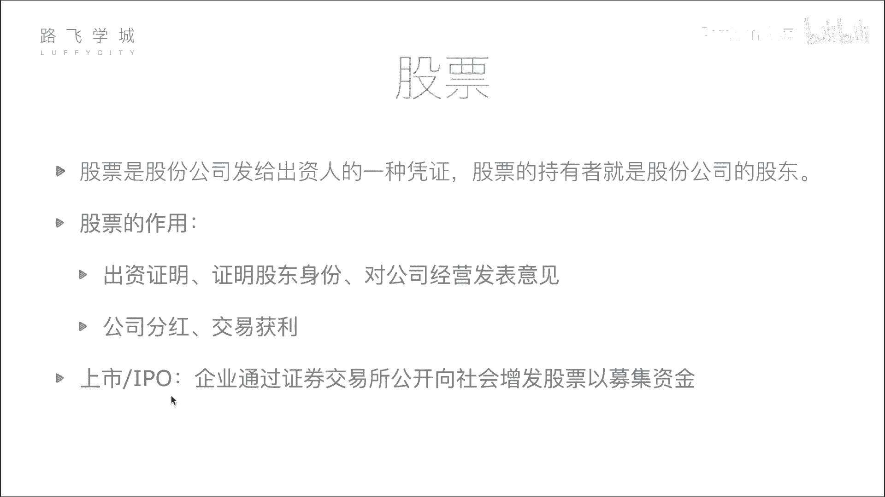
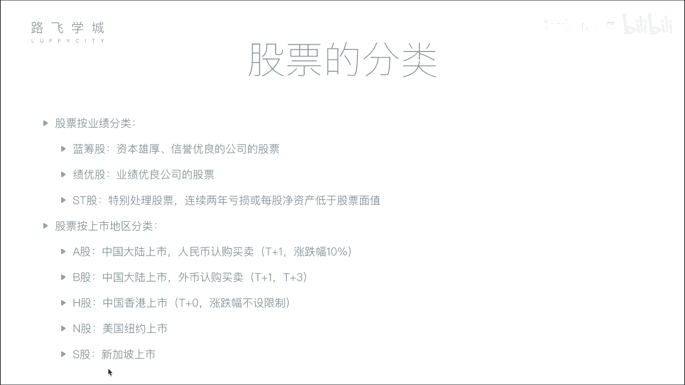

# Python金融量化分析实战：02：股票基本知识与分类 📈

## 概述
在本节课中，我们将要学习股票的基本概念、作用以及分类。理解这些基础知识是进行后续金融量化分析的前提。

## 股票的定义与作用
上一节我们介绍了金融量化分析的整体框架，本节中我们来看看股票究竟是什么。

股票是股份公司发给出资人的一种凭证。股票的持有者就是股份公司的股东。

为了更形象地理解，可以设想一个场景：一位创业者需要资金，而投资者看好其项目。投资者将资金给予创业者，创业者则向投资者发行公司的股票作为凭证。这代表投资者对公司出资，并因此成为公司的股东之一。例如，若一个公司初始市值为5亿，由五位出资人各出资1亿建立，那么每位出资人将获得公司20%的股票。

股票的作用主要有两点：
1.  **出资证明与股东身份**：持有股票意味着对公司拥有所有权，是股东身份的证明。股东有权参与公司重大决策，例如在股东大会上投票。
2.  **获利途径**：股东可以通过两种主要方式从股票投资中获利。

以下是两种主要的获利方式：
*   **公司分红**：当公司盈利时，可能会将部分利润以现金形式分配给股东。分红金额与股东持有的股份比例成正比。
*   **交易获利**：股东可以在二级市场（如证券交易所）将股票转让给其他投资者。如果卖出价格高于买入价格，其间的差价即为交易获利。

对于广大普通股民而言，他们通过证券交易所买卖股票，其获利逻辑与上述大型投资者完全相同，只是涉及的金额和股权比例通常较小。

## 公司上市与IPO
理解了股票的基本概念后，我们来看看公司如何让公众能够买卖其股票，这个过程就是上市。

所谓上市，就是企业通过证券交易所首次公开向公众增发股票以募集资金。未上市公司的融资行为（如向特定投资人募资）属于私募，范围有限。而上市意味着公司获得了在公开市场向所有符合资格的投资者募集资金的资格。

公司需要达到一定标准（如持续盈利、信息披露规范等）并通过监管机构（如中国的证监会）的审核才能上市。上市后，公司的股票就可以在证券交易所挂牌交易，所有投资者都能公开买卖。

**IPO** 即首次公开募股，特指公司第一次向社会公众公开发行股票的行为。

## 股票的分类
了解了上市过程，接下来我们系统地认识一下股票有哪些常见的分类方式。

### 按公司业绩分类
根据发行公司的经营业绩，股票通常可分为以下三类：

以下是按业绩分类的三种常见股票类型：
*   **蓝筹股**：指资本雄厚、信誉优良的巨型公司发行的股票。例如中国的石油、银行等行业巨头。名称源于赌场中价值最高的蓝色筹码。
*   **绩优股**：指业绩优良公司的股票。这类公司可能规模不是最大，但盈利能力持续稳定且表现突出。例如一些消费、医药行业的龙头公司。
*   **ST股**：中文为“特别处理股票”。如果公司连续两年亏损或每股净资产低于股票面值，其股票名称前会被加上“ST”标记，以警示投资者该公司存在较高风险。

### 按上市地区分类
根据股票上市交易的地理位置和结算货币，可以进行如下分类：

以下是按上市地区分类的主要股票类型：
*   **A股**：在中国大陆的上海或深圳证券交易所上市，以人民币认购和交易的股票。
*   **B股**：同样在中国大陆的上海（美元结算）或深圳（港币结算）证券交易所上市，但以外币认购和交易的股票。
*   **H股**：在中国香港联合交易所上市的中国内地公司股票。
*   **N股**：在美国纽约证券交易所上市的外国公司股票（通常指中国公司）。
*   **S股**：在新加坡证券交易所上市的外国公司股票。

### 不同市场的交易规则
不同地区的股市有其特定的交易规则，这对于量化交易策略的设计至关重要。以A股为例，有两个关键限制：

以下是A股市场的两个核心交易规则：
1.  **涨跌幅限制**：普通股票每日价格涨跌幅度不得超过前一交易日收盘价的10%。该规则旨在防止市场过度波动，保护投资者。
2.  **T+1交割制度**：“T”代表交易日。投资者当日买入的股票，必须等到下一个交易日（T+1）才能卖出。这限制了当日内的频繁买卖（即日内交易）。

相比之下，港股、美股等市场通常实行 **T+0** 制度（当日买入可当日卖出），且没有涨跌幅限制，因此价格波动可能更为剧烈。

## 总结
本节课中我们一起学习了股票的核心知识。我们明确了股票是股东权的凭证，其作用在于证明出资并可通过分红或交易获利。我们了解了公司通过IPO上市进入公开市场的过程。最后，我们掌握了股票按业绩（蓝筹股、绩优股、ST股）和按上市地区（A股、B股、H股等）的分类方法，并认识了不同市场（如A股）特有的交易规则（涨跌停、T+1）。这些概念是构建金融量化分析知识体系的重要基石。