# Python量化交易：P22：量化交易所需技能分析 📊

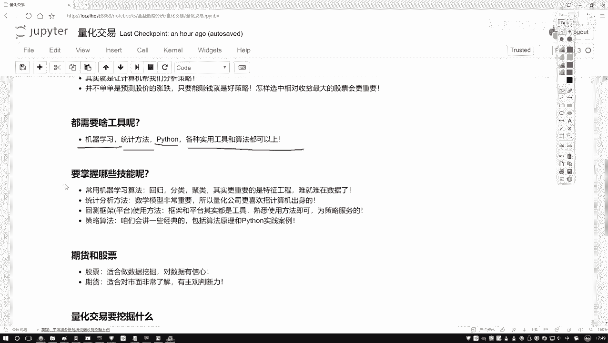

在本节课中，我们将要学习进行量化交易所需要掌握的核心技能。量化交易是一个融合了计算机科学、数学和金融学的交叉领域，理解其所需技能有助于我们构建系统的学习路径。

## 概述

量化交易的核心是将数据挖掘和算法应用于金融数据，以实现收益最大化。它不仅仅是预测股票涨跌，更是一个综合性的决策优化过程。本节将详细拆解实现量化交易所需的各项技能。

## 所需核心技能分析

上一节我们介绍了量化交易的基本概念，本节中我们来看看具体需要掌握哪些技能才能有效开展量化交易工作。

### 1. 机器学习算法与特征工程 🤖

机器学习算法是量化交易的重要工具。常规算法如回归、分类、聚类是基础。但更重要的是**特征工程**。

在机器学习中，数据决定了模型性能的上限，而算法只是帮助我们逼近这个上限的工具。特征工程的核心在于如何处理数据，以及如何从海量数据中提取最有价值的信息。

金融数据极为庞大和复杂。例如分析股票，不仅涉及收盘价、开盘价，还包括对应公司的财务数据、各种指标数据。我们需要将市场数据、公司数据、财务报表数据和股市走势数据等多个层面的信息融合起来。设计算法并将这些算法有效融入数据的过程，就是特征工程。选择最有价值的数据是机器学习中最具挑战性的环节，难点往往在于数据处理本身。

### 2. 统计学与数学基础 🧮

扎实的统计学和数学基础是量化交易的基石。无论是算法还是交易策略，本质上都是将数学公式应用到数据中。

数学是量化交易的本质。需要掌握的数学知识点很多，包括但不限于概率论、统计学、线性代数和微积分。许多量化交易岗位都要求应聘者具备数学、统计学、计算机或金融专业背景，这正说明了数学在此领域的重要性。

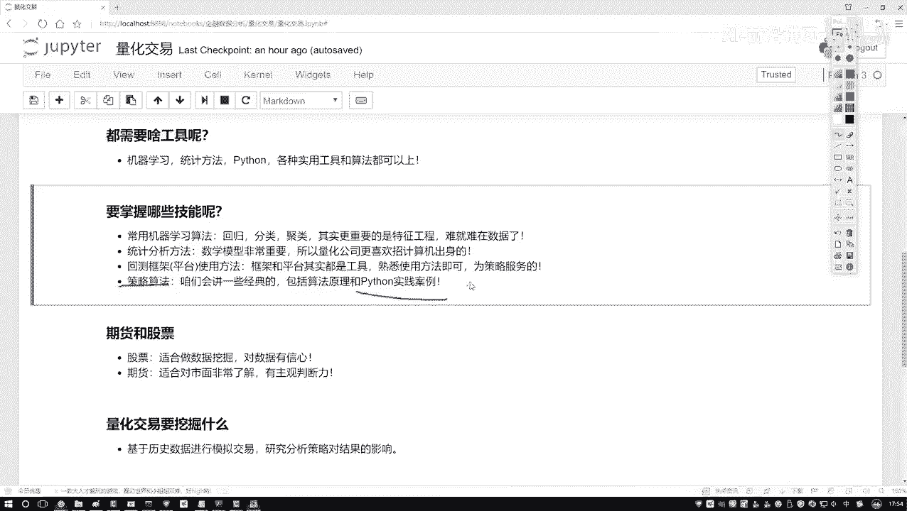

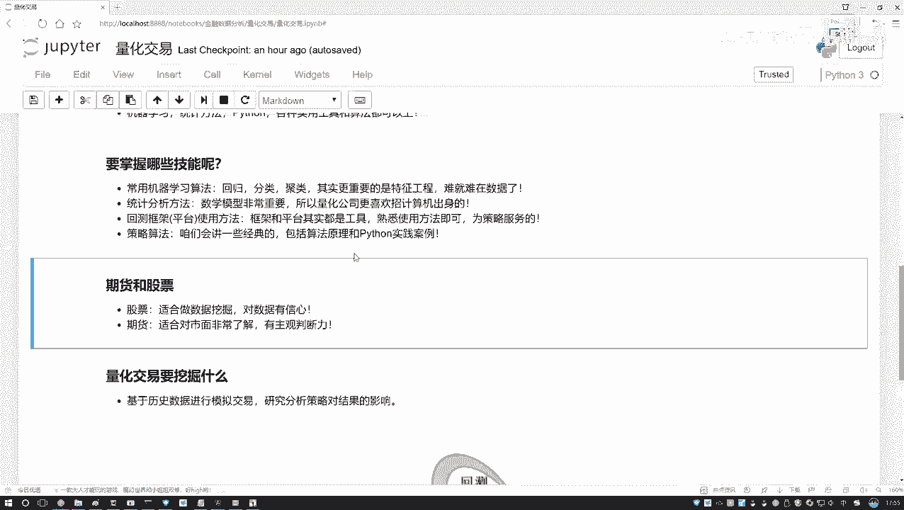

### 3. 平台与框架的使用 💻

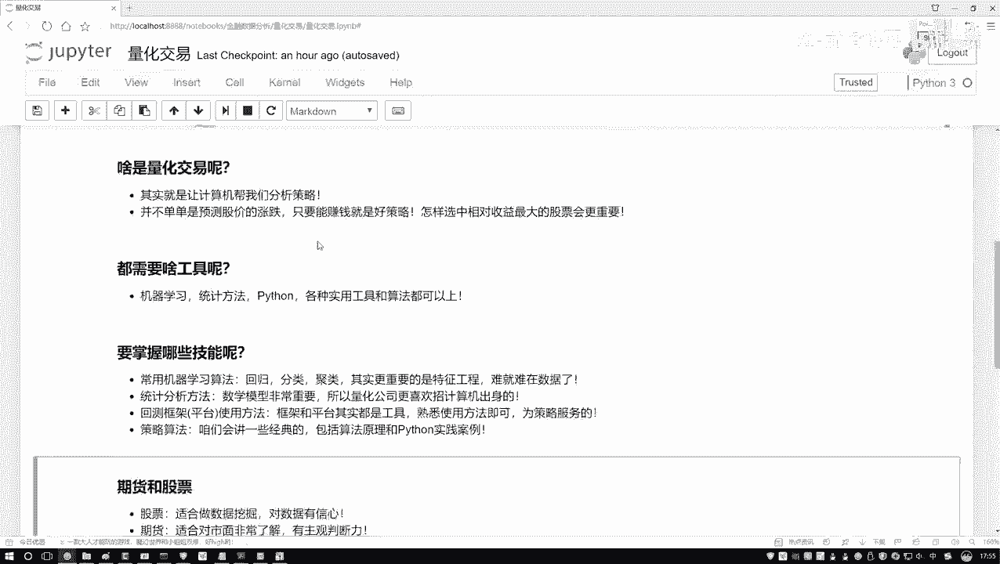

熟练使用量化交易平台和框架是实践的必要条件。这些工具能帮助我们进行策略回测和实践。

以下是选择平台时考量的因素：
*   **API简洁性**：接口应尽量简单易用。
*   **可视化清晰度**：结果展示需要直观清晰。
*   **功能完整性**：应支持编写Python代码、编译执行、并展示策略在特定历史时期（如10年到20年）内的每日实施情况、收益及最终结果。

平台和框架是工具，关键在于熟练使用，无需死记硬背。

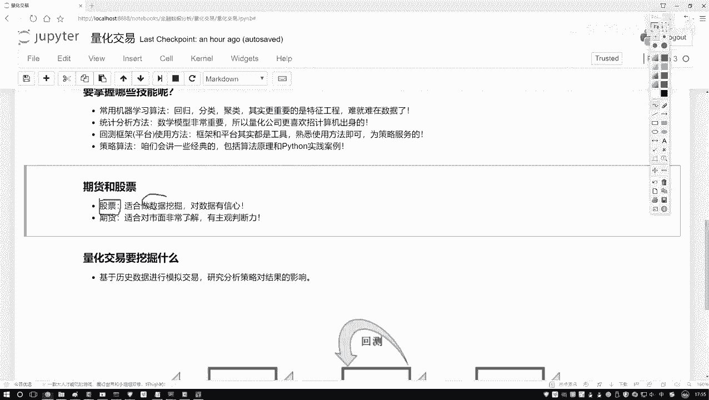

### 4. 策略算法 📈

策略算法是量化交易的核心。虽然最新的算法可以参考前沿论文，但本课程将聚焦于最常用和最经典的算法。

我们将讲解如何应用机器学习算法，以及如何使用常见的交易策略算法。课程会涵盖这些算法的原理及其在Python中的实现方法。本课程的重点是**如何在Python中实现量化交易案例**，侧重于实践，而非教授具体的炒股技巧。

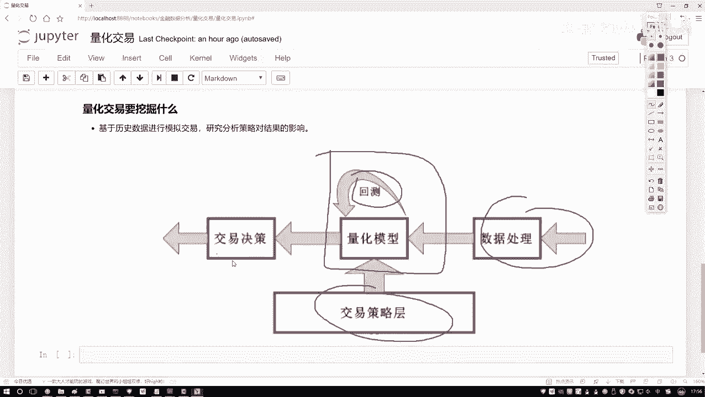

## 课程重点：股票数据挖掘

有同学问，在量化交易中，期货和股票都能操作，课程重点会是哪一个？本课程将更侧重于股票。

股票数据包含各种各样的指标，非常适合进行数据挖掘。相比之下，期货交易与市场关系更紧密，主观判断因素更强，通常需要深厚的行业经验。因此，本课程会以股票为主要案例，更适合用Python进行数据挖掘和实践。关于期货，仅会举几个小例子，不作为重点。

## 量化交易流程简述

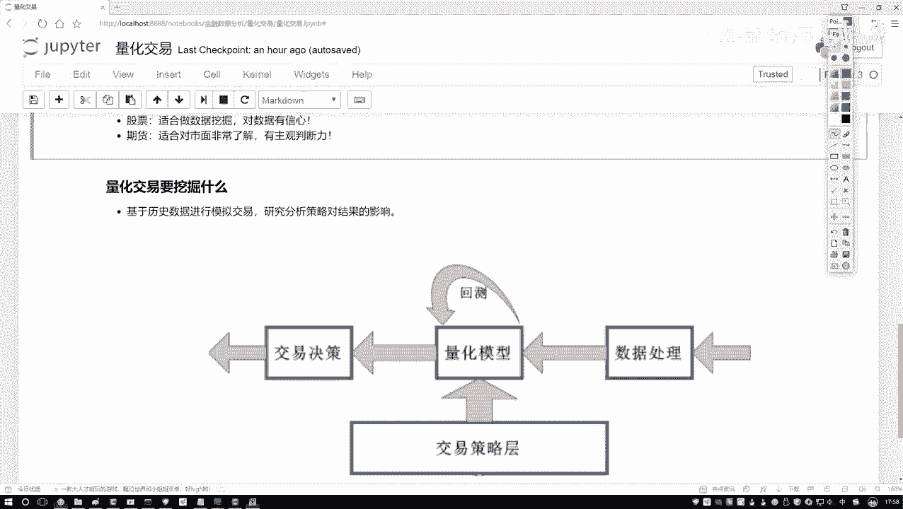

既然提到了数据挖掘，就不得不说其流程。量化交易本质上就是将数据挖掘算法应用于金融数据。

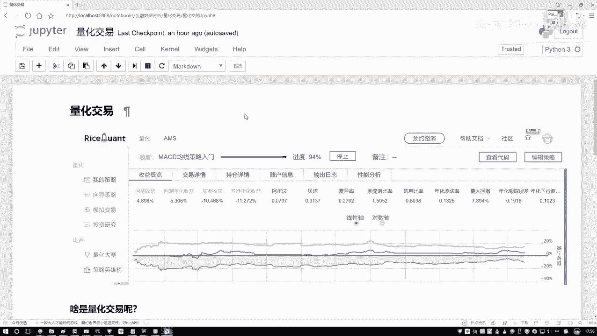

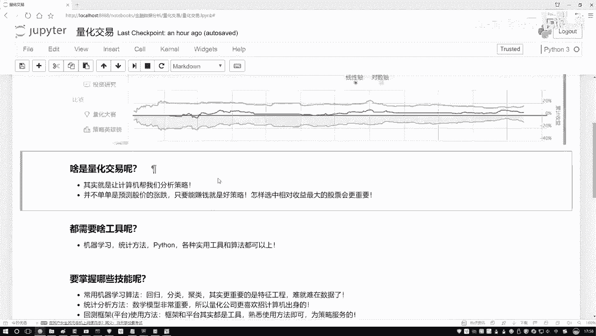

流程可以概括为：
1.  **数据处理**：获取数据后，对数据进行清洗、整合与特征提取。
2.  **策略设计**：基于处理后的数据设计交易逻辑。
3.  **回测验证**：将策略应用于历史数据，测试其表现。**回测**是指在历史数据上验证策略的有效性。
4.  **实盘指导**：回测结果为实际投资决策提供依据和指导。

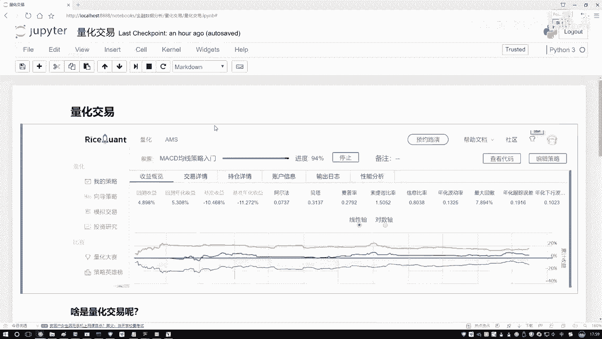

量化交易的目的不仅是预测涨跌，更是为了实现收益最大化。例如，如何从300只股票中选出最佳组合，在固定本金下实现最高收益或单位风险最高收益，这也是数据挖掘要解决的问题。

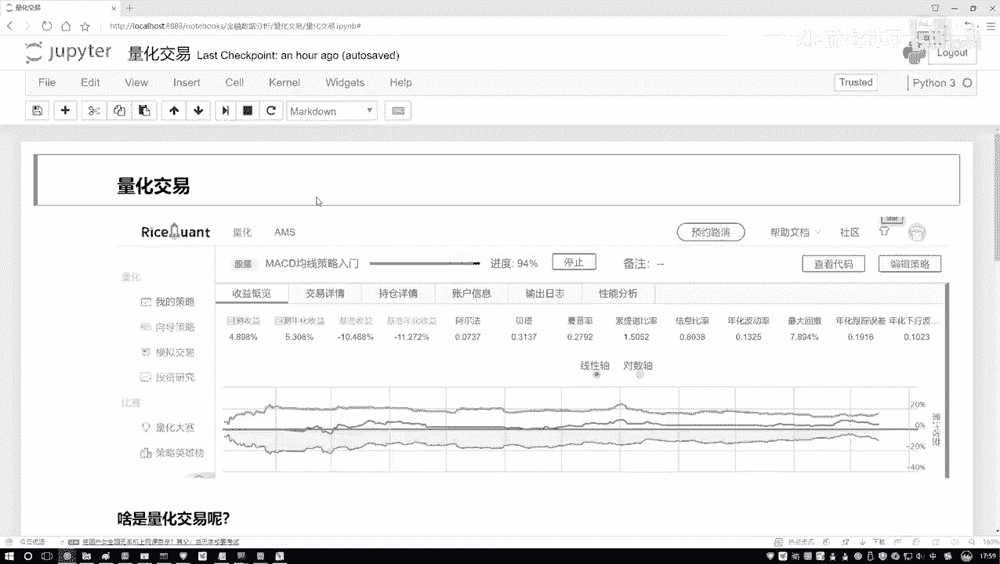

## 总结

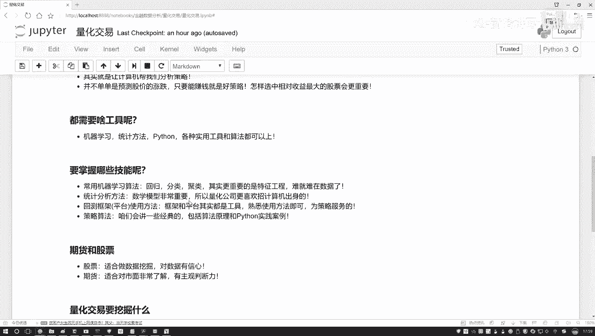

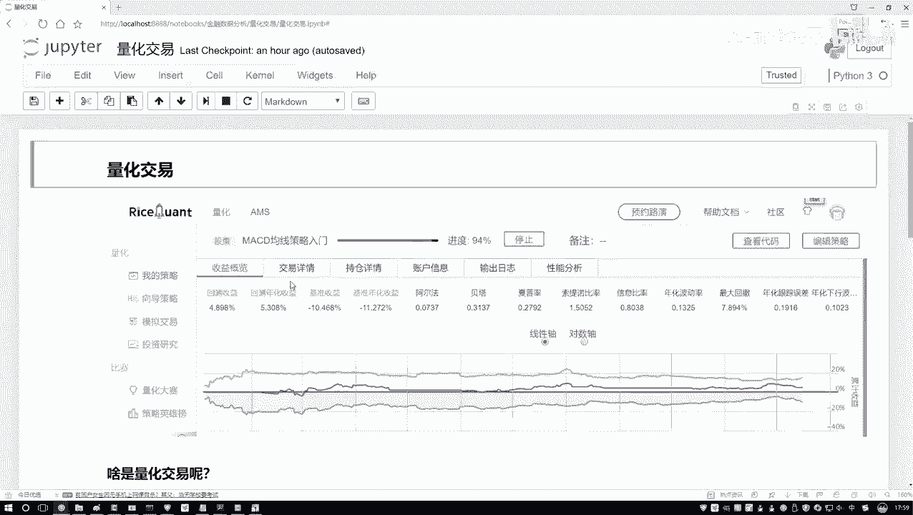

本节课中我们一起学习了进行量化交易所需的核心技能。你需要对机器学习算法与特征工程、统计学与数学基础、量化平台的使用以及策略算法有基本的了解。本课程将重点放在利用Python对股票数据进行数据挖掘的实践上，目标是实现收益优化。关于量化交易的历史和过于理论化的长篇大论，初学者无需过度关注，掌握其要做什么、用什么工具以及后续学习方向即可。