# Python量化交易：P58：KMEANS算法概述

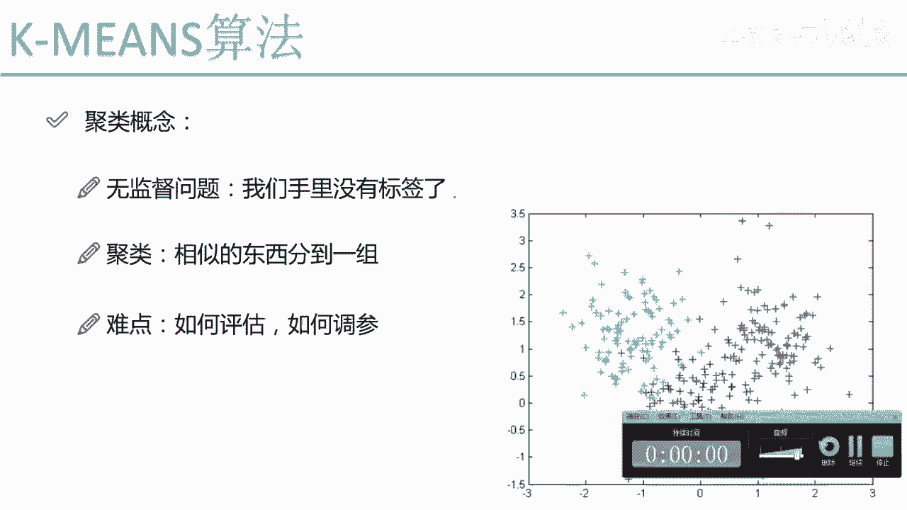

## 📚 概述
在本节课中，我们将学习机器学习中一个非常重要的分支——聚类。我们将重点介绍聚类算法的核心概念、应用场景以及面临的挑战，并详细讲解最经典、最实用的聚类算法之一：K-Means算法。

---

## 🔍 聚类是什么？
上一节我们介绍了有监督学习，其特点是拥有数据标签。本节中，我们来看看无监督学习中的聚类问题。

聚类是一种无监督学习方法。与有监督学习不同，聚类问题中，我们手里没有每个数据属于哪个类别的标签。聚类的目标是将数据集中相似的数据点自动分组到不同的“簇”中。

例如，观察右侧的图表，原始数据并没有颜色标记。聚类算法会根据数据点之间的相似度，自动将相似的点归为一组，最终形成绿色、红色和蓝色三个不同的簇。

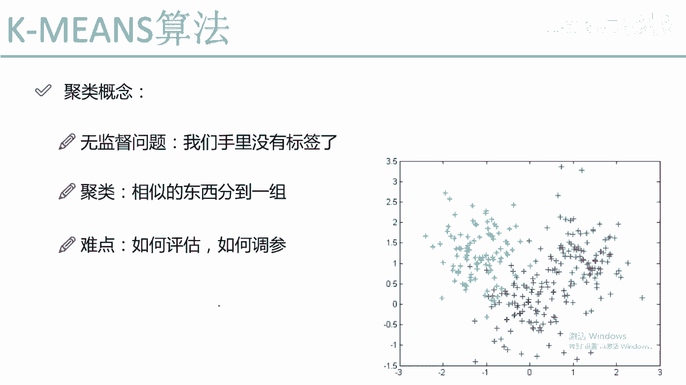

## ⚠️ 聚类的难点
聚类算法原理虽然相对简单，但在实际应用中存在两大难点。

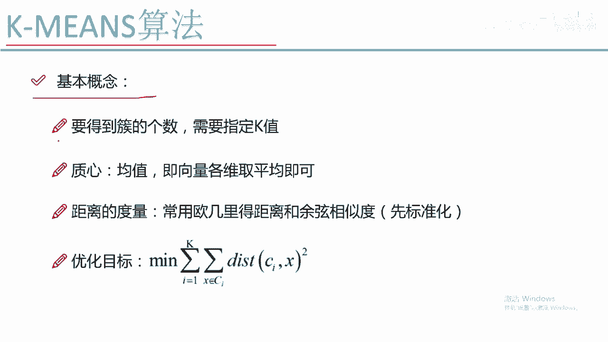

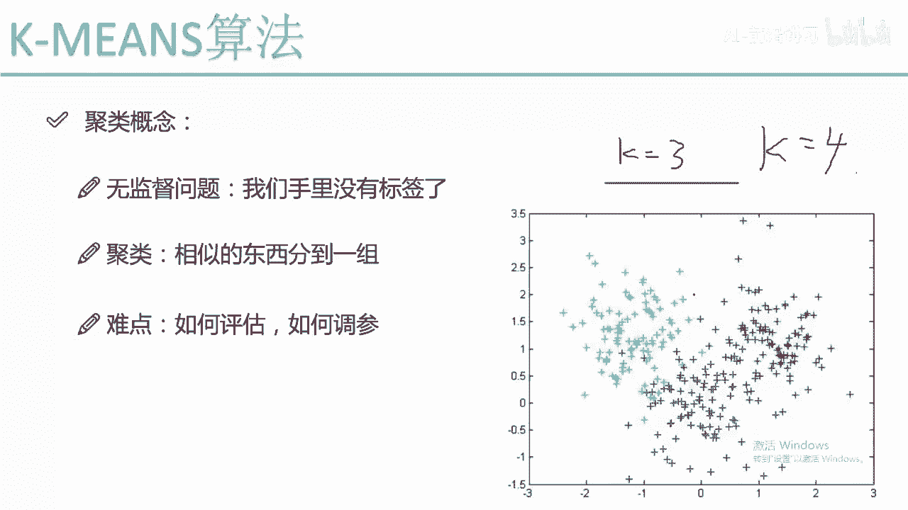

以下是聚类算法的主要挑战：
1.  **评估困难**：由于没有真实标签，我们无法像有监督学习那样直接计算准确率、召回率等指标来评估聚类结果的好坏。
2.  **参数调节困难**：例如，调整参数后得到不同的聚类结果，但因为没有标准答案，很难判断哪个结果更优。

## 🎯 K-Means算法核心概念
接下来，我们将深入探讨K-Means算法。首先需要理解它的几个核心概念。

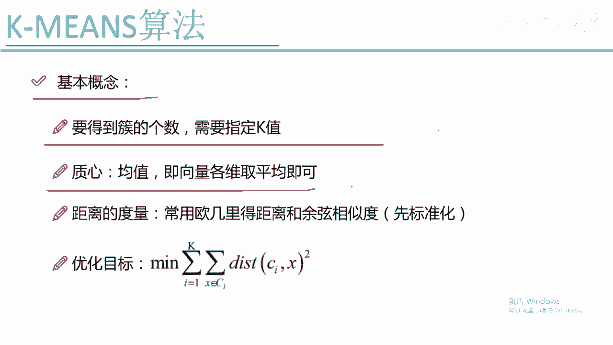

### 1. K值
K-Means算法需要我们预先指定一个K值。K值代表我们希望将数据聚合成多少个簇。例如，设定K=3，算法会将数据分成三堆；设定K=4，则分成四堆。

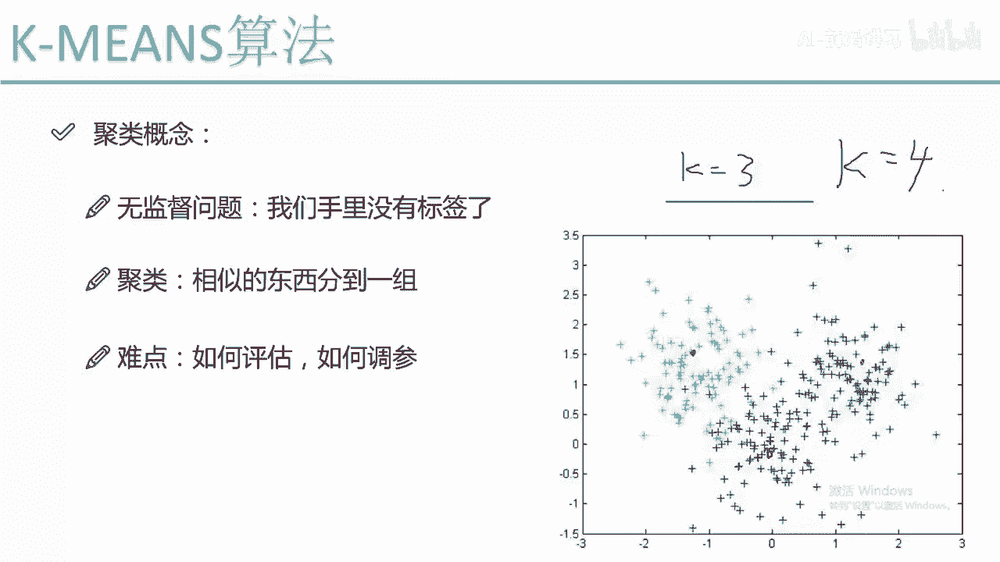

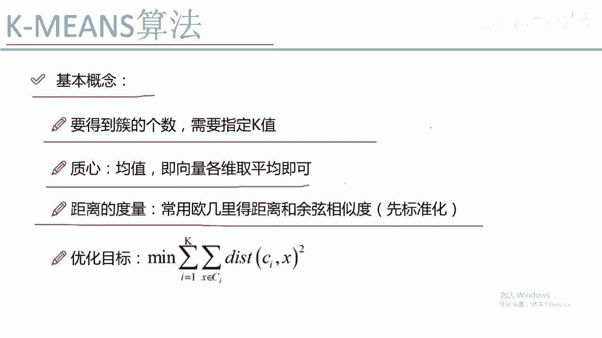

### 2. 质心
质心是K-Means算法中一个非常重要的概念。质心代表一个簇的中心位置，通常由该簇内所有数据点在各个维度上的平均值计算得出。

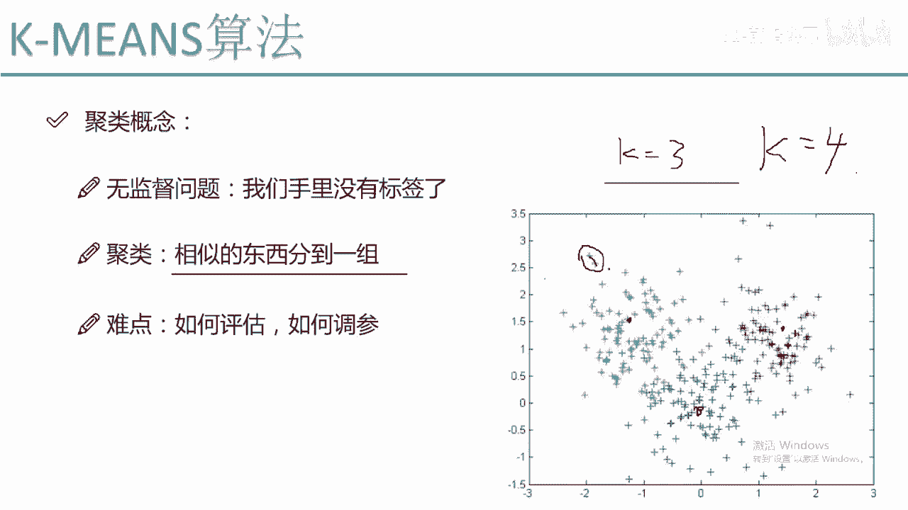

例如，在二维空间中，一个簇的质心坐标由其所有点的X坐标平均值和Y坐标平均值共同决定。每个簇都有自己的质心，它在算法的迭代过程中起到关键作用。

### 3. 距离度量
聚类需要判断数据点是否相似，这依赖于距离度量。最常用的距离计算方式是欧式距离。

**欧式距离公式**（二维空间）：
`距离 = sqrt((x2 - x1)^2 + (y2 - y1)^2)`

在使用距离度量（尤其是欧式距离）前，通常需要对数据进行标准化处理。这是因为如果不同特征（维度）的数值范围差异巨大，数值范围大的特征会主导距离计算，从而影响聚类效果。

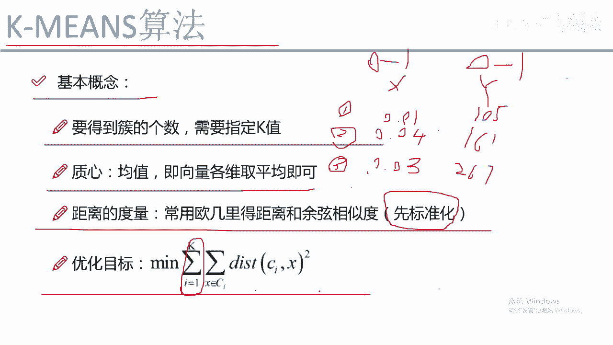

标准化（如归一化）可以将所有特征的数值范围调整到相近的区间（例如0到1之间），确保每个特征在距离计算中具有同等的重要性。

### 4. 优化目标
K-Means算法通过优化一个目标函数来工作。其目标是：对于最终形成的每一个簇，让簇内的每个数据点到该簇质心的距离总和尽可能小。

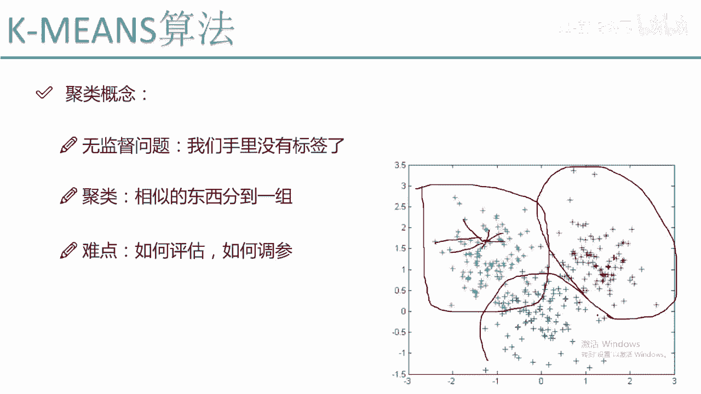

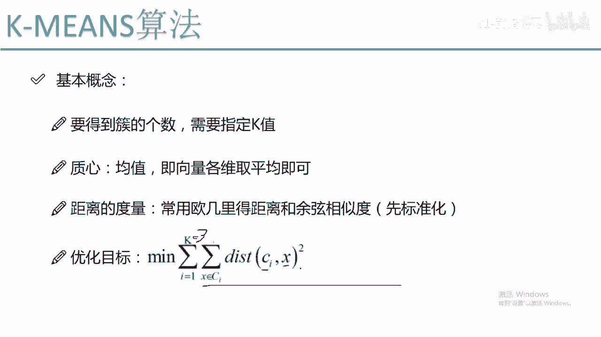

**优化目标公式**：
`最小化 Sum(从 i=1 到 K) [ Sum(对于簇i中的每个点 x) ( ||x - 质心_i||^2 ) ]`

这个公式的含义是：我们希望所有簇的内部都足够“紧凑”。如果一个点离当前簇的质心很远，算法在迭代过程中可能会将其重新分配到离它更近的另一个簇的质心所属的簇中。

## 📝 总结
本节课中，我们一起学习了聚类的基本概念和K-Means算法的核心思想。

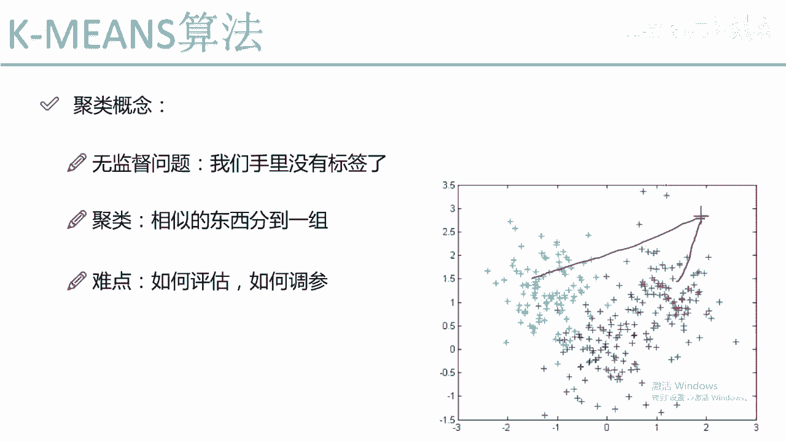

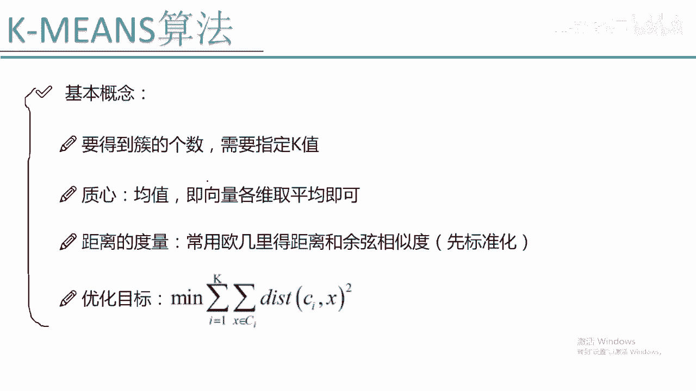

我们了解到聚类是一种无监督学习方法，用于将相似数据分组。K-Means算法作为最经典的聚类算法，需要我们预先指定簇的数量K。它通过计算数据点与质心（簇中心）的距离，并不断迭代优化，使得每个簇内部的数据点尽可能接近其质心，从而完成聚类任务。理解K值、质心、距离度量和优化目标是掌握K-Means算法的关键。