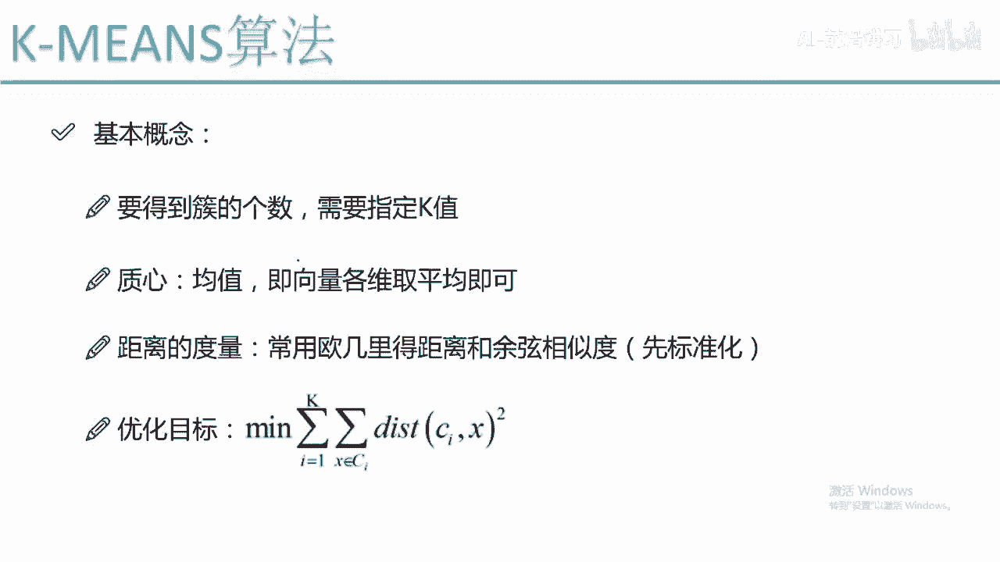
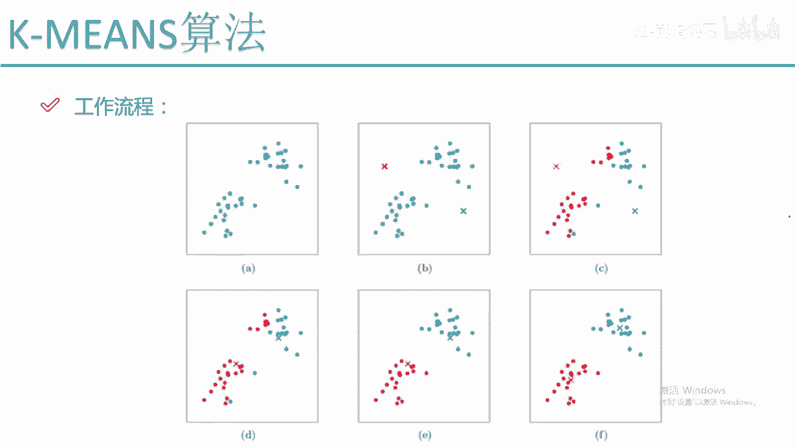
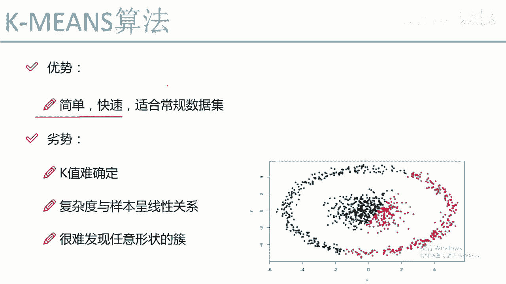
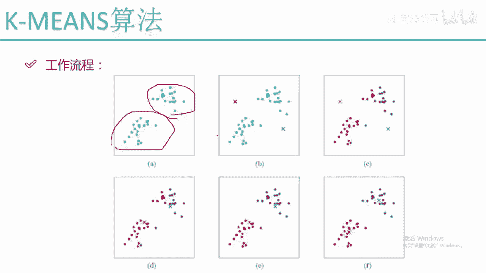
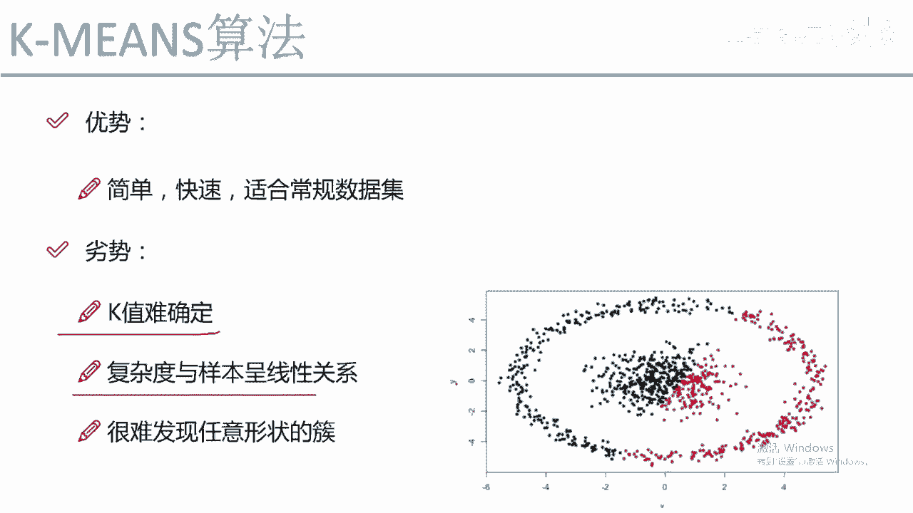
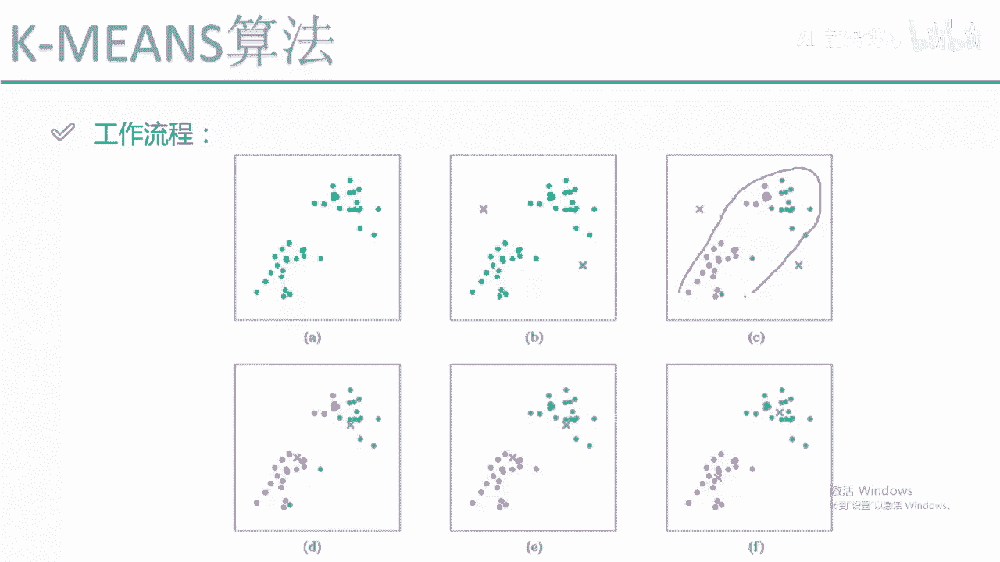
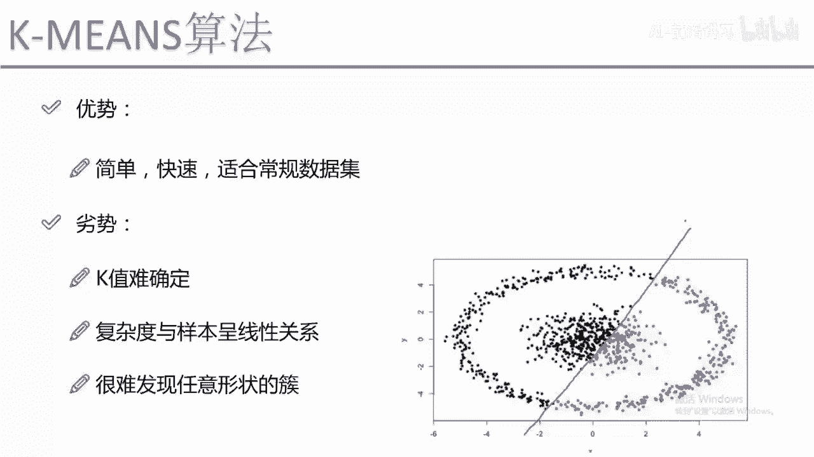
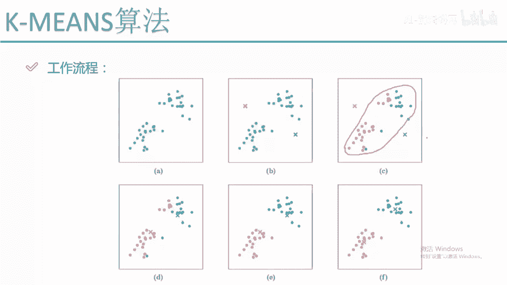
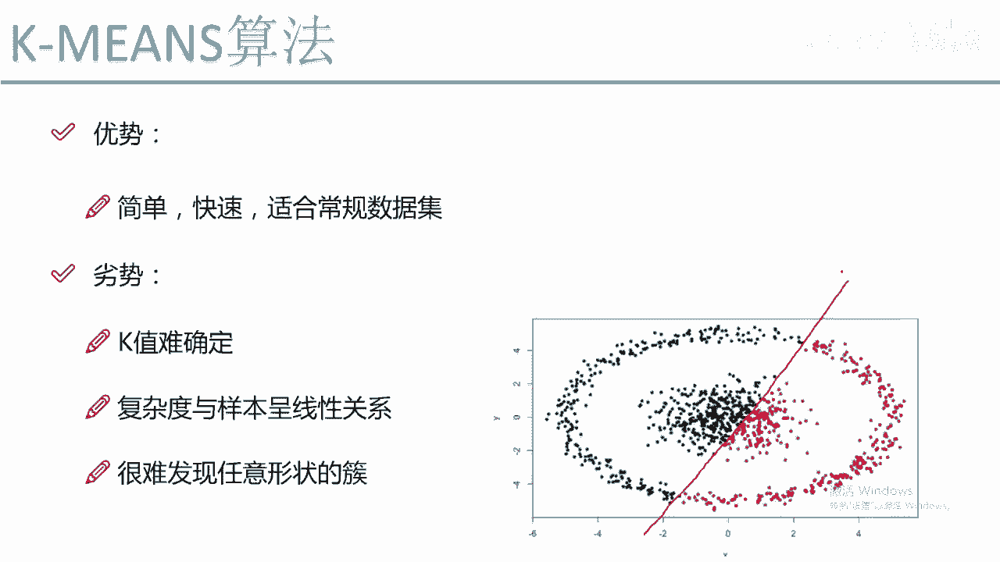

# Python量化交易：P59：K-Means工作流程 🧮

在本节课中，我们将学习K-Means聚类算法的工作流程。这是一种无监督学习算法，常用于将数据点自动分组到不同的“簇”中。我们将通过图解的方式，一步步拆解其核心步骤，并了解其优缺点。

## 原始数据与初始化

首先，我们有一组原始数据点。由于是无监督学习，我们事先并不知道每个点应该属于哪个簇。使用K-Means算法时，需要指定一个参数 **K**，它代表我们希望将数据分成几个簇。

假设我们设定 **K=2**。算法会随机初始化两个点作为初始的“质心”，例如一个红色质心和一个蓝色质心。这两个质心的位置通常是随机选择的。

## 分配数据点到簇

初始化质心后，算法开始为每一个数据点分配簇标签。分配的依据是**距离**：计算该数据点到两个质心的距离，然后将其分配给距离更近的那个质心。

具体步骤如下：
*   对于一个绿色的数据点，计算它到红色质心的距离 **D1**，以及到蓝色质心的距离 **D2**。
*   比较 **D1** 和 **D2**。如果 **D1 < D2**，则认为该点与红色质心更相似，将其标记为红色。
*   遍历数据集中的所有点，重复上述计算和比较过程。最终，所有点都会被标记为红色或蓝色，从而初步形成两个簇。

## 更新质心位置

第一次分配完成后，我们得到了两个初步的簇（一堆红点和一堆蓝点）。但此时质心的位置是随机初始的，划分结果可能并不准确（例如，肉眼可见应该是一左一右两堆，但算法可能划分成上下一堆）。

因此，我们需要**更新质心**。更新方法是：计算每个簇中所有点的平均值，将这个平均值点作为该簇新的质心。
*   对于所有红色点，计算它们在坐标轴上的平均值，得到一个新的红色质心。
*   对于所有蓝色点，同样计算平均值，得到一个新的蓝色质心。
*   更新后，质心通常会移动到各自簇的中心位置。

## 迭代优化

质心更新后，一切将重新开始。算法会再次遍历所有数据点，根据它们到**新质心**的距离重新分配簇标签。

这个过程会导致一些点的颜色发生变化：
*   之前被标记为红色的点，可能因为离新的蓝色质心更近而被重新标记为蓝色。
*   同理，一些蓝点也可能被重新标记为红色。

分配完成后，算法会再次基于新的簇分布更新质心位置。然后再次重新分配，再次更新……如此循环往复。

## 算法收敛

上述“分配-更新”的步骤会不断迭代，直到满足停止条件。最常见的停止条件是：**数据点的簇归属不再发生变化**，或者质心的移动距离小于某个阈值。

当算法收敛时，我们就得到了最终的聚类结果：数据被稳定地分成了K个簇，每个簇有其确定的质心。

## K-Means算法总结

本节课中我们一起学习了K-Means聚类算法的工作流程。其核心步骤可以概括为：
1.  **初始化**：随机选择K个点作为初始质心。
2.  **分配**：将每个数据点分配给距离最近的质心所在的簇。
3.  **更新**：重新计算每个簇的质心（即该簇所有点的均值）。
4.  **迭代**：重复步骤2和3，直到分配结果不再变化（收敛）。

其数学目标是最小化所有数据点到其所属簇质心的距离平方和，即最小化以下**公式**：
`J = Σ（每个点到其质心的距离²）`

## 优点与缺点

了解算法的优缺点有助于我们在实际应用中做出正确选择。

### 优点
K-Means算法主要有以下优点：
*   **原理简单**，易于理解和实现。
*   **效率较高**，对于常规数据集，计算速度相对较快。
*   **应用广泛**，是聚类任务中最常用的算法之一。

### 缺点
同时，K-Means算法也存在一些明显的缺点：
*   **需要预先指定K值**：在实际应用中，最佳簇数K往往难以确定，通常需要尝试多个K值并评估结果。
*   **对初始值敏感**：不同的随机初始质心可能导致不同的最终结果。
*   **对异常值敏感**：极端值会显著影响质心的计算。
*   **仅适用于球形簇**：算法基于距离度量，假设簇是凸形的（如球形）。对于环形、流形或交织在一起的复杂形状簇，效果很差。例如，它无法正确分离一个套在另一个外面的同心圆簇，而可能会将其错误地按左右或上下划分。

---
**总结**：K-Means是一个经典且强大的聚类算法，其核心思想是通过迭代优化质心位置来划分数据。它简单高效，适用于结构相对规整的数据集，但对簇的形状有要求，且需要人为指定簇的数量K。