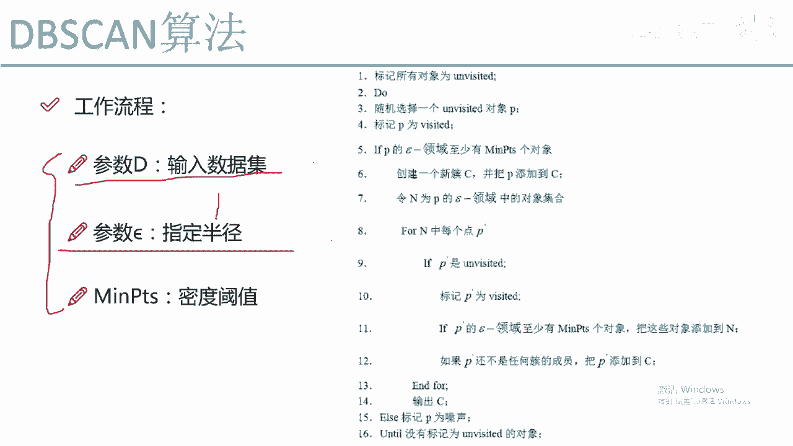
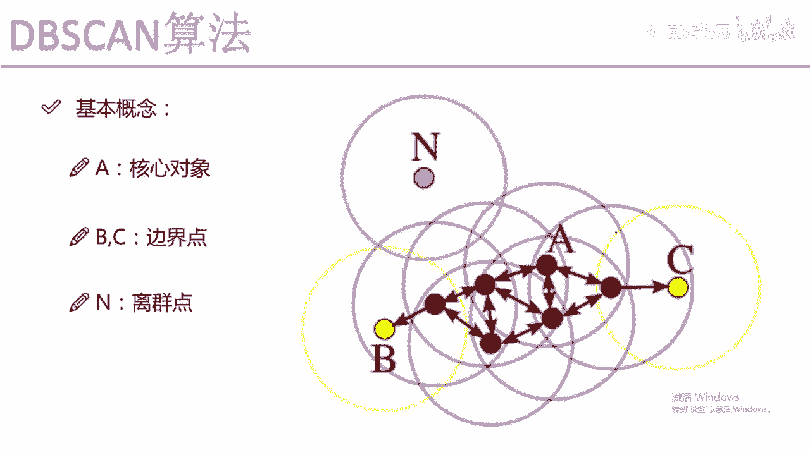
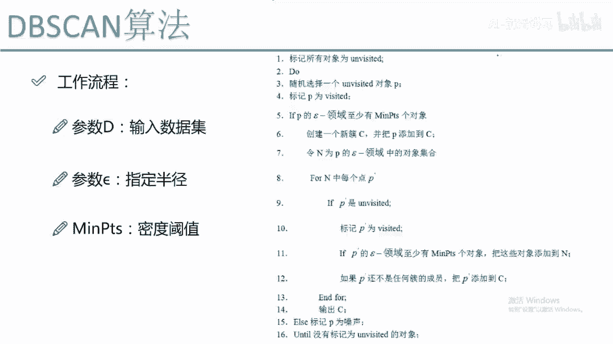
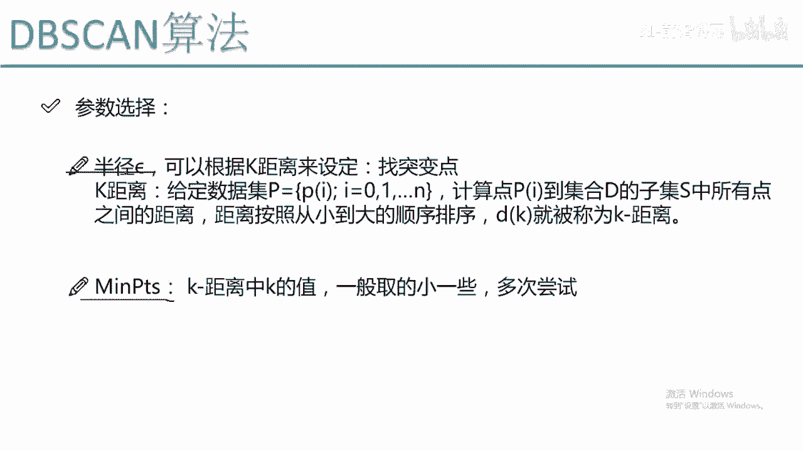
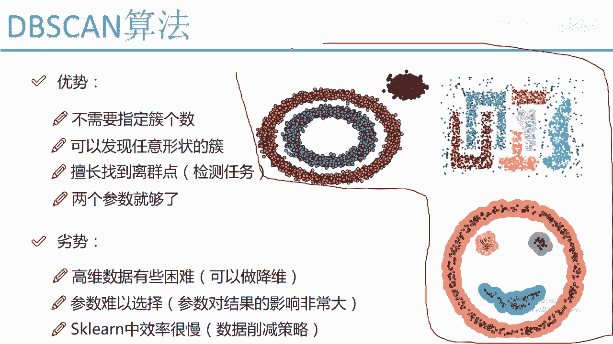

# Python量化交易：P62：DBSCAN工作流程

## 概述
在本节课程中，我们将深入探讨DBSCAN（基于密度的空间聚类应用）算法的工作流程。我们将从算法所需的输入参数开始，逐步解析其核心迭代过程，并讨论如何选择合适的参数。最后，我们将总结DBSCAN算法的优势与劣势，帮助你理解为何它在处理不规则数据时比K-Means等算法更具优势。

---

## 输入参数
DBSCAN算法主要需要三个输入参数。

以下是具体说明：

1.  **数据集**：这是任何聚类算法都必须输入的数据集合。
2.  **半径（eps）**：DBSCAN算法基于“画圈”寻找邻近点的思想，这个“圈”的半径就是`eps`。它定义了邻域的大小。
3.  **最小样本数（min_samples）**：这是一个密度阈值。它定义了在以某个点为中心、`eps`为半径的圆形区域内，最少需要有多少个点（包括中心点自身），才能将该点定义为一个**核心对象**。

---

## 算法工作流程
上一节我们介绍了DBSCAN的输入参数，本节中我们来看看算法是如何迭代运行的。整个过程可以类比为“发展下线”或“传销”模型。

以下是DBSCAN算法的详细步骤：

1.  **初始化标记**：首先，将数据集中的所有数据点标记为“未访问”。
2.  **随机选择起点**：从数据集中随机选择一个未被访问的点`P`，并将其标记为“已访问”。
3.  **判断核心对象**：检查点`P`在其`eps`半径的邻域内包含的点数（包括`P`自身）。如果该数量大于或等于`min_samples`，则`P`被认定为一个**核心对象**。
    *   如果`P`是核心对象：
        a. **创建新簇**：创建一个新的簇`C`。
        b. **扩展簇**：将点`P`及其`eps`邻域内的所有点（记为集合`N`）都加入到簇`C`中。
        c. **递归扩展**：对于集合`N`中的每一个点`Q`（这些点现在都是簇`C`的成员），重复以下操作：
            *   如果`Q`未被访问过，则将其标记为“已访问”。
            *   检查`Q`是否也是核心对象（即其`eps`邻域内的点数是否≥`min_samples`）。
            *   如果`Q`是核心对象，则将其`eps`邻域内的所有点（如果尚未在簇`C`中）也加入到集合`N`中。这个过程会不断重复，直到没有新的点可以加入到当前簇`C`为止。
4.  **处理非核心对象**：如果在步骤3中发现点`P`不是一个核心对象（即其邻域内点数 < `min_samples`），则暂时将其标记为“噪声点”（但最终分类可能改变）。
5.  **循环迭代**：重复步骤2-4，从剩余“未访问”的点中随机选择新的起点，创建新的簇，直到数据集中所有的点都被标记为“已访问”。

**核心概念公式**：
*   判断点`P`是否为核心对象：`Neighborhood(P, eps).size >= min_samples`
*   其中，`Neighborhood(P, eps)`表示以点`P`为中心、`eps`为半径的圆形区域内的所有点的集合。

---

## 参数选择技巧
DBSCAN的效果很大程度上依赖于`eps`和`min_samples`这两个参数的选择，尤其是`eps`。

以下是参数选择的一些方法：

1.  **半径（eps）的选择 - K距离图法**：
    *   对于数据集中的每个点`Pi`，计算它到所有其他点的距离。
    *   对这些距离进行排序。
    *   为每个点`Pi`绘制排序后的距离图（纵轴为距离，横轴为按距离排序的点的序号）。
    *   观察所有点的K距离图的“拐点”或“肘部”。通常，距离会突然增大形成一个拐点，这个拐点对应的距离值可以作为`eps`的参考值。因为拐点之后的点距离较远，可能属于其他簇或噪声。

2.  **最小样本数（min_samples）的选择**：
    *   这是一个相对简单的参数。`sklearn`库的建议是，这个值不宜过大，通常设置为一个较小的值，如4、5或10。
    *   一般经验是，`min_samples` ≥ 数据维度 + 1。对于维度较低的数据，从4开始尝试是一个不错的起点。

---

## 算法优势与效果
通过前面的讲解，我们了解了DBSCAN如何工作。现在，让我们看看它的实际效果和优势。

DBSCAN在处理复杂形状的数据集时表现出色：

*   **识别任意形状的簇**：与K-Means只能发现球形簇不同，DBSCAN可以识别出环形、月牙形等任意形状的簇，因为它基于密度连通性。
*   **自动确定簇数量**：算法不需要预先指定簇的个数（K值），它会根据数据的密度分布自动发现簇。
*   **识别噪声点**：DBSCAN能够有效识别并分离出不属于任何簇的噪声点（离群点）。在`sklearn`的实现中，这些噪声点的簇标签被标记为`-1`。
*   **参数较少**：核心参数只有两个（`eps`和`min_samples`）。

---

## 算法劣势与注意事项
尽管DBSCAN功能强大，但它也存在一些局限性和需要注意的地方。

以下是其主要劣势：

1.  **对高维数据处理困难**：在高维空间中，所有点之间的距离都倾向于变得相似（“维度灾难”），这使得定义有意义的`eps`半径变得非常困难，聚类效果会下降。
2.  **参数敏感且选择困难**：`eps`参数的选择对结果影响巨大，且没有适用于所有数据集的通用方法，通常需要结合领域知识和多次实验。
3.  **对密度不均的数据集效果不佳**：如果数据集中不同簇的密度差异很大，很难找到一个全局的`eps`值来同时很好地分离所有簇。
4.  **计算复杂度与内存消耗**：在大规模数据集上，尤其是在需要计算所有点之间距离时，DBSCAN的计算和内存开销可能较大。`sklearn`的实现对于大数据集可能出现内存溢出错误。对此，可以考虑先进行数据降维或采用数据削减策略。

---

## 总结
本节课中，我们一起学习了DBSCAN聚类算法。

我们从其核心思想——“基于密度”和“发展下线”入手，详细剖析了算法的工作流程，包括如何通过`eps`和`min_samples`参数识别核心对象并扩展簇。我们探讨了参数选择的实用技巧，特别是使用K距离图来估计`eps`。最后，我们总结了DBSCAN的主要优势（如能发现任意形状簇、自动确定簇数、识别噪声点）和劣势（如对参数敏感、高维数据处理困难）。

总体而言，DBSCAN是一种非常强大且实用的聚类算法，尤其适用于簇形状不规则、且含有噪声的数据集，是量化交易和数据分析中处理复杂数据模式的得力工具。