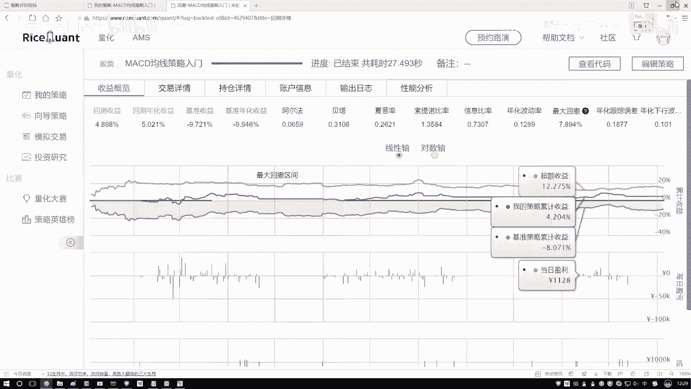
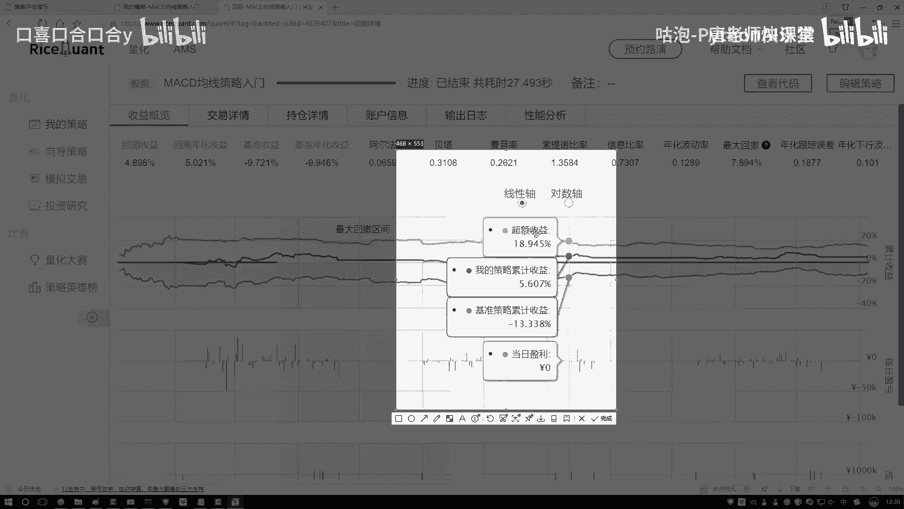
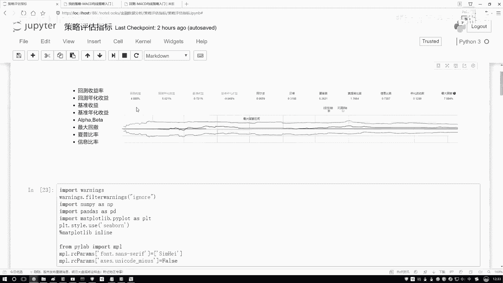

# 量化交易与Python金融分析实战：P18：20. 阿尔法与贝塔概述

在本节课中，我们将要学习量化策略评估中的两个核心概念：阿尔法（α）和贝塔（β）。理解这两个指标，有助于我们区分投资收益的来源，并明确策略优化的方向。

## 收益的构成

上一节我们介绍了多种策略评估指标，本节中我们来看看收益的深层构成。一项投资或策略所赚取的收益，通常可以分解为两个部分。

以下是收益的两个主要来源：

1.  **市场收益**：这部分收益与整体市场环境的好坏直接相关。当大盘整体上涨时，大部分投资都能获得收益，这部分可以理解为“随波逐流”赚到的钱。
2.  **超额收益**：这部分收益与市场整体波动关系不大，主要来源于投资者或策略自身的独特能力。例如，通过深入分析公司财报、敏锐发现市场机会或执行有效的交易策略所获得的额外收益。

阿尔法和贝塔就是分别用来衡量这两部分收益贡献的指标。

## 阿尔法（α）与贝塔（β）的定义

理解了收益的构成后，我们来看看如何用具体的指标来衡量它们。

*   **贝塔（β）**：衡量策略收益对市场波动的敏感性，即“市场收益”部分的系数。它反映了策略跟随大盘涨跌的程度。**β = 1** 表示策略与市场波动同步；**β > 1** 表示策略波动比市场更剧烈；**β < 1** 表示策略波动比市场更平缓。
*   **阿尔法（α）**：衡量与市场波动无关的超额收益，即“超额收益”部分。它代表了策略通过自身能力（如选股、择时）所创造的、超越市场基准的回报。正的阿尔法意味着策略跑赢了市场。

我们可以用一个简单的线性回归模型来理解它们的关系：

**策略收益 = α + β × 市场收益 + 误差项**

在这个模型中，我们的目标就是求解出 **α** 和 **β** 这两个系数。

## 实际图表解读

理论需要结合实践，让我们通过一个示意图来直观理解这些概念。

观察上图，我们可以识别出三条关键的收益曲线：

*   **我的策略收益**：代表您所运行的策略产生的总收益曲线。
*   **基准策略收益**：代表市场整体表现，例如沪深300指数的收益曲线。这就是“市场收益”的体现。
*   **超额收益**：由 **“策略收益”减去“基准收益”** 计算得出。这条曲线直观地展示了策略自身创造的价值，即 **阿尔法（α）** 的体现。

因此，**总收益 = β × 市场收益 + α**。

## 策略关注的核心

既然收益由两部分组成，那么我们应该更关注哪一部分呢？

市场整体的走势（贝塔部分）是个人投资者难以控制和预测的。因此，量化策略研究的核心目标，就是追求稳定且显著的 **阿尔法（α）**，即持续获得超越市场基准的超额收益。我们的努力方向应是优化策略，以最大化阿尔法。

## 本章小结

本节课中我们一起学习了阿尔法（α）和贝塔（β）的核心概念。

*   我们将策略总收益分解为**市场收益（贝塔）**和**超额收益（阿尔法）**两部分。
*   **贝塔**衡量策略对市场的敏感度，**阿尔法**衡量策略自身创造超额回报的能力。
*   在量化交易中，持续获取正的**阿尔法**是策略成功的关键。

公式和具体计算无需死记硬背，在实际应用中通常有现成的工具包可以调用。重要的是理解其经济含义，并能通过收益归因图进行解读。

