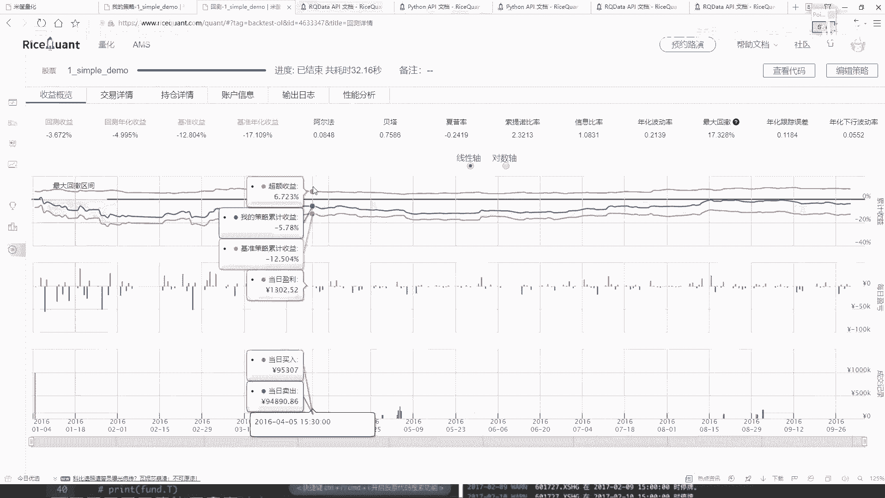
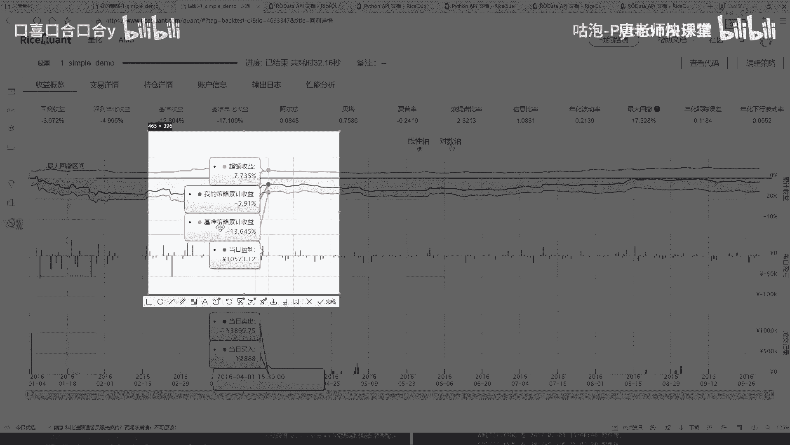
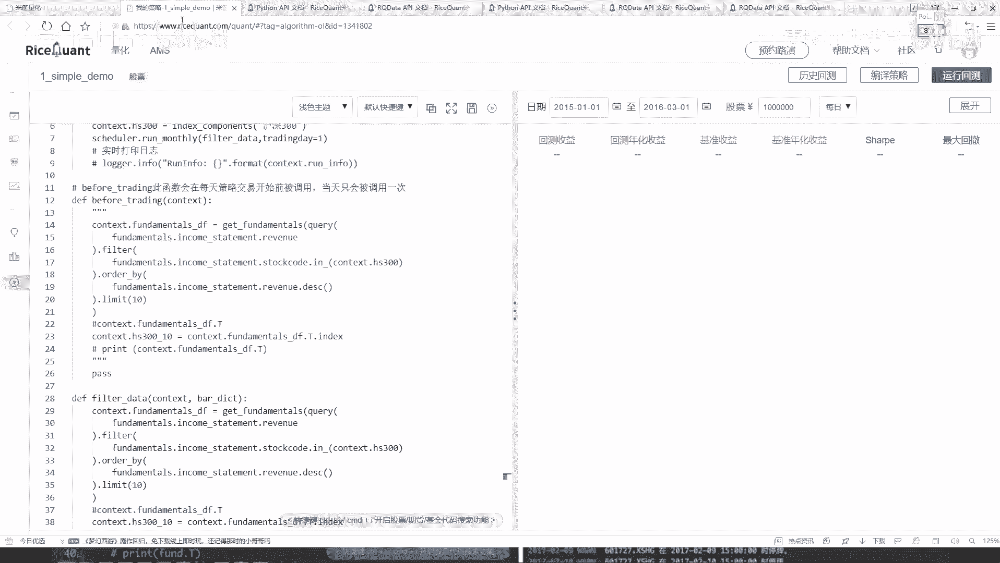

# 量化交易与Python金融分析实战：P25：定时器功能与作用 ⏰

## 概述
在本节课中，我们将学习量化交易策略中一个重要的功能：定时器。我们将了解如何通过定时器来控制策略中特定操作的执行频率，而不是在每一个交易日都执行所有操作。

上一节我们介绍了策略的基本框架和每日调仓的逻辑，本节中我们来看看如何自定义操作的执行时间点。

## 定时器功能详解
在之前的策略中，`before_trading` 函数和选股逻辑在**每一个交易日**都会执行。这意味着每天都会根据最新数据重新筛选股票并进行交易。然而，在实际策略中，我们可能希望以更低的频率执行某些操作，例如每十天或每月进行一次选股。

为了实现这个目的，平台提供了**定时器**功能。定时器允许我们按照设定的时间间隔（如每周、每月）来执行特定的函数。

### 定时器的基本用法
定时器主要在策略的初始化函数 `__init__` 中使用。其核心作用是注册一个函数，并指定该函数在何种时间周期下被调用。

以下是定时器的一个典型应用场景代码框架：





```python
def __init__(self):
    # 初始化策略
    # ...
    # 添加每月定时器，在每月第一个交易日执行 filter_data 函数
    self.run_monthly(self.filter_data, 1)
```

### 修改策略：从每日选股到每月选股
接下来，我们将修改之前的策略，将每日选股调整为每月第一个交易日选股。

以下是修改步骤：
1.  注释掉原来在 `before_trading` 函数中的每日选股逻辑。
2.  将选股逻辑封装到一个独立的函数中，例如 `filter_data`。
3.  在 `__init__` 函数中使用 `run_monthly` 定时器调用这个函数。

具体代码修改如下：

```python
def __init__(self):
    # ... 其他初始化代码 ...
    # 设置定时器：每月第一个交易日执行 filter_data 函数
    self.run_monthly(self.filter_data, 1)

def filter_data(self):
    """每月执行一次的选股函数"""
    # 原有的选股逻辑（从 before_trading 中移过来）
    stock_list = get_all_securities(types=[‘stock‘], date=self.current_dt).index.tolist()
    # ... 后续的数据查询、过滤、排序等代码 ...
    self.stock_pool = df[‘code‘].tolist()[:10]

def before_trading(self):
    # 注释掉原来的每日选股逻辑
    # self.stock_pool = ... 
    pass
```

### 不同定时周期的效果对比
修改完成后，我们重新回测策略。将选股频率从“每日”改为“每月”后，策略的最终收益结果可能会发生显著变化。这种变化可能向好也可能向坏，这取决于市场特性、所选时间段以及策略逻辑本身。

例如，在某个测试时间段内，每日调仓的策略可能亏损4%，而改为每月调仓后，亏损可能扩大至28%。反之，在另一个时间段或另一种市场环境下，每月调仓的效果可能会优于每日调仓。这说明了**参数敏感性**和**过拟合风险**在量化策略中的重要性。

## 核心要点总结
本节课中我们一起学习了量化策略中定时器的功能与作用。

1.  **定时器的作用**：定时器用于控制策略中特定函数的执行频率，如每周、每月执行一次，而不是默认的每个交易日都执行。
2.  **使用方法**：在策略的 `__init__` 初始化函数中，通过 `run_daily`, `run_weekly`, `run_monthly` 等API来注册定时任务。
3.  **策略灵活性**：通过调整操作的执行频率，我们可以构建不同风格的策略（如高频、低频），并观察其对策略绩效的影响。
4.  **学习路径**：掌握量化交易平台的最佳方式是勤查官方API文档，理解每个函数和参数的含义，并通过实践进行验证和调整。



定时器是优化策略逻辑、管理交易成本（如减少频繁交易产生的佣金）的重要工具。在后续的课程中，我们将继续探索更多用于精细化策略控制的API。