# 量化交易与Python金融分析实战：P28：百分位去极值方法

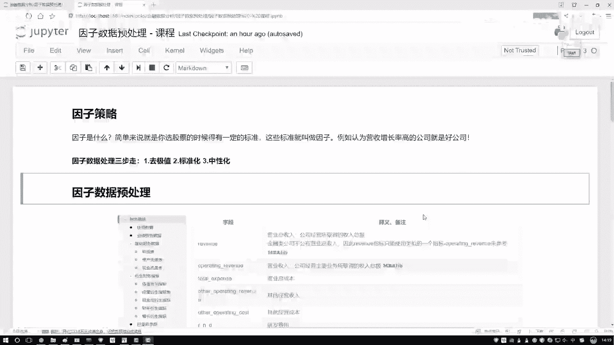

在本节课中，我们将学习如何对因子数据进行预处理。这是构建有效量化策略的关键步骤，旨在提升模型的稳定性和预测能力。

## 因子数据预处理概述

因子是影响投资决策的指标或标准。例如，市净率或营收增长率都可以作为选股的因子。我们的目标是分析这些因子如何影响最终的投资收益，并从中筛选出有效的因子。

在将因子数据用于建模之前，必须对其进行预处理。直接使用原始数据可能导致模型结果失真。本节将介绍三个核心的预处理步骤：去极值、标准化和中性化。前两个步骤在机器学习中很常见，而中性化则是金融因子分析中的特殊处理。

上一节我们介绍了因子数据的基本概念，本节中我们来看看如何处理这些数据。

## 第一步：去极值处理

去极值旨在处理数据中的异常值或离群点。直接删除异常值可能造成信息损失，因此更常见的做法是将其“拉回”到合理的边界内。例如，设定一个上限和下限，将超过上限的值设为上限值，低于下限的值设为下限值。

以下是几种常见的去极值方法，首先介绍基于分位数的方法。

### 分位数去极值法

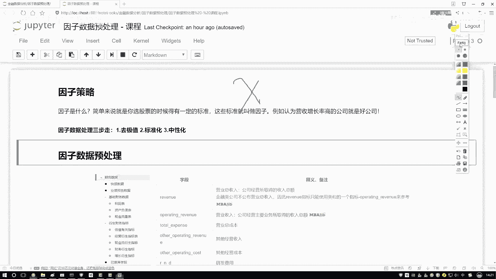

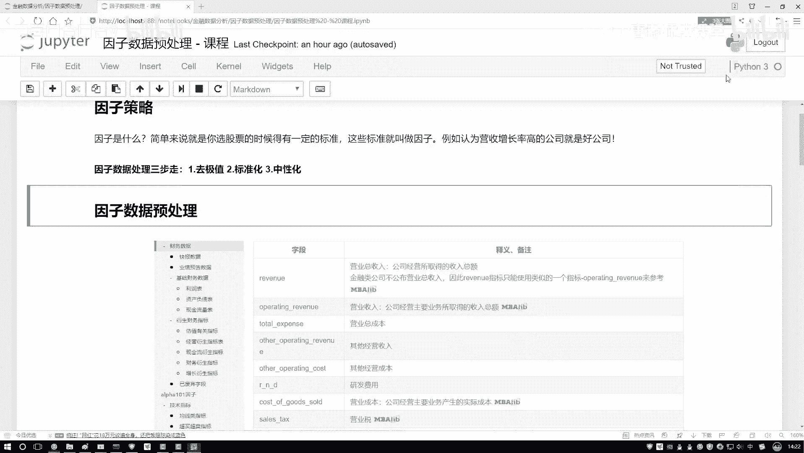

分位数是统计学中用于描述数据分布位置的概念。中位数是大家熟悉的概念，它代表数据排序后处于中间位置的值，相比均值对异常值更不敏感。

**核心概念**：
*   **中位数 (Q2)**：将数据分为两等份的值。
*   **下四分位数 (Q1)**：将数据下25%部分与上75%部分分开的值。
*   **上四分位数 (Q3)**：将数据下75%部分与上25%部分分开的值。

基于这些分位数，我们可以计算一个称为“四分位距”的范围。

**公式**：
`IQR = Q3 - Q1`

然后，我们通常将合理数据的上下界定义为：
*   **下界**：`Q1 - k * IQR`
*   **上界**：`Q3 + k * IQR`

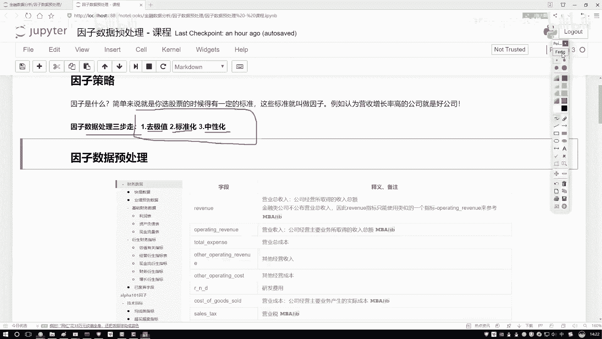

其中，`k` 是一个常数，通常取 1.5。任何低于下界或高于上界的值都被视为极值，并将其数值调整到对应的边界值。

**代码示例**：
```python
import numpy as np
import pandas as pd

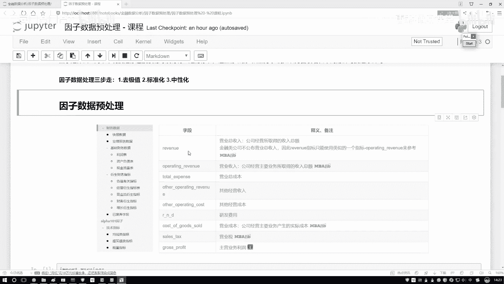

# 假设 factor_data 是一个包含因子值的Pandas Series
def winsorize_by_quantile(series, k=1.5):
    Q1 = series.quantile(0.25)
    Q3 = series.quantile(0.75)
    IQR = Q3 - Q1
    lower_bound = Q1 - k * IQR
    upper_bound = Q3 + k * IQR
    # 将极值拉回到边界
    series_winsorized = series.clip(lower=lower_bound, upper=upper_bound)
    return series_winsorized
```

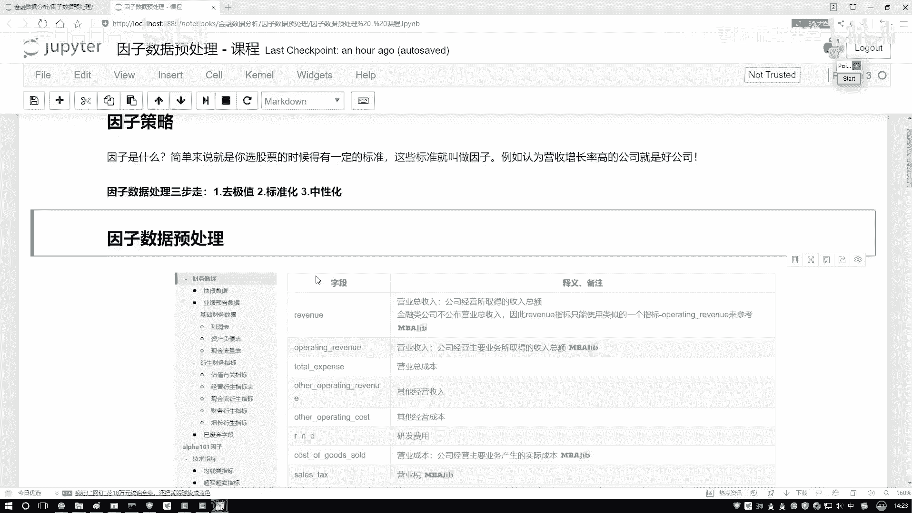

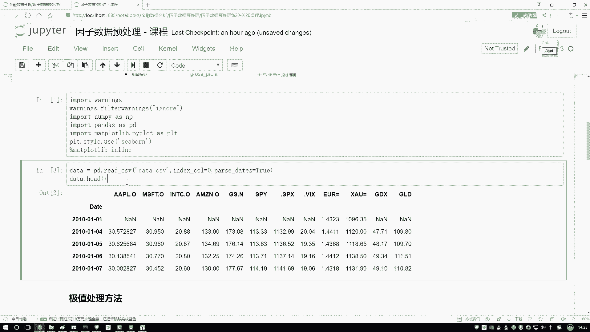

## 第二步：标准化处理

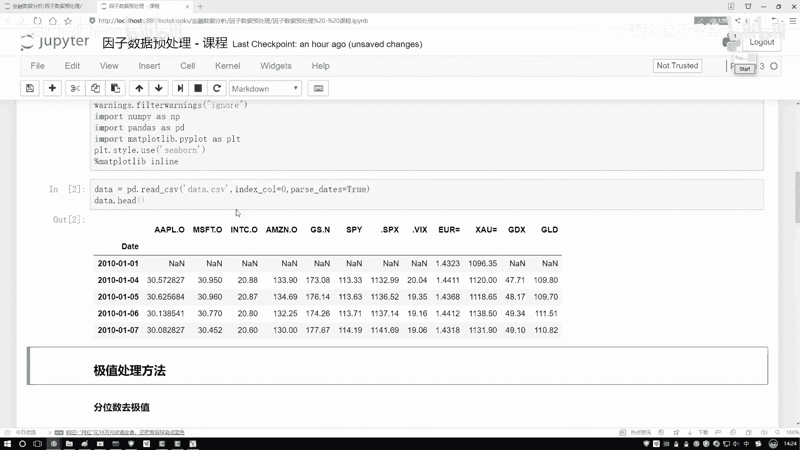

标准化旨在消除不同因子由于量纲和取值范围不同带来的影响。例如，市值可能是万亿级别，而换手率是百分比级别。标准化使得所有因子处于同一尺度，便于比较和建模。

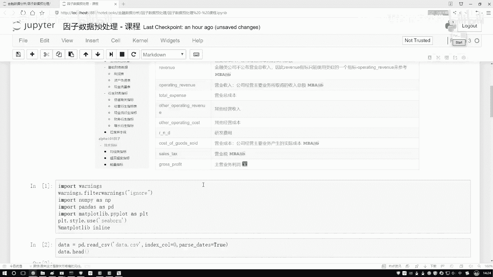

最常见的标准化方法是“Z-Score标准化”。

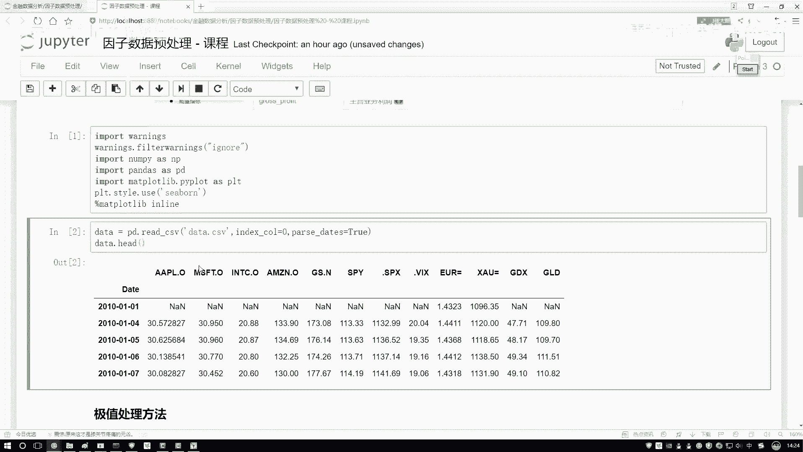

**公式**：
`z = (x - μ) / σ`

其中，`x` 是原始值，`μ` 是该因子所有数据的均值，`σ` 是标准差。标准化后的数据均值为0，标准差为1。

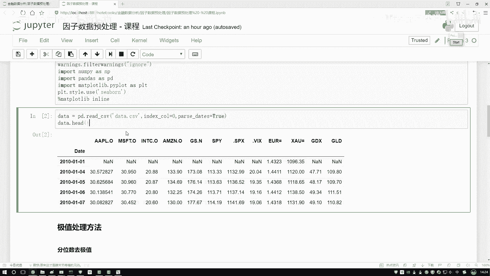

**代码示例**：
```python
def standardize_zscore(series):
    mean = series.mean()
    std = series.std()
    series_standardized = (series - mean) / std
    return series_standardized
```

另一种常见方法是“最大最小值标准化”，将数据缩放到[0, 1]区间。

**公式**：
`x_scaled = (x - min) / (max - min)`

## 第三步：中性化处理

中性化是金融因子分析中特有的步骤。其目的是消除因子本身可能受到的其他常见风险因素的影响，从而剥离出因子的“纯净”收益预测能力。

例如，市值因子（Size Factor）可能对股票收益有显著影响。当我们研究“营收增长率”这个因子时，需要先剔除“市值”对它的影响，才能判断营收增长率本身是否具有选股能力。

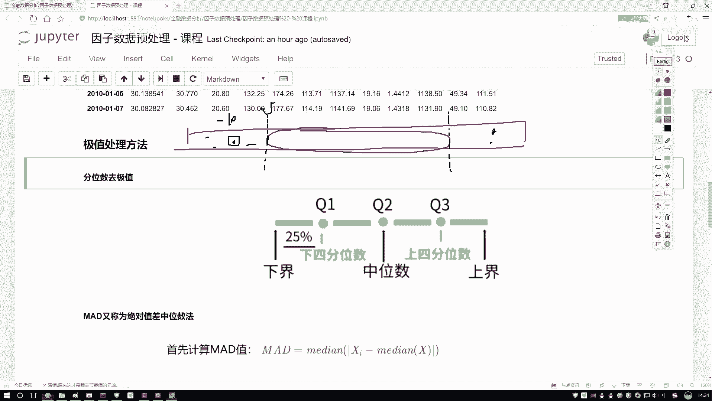

通常使用线性回归方法进行中性化。

**步骤**：
1.  将待中性化的因子（如营收增长率）作为因变量 `y`。
2.  将需要剔除影响的风格或行业因子（如市值、行业哑变量）作为自变量 `X`。
3.  进行线性回归 `y = Xβ + ε`。
4.  取回归的残差 `ε` 作为中性化后的因子值。这个残差代表了原始因子中无法被市值和行业所解释的部分。

**代码示例**：
```python
import statsmodels.api as sm

# 假设 df 是一个DataFrame，包含‘growth’（营收增长率），‘size’（市值），‘industry’（行业代码）
# 需要先将‘industry’转换为哑变量
df_with_dummies = pd.get_dummies(df, columns=[‘industry‘], drop_first=True)

# 准备自变量X（包含市值和各行业哑变量）和因变量y
X = df_with_dummies[[‘size‘] + [col for col in df_with_dummies.columns if ‘industry_‘ in col]]
X = sm.add_constant(X) # 添加截距项
y = df_with_dummies[‘growth‘]

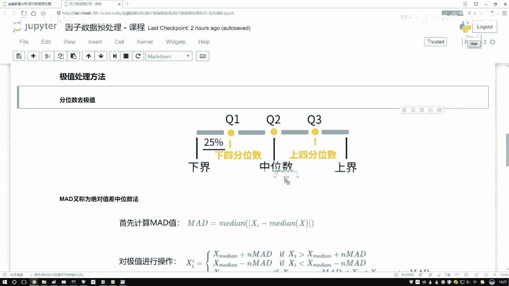

# 执行线性回归
model = sm.OLS(y, X).fit()
residuals = model.resid # 这就是中性化后的‘growth’因子

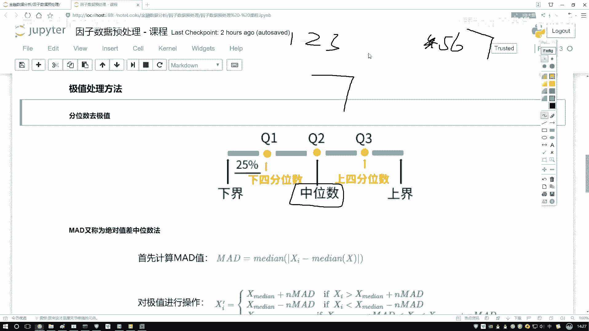

# 将中性化后的因子值放回原数据框
df[‘growth_neutralized‘] = residuals
```

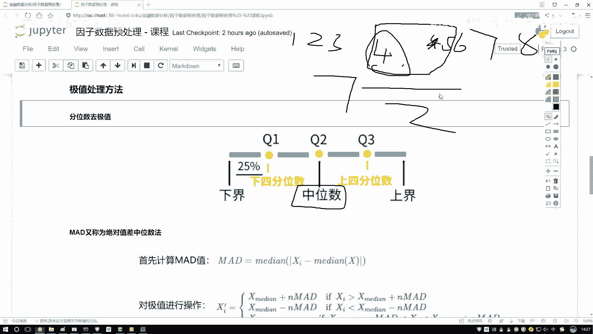

## 实战准备与总结

在后续的实战策略中，我们将应用这些预处理步骤。例如，在米矿等量化平台获取市净率、市值等因子后，首先使用百分位法去极值，然后进行标准化，最后针对市值和行业进行中性化处理，从而得到可用于多因子选股模型的“干净”因子。

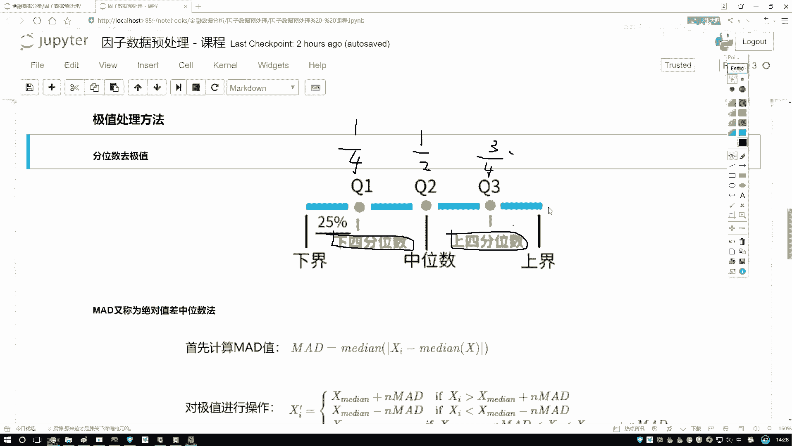

本节课中我们一起学习了因子数据预处理的三个核心步骤：去极值、标准化和中性化。去极值帮助我们稳健地处理异常值；标准化使得不同量纲的因子具有可比性；中性化则能剥离出因子独立的预测能力。掌握这些方法是构建稳健量化模型的重要基础。