# Python入门：第九关：Numpy基本操作 🧮

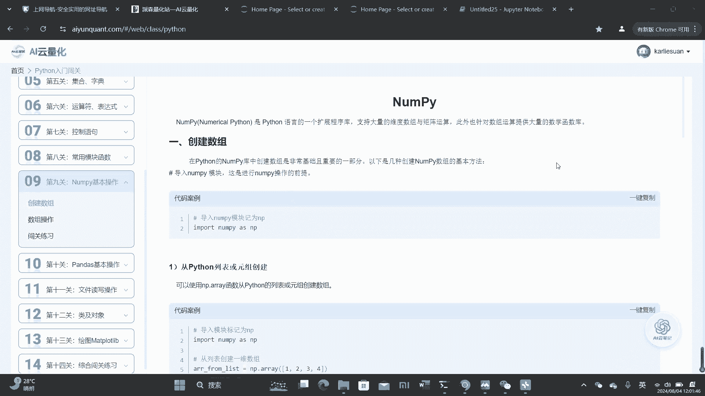

在本节课中，我们将要学习Python中一个非常重要的库——NumPy。NumPy是Python语言的一个扩展程序库，它支持大量的维度数组与矩阵运算，并针对数组运算提供了大量的数学函数库。掌握NumPy是进行科学计算、数据分析乃至量化策略学习的基础。

## 1. 导入NumPy库


在使用NumPy模块之前，必须先进行导入操作。这行代码是必不可少的，如果不导入，后续的所有操作都无法进行。

```python
import numpy as np
```
我们通常将`numpy`导入并简写为`np`，这样在使用时会更加便捷。

## 2. 创建数组

创建数组是NumPy最基础也是最重要的部分。有多种方式可以创建数组。

### 从Python列表或元组创建

我们可以使用`np.array()`函数，从列表或元组来创建数组。只需将列表或元组作为参数传入该函数即可。

```python
# 从列表创建一维数组
arr_from_list = np.array([1, 2, 3, 4, 5])
print(arr_from_list)

# 从元组创建一维数组
arr_from_tuple = np.array((6, 7, 8, 9))
print(arr_from_tuple)

# 从列表创建二维数组
arr_2d = np.array([[1, 2, 3], [4, 5, 6]])
print(arr_2d)
```

### 使用内置函数创建

NumPy提供了许多内置函数来快速创建特定类型的数组。

以下是几种常用的创建方法：

*   **创建全零数组**：使用`np.zeros()`，传入数组长度（一维）或形状（多维）。
    ```python
    arr_zeros_1d = np.zeros(4)  # 创建长度为4的全零一维数组
    arr_zeros_2d = np.zeros((2, 3))  # 创建形状为(2,3)的全零二维数组
    ```
*   **创建全一数组**：使用`np.ones()`，用法与`np.zeros()`类似。
    ```python
    arr_ones = np.ones((2, 3))  # 创建形状为(2,3)的全一二维数组
    ```
*   **创建单位矩阵**：使用`np.eye()`，只需传入一个参数（因为单位矩阵是方阵）。
    ```python
    identity_matrix = np.eye(3)  # 创建3x3的单位矩阵
    ```
*   **创建对角矩阵**：使用`np.diag()`，传入对角线上的数值。
    ```python
    diag_matrix = np.diag([10, 20, 30, 40])
    ```
*   **创建未初始化的数组**：使用`np.empty()`，其初始内容未知。
    ```python
    arr_empty = np.empty((3, 2))
    ```
*   **创建等差数列数组**：使用`np.arange()`，类似于Python的`range()`，但生成的是数组。
    ```python
    arr_range = np.arange(5)  # 创建元素为[0, 1, 2, 3, 4]的数组
    ```
*   **创建等间隔数组**：使用`np.linspace()`，指定起始值、结束值和元素个数。
    ```python
    arr_linspace = np.linspace(0, 1, 5)  # 在0到1之间创建5个等间隔的数
    ```
*   **创建随机数组**：使用`np.random`模块。
    ```python
    arr_random = np.random.rand(2, 2)  # 创建形状为(2,2)，元素在[0,1)区间的随机数组
    ```

### 创建特定数据类型的数组

可以在创建数组时指定数据类型。

```python
arr_int32 = np.array([1, 2, 3], dtype=np.int32)  # 创建整型数组
arr_float = np.array([1, 2, 3], dtype=float)  # 创建浮点型数组
```

### 习题示例

**任务**：分别创建从1到9的等差数列、长度为5的全零数组以及长度为10的全一数组。

```python
import numpy as np

# 创建从1到9的等差数列（包头不包尾，所以结束值是10）
arr_seq = np.arange(1, 10)
print(“等差数列:”, arr_seq)

# 创建长度为5的全零数组
arr_zeros = np.zeros(5)
print(“全零数组:”, arr_zeros)

# 创建长度为10的全一数组
arr_ones = np.ones(10)
print(“全一数组:”, arr_ones)
```

## 3. 数组形状操作

上一节我们介绍了如何创建数组，本节中我们来看看如何操作数组的形状。

### 改变数组形状

使用`reshape()`方法可以改变数组的形状，它会返回一个具有新形状的数组，但不改变原数组的数据。

```python
arr = np.arange(6)  # 创建一维数组 [0, 1, 2, 3, 4, 5]
arr_reshaped = arr.reshape(2, 3)  # 改变为2行3列的二维数组
print(arr_reshaped)
```

### 查看数组形状

使用`shape`属性可以查看数组的形状。

```python
arr = np.array([[1, 2, 3], [4, 5, 6]])
print(arr.shape)  # 输出: (2, 3)，表示2行3列
```

### 修改数组本身形状

使用`resize()`方法会直接修改数组本身的形状。

```python
arr = np.array([1, 2, 3, 4, 5, 6])
arr.resize(2, 3)
print(arr)
```

### 数组降维

可以将多维数组降为一维数组。

*   `flatten()`：返回一份展开后的副本。
*   `ravel()`：返回一个展开后的视图（修改视图可能影响原数组）。

```python
arr_2d = np.array([[1, 2], [3, 4]])
arr_flat = arr_2d.flatten()
arr_ravel = arr_2d.ravel()
print(“flatten:”, arr_flat)
print(“ravel:”, arr_ravel)
```

### 增加或减少维度

*   **增加维度**：使用`np.newaxis`或`np.expand_dims()`。
    ```python
    arr_1d = np.array([1, 2, 3])
    arr_col = arr_1d[:, np.newaxis]  # 将一维行向量变为列向量（二维）
    print(arr_col.shape)  # 输出: (3, 1)
    ```
*   **减少维度**：使用`squeeze()`移除数组中大小为1的维度。
    ```python
    arr = np.array([[[1], [2], [3]]])
    print(“原始形状:”, arr.shape)  # 输出: (1, 3, 1)
    arr_squeezed = arr.squeeze()
    print(“squeeze后形状:”, arr_squeezed.shape)  # 输出: (3,)
    ```

### 转置数组

使用`transpose()`方法或`.T`属性可以对数组进行转置。

```python
arr = np.array([[1, 2], [3, 4]])
print(“转置前:\n”, arr)
print(“转置后（使用.T）:\n”, arr.T)
print(“转置后（使用transpose）:\n”, arr.transpose())
```

### 习题示例

**任务**：建立一个5x3（五行三列）包含学生信息（年龄、身高、体重）的数组`X`，然后将其形状改变为3x5得到数组`Y`，最后对`Y`进行转置得到数组`Z`。

```python
import numpy as np

# 创建5x3的数组
X = np.array([
    [18, 170, 65],
    [20, 175, 70],
    [19, 168, 60],
    [22, 180, 80],
    [21, 172, 68]
])
print(“原始数组 X:\n”, X)

# 改变形状为3x5
Y = X.reshape(3, 5)
print(“改变形状后的数组 Y:\n”, Y)

# 转置数组
Z = Y.T
print(“转置后的数组 Z:\n”, Z)
```

## 4. 数组索引与切片

在Python中，NumPy数组也可以进行索引和切片，这是一种从数组中选择元素的有效方法。

### 一维数组索引与切片

一维数组的索引和切片与Python列表相似。

```python
arr = np.arange(10)  # [0, 1, 2, 3, 4, 5, 6, 7, 8, 9]
print(arr[5])    # 输出索引为5的元素: 5
print(arr[2:5])  # 切片，输出索引2到4的元素: [2, 3, 4] (包头不包尾)
```

### 多维数组索引与切片

对于多维数组，需要为每个维度指定索引或切片，用逗号分隔。

```python
arr_2d = np.array([[1, 2, 3], [4, 5, 6], [7, 8, 9]])

# 索引：获取第二行（索引1）第三列（索引2）的元素
element = arr_2d[1, 2]  # 输出: 6
print(element)

# 切片：获取所有行的第三列（索引2）
col_2 = arr_2d[:, 2]  # 输出: [3, 6, 9]
print(col_2)

# 切片：获取第一、二行（索引0:2）的第二、三列（索引1:3）
sub_matrix = arr_2d[0:2, 1:3]  # 输出: [[2, 3], [5, 6]]
print(sub_matrix)
```

### 布尔索引

NumPy可以使用布尔数组进行索引，选择满足条件的元素。

```python
arr = np.array([1, 2, 3, 4, 5, 6])
# 选择所有大于3的元素
mask = arr > 3
selected = arr[mask]  # 或直接写 arr[arr > 3]
print(selected)  # 输出: [4, 5, 6]
```

### 习题示例

**任务**：给定一个5x4的数组`X`，选择其第一行数据、第一列数据以及第二行第三列的数据。

```python
import numpy as np

X = np.arange(20).reshape(5, 4)
print(“原始数组 X:\n”, X)

# 选择第一行数据
row_0 = X[0, :]  # 或 X[0]
print(“第一行:”, row_0)

# 选择第一列数据
col_0 = X[:, 0]
print(“第一列:”, col_0)

# 选择第二行第三列的数据（索引从0开始）
element = X[1, 2]
print(“第二行第三列的元素:”, element)
```

## 5. 数组拼接与分割

接下来，我们学习如何将多个数组合并或将一个数组拆分开。

### 数组拼接

NumPy提供了几种拼接数组的方法。

*   `np.concatenate()`：通用拼接函数，需要指定沿哪个轴（axis）拼接。
    *   在二维数组中，`axis=0`表示沿行（垂直）拼接，`axis=1`表示沿列（水平）拼接。
*   `np.vstack()`：垂直堆叠（沿行拼接）。
*   `np.hstack()`：水平堆叠（沿列拼接）。

**注意**：进行拼接的数组在非拼接轴上的形状必须相同。

```python
a = np.array([[1, 2], [3, 4]])
b = np.array([[5, 6]])

# 垂直拼接（沿行）
v_stack = np.vstack((a, b))  # 或 np.concatenate((a, b), axis=0)
print(“垂直拼接:\n”, v_stack)

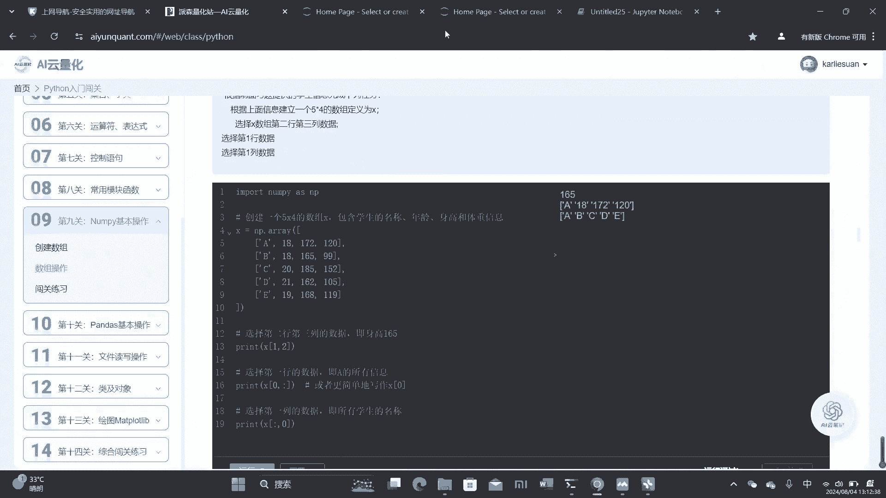

# 水平拼接（沿列），需要b是列向量形式
b_col = b.T  # 将b转置为列向量 [[5], [6]]
h_stack = np.hstack((a, b_col))  # 或 np.concatenate((a, b_col), axis=1)
print(“水平拼接:\n”, h_stack)
```

### 数组分割

与拼接相反，我们可以将数组分割成多个子数组。

*   `np.split()`：通用分割函数，可以指定分割成的份数或分割点。
*   `np.vsplit()`：垂直分割（沿行分割）。
*   `np.hsplit()`：水平分割（沿列分割）。

```python
arr = np.arange(12).reshape(3, 4)
print(“原始数组:\n”, arr)

# 垂直分割成3个子数组（按行分割）
sub_arrays_v = np.vsplit(arr, 3)
print(“垂直分割结果:”)
for sub in sub_arrays_v:
    print(sub)

# 水平分割成2个子数组（按列分割）
sub_arrays_h = np.hsplit(arr, 2)
print(“水平分割结果:”)
for sub in sub_arrays_h:
    print(sub)
```

### 习题示例

**任务**：给定两个数组`a`和`b`。
1.  将`a`和`b`拼接成一行。
2.  将`a`和`b`垂直堆叠，赋值给`c`。
3.  将数组`c`分割成两行。

```python
import numpy as np

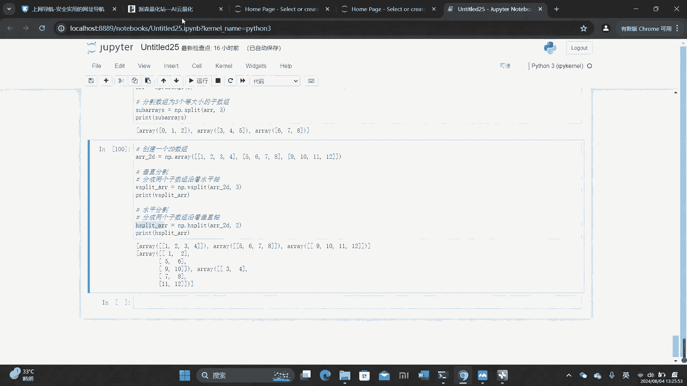

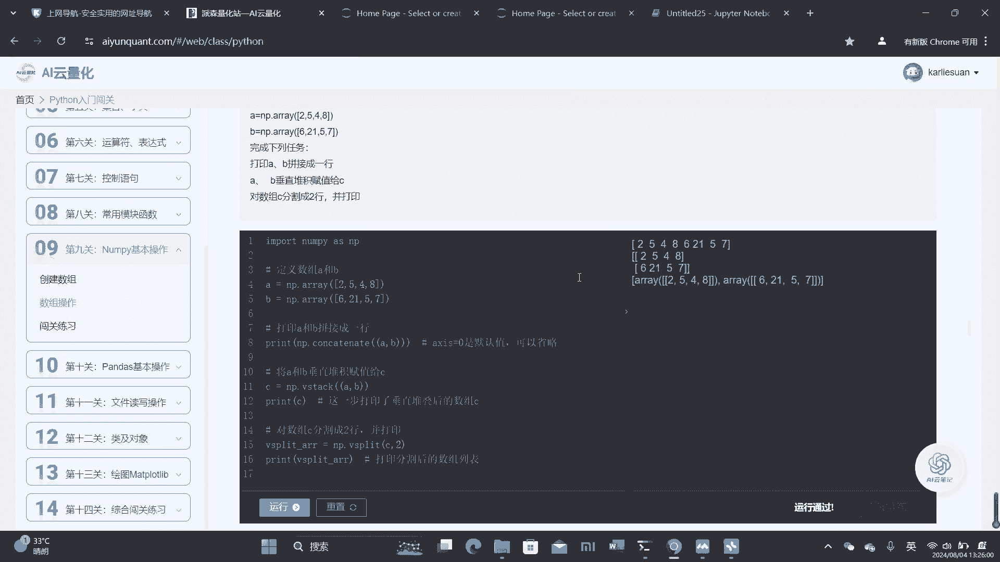

a = np.array([1, 2, 3])
b = np.array([4, 5, 6])

# 1. 拼接成一行（沿第一个轴，即行方向）
ab_row = np.concatenate((a, b))  # axis=0是默认值，可省略
print(“拼接成一行:”, ab_row)

# 2. 垂直堆叠
c = np.vstack((a, b))
print(“垂直堆叠后的数组 c:\n”, c)

# 3. 将c分割成两行
split_c = np.vsplit(c, 2)
print(“将c分割成两行:”)
for part in split_c:
    print(part)
```

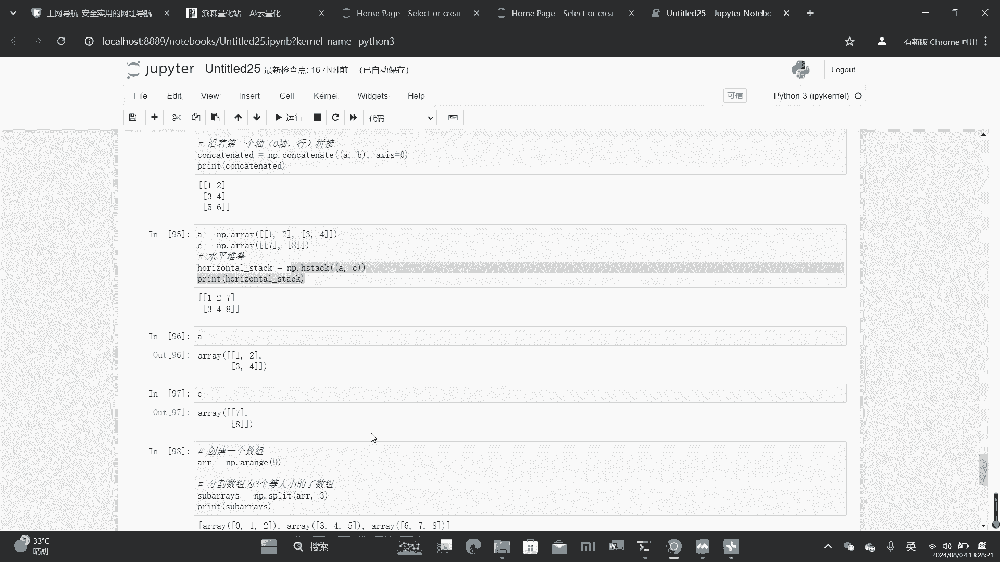

## 6. 数组的数学运算

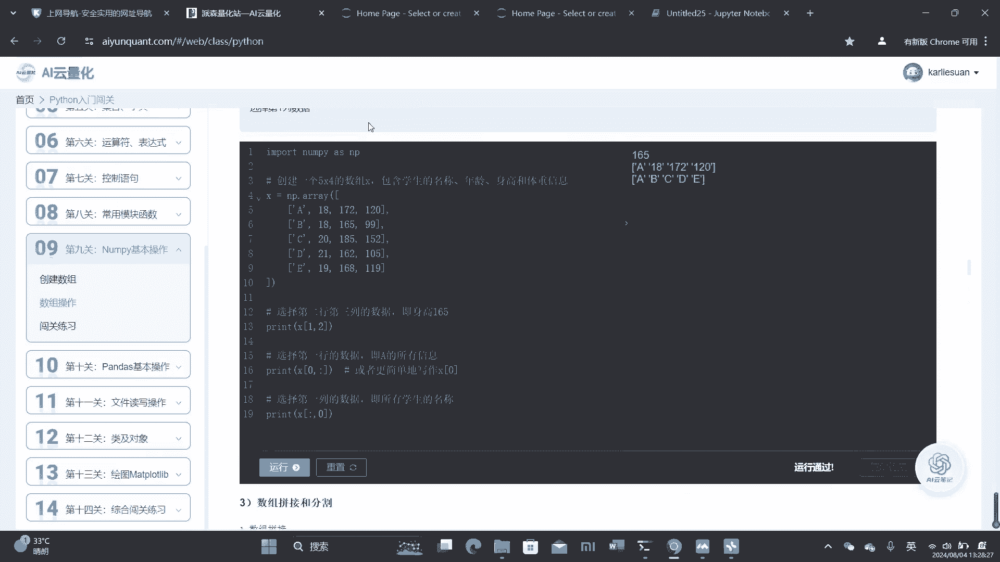

NumPy数组支持基本的数学运算以及更复杂的数学函数。

### 基本算术运算

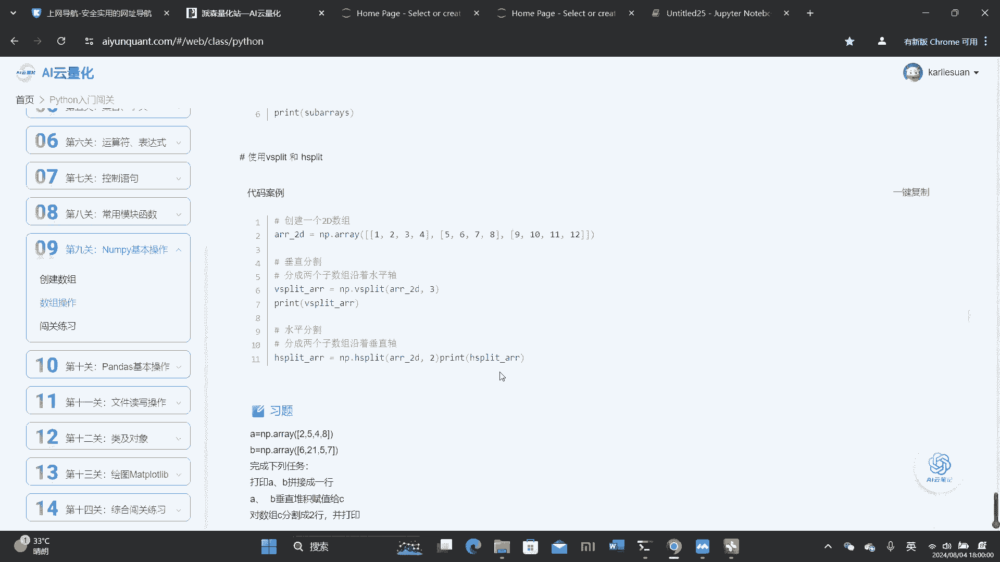

数组支持逐元素的加（`+`）、减（`-`）、乘（`*`）、除（`/`）和求幂（`**`）等运算。

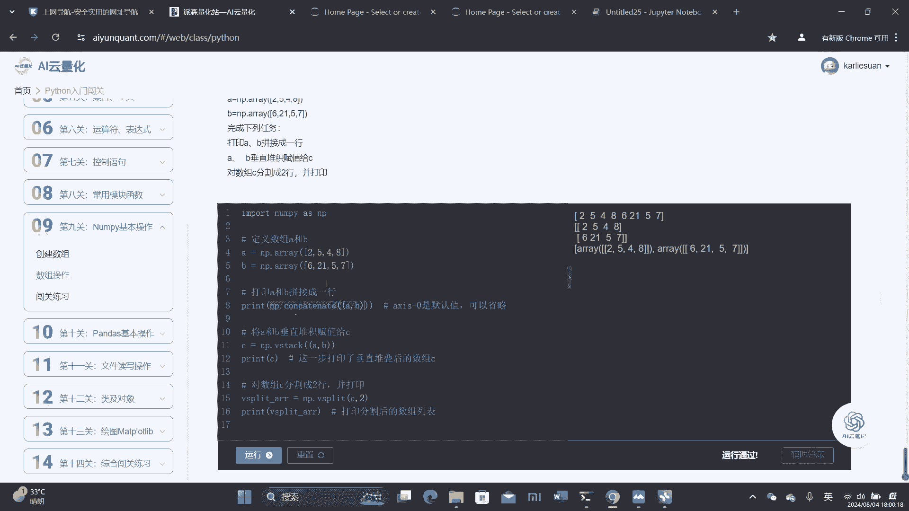

```python
a = np.array([1, 2, 3, 4])
b = np.array([5, 6, 7, 8])

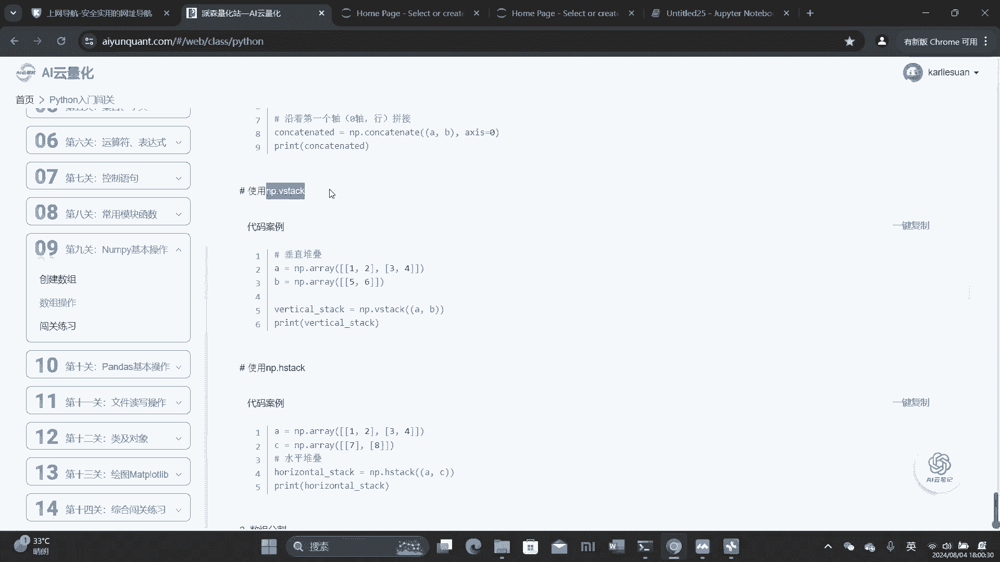

print(“a + b =”, a + b)  # 逐元素相加
print(“a - b =”, a - b)  # 逐元素相减
print(“a * b =”, a * b)  # 逐元素相乘
print(“a / b =”, a / b)  # 逐元素相除
print(“a ** 2 =”, a ** 2)  # a中每个元素求平方
```

### 高级数学函数

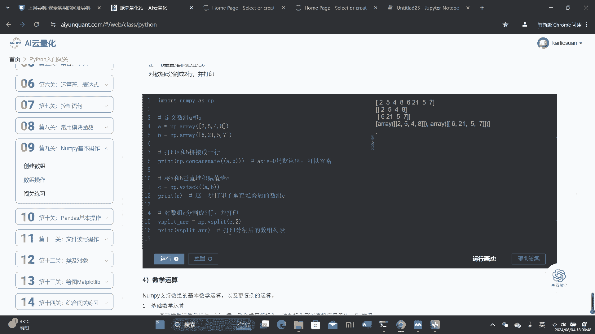

NumPy提供了三角函数、指数、对数等高级数学函数。

```python
# 三角函数
angles = np.array([0, 30, 45, 60, 90])
radians = np.deg2rad(angles)  # 角度转弧度
sines = np.sin(radians)
print(“正弦值:”, sines)

# 指数与对数
arr = np.array([1, 2, 3])
print(“指数:”, np.exp(arr))  # e^1, e^2, e^3
print(“自然对数:”, np.log(arr))  # ln(1), ln(2), ln(3)
```

### 聚合运算

聚合函数用于对数组进行统计分析，如求和、求极值、平均值等。

```python
arr = np.array([1, 2, 3, 4])

print(“总和:”, np.sum(arr))
print(“最小值:”, np.min(arr))
print(“最大值:”, np.max(arr))
print(“平均值:”, np.mean(arr))
print(“标准差:”, np.std(arr))
print(“中位数:”, np.median(arr))
```

### 线性代数运算

NumPy也提供了一系列线性代数函数。

```python
A = np.array([[1, 2], [3, 4]])
B = np.array([[5, 6], [7, 8]])

# 矩阵乘法
print(“矩阵乘法 A·B:\n”, np.dot(A, B))  # 或 A @ B

# 矩阵转置
print(“A的转置:\n”, A.T)

# 矩阵的逆
print(“A的逆矩阵:\n”, np.linalg.inv(A))

# 矩阵的行列式
print(“A的行列式:”, np.linalg.det(A))
```

### 习题示例

**任务**：给定两个数组`x`和`y`，实现以下运算：
1.  打印`x+y`, `x-y`, `x*y`, `x/y`的结果。
2.  打印`x`的开方、对数。
3.  打印`x`的最大值、最小值、平均值和标准差。
4.  打印`x`和`y`的矩阵乘法结果。

```python
import numpy as np

x = np.array([1, 4, 9, 16])
y = np.array([2, 3, 4, 5])

# 1. 基本运算
print(“x + y =”, x + y)
print(“x - y =”, x - y)
print(“x * y =”, x * y)
print(“x / y =”, x / y)

# 2. 开方与对数
print(“sqrt(x) =”, np.sqrt(x))
print(“log(x) =”, np.log(x))

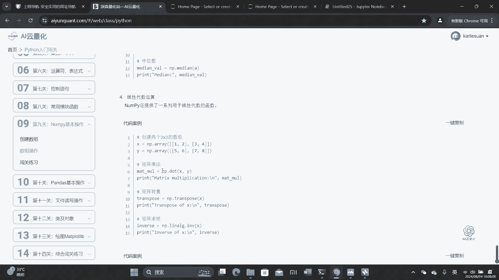

# 3. 聚合运算
print(“max(x) =”, np.max(x))
print(“min(x) =”, np.min(x))
print(“mean(x) =”, np.mean(x))
print(“std(x) =”, np.std(x))

# 4. 矩阵乘法（需要将一维数组转为二维行/列向量）
x_mat = x.reshape(1, -1)  # 转为1行4列
y_mat = y.reshape(-1, 1)  # 转为4行1列
print(“x (as row) 与 y (as col) 的矩阵乘法:\n”, np.dot(x_mat, y_mat))
```

## 7. 广播机制

广播（Broadcasting）是NumPy中一个强大的机制，它允许不同形状的数组进行算术运算。广播的核心思想是，将较小的数组“广播”到较大数组的形状，以便它们具有兼容的形状进行逐元素运算。

广播遵循一套严格的规则，但其实际运用可以简化为：当操作两个数组时，NumPy会从它们的形状的最右边维度开始逐元素比较。如果两个维度相等，或其中一个维度为1，或其中一个数组在该维度上不存在，则它们是兼容的。

```python
# 示例1：标量与数组的运算
a = np.array([1.0, 2.0, 3.0])
b = 2.0
print(“a + b (广播) =”, a + b)  # b被广播成[2., 2., 2.]，然后与a相加

# 示例2：不同形状数组的运算
A = np.array([[1, 2, 3], [4, 5, 6], [7, 8, 9]])  # 形状(3,3)
B = np.array([10, 20, 30])  # 形状(3,)
print(“A + B (广播) =\n”, A + B)  # B被广播为[[10,20,30], [10,20,30], [10,20,30]]，然后相加

# 示例3：形状不兼容导致错误
C = np.array([[1], [2]])  # 形状(2,1)
D = np.array([[3, 4, 5]]) # 形状(1,3)
# print(C + D) # 可以广播，C被广播为[[1,1,1],[2,2,2]]，D被广播为[[3,4,5],[3,4,5]]，结果形状(2,3)

E = np.array([1, 2])      # 形状(2,)
# print(C + E) # 可能出错或产生非预期结果，需要理解广播规则
```

广播在数据归一化等操作中非常有用。

```python
# 示例：数据归一化 (减去均值，除以标准差)
data = np.random.randn(10, 100, 3)  # 假设一个10x100x3的数据集
mean = data.mean(axis=(0, 1))       # 计算每个特征（第3维）的均值，形状(3,)
std = data.std(axis=(0, 1))         # 计算每个特征的标准差，形状(3,)
# 广播：mean和std会被广播到data的每个样本点上
normalized_data = (data - mean) / std
```

### 习题示例

**任务**：对给定的股票日序列数据（假设已获取为NumPy数组`prices`）进行广播归一化，并打印前5行。

```python
import numpy as np
import akshare as ak  # 需要安装akshare库

# 假设获取了股票数据（此处用随机数据模拟）
np.random.seed(42)
prices = np.random.randn(100, 5)  # 100天，5个指标（如开盘、收盘、最高、最低、成交量）

# 计算每个指标的均值和标准差
mean_vals = prices.mean(axis=0)  # 沿天（行）计算，得到每个指标的均值，形状(5,)
std_vals = prices.std(axis=0)    # 得到每个指标的标准差，形状(5,)

# 执行广播归一化
normalized_prices = (prices - mean_vals) / std_vals

print(“归一化后的前5行数据:”)
print(normalized_prices[:5])
```

## 8. 本章习题与闯关练习

以下是综合本章知识的练习题。

### 练习题1
创建一个长度为10的空向量（全零），并将其第5个值（索引为4）设置为1。
```python
import numpy as np
vec = np.zeros(10)
vec[4] = 1
print(vec)
```

### 练习题2
创建一个包含从10到49的值的向量，并将其反转。
```python
import numpy as np
vec = np.arange(10, 50)  # 10到49
reversed_vec = vec[::-1]  # 反转
print(reversed_vec)
```

### 练习题3
创建一个3x3、值从0到8的矩阵，并打印出所有大于5的数。
```python
import numpy as np
mat = np.arange(9).reshape(3, 3)
print(“矩阵:\n”, mat)
print(“大于5的数:”, mat[mat > 5])
```

### 练习题4
创建一个3x3x3的随机数组，并找到数组中的最大值和最小值。
```python
import numpy as np
arr = np.random.rand(3, 3, 3)
print(“数组形状:”, arr.shape)
print(“最大值:”, np.max(arr))
print(“最小值:”, np.min(arr))
```

### 闯关练习5
创建一个10x10的二维数组，其中边界值全为1，内部值全为0。然后对数据进行归一化，并将可能出现的NaN值替换为5。
```python
import numpy as np

# 创建全零数组
Z = np.zeros((10, 10))
# 将边界设置为1
Z[0, :] = 1   # 第一行
Z[-1, :] = 1  # 最后一行
Z[:, 0] = 1   # 第一列
Z[:, -1] = 1  # 最后一列
print(“边界为1的数组:\n”, Z)

# 归一化
mean = Z.mean()
std = Z.std()
# 避免除以0
if std == 0:
    std = 1
Z_normalized = (Z - mean) / std
print(“归一化后（部分）:\n”, Z_normalized[:3, :3])

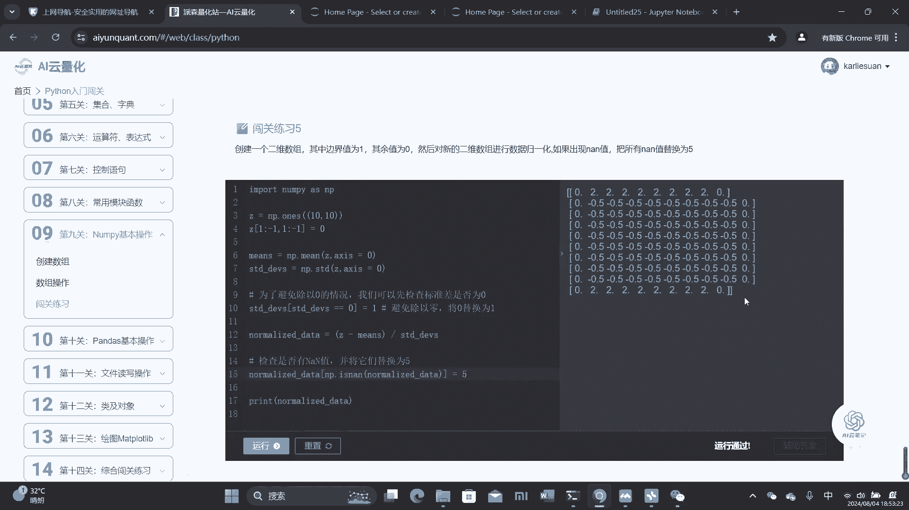


# 检查并替换NaN值（此例中std不为0，通常不会产生NaN，此处演示方法）
Z_normalized[np.isnan(Z_normalized)] = 5
print(“替换NaN后（部分）:\n”, Z_normalized[:3, :3])
```

## 总结


本节课中我们一起学习了NumPy库的基本操作。我们首先掌握了使用多种方式创建数组，包括从列表、元组创建以及使用各种内置函数。接着，我们深入学习了如何操作数组的形状，如改变形状、转置、升降维度等。然后，我们探讨了如何对数组进行索引、切片以及使用布尔索引选择数据。此外，我们还学习了如何拼接和分割数组。最后，我们介绍了数组的数学运算（基本运算、高级函数、聚合运算、线性代数）以及强大的广播机制。通过本章的学习和练习，你已经具备了使用NumPy进行基础数值计算和数组操作的能力，这是迈向数据分析和科学计算的重要一步。