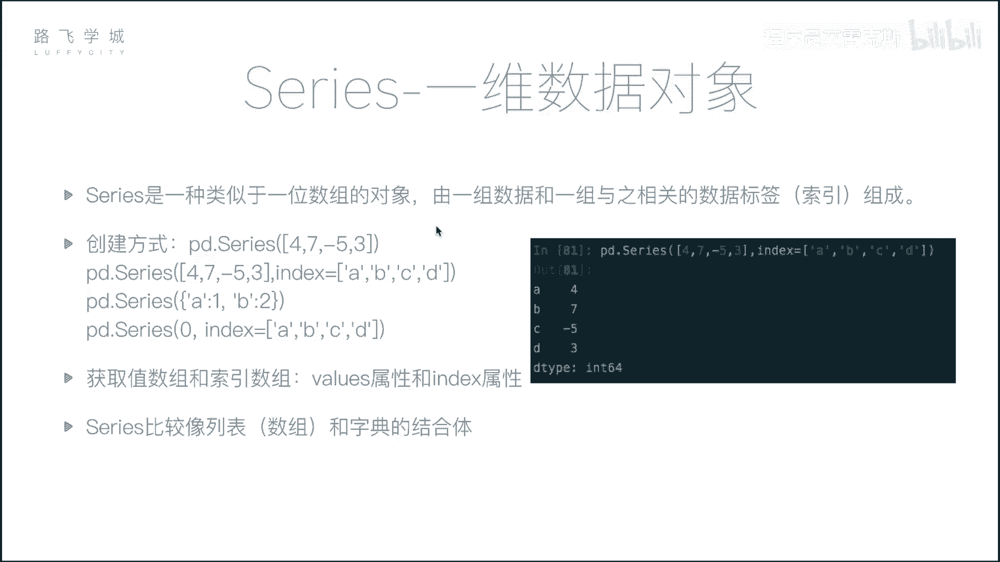
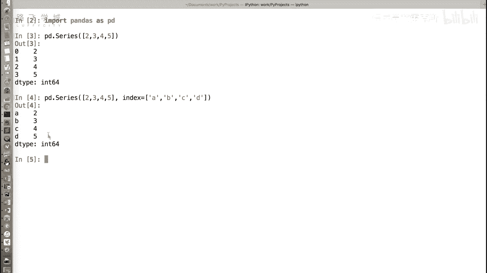
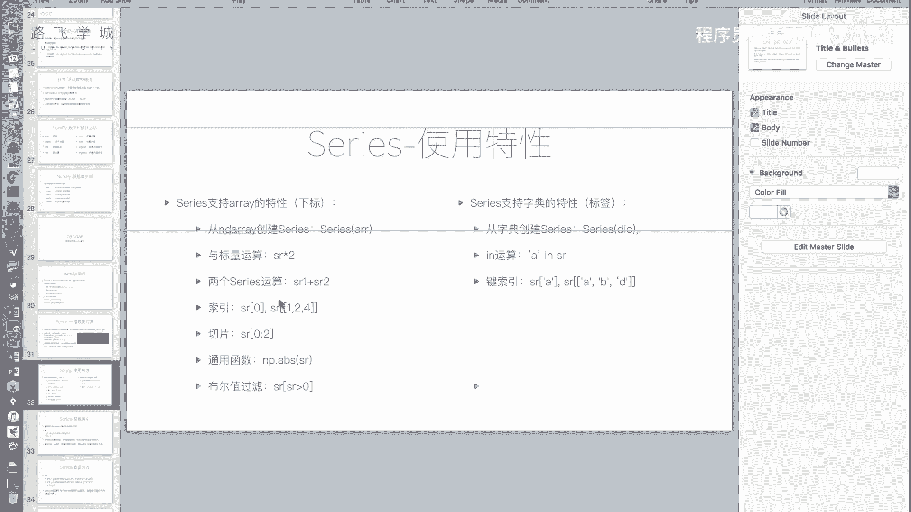
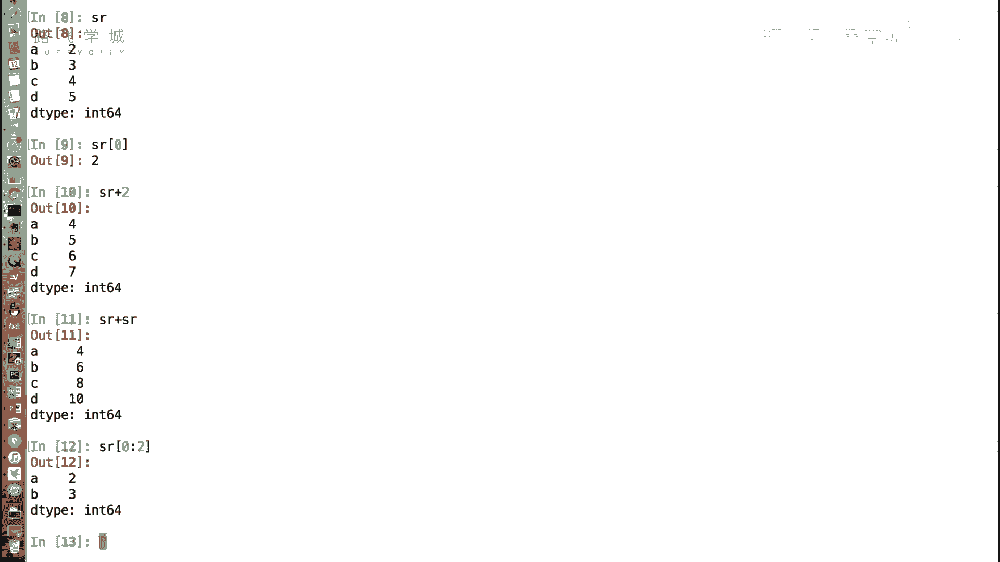
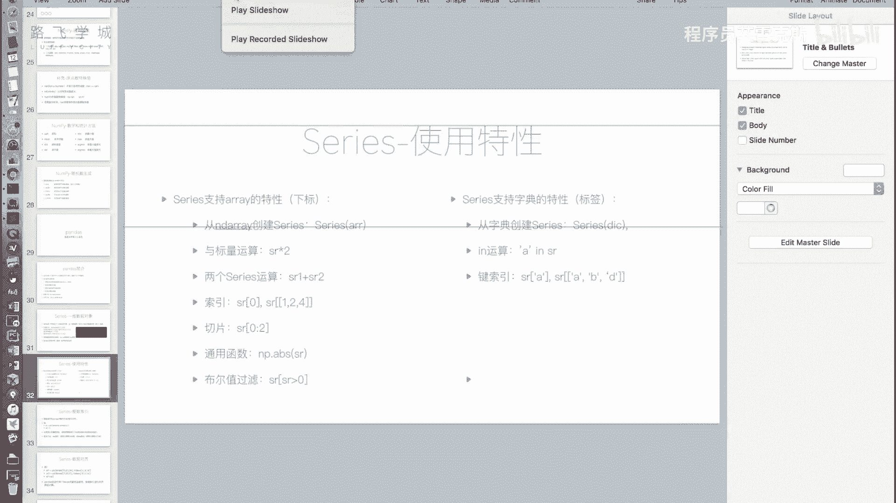
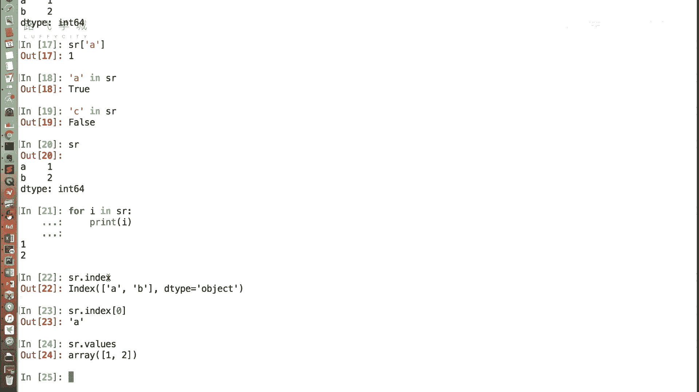
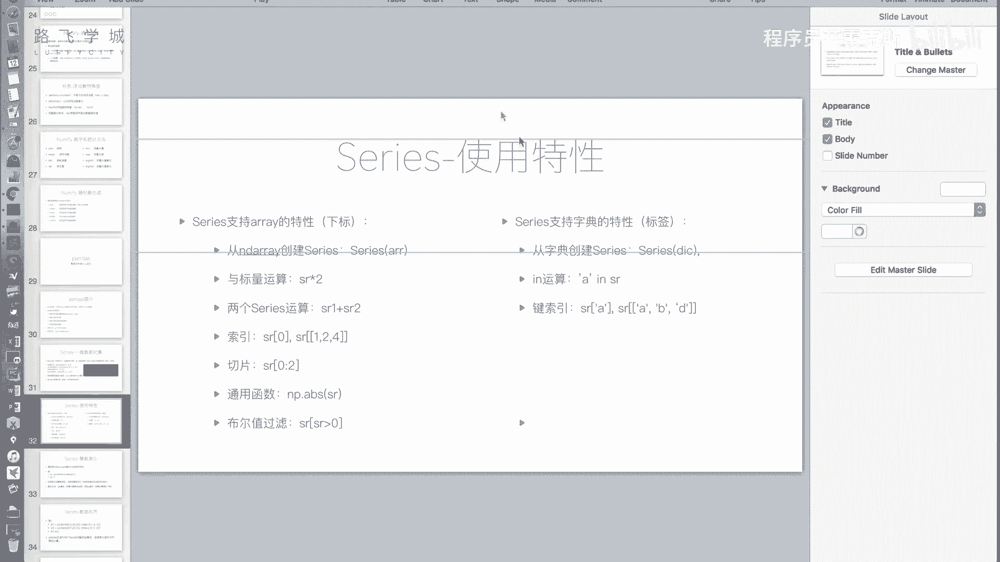
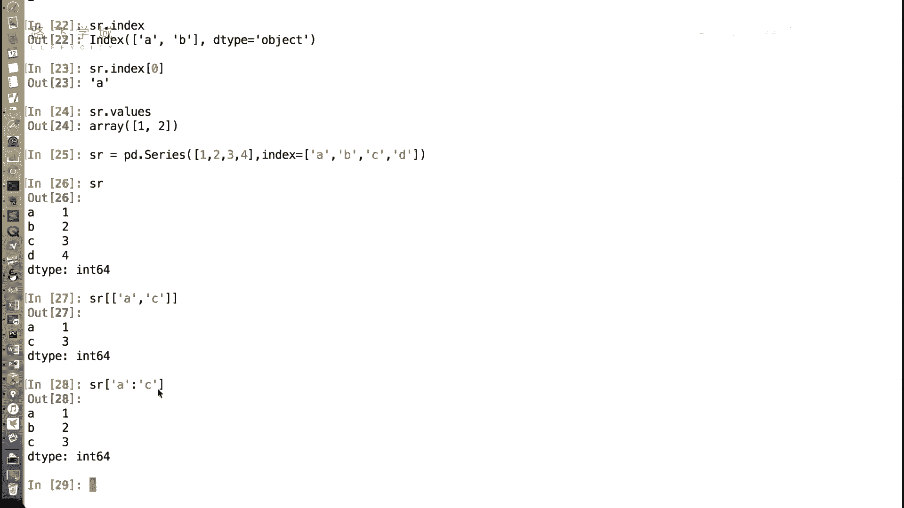

# Python金融量化投资分析：P16：Series介绍 📊

## 概述
在本节课中，我们将学习Pandas库中的核心数据结构之一：**Series**。我们将了解它如何结合了列表（数组）和字典的特性，并掌握其创建、索引和基本操作的方法。

---

## 从NumPy到Pandas
上一节我们介绍了数据分析的基础包NumPy。接下来我们讲解Pandas，它在数据分析领域应用广泛。Pandas基于NumPy构建，封装层级更高，是数据分析不可或缺的工具。

Pandas的主要功能包括：
*   提供两种核心数据结构：**DataFrame**和**Series**。
*   集成时间序列功能。
*   提供丰富的数学运算和操作。
*   灵活处理缺失数据。


安装Pandas非常简单，使用`pip`命令即可。官方建议的导入方式如下：

```python
import pandas as pd
```



---

## 什么是Series？🤔
Series是Pandas中的一种核心数据对象，它是一种类似于一维数组的对象。你可以将其理解为**数组与字典的结合体**。



### 创建Series
创建Series使用`pd.Series()`方法。以下是两种创建方式：


```python
import pandas as pd

# 方式一：从列表创建（类似数组）
s1 = pd.Series([2, 3, 4, 5])
print(s1)
# 输出：
# 0    2
# 1    3
# 2    4
# 3    5
# dtype: int64

# 方式二：指定索引（类似字典的键）
s2 = pd.Series([2, 3, 4, 5], index=['A', 'B', 'C', 'D'])
print(s2)
# 输出：
# A    2
# B    3
# C    4
# D    5
# dtype: int64
```

第一种写法像一个有序列表，第二种写法则像是一个带自定义键的字典。Series巧妙地融合了这两种数据结构的特性。


---



## Series的数组（列表）特性
Series继承了许多NumPy数组或Python列表的特性，使其操作非常灵活。

以下是Series支持的数组类操作：

1.  **从数组创建**：不仅可以从列表，也可以从NumPy数组创建Series。
    ```python
    import numpy as np
    arr = np.array([1, 2, 3])
    s = pd.Series(arr)
    ```



2.  **通过下标索引访问**：即使指定了自定义索引（如A, B, C, D），仍然可以通过整数位置（下标）进行访问。
    ```python
    s2 = pd.Series([2, 3, 4, 5], index=['A', 'B', 'C', 'D'])
    print(s2[0])  # 输出：2
    ```



3.  **向量化运算**：支持与标量进行运算，也支持两个相同大小的Series之间进行逐元素运算（加、减、乘、除、比较等）。
    ```python
    print(s2 * 2)          # 每个值乘以2
    print(s2 + s2)         # 两个相同Series相加
    ```

4.  **切片操作**：和列表一样，可以使用切片语法。
    ```python
    print(s2[0:2])  # 输出索引0和1对应的元素（A和B）
    ```

5.  **支持通用函数**：支持NumPy的通用函数，如取绝对值、最大值、最小值等。
    ```python
    print(np.abs(s2))
    ```

6.  **布尔索引**：可以通过条件表达式进行筛选。
    ```python
    print(s2[s2 > 3])  # 输出值大于3的元素
    ```

---

## Series的字典特性
除了数组特性，Series也具备类似字典的操作方式，这为数据访问提供了更多便利。

以下是Series支持的字典类操作：

1.  **从字典创建**：可以直接用一个字典来创建Series，字典的键（key）会自动成为Series的索引（标签）。
    ```python
    dict_data = {'A': 10, 'B': 20, 'C': 30}
    s3 = pd.Series(dict_data)
    print(s3)
    ```





2.  **通过标签索引访问**：这是Series最强大的特性之一，可以通过自定义的索引标签来获取值。
    ```python
    print(s3['A'])  # 输出：10
    ```

3.  **`in`操作**：可以检查某个标签是否存在于Series的索引中。
    ```python
    print('A' in s3)   # 输出：True
    print('Z' in s3)   # 输出：False
    ```
    **注意**：对Series进行`for`循环时，遍历的是它的**值**，而不是索引（键）。这与遍历字典不同。

4.  **花式索引与切片**：可以通过标签列表进行花式索引，也可以通过标签进行切片。
    ```python
    # 花式索引
    print(s3[['A', 'C']])
    # 标签切片（注意：标签切片是“前包后也包”的）
    print(s3['A':'C'])
    ```
    **重要区别**：整数位置切片是“前包后不包”，而标签切片是“前包后也包”。

---

## 获取索引与值
在实际操作中，我们经常需要分别获取Series的索引部分和值部分。

*   **获取索引**：使用`.index`属性。
    ```python
    print(s3.index)  # 输出索引对象，类似数组
    ```
*   **获取值**：使用`.values`属性。
    ```python
    print(s3.values) # 输出值数组，是一个NumPy数组
    ```

---

## Series的应用场景 💡
理解了Series的特性后，我们可以想象它的实用场景。它非常适合表示**带标签的一维数据**。



例如，在金融分析中：
*   你可以用Series存储一支股票历史上每天的收盘价。索引是日期（标签），值是价格。这样，你既可以通过日期（`s['2023-10-01']`）快速查询某天的价格，也可以通过位置（`s[0:5]`）获取前5天的数据。
*   相比于传统方法（如在列表中存储`(日期， 价格)`的元组），Series提供了类似字典的直接键值访问，同时保证了数据的顺序性，极大地提升了数据查询和操作的效率。

---

## 总结
本节课我们一起学习了Pandas库的核心数据结构**Series**。
*   Series是**一维带标签的数组**，融合了数组和字典的优点。
*   它可以通过列表、数组或字典创建。
*   它支持**两种索引方式**：整数位置索引和标签索引。
*   它继承了NumPy数组的**向量化运算**和**布尔索引**等强大功能。
*   通过`.index`和`.values`属性可以方便地获取其索引和值。
*   Series为处理如时间序列、单一指标数据等结构化一维数据提供了极大便利，是后续学习DataFrame的重要基础。

掌握了Series，你就拥有了处理一维数据的利器。下一节，我们将学习更强大的二维表格结构——DataFrame。