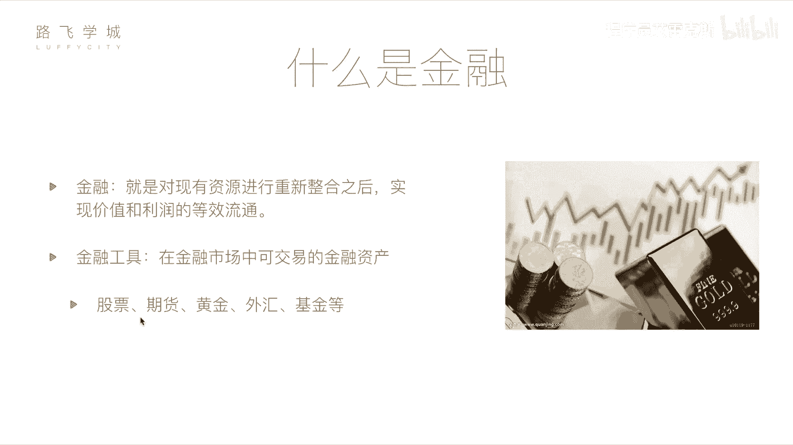

# Python金融量化投资分析：P2：01 金融量化分析-基本金融知识介绍 📈

在本节课中，我们将学习金融量化分析的基础知识。我们将从金融的基本概念入手，介绍几种常见的金融工具，并重点讲解股票这一核心概念，为后续的量化分析打下基础。

## 什么是金融？

金融的定义是对现有资源进行重新整合之后，实现价值和利润的等效流通。这个概念听起来可能有些抽象。在日常生活中，金融常被理解为与金钱相关的活动。但金融行业并非完全是投机行为。金融活动可以促进经济发展，让资金流向需要它的地方，实现双赢。

例如，一个拥有资金但缺乏投资渠道的人，可以将资金投资给一个有创意但缺乏资金的创业者。创业者用这笔钱发展公司，成功后，投资者获得回报。这个过程促进了资源有效配置和经济增长。

## 常见的金融工具

在金融市场中，存在多种可交易的金融资产，这些被称为金融工具。以下是几种常见的金融工具：

以下是几种主要的金融工具介绍：

*   **股票**：代表对一家公司的部分所有权。购买股票即成为该公司的股东，可以分享公司成长的收益（如分红），也承担公司经营的风险。这是我们本课程后续将重点讲解的核心工具。
*   **期货**：一种标准化合约，约定在未来某一特定时间和地点，以特定价格交割一定数量的某种商品或金融资产。其特点是**高风险、高收益**。交易双方基于对未来价格走势的不同判断进行交易，主要用于套期保值或投机。
    *   **简单示例**：发电厂预计煤炭价格未来会上涨，而煤矿主预计价格会下跌。双方可以签订一份期货合约，约定半年后以当前价格交易煤炭。无论未来市场价格如何波动，都必须按合约价格执行。
*   **黄金**：一种传统的避险资产和保值工具。其价格相对稳定，因为黄金的全球储量有限。其价格波动通常与全球经济形势、货币政策和市场避险情绪相关。
    *   **核心关系**：在理想情况下，黄金价格与货币供应量存在一定关系。钱多金少时，金价倾向于上涨；钱少金多时，金价倾向于下跌。
*   **外汇**：指不同国家货币之间的兑换交易。投资者通过预测两种货币间汇率的变动来获利。例如，交易美元兑人民币的汇率波动。由于汇率波动通常较小，个人投资者参与较少，更多是大型金融机构在进行操作。
*   **基金**：由基金公司收集众多投资者的资金，交由专业的基金经理进行统一管理和投资的一种工具。投资者购买基金份额，相当于间接持有了基金所投资的一篮子资产（如股票、债券等）。
    *   **特点**：基金的风险和收益通常介于股票和债券之间，适合那些希望参与金融市场但缺乏专业知识或时间的投资者。

上一节我们介绍了包括股票在内的几种主要金融工具，本节中我们来看看本课程的核心——股票。

## 什么是股票？

股票是股份公司为筹集资金而发行给股东的所有权凭证。购买股票意味着你成为了该公司的一部分所有者。作为股东，你有权分享公司的利润（通过分红），同时也承担公司经营的风险。

股票交易在证券交易所进行，价格由市场供求关系决定。投资者通过低买高卖来获取价差收益，或长期持有以分享公司成长的红利。

在本节课中，我们一起学习了金融的基本概念，了解了股票、期货、黄金、外汇和基金等常见金融工具的特点与区别，并重点明确了股票作为公司所有权凭证的本质。理解这些基础知识，是后续我们运用Python进行量化分析和自动化交易的第一步。