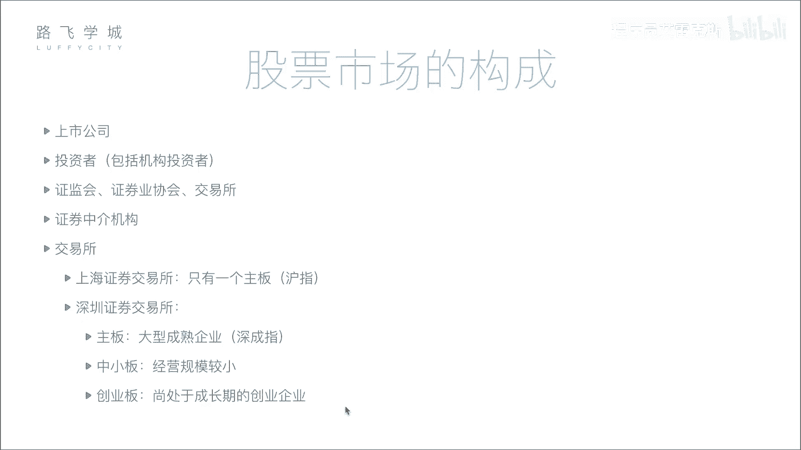
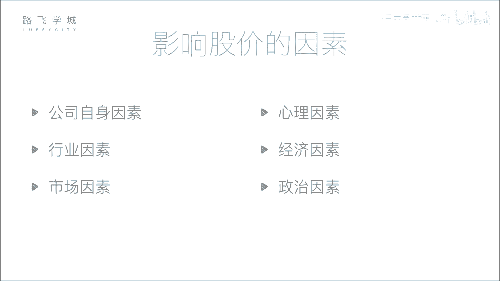

# Python金融量化投资分析：P3：02 金融量化分析-股票市场构成 📈

在本节课中，我们将要学习股票市场的构成。了解市场中有哪些参与者以及他们各自扮演的角色，是进行量化分析的基础。我们还将探讨影响股价的关键因素，为后续的实战分析做好准备。

## 公司和投资者

上一节我们介绍了股票的分类，本节中我们来看看股票市场的构成。首先，市场中最核心的参与者是公司和投资者。

*   **公司**：需要资金的一方，通过发行股票进行融资。
*   **投资者**：提供资金的一方，通过购买股票进行投资。

## 监管机构与自律组织

但是，公司和投资者不能直接进行交易，以避免暗箱操作。因此，市场需要监管机构。

*   **证监会**：这是证券行业最主要的监管机构。公司上市需要向证监会提交材料，证监会负责审查公司是否存在欺诈、洗钱等违法行为。其权力很大，可以决定公司能否上市或将其退市。
*   **证券业协会**：这是一个自律性组织，作用相对较弱，例如负责主办证券从业资格考试等。

## 交易所

交易所为股票交易提供了一个集中的场所。

*   **功能**：交易所负责处理所有买卖股票的请求。在电子化交易普及前，投资者需要到交易所现场排队交易；现在则通过互联网连接到交易所的系统进行交易。
*   **中国的交易所**：中国有两个主要的证券交易所，分别在上海和深圳。

以下是每个交易所包含的板块：

*   **上海证券交易所**：只有一个主板。
*   **深圳证券交易所**：分为三个板块：
    *   **主板**：面向大型成熟企业。
    *   **中小板**：面向中小企业。
    *   **创业板**：面向成长型创业公司，上市门槛相对主板较低，例如要求公司连续几年达到一定净利润即可。

## 证券中介机构

个人投资者通常不能直接在交易所买卖股票，需要通过证券中介机构，也就是券商。

*   **角色**：券商在交易所拥有交易席位。个人投资者通过在券商开户，使用其提供的软件（如同花顺等）提交交易指令。券商再将指令通过自己的席位传达到交易所，完成股票买卖。
*   **历史原因**：早期交易所席位价格昂贵，普通投资者无法承担。拥有席位的机构于是发展出代理买卖业务，汇集众多小投资者的资金进行交易，演变至今就成了券商模式。

## 大盘指数

对于每一个板块，我们常用一个“大盘”指数来反映其整体表现。

*   **定义**：指数反映了该板块内所有股票的综合表现。它通过计算一篮子代表性股票价格的平均值或加权平均值，形成一条趋势线。
*   **作用**：指数用于判断市场整体的好坏趋势，而不是只看单只股票的涨跌。

以下是各板块对应的主要指数：

*   **上海主板**：**沪指**（上证综指）。
*   **深圳主板**：**深成指**（深证成份指数）。
*   **深圳中小板**：**中小板指**。
*   **深圳创业板**：**创业板指**。

## 影响股价的因素

了解了市场构成后，我们来看看哪些因素会影响股价的波动。

股价的变动受到多种力量驱动，主要可以归纳为以下几个方面：

*   **公司基本面**：公司的盈利能力、财务状况、成长前景等。公式可以简化为：`股价 ≈ 每股收益 (EPS) × 市盈率 (PE)`。
*   **宏观经济环境**：国家经济增长率、利率、通货膨胀率、货币政策等。
*   **行业状况**：行业所处的生命周期、政策支持力度、技术变革等。
*   **市场情绪与资金流动**：投资者的心理预期、市场热点、资金流入流出情况等。
*   **突发事件**：如自然灾害、政治事件、公司丑闻等。

本节课中我们一起学习了股票市场的核心构成，包括公司、投资者、监管机构、交易所、券商以及大盘指数。理解这些参与者的角色和相互关系，是分析市场、理解股价波动逻辑的第一步。下一节，我们将开始学习如何获取和分析这些市场数据。