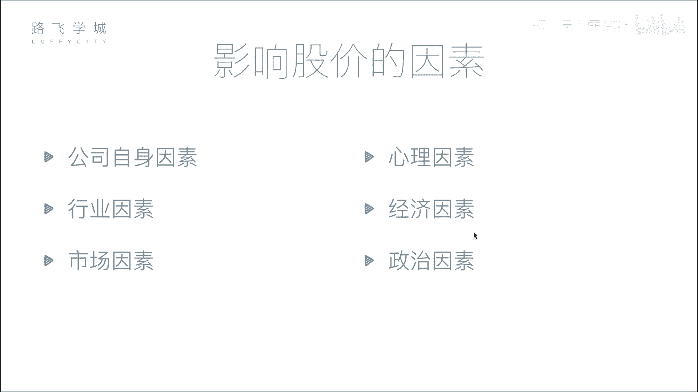
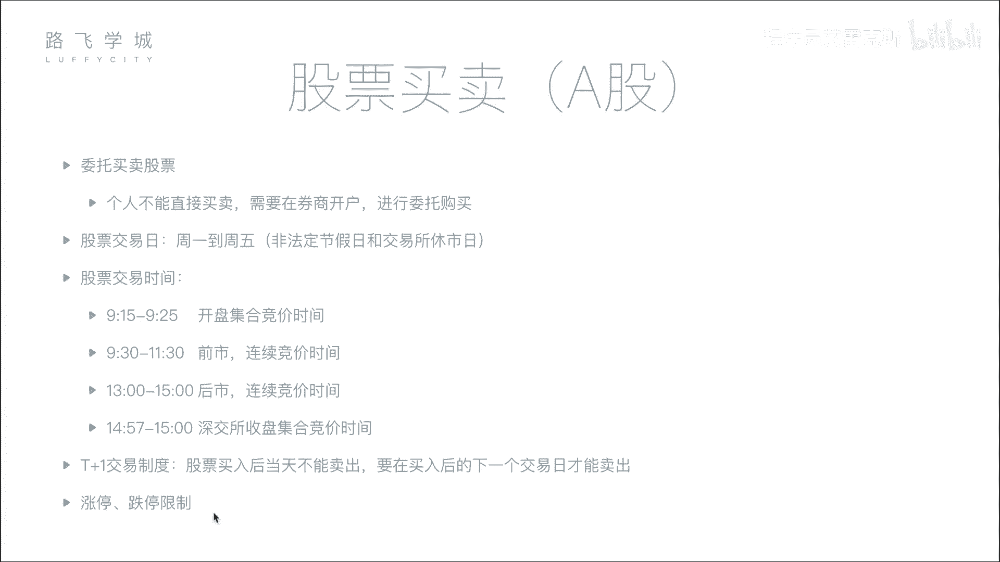

# Python金融量化投资分析：P4：03金融量化分析-影响股价因素&股票买卖知识 📈

在本节课中，我们将要学习影响股票价格的主要因素，并了解股票买卖的基本流程与规则。理解这些基础知识是进行量化分析的前提。

## 影响股价的六大因素 📊

上一节我们介绍了股票的基本概念，本节中我们来看看哪些因素会驱动股票价格的涨跌。影响股价的因素可以归纳为以下六个方面。

以下是影响股价的六大核心因素：

1.  **公司自身因素**：这是影响股价最根本的因素。公司的经营状况、盈利能力、发展前景等基本面直接决定了其长期价值。如果公司发展良好，市值增长，股价通常会上涨；反之，如果公司经营不善或出现负面新闻，股价则可能下跌。
2.  **市场因素**：这是影响股价最直接的因素。股价的短期波动由市场的供求关系决定。当买盘多于卖盘（供不应求）时，股价上涨；当卖盘多于买盘（供过于求）时，股价下跌。这类似于普通商品的买卖逻辑。
3.  **行业因素**：公司所属行业的整体景气度会影响行业内大部分公司的股价。例如，当某个行业（如人工智能）处于风口时，相关公司的股票可能普遍上涨；当某个行业（如传统IT培训）衰退时，相关股票则可能下跌。
4.  **心理因素**：投资者的情绪和从众心理会影响买卖决策，从而造成股价的非理性波动。例如，市场恐慌性抛售可能引发股价暴跌，即使公司基本面并未发生重大变化。
5.  **经济因素**：国家宏观经济政策、利率、存款准备金率、通货膨胀率等都会影响整个股票市场的资金流动性和投资者预期。例如，央行加息可能导致市场资金回流银行，从而对股市造成压力。
6.  **政治因素**：国际关系、地区局势、国家政策变动等政治事件会显著影响市场信心和资本流向。例如，地缘政治紧张局势可能引发市场避险情绪，导致股市下跌；而军工等特定板块则可能因此上涨。

## 股票买卖流程与规则 ⏰

了解了影响股价的因素后，我们来看看投资者实际买卖股票需要遵循的流程与规则。

### 1. 委托买卖

个人投资者不能直接进入交易所交易，必须通过证券公司（券商）进行。流程如下：
1.  在券商处开设证券账户。
2.  通过券商提供的系统（如交易软件）连接至交易所。
3.  提交买入或卖出指令，这个过程称为“委托”。

### 2. 交易日与交易时间

股票交易并非24小时进行，它有固定的交易日和时间安排。

*   **交易日**：通常为每周一至周五（非法定节假日）。
*   **交易时间**：一般为每个交易日的上午9:30至11:30，下午13:00至15:00。其中，9:15至9:25为**开盘集合竞价**时间，14:57至15:00（深交所）为**收盘集合竞价**时间。

### 3. 集合竞价与连续竞价

交易日的不同时段采用不同的交易机制。

*   **开盘集合竞价（9:15-9:25）**：在此时间段内提交的所有买卖委托不会立即成交，而是集中到9:25这一刻，由交易系统按照“**最大成交量**”原则一次性撮合成交，所产生的价格即为当日的**开盘价**。
*   **连续竞价（9:30-11:30, 13:00-14:57）**：在此时段内，交易系统对不断进入的买卖委托进行实时、连续的撮合，通常几秒钟内即可完成一次撮合。
*   **收盘集合竞价（深交所：14:57-15:00）**：与开盘集合竞价类似，此时间段内的委托集中到15:00撮合，产生**收盘价**。上海证券交易所无此环节，其收盘价为最后一笔连续竞价的成交价。

### 4. 交易制度

之前提到的`T+1`交易制度和涨跌幅限制是A股市场的重要规则。

*   **`T+1`制度**：当日（`T`日）买入的股票，必须到下一个交易日（`T+1`日）才能卖出。
*   **涨跌幅限制**：普通股票在一个交易日内的价格波动被限制在前一交易日收盘价上下10%的范围内（ST股为5%）。这可以用公式表示：
    `涨停价 = 前收盘价 × (1 + 10%)`
    `跌停价 = 前收盘价 × (1 - 10%)`

---

本节课中我们一起学习了影响股票价格的六大因素（公司、市场、行业、心理、经济、政治），并掌握了股票买卖的基本流程、交易时间、竞价机制（集合竞价与连续竞价）以及核心交易制度（`T+1`和涨跌停板）。这些知识是构建量化分析策略和理解市场行为的基础。