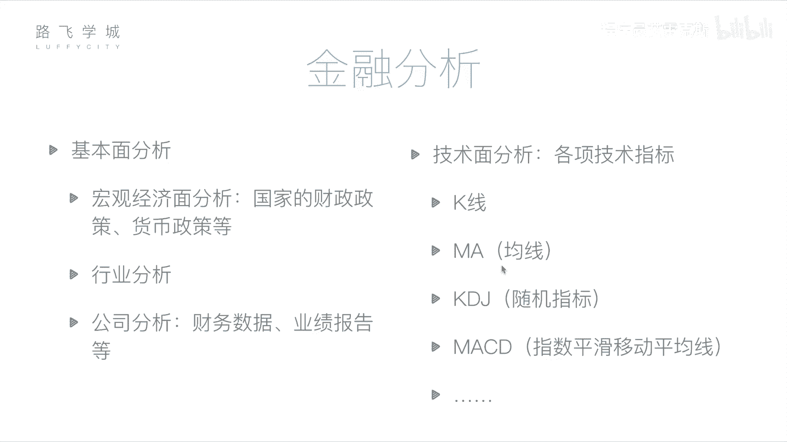
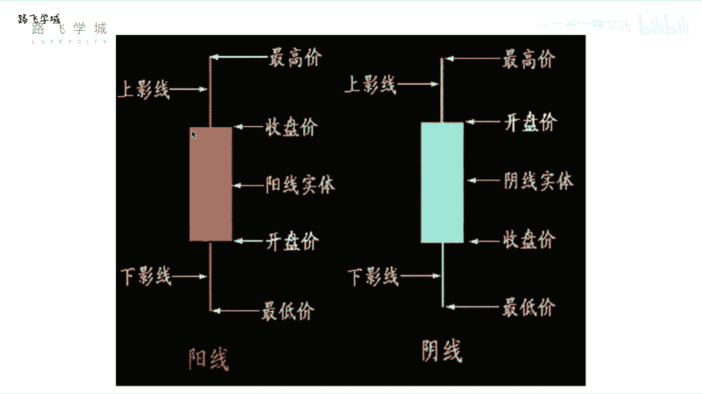
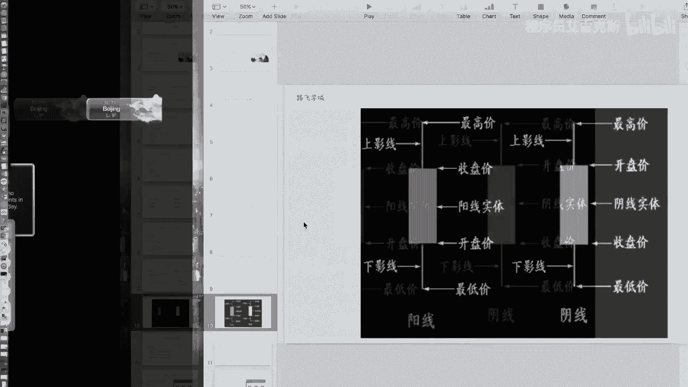
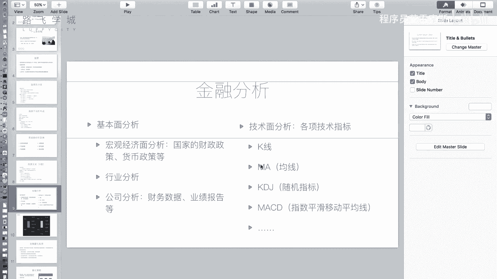
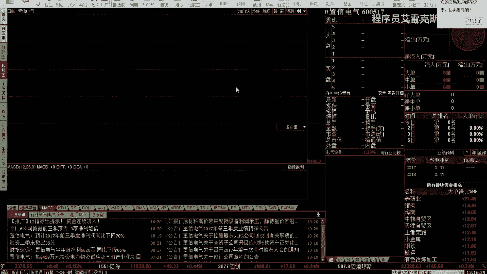
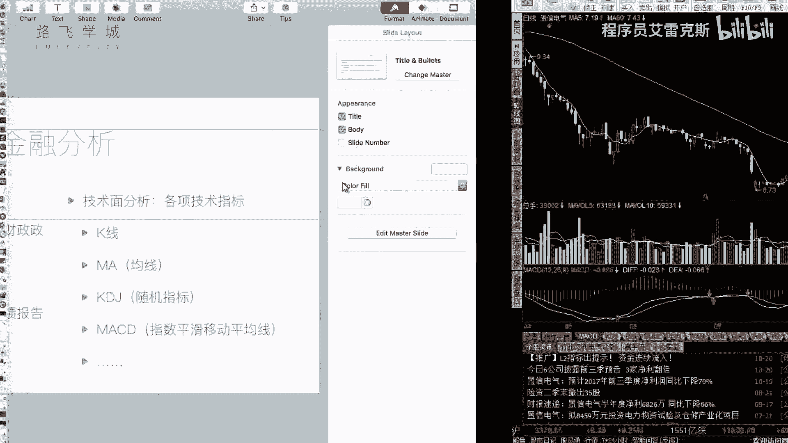

# Python金融量化投资分析：P5：04 金融量化分析-金融分析 📈

在本节课中，我们将要学习金融分析的核心方法。我们将了解如何通过基本面分析和技术面分析来判断股票的投资价值，避免盲目投资。

上一节我们介绍了金融和股票的基础知识，本节中我们来看看如何对股票进行分析。

## 概述：两种核心分析方法

金融分析主要分为两种方法：基本面分析和技术面分析。盲目购买股票如同赌博，而这两种方法为我们提供了理性的决策依据。

### 基本面分析

基本面分析的核心是评估公司的实际运营状况，即之前提到的“公司自身因素”。它通过分析宏观经济、行业前景和公司财务来判断股票的内在价值。

以下是基本面分析的三个层面：

1.  **宏观经济面分析**：分析国家的财政政策、货币政策等，判断整体经济环境是鼓励资金进入股市还是存入银行。但需注意，市场规律有时与宏观分析结论不一致。
2.  **行业分析**：判断特定行业（如教育、IT、能源）的整体发展前景。可以通过观察该行业内几只代表性股票的走势来进行初步判断。
3.  **公司分析**：这是最具体的层面。通过研究目标公司（如中国茅台）公开的财务报告和运营数据来判断其价值。上市公司会定期发布经审计的财报，数据相对客观真实。如果判断公司运营良好、盈利能力强，则可以考虑买入其股票。

### 技术面分析

技术面分析认为，所有信息都已蕴含在市场的历史交易数据中。其核心是通过研究股票过去的价格走势和一系列技术指标，来预测未来的价格变动。

技术分析不直接关注公司经营，而是专注于市场行为本身。以下是两个基础且重要的技术指标：

#### K线图

K线图是展示股票每日价格走势的图表。横轴是时间，纵轴是价格。图中的每一个柱状体称为一根“K线”，它浓缩了四个关键价格。

**K线公式/构成**：
*   **阳线**（通常为红色/空心）：表示当日股价上涨，即收盘价高于开盘价。
*   **阴线**（通常为绿色/蓝色/实心）：表示当日股价下跌，即收盘价低于开盘价。

一根标准K线包含：
*   **实体**：中间的矩形部分。其上下边缘分别代表开盘价和收盘价。
    *   阳线：实体下边缘为开盘价，上边缘为收盘价。
    *   阴线：实体上边缘为开盘价，下边缘为收盘价。
*   **影线**：实体上下方的细线。
    *   **上影线**顶端表示当日**最高价**。
    *   **下影线**底端表示当日**最低价**。

因此，一根K线以直观的形式包含了：`开盘价`， `收盘价`， `最高价`， `最低价`。

K线有一些特殊形态，例如“十字线”（开盘价等于收盘价）或“光头光脚线”（没有影线），它们都具有特定的市场含义。

#### 移动平均线

移动平均线是技术分析中另一个基础工具，用于平滑价格数据，识别趋势。

**均线计算公式**：
`MA(N) = (P1 + P2 + ... + PN) / N`
其中，`P1` 到 `PN` 代表过去N个交易日的收盘价（或平均价），`N`为周期数。

常见的均线有：
*   **MA5**：5日均线，过去5个交易日收盘价的平均值。
*   **MA60**：60日均线，过去60个交易日收盘价的平均值。

将每个交易日的移动平均值连接起来，就形成了均线。它被称为“移动”平均线，是因为计算窗口会随着时间推移而移动。例如，短期均线（如MA5）对价格变化更敏感，而长期均线（如MA60）则更能反映长期趋势。

## 总结

本节课中我们一起学习了金融分析的两大支柱。
*   **基本面分析**从宏观经济、行业和公司层面出发，评估股票的内在价值。
*   **技术面分析**则专注于市场价格本身，通过研究**K线图**和**移动平均线**等历史数据形成的图表与指标，来推测未来走势。

理解这两种方法是进行理性股票投资和后续量化策略开发的基础。在接下来的课程中，我们将深入探讨如何将这些分析方法转化为可执行的量化交易策略。