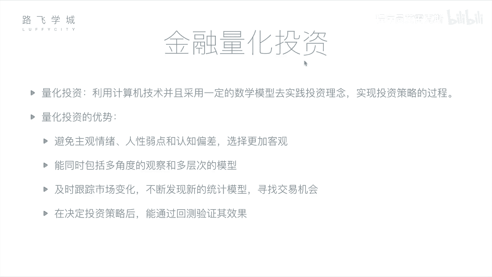
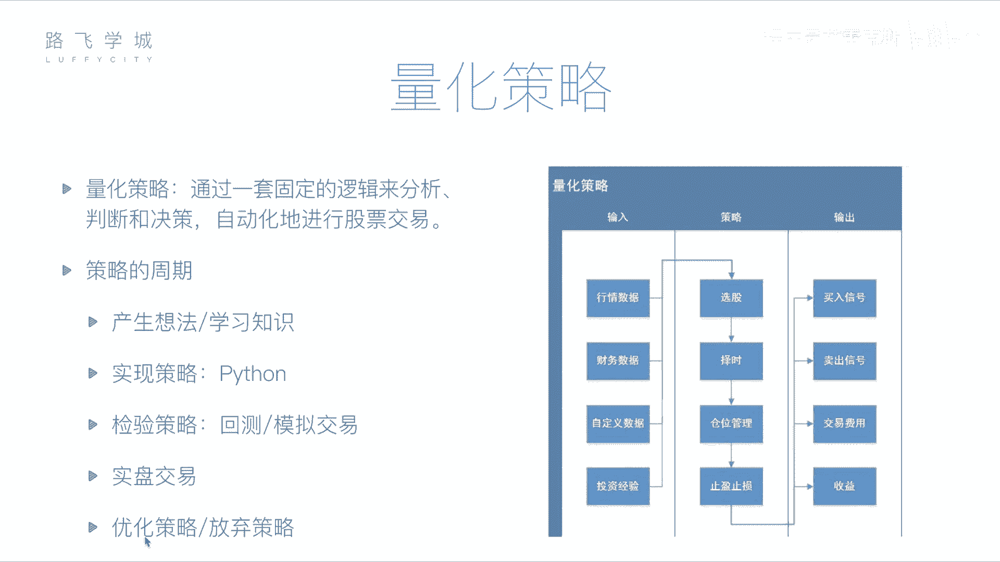

# Python金融量化投资分析：P6：05 金融量化投资介绍 📈

在本节课中，我们将要学习金融量化投资的核心概念、基本流程以及量化策略的构成。我们将了解如何利用计算机技术和数学模型，将投资理念转化为可执行的自动化策略。

## 量化投资概念

上一节我们介绍了金融分析可以通过基本面或技术面进行。本节中我们来看看如何将这一分析过程自动化。

量化投资是指利用计算机技术，并采用一定的数学模型去实现投资理念与策略的过程。它包含三个重要部分：
1.  **计算机技术**：使用编程方式实现。
2.  **数学模型**：即具体的投资策略和规则，例如计算移动平均线的公式 `MA = (P1 + P2 + ... + Pn) / n`。
3.  **实践验证**：将编写好的程序用于实际投资或预先测试。

## 量化投资的优势

相较于人工投资，量化投资具有以下优势：

以下是量化投资的四个主要优点：

1.  **避免主观情绪**：程序决策可以排除人性弱点（如贪婪、恐惧）和认知偏差，使选择更加客观。
2.  **多维度高效分析**：计算机能够同时处理海量数据，从多个角度（如技术指标、财务数据、行业新闻）快速分析成千上万只股票，远超人类能力。
3.  **及时跟踪与发现**：程序可以7x24小时监控市场变化，及时发现交易机会并执行，反应速度远超人工。同时，便于尝试和集成新的投资方法或机器学习策略。
4.  **历史回测验证**：在实盘交易前，可以使用历史数据检验策略的有效性。这个过程称为**回测**。通过调整和优化策略参数，可以在历史数据上验证其盈利能力，从而增加实盘成功的信心。

## 量化策略的核心构成

一个完整的量化策略主要包括三个部分：输入、处理逻辑和输出。

### 策略输入（数据源）

策略需要数据来进行分析和决策。主要输入数据包括：

以下是常见的策略输入数据类型：

*   **行情数据**：股票的历史价格与交易信息，例如每日的开盘价、收盘价、最高价、最低价和成交量。
*   **财务数据**：上市公司的各类财务报表数据，如利润表、资产负债表。
*   **自定义数据**：任何可量化的信息，例如新闻舆情分析、宏观经济指标，甚至是一些个性化的投资经验规则。

### 策略处理（核心逻辑）

策略的核心在于对输入数据进行处理并做出决策。主要完成四件事：

以下是量化策略处理的四个关键环节：

1.  **选股**：从众多股票中筛选出符合特定条件的投资标的。
2.  **择时**：决定买卖的具体时机，旨在实现“低买高卖”。
3.  **仓位管理**：决定资金在不同股票或资产上的分配比例，以控制风险和优化收益。
4.  **止盈止损**：设定自动化的卖出规则。**止损**（如亏损达到10%时卖出）以控制损失；**止盈**（如盈利达到30%时卖出）以锁定利润。

### 策略输出（执行与评估）

策略运行后会产生相应的输出：

以下是策略的主要输出结果：

*   **交易信号**：程序生成的买入或卖出指令。这可以是一个提示信息，也可以直接连接到券商系统进行自动交易。
*   **交易费用与收益**：计算每次交易产生的佣金、手续费等成本，并最终核算策略的净收益、收益率等绩效指标。

## 量化策略的开发周期

一个量化策略从构思到实盘通常会经历一个完整的生命周期。

以下是量化策略开发的典型流程：

1.  **产生想法**：基于投资经验、学术理论或市场观察形成策略雏形。
2.  **策略实现**：使用编程语言（如Python）将想法转化为可执行的代码。
3.  **回测验证**：使用历史数据运行策略，检验其过去的表现。
4.  **模拟交易**：使用当前的真实市场数据运行策略，但不投入真实资金，进一步验证其在近期市场的适应性。
5.  **实盘交易**：将经过充分验证的策略投入真实市场进行交易。
6.  **优化与迭代**：根据实盘或回测结果对策略进行持续优化，或决定是否放弃并开发新策略。

## 总结

本节课中我们一起学习了金融量化投资的基础知识。我们明确了量化投资是利用计算机和数学模型进行客观、高效投资决策的过程，并详细剖析了量化策略的三大构成部分：数据输入、处理逻辑（选股、择时、仓位管理、止盈止损）和结果输出。最后，我们了解了策略从构思、回测到实盘的完整开发周期。接下来，我们将开始学习如何使用Python及其相关工具库来具体实现这些量化分析理念。