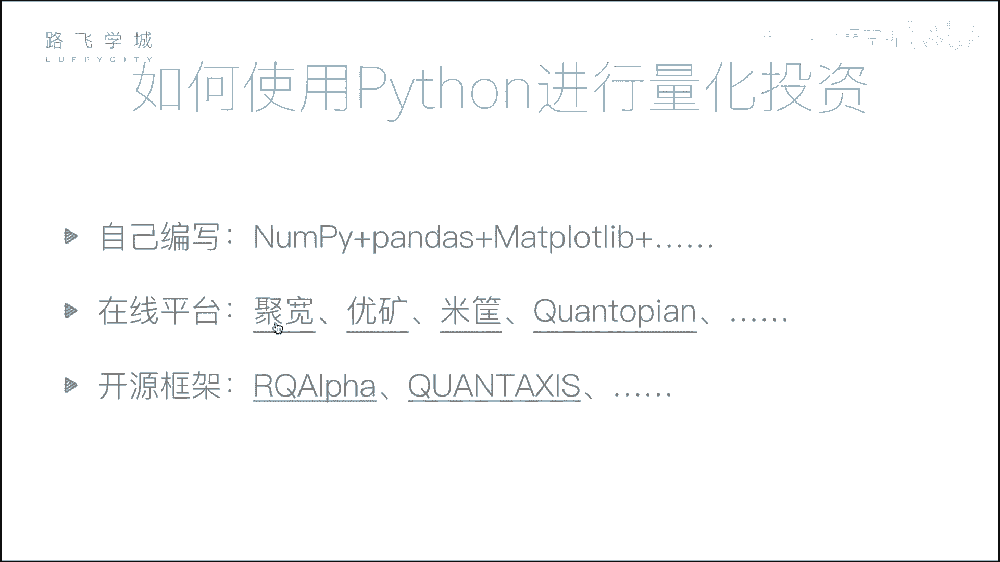
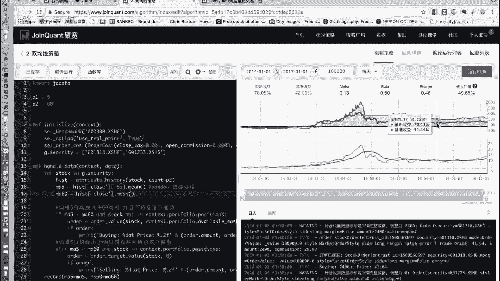
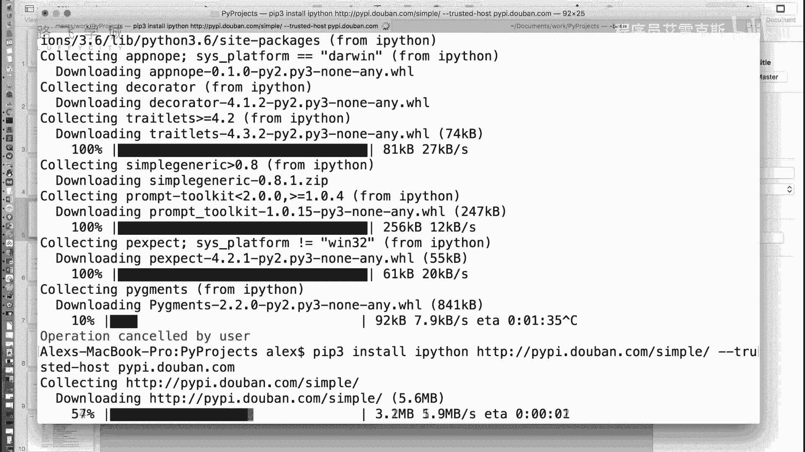
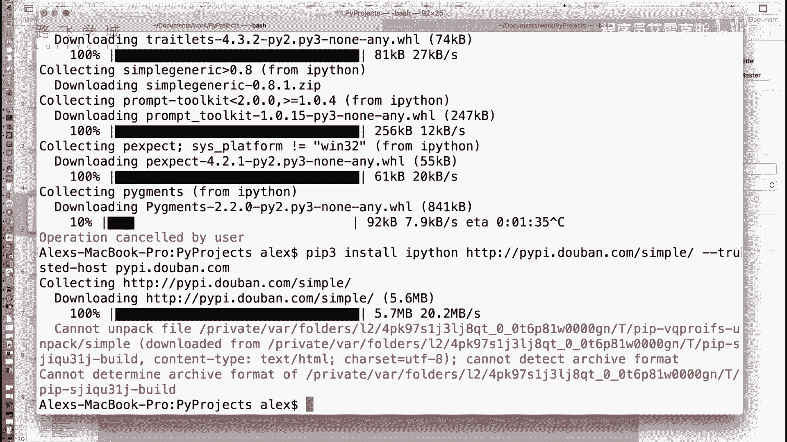
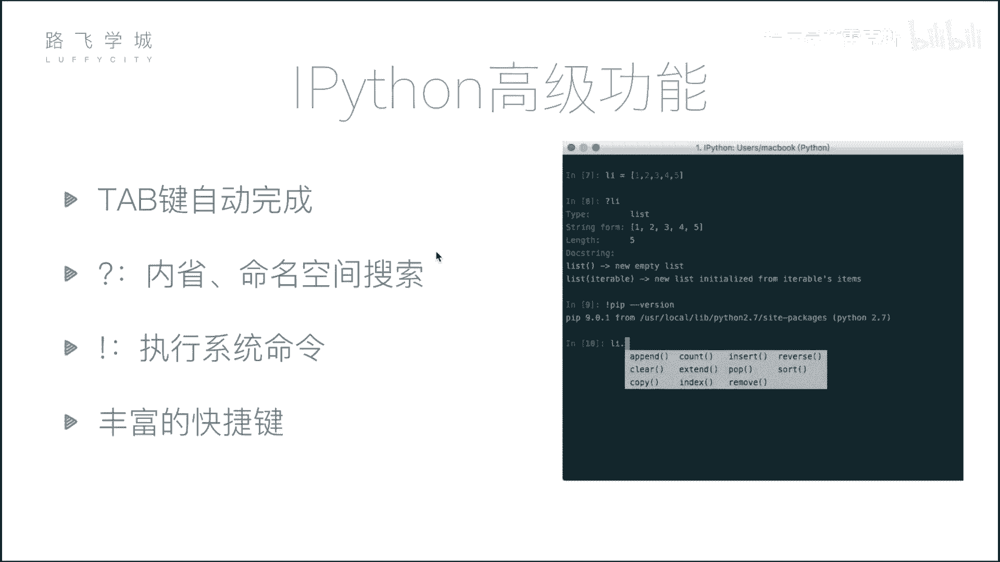
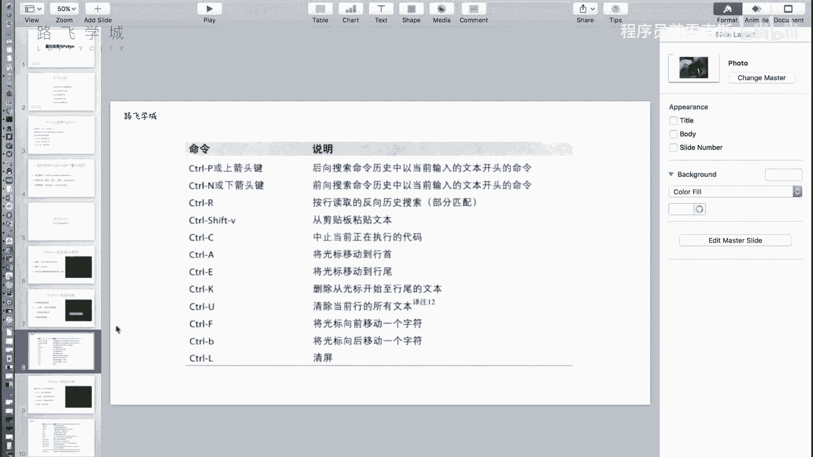

# Python金融量化投资分析：P7：06：量化投资与Python及IPython初识 📈

在本节课中，我们将要学习量化投资与Python编程语言的关系，并初步认识一个强大的交互式工具——IPython。我们将了解为何Python是量化投资的理想选择，并介绍后续课程中将使用的核心数据分析模块。

## 量化投资与Python 🐍

上一节我们介绍了量化投资的基本概念，本节中我们来看看如何利用Python工具来实现它。

量化投资本质上是分析数据并据此做出决策的过程。Python因其强大的数据处理能力和丰富的生态系统，成为该领域的首选工具。

### 为何选择Python？



除了Python，市场上还有其他可用于数据分析的工具。以下是部分工具的简要对比：

*   **Excel**：无需编程，依赖手动操作，功能有限。
*   **SAS/SPSS**：专业的统计分析软件，提供图形化界面，但同样缺乏编程灵活性。
*   **R语言**：专注于统计分析和数据可视化的编程语言，但应用领域相对狭窄。



相比之下，Python是一门通用编程语言，在数据分析、Web开发、自动化脚本等多个领域都有广泛应用。学习Python意味着掌握了一项多功能技能。

### Python量化分析核心模块

在Python生态中，有三个库是金融数据分析的基石：

1.  **NumPy**：用于高效的**数组批量计算**。其核心是`ndarray`对象。
    ```python
    import numpy as np
    arr = np.array([1, 2, 3, 4, 5])
    ```
2.  **Pandas**：提供灵活的**数据表结构（DataFrame）**，是数据处理和分析的核心工具。
    ```python
    import pandas as pd
    df = pd.DataFrame({'A': [1, 2, 3], 'B': [4, 5, 6]})
    ```
3.  **Matplotlib**：用于**数据可视化**，将分析结果以图表形式呈现。
    ```python
    import matplotlib.pyplot as plt
    plt.plot([1, 2, 3], [4, 5, 1])
    plt.show()
    ```





### 量化策略的实现方式

掌握了上述工具后，你可以通过以下方式实践量化投资：

*   **自建框架**：使用NumPy、Pandas和Matplotlib从零开始搭建简单的量化回测框架，编写并测试自己的交易策略。
*   **在线平台**：利用现成的量化平台（如聚宽、米筐等），只需编写核心策略代码即可进行回测。平台会自动生成策略收益曲线等可视化结果。
    > 例如，策略回测结果可能包含一条代表策略收益的曲线，以及与基准收益（如大盘指数）的对比图，直观反映策略表现。

## IPython交互式环境介绍 ⚡


在深入学习上述模块前，我们先认识一个能提升开发效率的工具——IPython。它是一个功能增强的交互式Python命令行工具。



### 安装IPython

可以通过Python的包管理工具pip进行安装。建议使用国内镜像源以加速下载。
```bash
pip install ipython -i https://pypi.douban.com/simple/
```
对于初学者，也可以直接安装**Anaconda**发行版，它集成了IPython及我们将要学习的所有数据分析库。

### IPython基础使用

安装完成后，在命令行输入`ipython`即可启动。其界面与标准Python解释器类似，但提示符带有行号（如`In [1]:`），输入和输出分别标记为`In`和`Out`。

### IPython高级功能

IPython提供了许多提升效率的特性，以下是几个核心功能：

*   **Tab键自动补全**：输入变量名或函数名的一部分，按`Tab`键可以自动补全或列出所有可能选项。
*   **执行系统命令**：在命令前添加感叹号`!`，可以直接执行系统命令（如`!ls`、`!pwd`）。
*   **内省与搜索**：
    *   在变量或函数后加`?`，可以查看其文档字符串（Docstring）等详细信息。
    *   使用`*`进行模糊搜索，例如`a.*pp*?`会列出所有名称中包含`pp`的方法。
*   **丰富的快捷键**：IPython支持大量快捷键以提高操作速度，例如：
    *   `Ctrl + A`：移动光标到行首。
    *   `Ctrl + E`：移动光标到行尾。
    *   `Ctrl + U`：删除从光标到行首的所有内容。
    *   `Ctrl + K`：删除从光标到行尾的所有内容。

---



本节课中我们一起学习了Python在量化投资领域的优势，认识了NumPy、Pandas和Matplotlib这三个核心数据分析库，并初步掌握了IPython这一高效交互式工具的基本使用方法。接下来，我们将开始深入这些工具的具体应用。