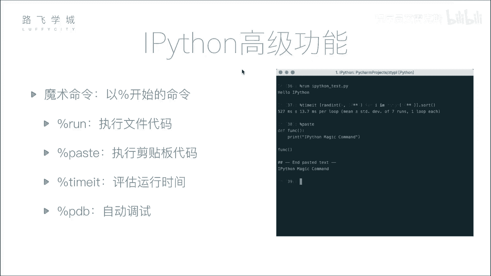
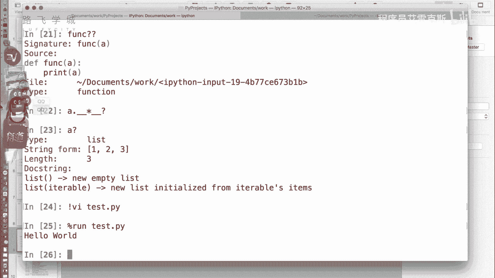
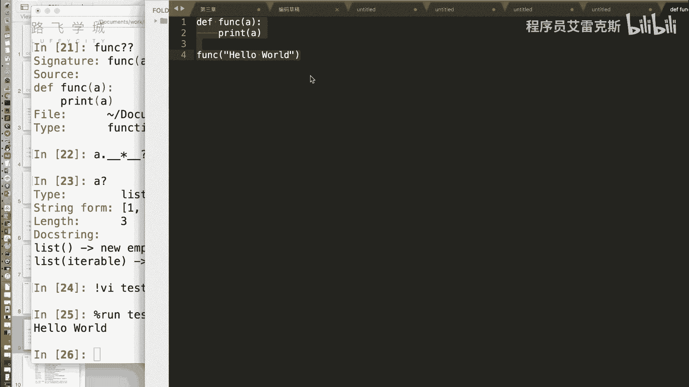
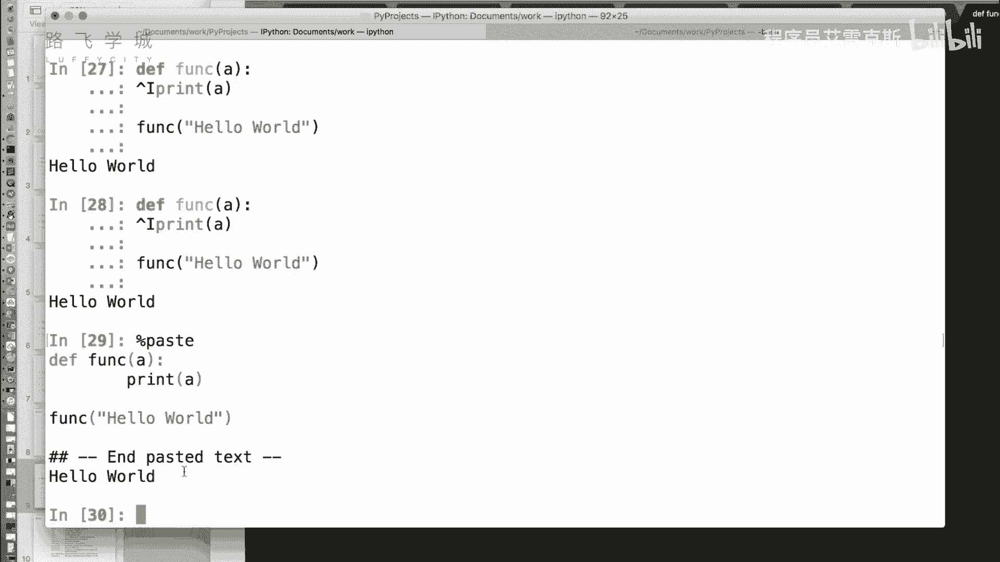
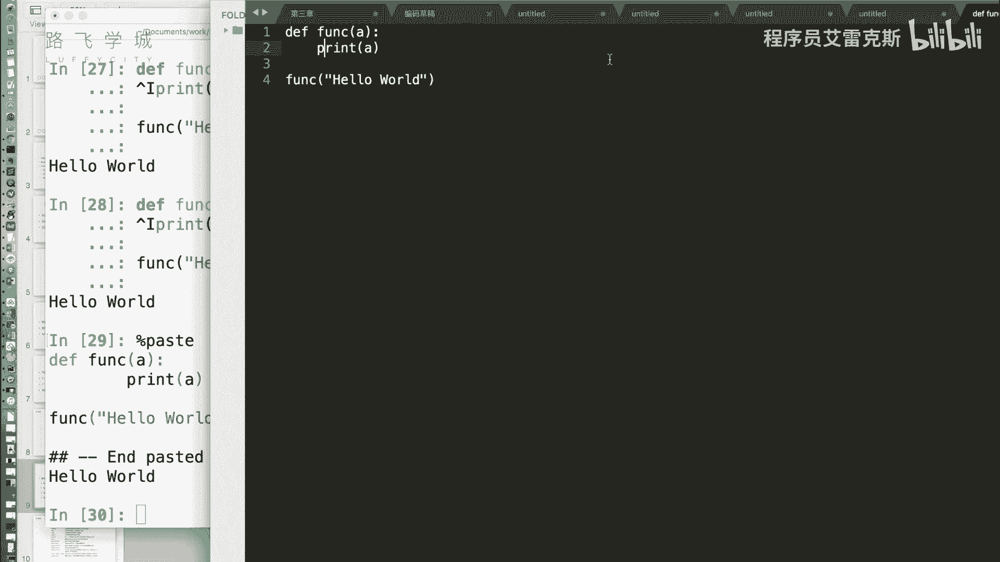
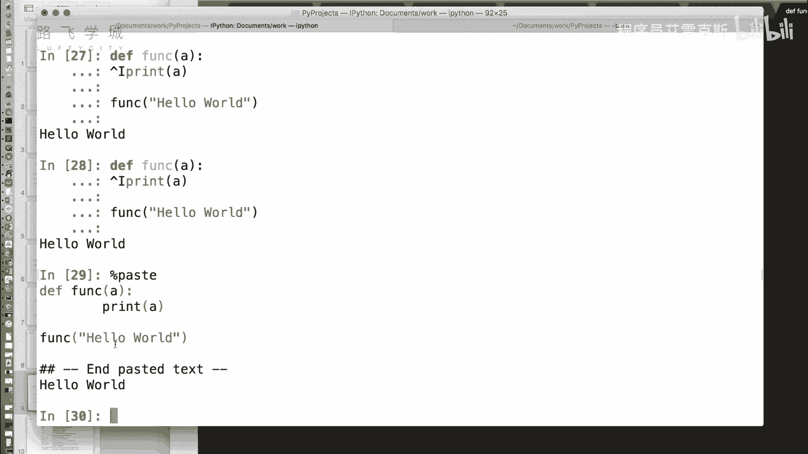
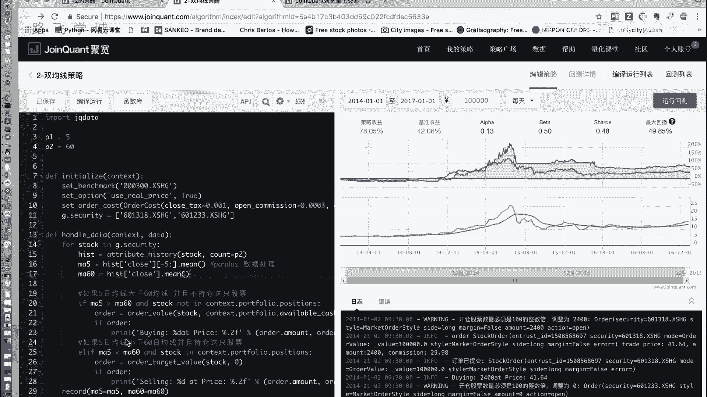
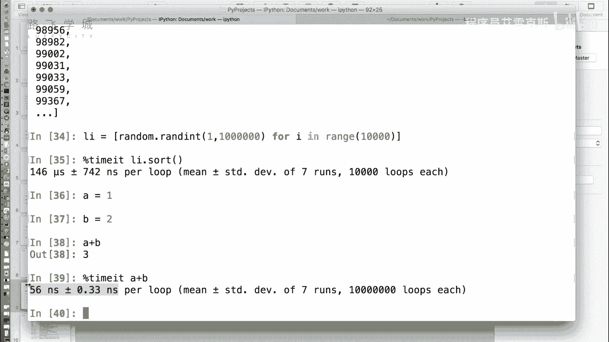

# Python金融量化投资分析：P8：08 IPython魔术命令 🪄



在本节课中，我们将学习IPython中一个非常实用且有趣的高级功能——魔术命令。魔术命令以百分号开头，能够极大地提升我们在交互式环境中的工作效率，例如运行外部脚本、粘贴代码块或精确测量代码执行时间。

## 什么是魔术命令？

上一节我们介绍了IPython的基本交互功能，本节中我们来看看它的“魔术”所在。魔术命令是IPython提供的一系列以百分号 `%` 开头的特殊命令。它们并非Python语言的一部分，而是IPython环境提供的增强工具，用于执行一些在标准Python解释器中无法直接完成的操作。



## 常用魔术命令详解

以下是几个在金融量化分析和日常开发中非常实用的魔术命令。



### 运行外部Python文件：`%run`

在标准Python命令行中，要运行一个外部`.py`文件，通常需要退出解释器再执行 `python filename.py`。在IPython中，我们可以使用 `%run` 命令直接在交互式环境中运行脚本，脚本中定义的变量和函数会直接导入到当前会话中。

**命令格式：**
```python
%run 文件名.py
```

例如，假设我们有一个名为 `hello.py` 的文件，内容为 `print(“Hello World”)`，只需在IPython中输入 `%run hello.py` 即可执行。





### 执行剪贴板中的代码：`%paste`





有时我们需要从编辑器或其他地方复制一段代码到IPython中进行测试。直接粘贴可能会因为缩进或特殊字符导致错误。`%paste` 命令可以智能地执行剪贴板中的代码，自动处理格式问题。

**命令格式：**
```python
%paste
```

执行此命令后，IPython会先打印出剪贴板中的代码内容，然后执行它。这对于测试代码片段非常方便。

### 测量代码执行时间：`%timeit`

在性能分析和优化时，准确测量代码执行时间至关重要。Python内置的 `time` 模块对于极短的操作可能不够精确（例如显示为0秒）。`%timeit` 命令通过多次运行代码并计算平均时间，能够提供高精度的性能数据。

**命令格式：**
```python
%timeit 代码语句
```

例如，测量对一个包含10,000个随机数的列表进行排序所需的时间：
```python
import random
lst = [random.random() for _ in range(10000)]
%timeit sorted(lst)
```
`%timeit` 会自动决定运行次数，对于快速操作会运行很多次以获得稳定的平均值，结果会显示平均时间及标准差，单位可能是微秒（µs）或纳秒（ns）。

## 总结



本节课中我们一起学习了IPython的三个核心魔术命令：`%run`、`%paste` 和 `%timeit`。这些命令分别用于运行外部脚本、执行剪贴板代码和精确测量代码性能。掌握这些工具能让你在数据分析和量化策略开发中更加得心应手，提升交互式编程的效率和体验。在后续的实战中，我们将频繁使用这些命令来测试和优化我们的代码。