# Python金融量化投资分析：P9：09 金融量化分析-IPython高级功能 🧙‍♂️

在本节课中，我们将学习IPython的几个高级功能，包括PDB调试、命令历史、获取输入输出结果、目录书签系统以及Jupyter Notebook。这些工具能显著提升代码调试和交互式计算的效率。

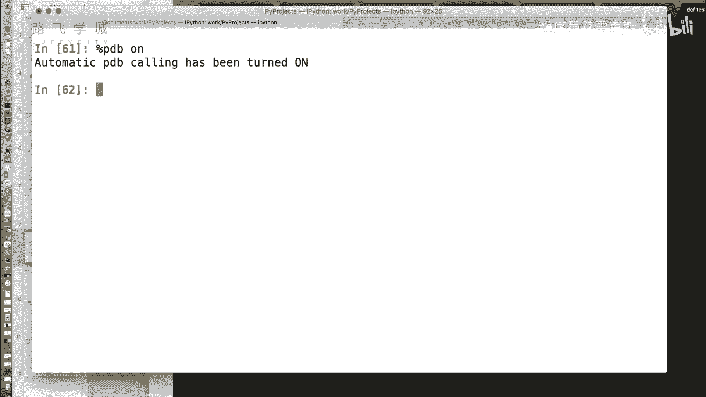

## PDB调试模式 🔧

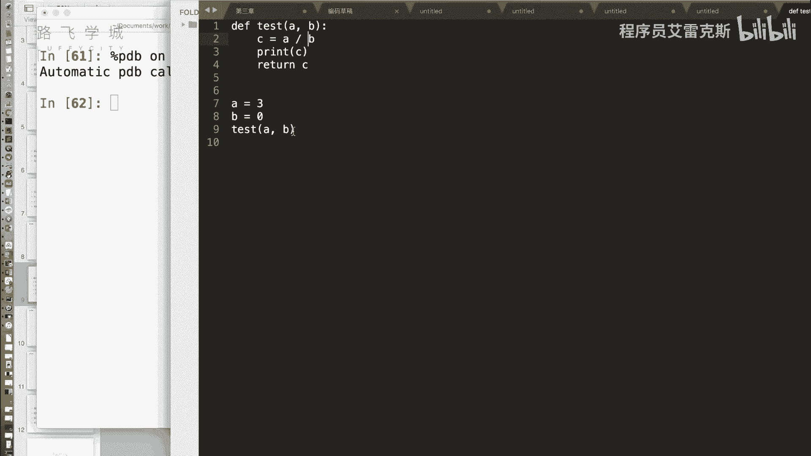

上一节我们介绍了IPython的魔术命令，本节中我们来看看一个用于调试的强大工具：`%pdb`。

`%pdb`是一个开关性质的魔术命令。使用`%pdb on`可以开启调试模式。开启后，当运行代码遇到错误时，IPython会在报错的那一行之前自动暂停，并进入交互式调试器。这允许你在错误发生前检查变量的状态。

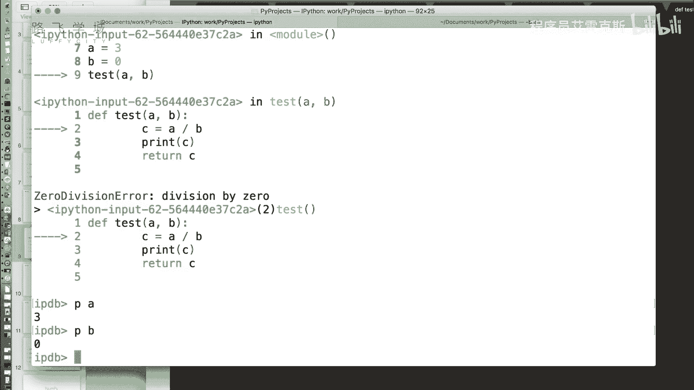

**核心命令**：
```python
%pdb on  # 开启自动调试模式
%pdb off # 关闭自动调试模式
```

### 调试模式示例

以下是一段测试代码，函数`test`会触发一个除以零的错误。

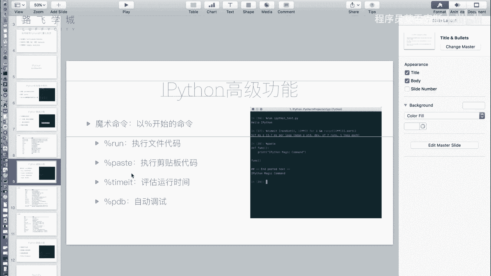

```python
def test(a, b):
    c = a / b
    return c

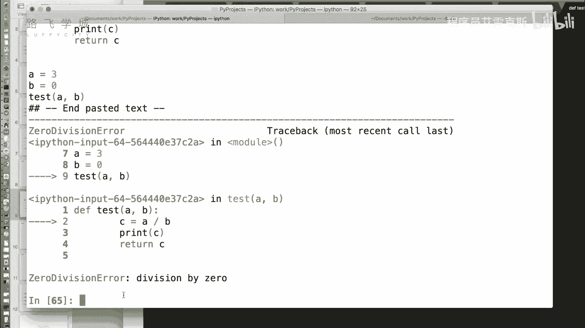

test(3, 0)
```

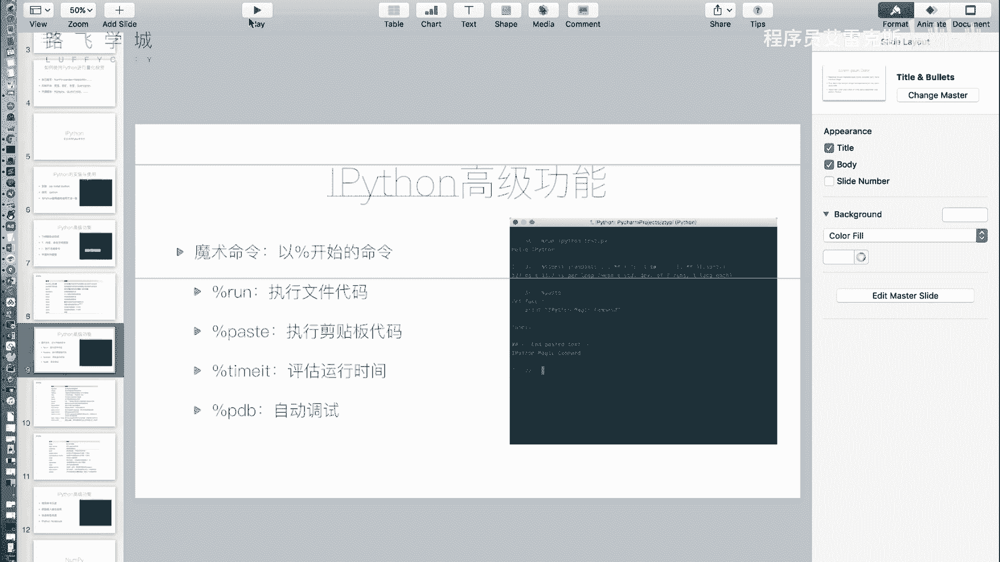

在`%pdb on`模式下运行此代码，程序会在执行`c = a / b`之前暂停，并进入调试器（pdb）。此时，你可以使用pdb命令检查变量。

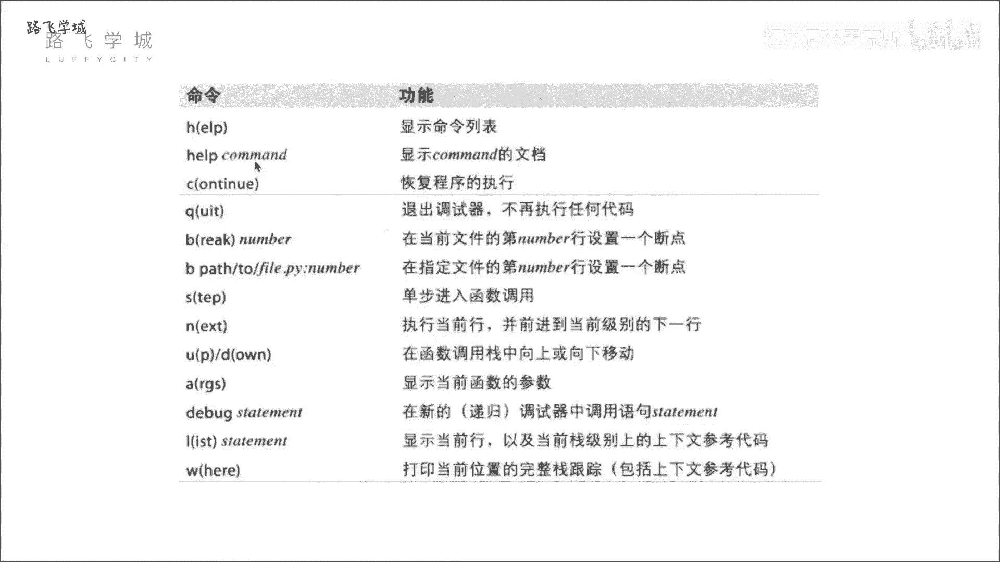


以下是PDB调试器中一些常用命令：
*   **p**：打印变量的值。例如 `p a` 会打印变量`a`的值。
*   **n**：执行下一行代码。
*   **h**：查看帮助文档。
*   **q**：退出调试器。

在调试器中，你可以使用`p a`和`p b`来分别查看传入的参数值，从而定位问题。当不需要自动调试时，使用`%pdb off`关闭即可。

## 使用命令历史 🔍

接下来，我们看看如何高效地使用命令历史。IPython可以记录你输入过的所有命令，并支持快速检索。

在IPython中，按**上箭头键**可以逐条回溯之前输入的命令。此外，你还可以进行部分匹配搜索：例如，输入字母`a`，然后按上箭头，IPython会回溯到最近一条以`a`开头的命令。这能帮助你快速找到并重新执行之前的代码片段。

## 获取输入与输出结果 📥📤

在交互式编程中，我们常常需要引用上一行代码的输出结果。IPython为此提供了便捷的语法。

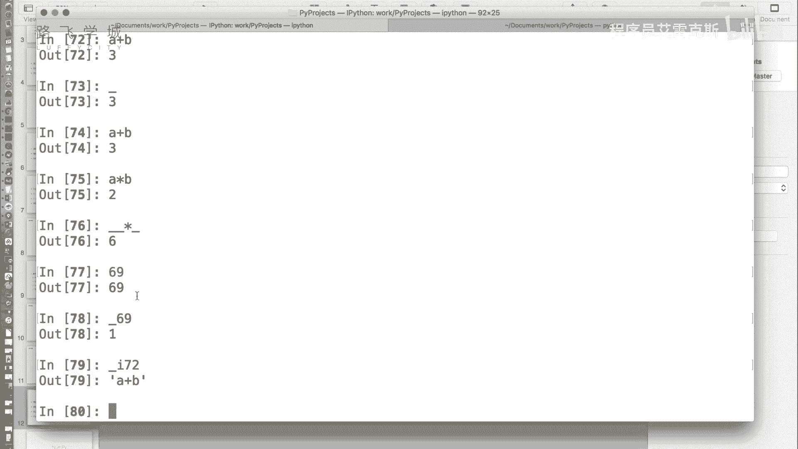

*   **获取输出**：使用单个下划线 `_` 可以获取上一行代码的输出结果。使用双下划线 `__` 可以获取上上一行的输出，以此类推。
*   **获取特定行的输出**：使用 `_N` （N为行号）可以获取指定行的输出结果。
*   **获取输入**：使用 `_iN` 可以获取指定行输入的代码字符串。

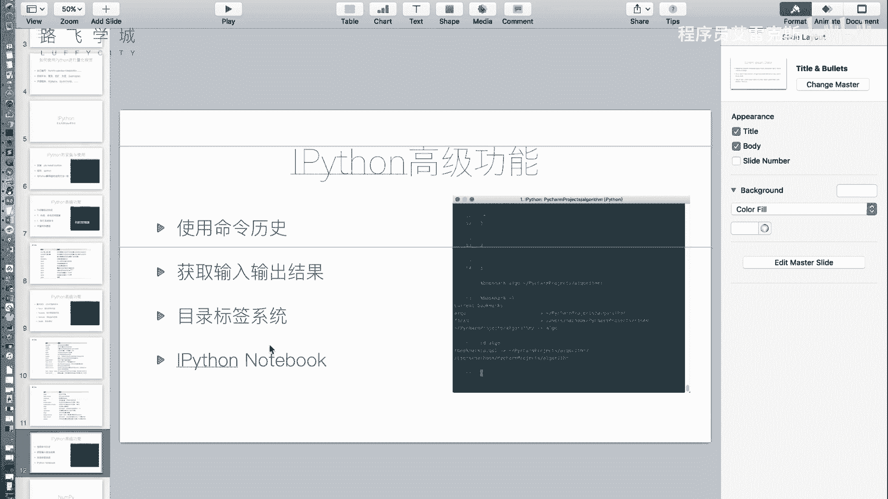

**示例**：
```python
a = 1
b = 2
a + b  # 输出：3
_ * 2  # 使用上一个输出结果3进行计算：3 * 2 = 6
_i3    # 获取第3行的输入，返回字符串 ‘a + b’
```

## 目录书签系统 📂

如果你经常需要在多个项目目录间切换，反复输入`cd`命令会非常繁琐。IPython的`%bookmark`魔术命令可以创建目录书签，实现快速跳转。

以下是目录书签的常用操作：

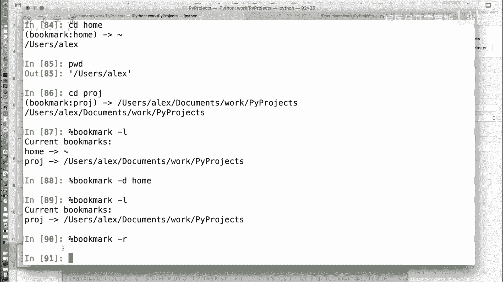

*   **创建书签**：`%bookmark 书签名 目录路径`
*   **查看所有书签**：`%bookmark -l`
*   **跳转到书签目录**：`cd 书签名`
*   **删除单个书签**：`%bookmark -d 书签名`
*   **删除所有书签**：`%bookmark -r`

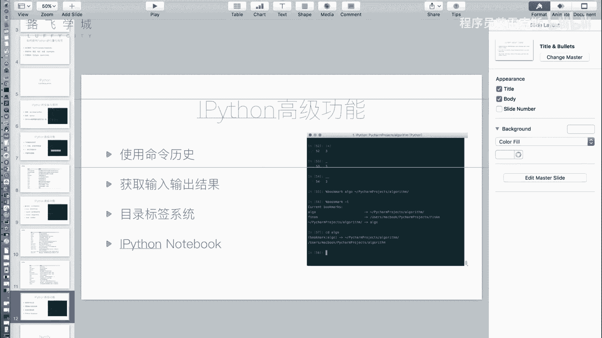

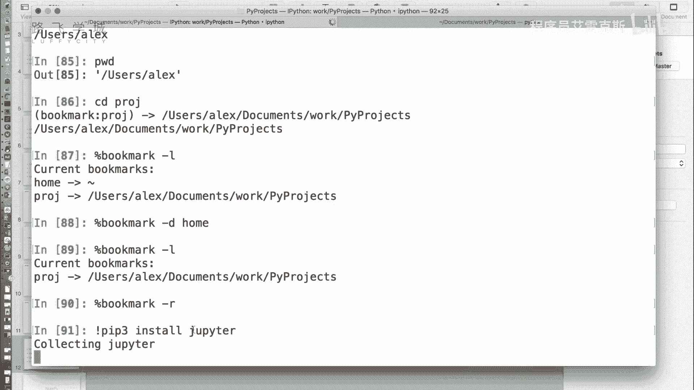

例如，将当前目录保存为书签`proj`：`%bookmark proj`。之后只需输入`cd proj`即可快速返回该目录。


## Jupyter Notebook 🌐

最后，我们介绍一个基于Web的交互式计算环境——Jupyter Notebook。它是IPython的扩展，特别适合用于数据清洗、统计建模、数据可视化和机器学习等领域。

要使用Jupyter Notebook，需要先安装`jupyter`模块：
```bash
pip install jupyter
```

安装完成后，在命令行输入`jupyter notebook`，它会在浏览器中打开一个本地服务器页面。在这里，你可以创建新的Notebook文件。

Jupyter Notebook的核心特点包括：
1.  **交互式单元**：代码被组织在一个个“单元格”中，可以独立运行并立即看到结果。
2.  **富文本支持**：单元格不仅支持Python代码，还可以切换为Markdown格式，用于编写带格式的文本、数学公式，非常适合撰写技术报告或教程。
3.  **多媒体输出**：可以直接在单元格中内嵌显示图表、图片、视频等。
4.  **多种导出格式**：Notebook文件可以导出为Python脚本、HTML、PDF等多种格式，便于分享和发布。

对于金融量化分析，Jupyter Notebook是一个理想的工具，因为它能清晰地展示数据分析的步骤、中间结果和最终图表，使整个分析过程可重复、可分享。

## 总结 📝

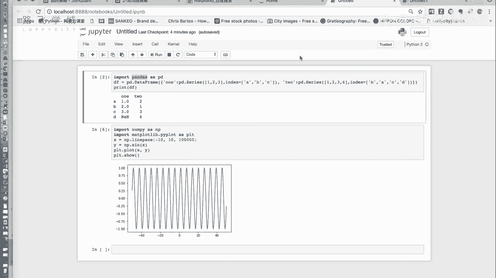

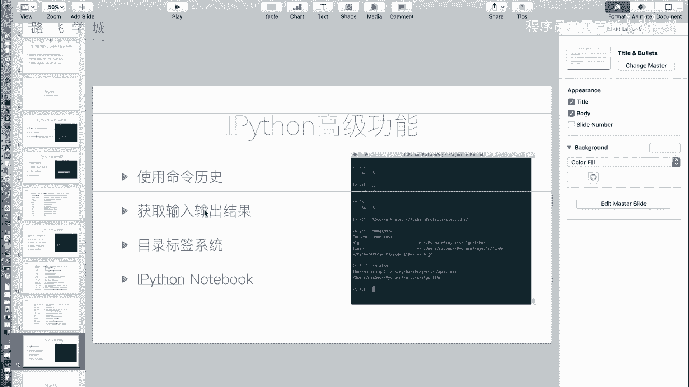

本节课中我们一起学习了IPython的多个高级功能。
*   我们掌握了使用`%pdb`进行自动错误调试的方法。
*   我们学会了利用命令历史快速检索和重用代码。
*   我们了解了通过下划线语法便捷地获取输入和输出结果。
*   我们使用`%bookmark`创建了目录书签以提升工作效率。
*   最后，我们认识了强大的交互式笔记本工具Jupyter Notebook，它为数据分析和报告撰写提供了极大的便利。

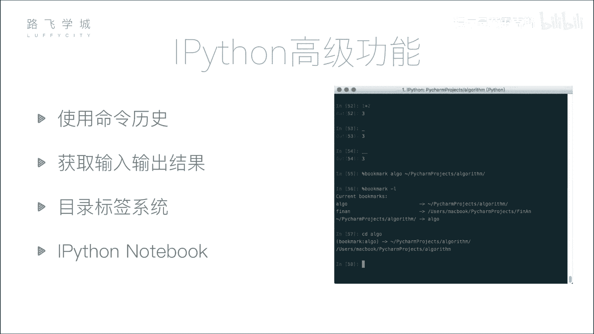


这些工具共同构成了一个高效的Python交互式编程环境，是进行金融量化分析不可或缺的助手。接下来，我们将开始学习数据分析的核心模块之一：NumPy。