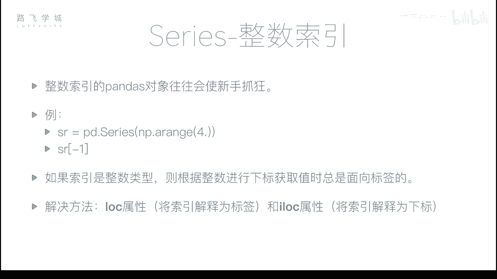
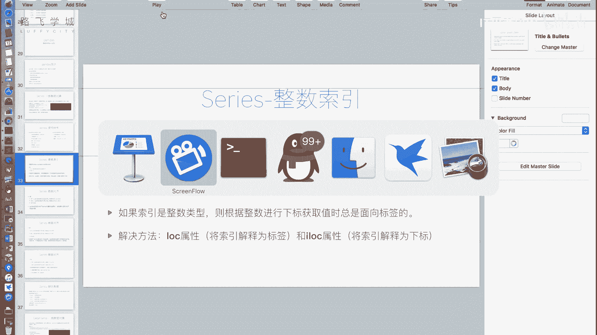
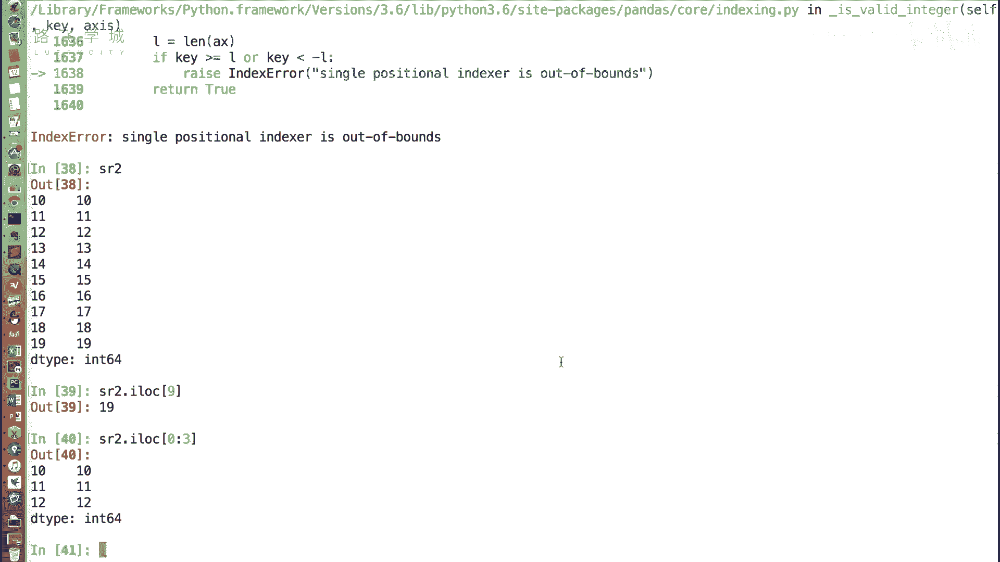
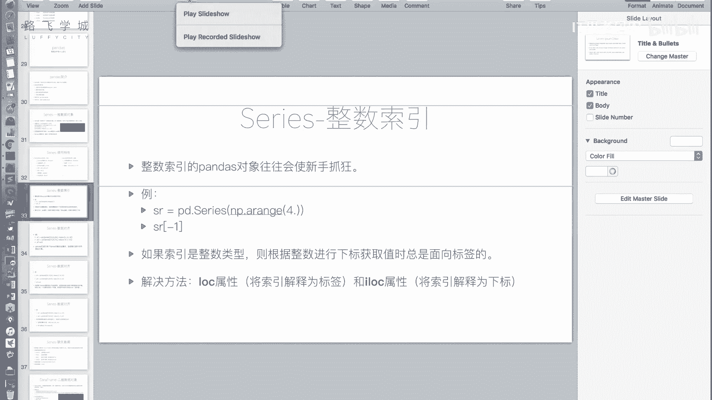

# Python金融分析与量化交易实战教程：P19：Series整数索引问题

在本节课中，我们将要学习Pandas Series对象在使用整数索引时可能遇到的歧义问题，以及如何通过`.loc`和`.iloc`属性来明确指定索引方式，从而避免混淆。

上一节我们介绍了Series的一些基本特性，本节中我们来看看使用整数索引时一个非常重要的注意事项。



## 整数索引的歧义问题



当使用整数作为索引的Pandas对象时，新手常常会感到困惑。这种困惑源于整数索引可能被解释为“标签”或“位置下标”，而Pandas对此有明确的规定。

例如，我们创建一个没有指定索引的Series对象，它会自动生成从0开始的整数索引。

```python
import pandas as pd
import numpy as np

# 创建一个自动生成整数索引的Series
sr = pd.Series(np.arange(20))
print(sr)
```

接下来，我们通过切片创建一个新的Series对象 `sr2`，它包含原Series从索引10开始到最后的部分。

```python
# 通过切片创建新Series
sr2 = sr[10:].copy()
print(sr2)
```

此时，`sr2` 的索引是从10开始的整数。如果我们尝试通过 `sr2[10]` 来取值，就会产生歧义。

以下是两种可能的解释：
*   **解释为标签**：`10` 是索引标签，应返回标签为10的那一行数据。
*   **解释为位置下标**：`10` 是位置（从0开始），应返回第10个位置的数据（即原Series中索引为10的数据）。

实际上，Pandas规定：**当索引是整数时，使用 `sr2[10]` 这种形式，中括号内的值会被强制解释为标签**。因此，`sr2[10]` 返回的是标签为10的数据。如果你想获取最后一个数据（位置下标为9），使用 `sr2[20]` 会报错，因为标签20不存在。

## 解决方案：使用 `.loc` 和 `.iloc`

为了解决这个歧义，Pandas提供了两个明确的属性来区分索引方式。

*   **`.loc[]`**：**基于标签**进行索引。中括号内的值被解释为索引的标签。
*   **`.iloc[]`**：**基于位置**进行索引。中括号内的值被解释为整数位置（从0开始）。

以下是具体使用方法：

```python
# 使用 .loc，明确按标签索引
print(sr2.loc[10])  # 输出标签为10的数据

# 使用 .iloc，明确按位置索引
print(sr2.iloc[9])  # 输出第9个位置（下标为9）的数据，即最后一个数据
```

这两个属性不仅支持单个值索引，也完全支持切片、布尔索引和花式索引等操作，只是明确了索引的基准。

例如，使用位置进行切片：

```python
# 使用 .iloc 按位置切片，获取前3个元素
print(sr2.iloc[0:3])
```

## 核心要点总结



本节课中我们一起学习了Pandas Series整数索引的核心问题与解决方案。

1.  **问题根源**：当Series的索引是整数时，使用 `sr[整数]` 会产生歧义，Pandas默认将其解释为**标签索引**。
2.  **解决方案**：使用 `.loc` 和 `.iloc` 属性来明确索引意图。
    *   **`.loc[]`** 用于**标签索引**。
    *   **`.iloc[]`** 用于**位置索引**。
3.  **最佳实践**：只要涉及到使用整数从Series中选取数据，**强烈建议使用 `.loc` 或 `.iloc`** 来避免潜在的混淆和错误，使代码意图更加清晰。



记住这个简单的规则，就能轻松驾驭Series的整数索引了。