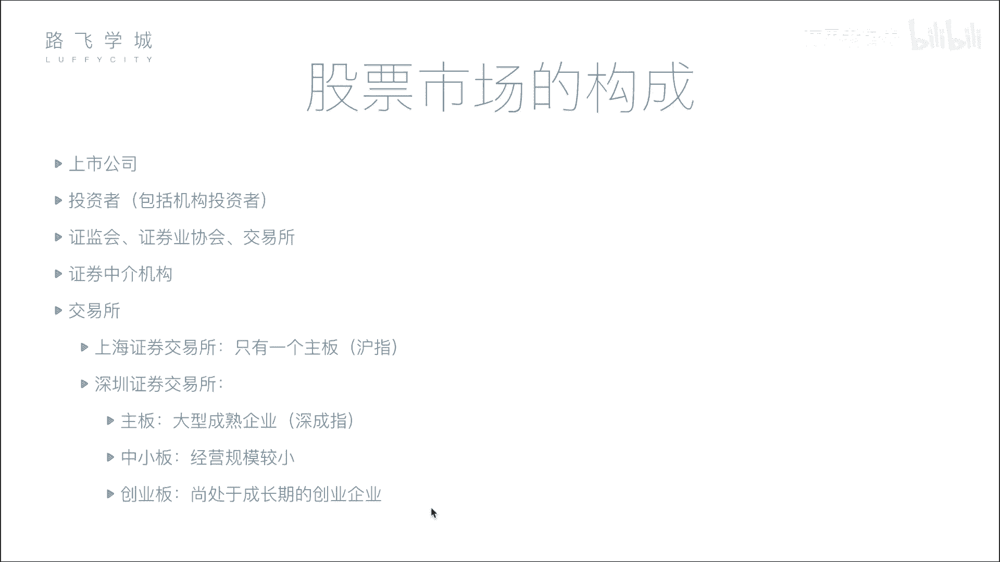
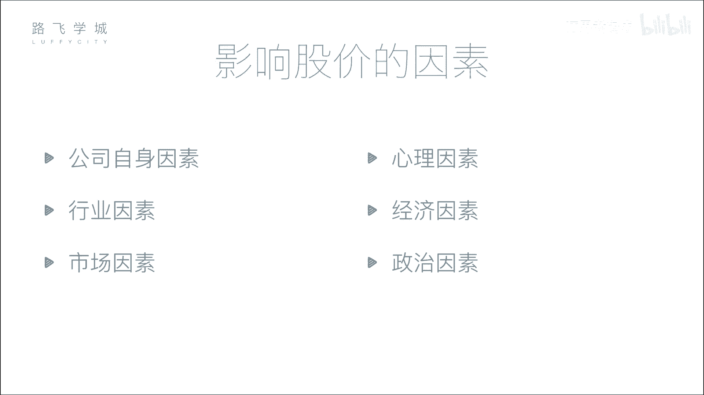

# Python金融量化分析实战：P4：03 金融量化分析-股票市场构成 📈

在本节课中，我们将要学习股票市场的构成。了解市场中有哪些参与者以及他们各自扮演的角色，是进行金融分析和量化交易的基础。我们将从公司和投资者开始，逐步介绍监管机构、交易所和中介机构，最后解释股票指数（大盘）的含义。

## 公司与投资者

上一节我们介绍了股票的分类，本节中我们来看看股票市场的参与者。首先，市场中最核心的两方是公司和投资者。

*   **公司**：需要融资的一方。
*   **投资者**：提供资金的一方。

公司通过发行股票向投资者融资，投资者则通过购买股票进行投资。但是，股票交易并非由公司和投资者直接进行。

## 监管机构与自律组织

为了保证市场的公平、公正，防止暗箱操作，需要有专门的机构进行监管。以下是两个重要的机构：

*   **证监会**：这是证券行业的监管机构，权力很大。公司想要上市，必须向证监会提交各种材料。证监会负责审查公司是否存在欺诈、洗钱等违法行为，并有权决定公司能否上市或将其退市。
*   **证券业协会**：这是一个自律性组织，作用相对较弱。例如，证券从业资格考试就是由它主办的。

## 交易所

交易所为股票交易提供了一个集中的场所。在中国，主要有上海和深圳两家交易所。

在电子化交易之前，投资者需要亲自到交易所的“大房子”里排队进行买卖。现在，所有交易都通过互联网连接到交易所的系统完成。交易所的核心功能是处理来自各方的买卖请求。

## 证券中介机构（券商）

个人投资者通常不能直接向交易所买卖股票。这并非完全禁止，而是因为直接交易的成本太高。这源于历史上的交易模式：交易所向会员出售昂贵的交易席位，只有拥有席位的会员才能入场交易。

*   **历史背景**：富有的会员购买席位后，为了赚回席位费，会代理场外众多小投资者的交易请求。小投资者将资金和指令交给他们，由他们利用席位统一进场交易。
*   **现代券商**：如今，这个角色由**证券中介机构**（俗称券商）承担，例如中信证券、中金公司等。券商在交易所拥有席位，并开发了交易软件（如各券商APP或同花顺）。投资者通过券商的软件提交交易指令，券商再通过其席位将指令传达到交易所执行。

## 交易所板块与股票指数（大盘）

中国有两个主要交易所，每个交易所下又分为不同的板块，以适应不同规模和发展阶段的企业。

*   **上海证券交易所**：主要板块是**主板**。
*   **深圳证券交易所**：分为**主板**、**中小板**和**创业板**。中小板和创业板是为规模较小但成长性好的创业公司提供的融资平台，上市门槛比主板低。

对于每个板块，我们常用一个**指数**来反映其整体表现，这就是常说的“大盘”。

*   **指数含义**：指数反映了该板块内所有股票的综合表现。例如，上海主板的大盘指数是**上证指数（沪指）**，深圳主板的大盘指数是**深证成指（深成指）**。此外，还有**中小板指**和**创业板指**。
*   **作用**：它像是一个“平均值”或“趋势图”，用来快速判断整个市场的行情是向好还是向坏，而不必逐一查看每只股票的涨跌。

---

本节课中我们一起学习了股票市场的基本构成。我们了解了市场的核心参与者（公司、投资者），认识了维护秩序的监管机构（证监会、证券业协会），知道了交易发生的场所（交易所）以及连接个人投资者与交易所的桥梁（券商）。最后，我们明白了“大盘”指数是衡量市场整体走势的重要工具。理解这些基本概念，是后续进行深入金融数据分析与量化策略开发的第一步。