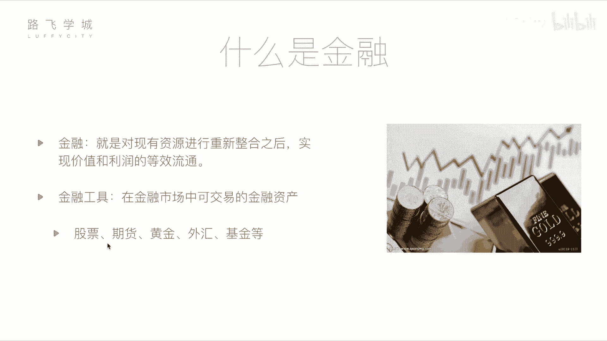

# Python金融量化分析：01：基本金融知识介绍 📈

## 概述
在本节课中，我们将学习金融与量化分析的基础知识。我们将首先了解金融的基本概念，然后介绍几种常见的金融工具，最后重点讲解股票这一核心概念。通过本节内容，你将建立起对金融量化领域的初步认识。

## 什么是金融？
金融是对现有资源进行重新整合后，实现价值和利润等效流通的过程。这个定义可能有些抽象，但通俗地讲，金融涉及资金的流动和增值。金融活动并非都是投机行为，它对国家、企业和个人都有积极作用。

例如，一位拥有闲置资金的投资者，可以将资金投入一家有潜力的创业公司。公司获得发展所需的资金，而投资者在公司成长后获得回报。这个过程促进了经济发展，实现了双赢。这种资金融通的行为就是金融的核心。

## 常见的金融工具
在金融市场中，可交易的金融资产被称为金融工具。以下是几种常见的金融工具：

*   **股票**：代表对一家公司的所有权份额。购买股票意味着成为该公司的股东。
*   **期货**：一种标准化合约，约定在未来某一特定时间，以特定价格买卖某种资产。
*   **黄金**：一种传统的贵金属，常被视为保值和对冲通胀的工具。
*   **外汇**：指不同国家货币之间的兑换交易，其价格表现为汇率。
*   **基金**：由专业基金经理管理，集合众多投资者的资金进行分散投资的一种方式。

## 金融工具详解
上一节我们列举了常见的金融工具，本节中我们来详细了解一下它们各自的特点。

### 期货
期货的风险和潜在收益通常都高于股票。其本质是关于未来商品价格的合约。

**核心机制**：交易双方基于对未来价格走势的不同判断达成协议。例如，发电厂（买方）预计煤炭价格未来会上涨，而煤矿主（卖方）预计价格会下跌。双方可以签订一份期货合约，约定在未来某个时间以当前价格（如每吨10元）交易一定数量的煤炭。

*   如果未来价格上涨至15元，买方以10元买入，相当于节省了成本。
*   如果未来价格下跌至5元，卖方仍能以10元卖出，获得了更高收益。

期货交易通常涉及**保证金**制度，这进一步放大了收益和风险。

### 黄金
黄金的价格相对稳定，是一种常见的保值投资选择。其价值基于稀缺性。

**价格波动原理**：黄金价格受供求关系影响。简单来说，黄金总量（供给）和全球货币总量（需求）之间存在动态平衡。

*   公式：`黄金价格 ∝ 货币总量 / 黄金总量`
*   若发现大型金矿（黄金总量增加），金价可能下跌。
*   若全球央行增发货币（货币总量增加），金价可能上涨。

### 外汇
外汇交易涉及不同货币之间的兑换，利用汇率波动获利。

**汇率波动原因**：汇率反映了两国经济的相对强弱和货币政策。例如，如果中国经济持续高速增长，而货币供应保持稳定，人民币的购买力就会增强，可能导致人民币相对于其他货币升值。

大型投资机构会基于对宏观经济的研究进行外汇交易。对于个人投资者而言，由于汇率日常波动较小，外汇交易的吸引力通常不大。

### 基金
基金为个人投资者提供了借助专业知识的投资渠道。

**运作模式**：投资者将资金交给基金公司，由专业的基金经理进行管理和投资。基金公司会制定投资策略，可能同时投资于股票、债券、期货等多种资产以分散风险。

*   优势：由专业人士管理，分散投资降低风险。
*   代价：收益的一部分会作为管理费用支付给基金公司，因此整体收益可能低于直接投资，但风险也相对更低。

## 核心工具：股票
在介绍了多种金融工具后，我们将聚焦于本课程的核心——股票。股票是公司所有权的证明，也是量化分析中最常见的研究对象。

购买一家公司的股票，就意味着成为了该公司的部分所有者（股东）。股票的价值随着公司经营状况和市场情绪波动，投资者通过股价的涨跌获取收益或承担损失。我们后续的量化分析课程，将主要围绕如何利用Python程序对股票数据进行分析和交易决策展开。

## 总结
本节课我们一起学习了金融的基本概念，了解了期货、黄金、外汇、基金等几种重要金融工具的特点和运作原理，并明确了股票作为本课程核心研究对象的地位。理解这些基础知识，是后续我们使用Python进行金融量化分析与实战的坚实基础。