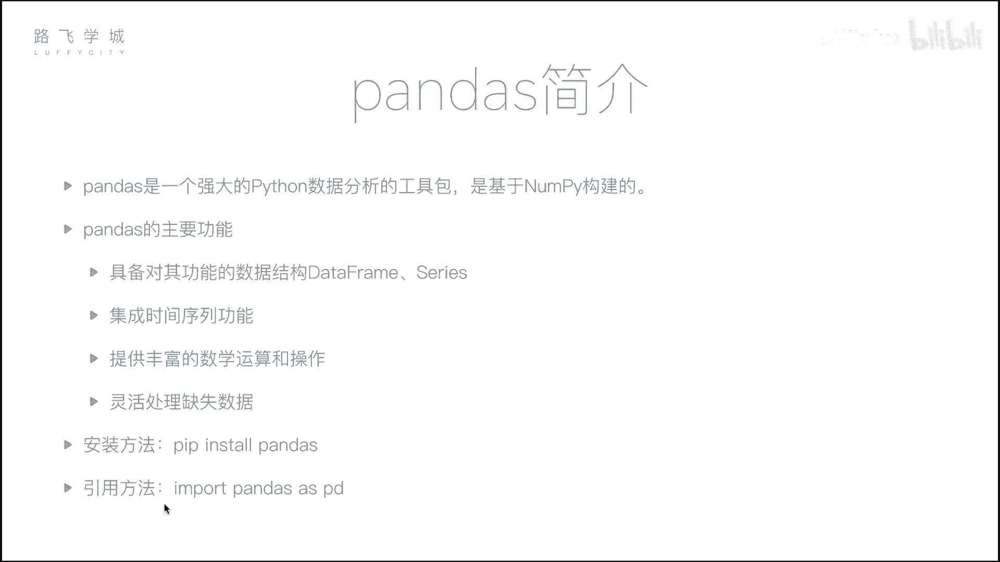
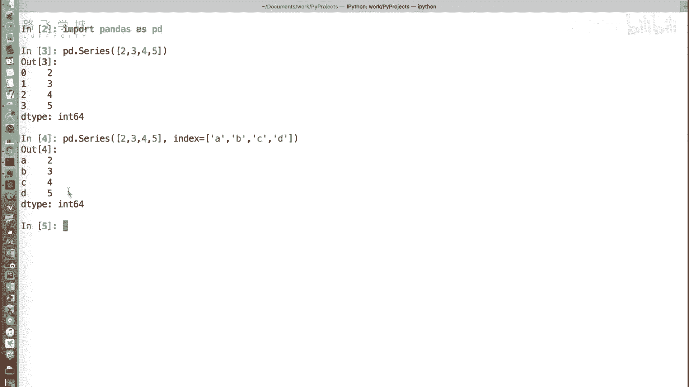
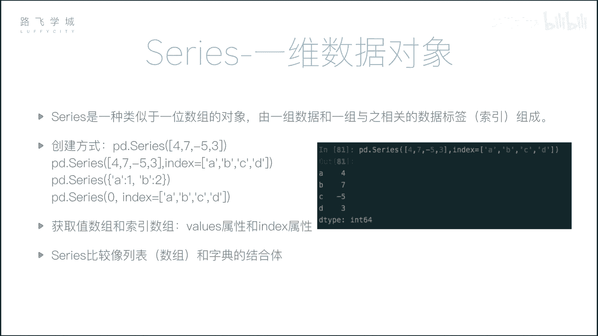
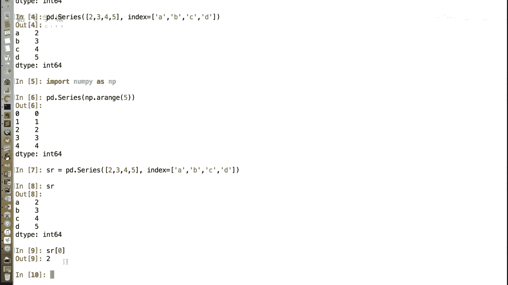
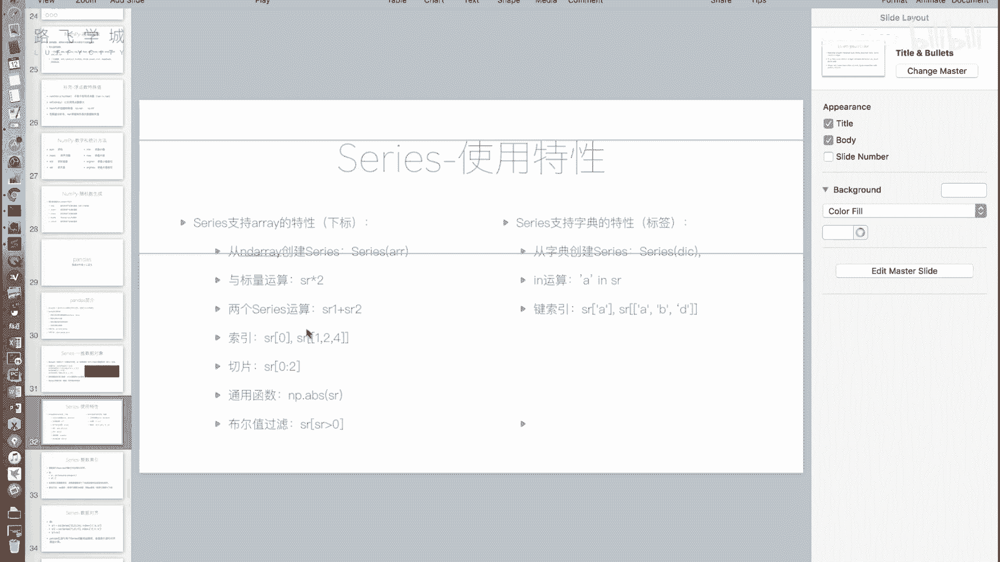
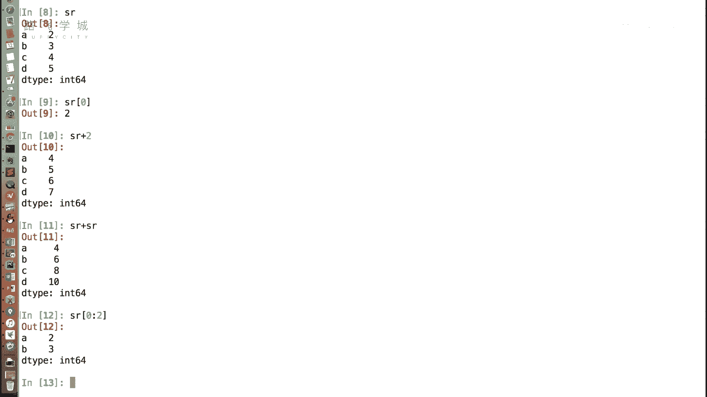
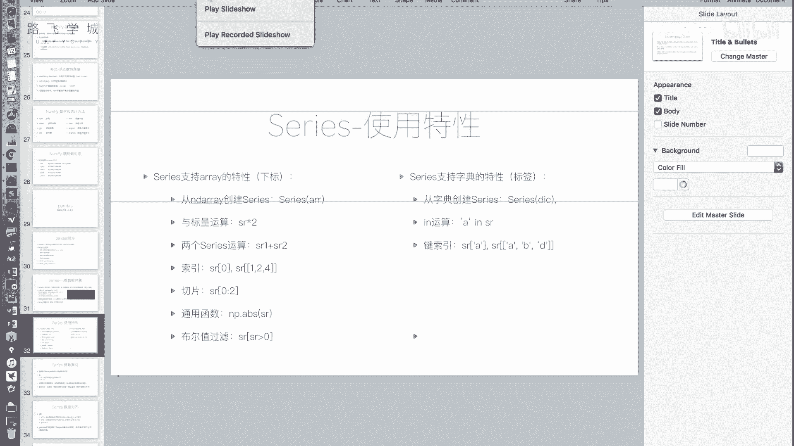
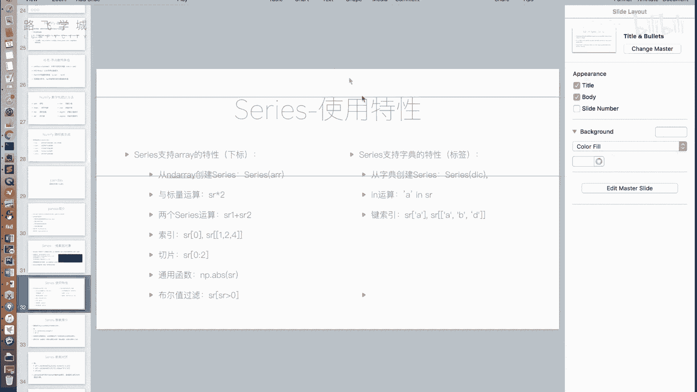
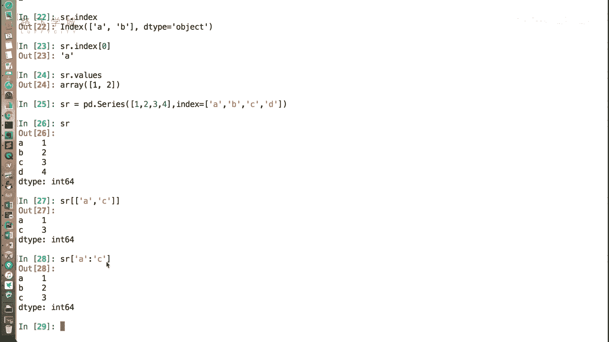

# Python金融量化分析：P17：Series介绍 📊

## 概述
在本节课中，我们将要学习Pandas库中的第一个核心数据结构——**Series**。Series是构建Pandas数据分析能力的基础，理解它对于后续学习DataFrame至关重要。

上一节我们介绍了NumPy，它是一个强大的数值计算基础包。本节中我们来看看基于NumPy构建的、在数据分析领域应用更广泛的Pandas库。Pandas封装层级更高，是数据分析工作无法绕开的工具。



Pandas的主要功能包括：
*   提供两种核心数据结构：**DataFrame**和**Series**。
*   集成了时间序列处理功能。
*   提供了丰富的数学运算和灵活处理缺失数据的能力。


其安装方法简单，使用`pip install pandas`即可。官方建议的导入方式如下：

```python
import pandas as pd
```





---

## Series：一维带标签数组

Series是一种类似于一维数组的对象，可以将其理解为**数组与字典的结合体**。





### 创建Series对象
创建Series的基本方法是使用`pd.Series()`。

以下是创建Series的几种方式：

**1. 从列表创建**
传入一个列表，Pandas会自动生成整数索引（0, 1, 2...）。





```python
import pandas as pd
s = pd.Series([2, 3, 4, 5])
```

**2. 指定索引（标签）创建**
通过`index`参数，可以为数据指定自定义的标签，此时Series的表现形式类似于字典（键值对）。

```python
s = pd.Series([2, 3, 4, 5], index=['a', 'b', 'c', 'd'])
```

**3. 从字典创建**
直接传入一个字典，字典的键（key）会自动成为Series的索引（标签）。

```python
s = pd.Series({'a': 2, 'b': 3, 'c': 4})
```

### Series的数组（列表）特性
Series继承了许多NumPy数组或Python列表的特性，使其能进行高效的向量化运算。




以下是Series支持的数组类操作：

*   **下标访问**：即使指定了自定义标签，依然可以通过原始整数位置进行访问。`s[0]` 可以访问第一个元素。
*   **向量化运算**：可以与标量（单个数字）进行运算，也可以在两个相同大小的Series之间进行逐元素运算（加、减、乘、除、比较等）。
    ```python
    s * 2  # 所有元素乘以2
    s + s  # 两个相同Series对应位置相加
    ```
*   **切片**：与列表切片语法一致。`s[0:2]` 会取出前两个元素。
*   **通用函数**：支持NumPy的通用函数，如取绝对值、最大值、最小值等。
*   **布尔索引**：可以通过布尔条件进行数据筛选。
    ```python
    s[s > 3]  # 筛选出值大于3的元素
    ```

### Series的字典特性
Series也融合了字典的一些便捷特性，允许通过标签进行数据访问和操作。

以下是Series支持的字典类操作：

*   **标签访问**：通过自定义的索引标签来获取值。`s['a']` 可以获取标签为`'a'`的值。
*   **`in`操作**：用于判断某个标签是否存在于Series的索引中。
    ```python
    'a' in s  # 返回 True
    'z' in s  # 返回 False
    ```
*   **花式索引与切片**：可以通过一个标签列表进行批量查询，也支持按标签切片。
    ```python
    s[['a', 'c']]  # 获取标签'a'和'c'对应的值
    s['a':'c']     # 获取从标签'a'到'c'的所有值（注意：标签切片是“前包后也包”的）
    ```
*   **获取索引与值**：可以通过`.index`和`.values`属性分别获取索引对象和数据值（NumPy数组）。
    ```python
    s.index   # 输出索引，如 Index(['a', 'b', 'c'], dtype='object')
    s.values  # 输出值数组，如 array([2, 3, 4])
    ```
*   **遍历**：直接对Series进行`for`循环，迭代的是它的**值**，而不是索引。这与遍历字典（得到键）不同。



---

## 总结
本节课中我们一起学习了Pandas的核心数据结构**Series**。我们了解到：
1.  Series是一个**一维带标签的数组**，融合了数组的高效运算和字典的灵活访问特性。
2.  可以通过列表、字典等方式创建Series，并能自定义索引。
3.  它支持类似数组的下标访问、向量化运算和切片，也支持类似字典的标签访问、成员判断和花式索引。
4.  Series的`.index`和`.values`属性用于分别获取其索引和数值。

Series为处理单列数据提供了极大的便利，例如存储一支股票每日的收盘价时，既可以用日期作为标签快速查询某一天的价格，也可以用整数位置进行切片分析历史区间。它是构建更复杂表格型数据DataFrame的基石。下一节，我们将学习功能更强大的二维数据结构——DataFrame。