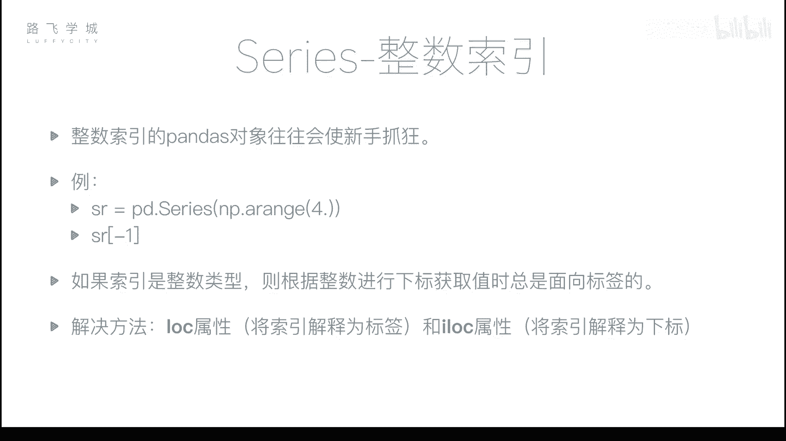
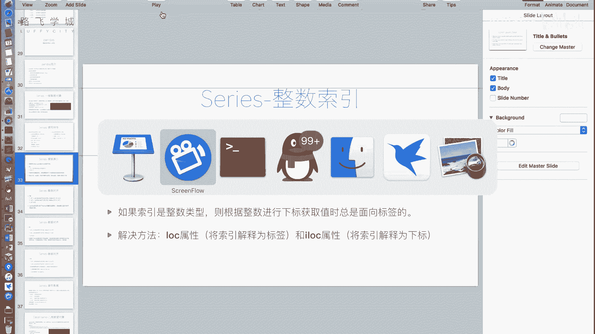
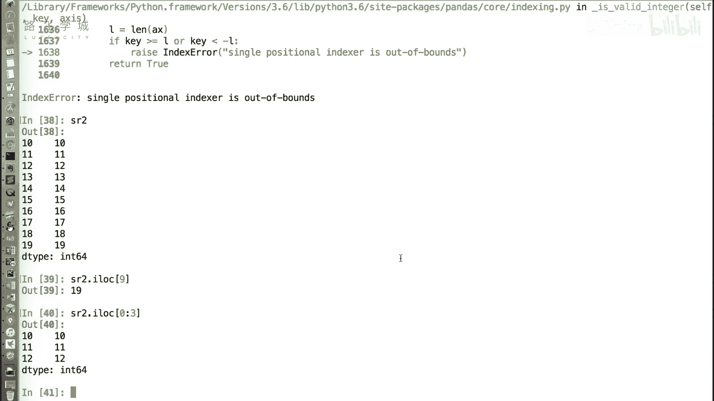
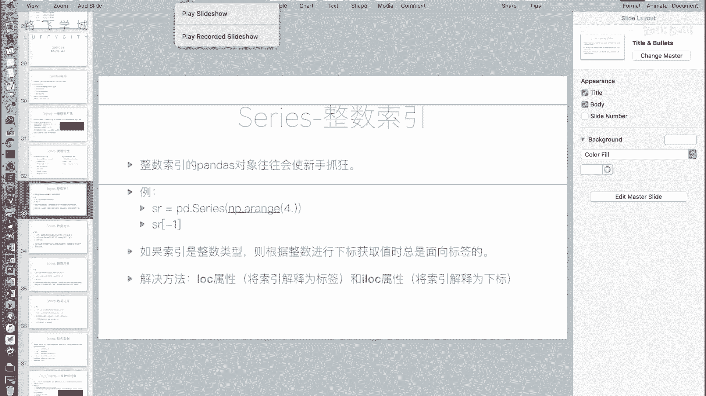

# Python金融量化分析：P18：Series整数索引问题详解 🐍

在本节课中，我们将要学习Pandas Series对象在使用整数索引时的一个关键注意事项。这个问题常常让初学者感到困惑，我们将通过清晰的解释和示例，帮助你理解其原理并掌握正确的解决方法。



## 整数索引的歧义问题

上一节我们介绍了Series的一些基本特性，本节中我们来看看Series对象使用整数索引时可能遇到的问题。



当你使用整数索引的Pandas对象时，可能会遇到意想不到的行为。整数索引意味着Series的索引标签本身就是整数。

例如，我们创建一个没有指定索引的Series对象，它会自动生成从0开始的整数索引。

```python
import pandas as pd
import numpy as np

# 创建一个自动生成整数索引的Series
sr = pd.Series(np.arange(20))
print(sr)
```

输出结果将显示索引从0到19。接下来，我们通过切片创建一个新的Series对象。

```python
# 通过切片创建新Series，索引从10开始
sr2 = sr[10:].copy()
print(sr2)
```

此时，`sr2`的索引是10到19。如果我们尝试通过`sr2[10]`来获取值，问题就出现了。这个`10`可能被解释为标签（即索引为10的那一行），也可能被解释为位置下标（即第10个元素，从0开始计数）。在Pandas中，当索引是整数时，中括号`[]`内的值**总是被解释为标签**。因此，`sr2[10]`会尝试寻找标签为10的行，并返回其值。然而，如果你想获取最后一个元素而使用`sr2[20]`，则会因为标签不存在而报错。

## 解决方案：loc与iloc属性

为了解决整数索引的歧义问题，Pandas提供了两个明确的属性：`.loc`和`.iloc`。

以下是这两个属性的核心区别：
*   **`.loc[]`**：**基于标签**进行索引。中括号内的值被强制解释为索引标签。
*   **`.iloc[]`**：**基于位置**进行索引。中括号内的值被强制解释为整数位置下标（从0开始）。

让我们通过代码示例来理解它们的用法。

```python
# 使用 .loc，将10解释为标签
value_by_label = sr2.loc[10]
print(f"使用.loc[10]（标签）获取的值是: {value_by_label}")

# 使用 .iloc，将0解释为位置下标（第一个元素）
value_by_position = sr2.iloc[0]
print(f"使用.iloc[0]（位置）获取的值是: {value_by_position}")
```

`.loc`和`.iloc`不仅支持单个值的获取，也完全支持切片、布尔索引和花式索引等操作，只是明确指定了索引的依据。

例如，使用`.iloc`进行切片：

```python
# 使用.iloc进行位置切片，获取前3个元素
first_three = sr2.iloc[0:3]
print("使用.iloc[0:3]切片的结果:")
print(first_three)
```

## 核心要点总结



本节课中我们一起学习了Pandas Series整数索引的核心问题与解决方案。

1.  **问题根源**：当Series的索引是整数时，使用`series[key]`语法会产生歧义，Pandas统一将其解释为**标签索引**。
2.  **解决方案**：使用`.loc`和`.iloc`属性来明确索引意图。
    *   使用 **`series.loc[]`** 进行明确的**标签索引**。
    *   使用 **`series.iloc[]`** 进行明确的**位置索引**。
3.  **最佳实践**：只要涉及到整数索引，为了代码清晰且避免错误，建议始终使用`.loc`或`.iloc`来替代简单的`[]`索引。



掌握这一区别，能让你在数据选取操作中更加得心应手，避免因索引歧义导致的程序错误。