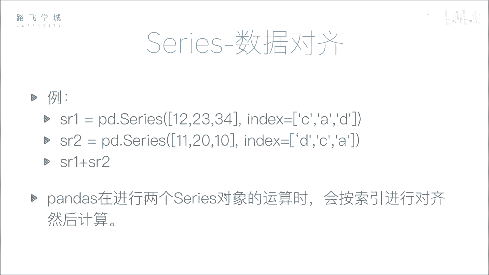
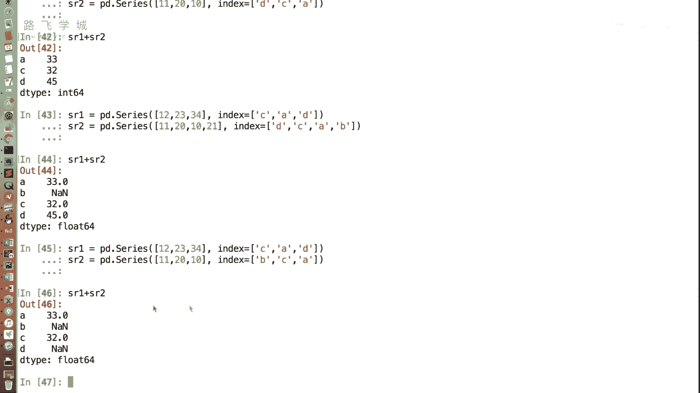
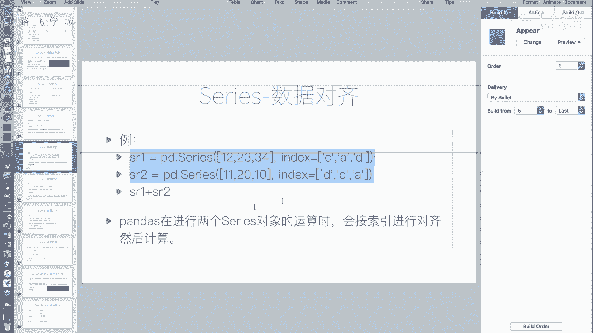
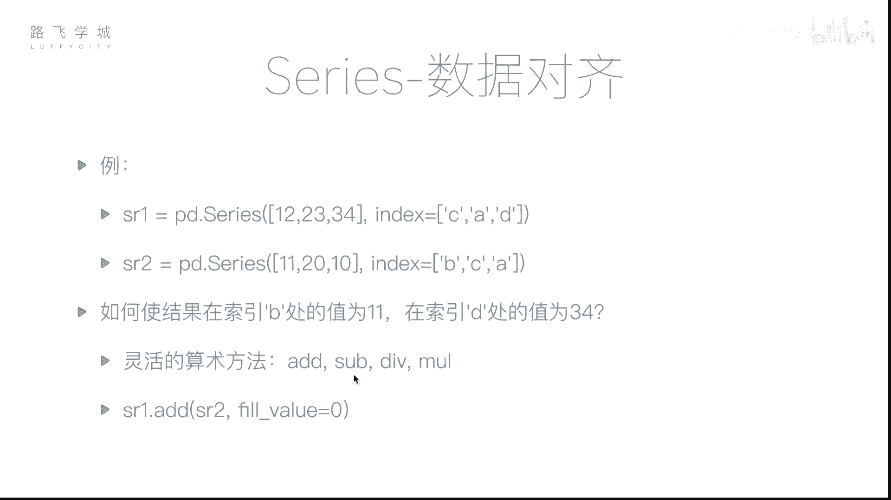
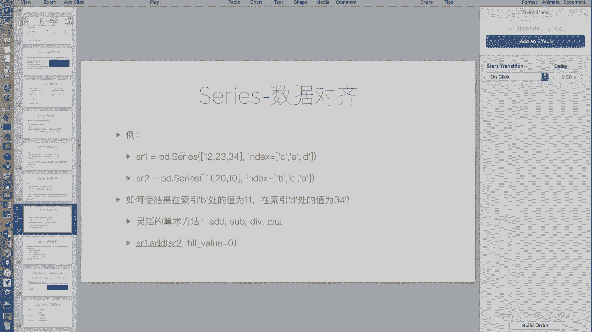
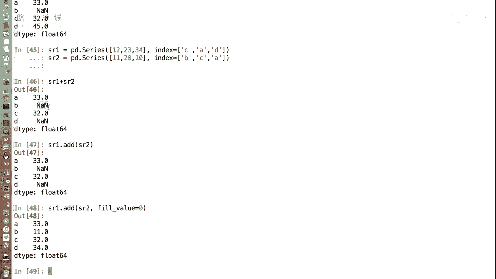

# Python金融量化与股票分析：P19：Series数据对齐 📊

在本节课中，我们将要学习Pandas中Series对象一个非常重要的特性：数据对齐。数据对齐是Pandas进行数据运算的基础，它允许我们根据索引标签而非位置顺序来组合数据，这在处理金融时间序列等实际数据时非常有用。

上一节我们介绍了Series的基本操作，本节中我们来看看数据对齐的具体机制和效果。

## 数据对齐的概念

在Pandas中，当对两个Series对象进行算术运算（如加法）时，运算不是简单地按照它们在数组中的位置（下标）进行，而是按照它们的索引标签进行匹配对齐。这意味着，只要两个Series拥有相同的索引标签，无论它们在各自对象中的顺序如何，对应的值都会被正确地组合运算。

## 数据对齐示例



以下是数据对齐的一个基础示例。我们创建两个索引顺序不同但标签有重叠的Series对象。


```python
import pandas as pd

# 创建两个Series对象
sr1 = pd.Series([12, 23, 34], index=[‘C‘, ‘A‘, ‘D‘])
sr2 = pd.Series([11, 20, 10], index=[‘D‘, ‘C‘, ‘A‘])

# 执行加法运算
result = sr1 + sr2
print(result)
```

执行上述代码后，结果将是：
*   **A**: 23 + 10 = 33
*   **C**: 12 + 20 = 32
*   **D**: 34 + 11 = 45

可以看到，运算是根据标签‘A‘、‘C‘、‘D‘进行对齐后计算的，完全不受原始顺序（C, A, D 和 D, C, A）的影响。这个功能非常强大，它使得我们在合并不同来源或不同时期的数据时，无需预先进行繁琐的排序操作。

## 处理索引长度不一致的情况

在实际应用中，我们经常会遇到两个Series索引不完全一致的情况。Pandas处理这种情况的方式是：只对两个Series共有的索引标签进行运算，对于仅存在于一个Series中的索引，其结果会被标记为缺失值（NaN）。

以下是当两个Series索引长度不一致时的运算结果。

```python
# sr1的索引为 [‘A‘, ‘C‘, ‘D‘]
# sr2的索引为 [‘A‘, ‘B‘, ‘C‘]
sr1_new = pd.Series([23, 12, 34], index=[‘A‘, ‘C‘, ‘D‘])
sr2_new = pd.Series([10, 11, 20], index=[‘A‘, ‘B‘, ‘C‘])

result_new = sr1_new + sr2_new
print(result_new)
```

运算结果中：
*   **A** (23+10) 和 **C** (12+20) 会得到正常数值。
*   **B** 只存在于sr2中，**D** 只存在于sr1中，因此这两个位置的结果都是 `NaN`（Not a Number，在Pandas中代表缺失值）。

## 使用灵活算术方法填充缺失值

直接使用 `+`、`-`、`*`、`/` 运算符在遇到缺失值时会产生NaN。但有时我们希望用特定值（如0）来填充这些缺失位置后再进行计算。Pandas提供了 `.add()`, `.sub()`, `.mul()`, `.div()` 等灵活的算术方法来实现这一需求。

以下是使用 `.add()` 方法并填充缺失值为0的示例。



```python
# 使用add方法，并设置fill_value参数
filled_result = sr1_new.add(sr2_new, fill_value=0)
print(filled_result)
```



运算逻辑变为：
*   共有的标签 **A**, **C** 正常相加。
*   **B** 在sr1中缺失，用0填充，因此 B = 0 + 11 = 11。
*   **D** 在sr2中缺失，用0填充，因此 D = 34 + 0 = 34。





这种方法在诸如计算员工多月累计出勤、加总不同时期财务报表等场景中非常实用。

## 本节总结

本节课中我们一起学习了Series的数据对齐特性。我们了解到：
1.  Pandas的运算基于索引标签对齐，而非数据位置，这大大提升了数据操作的灵活性。
2.  当两个Series索引不一致时，运算会产生缺失值 `NaN`。
3.  我们可以使用 `.add()` 等算术方法，并通过 `fill_value` 参数来控制缺失值的填充逻辑，从而得到符合业务需求的计算结果。



数据对齐是Pandas高效处理表格数据的核心机制之一。对齐后产生的缺失值是需要我们重点关注和处理的数据问题。在接下来的课程中，我们将专门讲解如何处理这些缺失值。