# Python金融量化与股票分析：P20：Series缺失值处理 📊

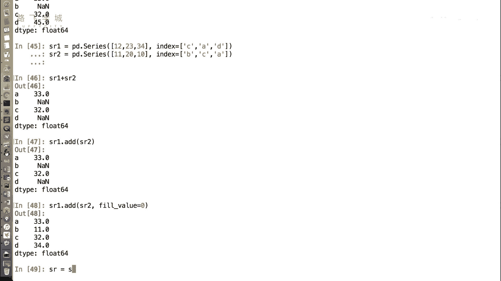

在本节课中，我们将要学习如何处理Pandas Series中的缺失值。缺失值是数据分析中常见的问题，有效处理它们对于后续的计算和可视化至关重要。

上一节我们介绍了Series的基本概念和创建方法，本节中我们来看看如何处理Series中可能出现的缺失数据。

## 识别缺失值

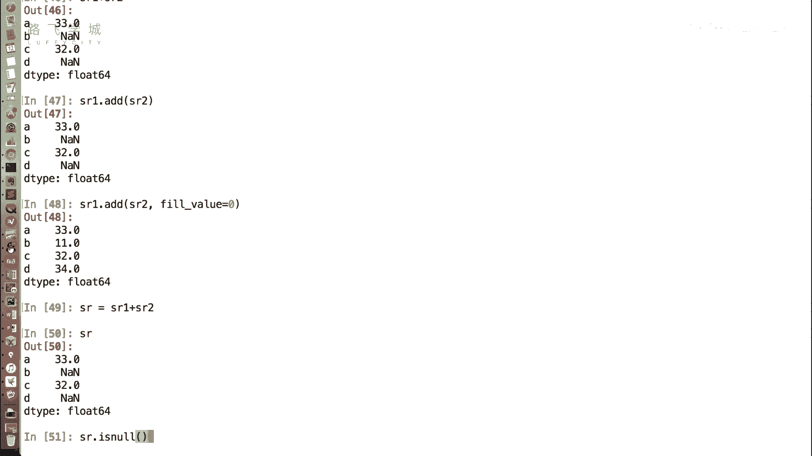

首先，我们需要能够识别Series中的缺失值。在Pandas中，缺失值通常用`NaN`（Not a Number）表示。

以下是判断Series中每个元素是否为缺失值的函数：

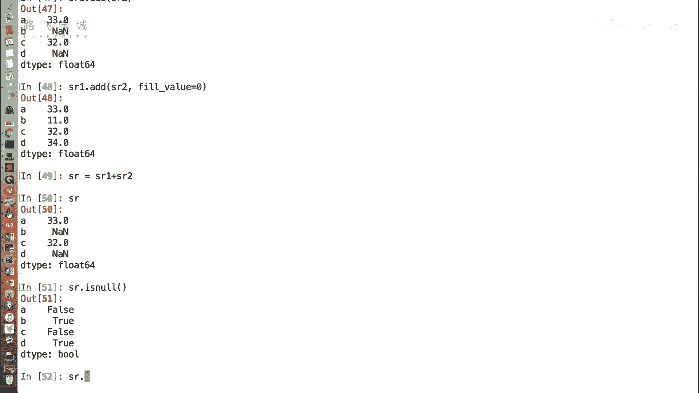

*   `sr.isnull()`：如果元素是缺失值（`NaN`），则返回`True`；否则返回`False`。
*   `sr.notnull()`：与`isnull()`相反，如果元素**不是**缺失值，则返回`True`；否则返回`False`。

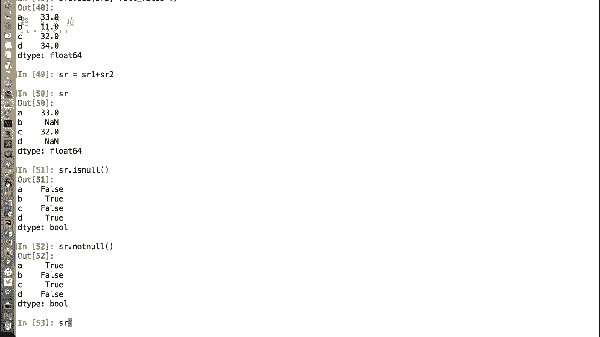

这两个函数返回的是一个布尔类型的Series，可以用于后续的筛选操作。

## 处理缺失值的方法

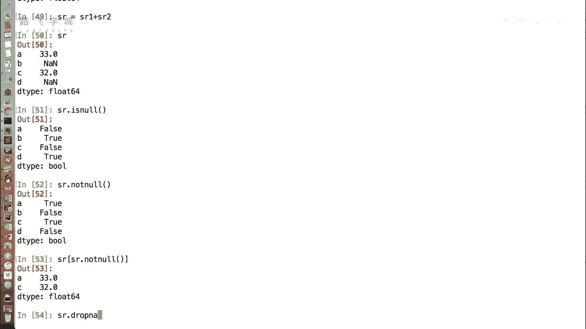

识别出缺失值后，我们主要有两种处理思路：删除或填充。

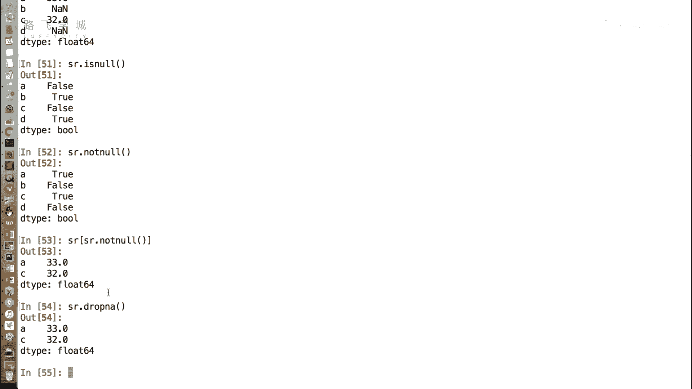

### 方法一：删除缺失值

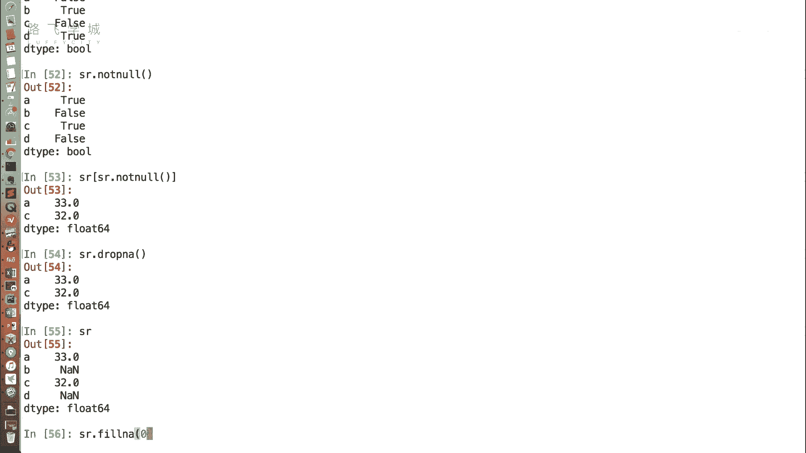

如果缺失值数量不多，或者缺失行对整个分析影响不大，我们可以选择直接删除包含缺失值的行。

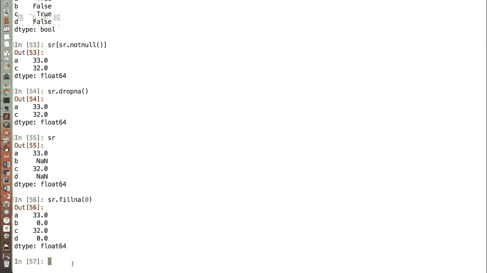

以下是删除缺失值的相关操作：

*   **基于布尔索引筛选**：利用`sr.notnull()`的结果进行筛选，只保留非缺失值。
    ```python
    sr_filtered = sr[sr.notnull()]
    ```
*   **使用专用函数**：Pandas提供了`dropna()`函数来直接删除缺失值。
    ```python
    sr_dropped = sr.dropna()
    ```

**注意**：无论是筛选还是使用`dropna()`，原始Series`sr`本身不会被修改，操作结果需要赋值给一个新变量来保存。

### 方法二：填充缺失值

如果直接删除数据会导致信息损失过多，或者我们希望保持数据集的连续性，可以选择填充缺失值。

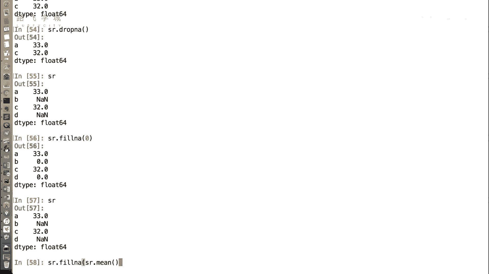

填充缺失值使用`fillna()`函数。我们可以根据业务逻辑，将缺失值填充为特定的值。

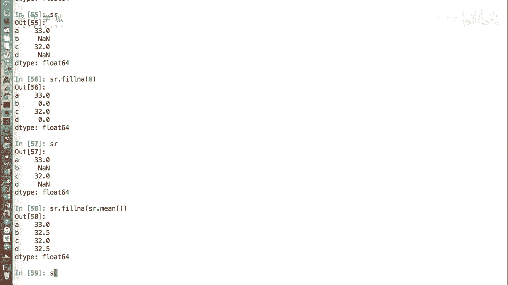

以下是几种常见的填充方式：

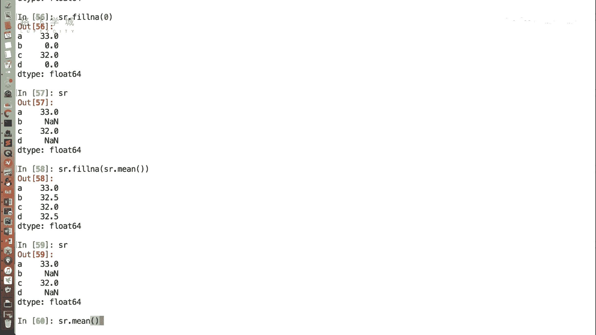

*   **填充为固定值**：例如，将所有缺失值填充为0。
    ```python
    sr_filled_zero = sr.fillna(0)
    ```
*   **填充为统计值**：更常见的方法是填充为该Series的统计量，如平均值（`mean`）。这样做的好处是，填充后的数据不会过分扭曲整体的分布趋势。
    ```python
    sr_filled_mean = sr.fillna(sr.mean())
    ```
    **一个重要特性**：Pandas的`mean()`等统计函数在计算时会自动忽略`NaN`值，这为我们的填充操作提供了便利。

**再次注意**：`fillna()`函数同样不会修改原Series，需要将结果赋值保存。

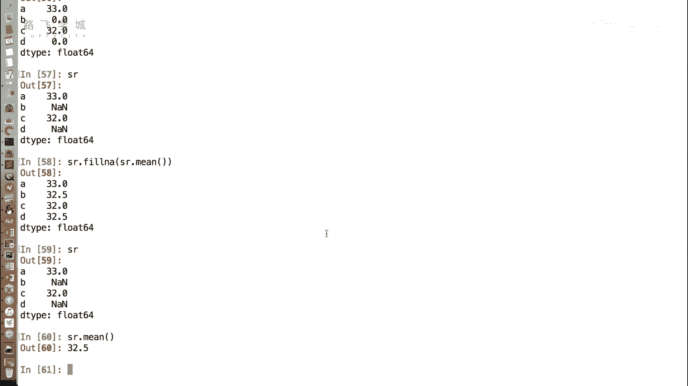

本节课中我们一起学习了如何处理Pandas Series中的缺失值。我们掌握了两种核心方法：使用`dropna()`删除缺失值，以及使用`fillna()`并配合统计函数（如`mean()`）来填充缺失值。理解并熟练运用这些方法，是进行数据清洗、保证分析结果可靠性的重要基础。