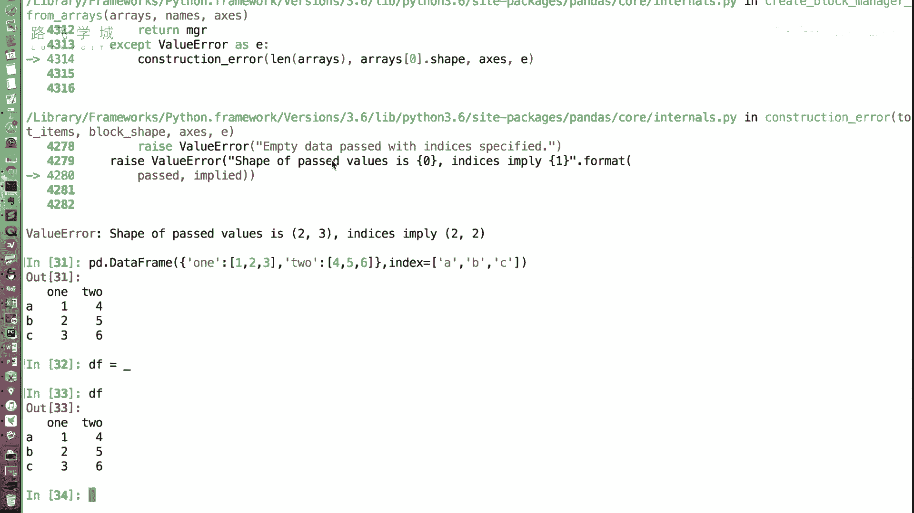
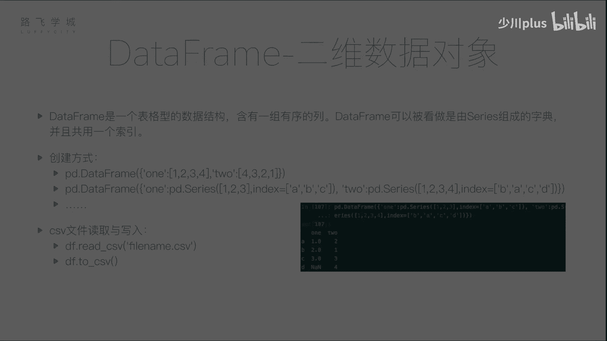

# Python金融量化分析：P22：DataFrame的创建 📊

## 概述
在本节课中，我们将要学习Pandas库中的核心数据结构之一：**DataFrame**。上一节我们介绍了Series，它是一种一维数据结构。本节中我们来看看DataFrame，它是一种二维的、表格型的数据结构，类似于Excel表格，是进行数据分析的基础。

## 什么是DataFrame？
DataFrame是一个二维的、表格型的数据结构，包含一组有序的列。它可以看作是由多个Series组成的字典，并且这些Series共享同一个行索引。DataFrame是处理金融数据、表格数据的核心工具。

## DataFrame的创建方法
DataFrame有多种创建方式，以下是两种常见的方法。

### 1. 从字典创建
可以从一个字典创建DataFrame，字典的键将成为列名，字典的值（列表）将成为对应列的数据。

**代码示例：**
```python
import pandas as pd

# 创建一个字典，键为列名，值为列表数据
data = {
    ‘one‘: [1, 2, 3],
    ‘two‘: [4, 5, 6]
}





# 使用pd.DataFrame()函数创建DataFrame
df = pd.DataFrame(data)
print(df)
```
执行上述代码，将创建一个两列的DataFrame。如果没有指定行索引（`index`），Pandas会自动生成从0开始的整数索引。

如果想指定行索引，可以使用`index`参数。

**代码示例：**
```python
df = pd.DataFrame(data, index=[‘a‘, ‘b‘, ‘c‘])
print(df)
```

### 2. 从Series字典创建
DataFrame也可以由多个Series组成的字典来创建。当各个Series的索引不完全相同时，Pandas会自动按索引标签对齐数据，缺失的位置会用`NaN`（Not a Number）填充。

**代码示例：**
```python
# 创建两个具有不同索引的Series
s1 = pd.Series([1, 2, 3], index=[‘a‘, ‘b‘, ‘c‘])
s2 = pd.Series([4, 5, 6, 7], index=[‘b‘, ‘a‘, ‘c‘, ‘d‘])

# 用Series字典创建DataFrame
df2 = pd.DataFrame({‘col1‘: s1, ‘col2‘: s2})
print(df2)
```
在这个例子中，`col1`列在`d`索引处没有值，因此显示为`NaN`。这个自动对齐功能在处理现实世界中不规整的数据时非常有用。

## 从文件读取DataFrame
在实际项目中，我们很少手动创建大量数据，更多的是从外部文件（如CSV、Excel）读取数据。Pandas提供了强大的文件读取功能。

### 读取CSV文件
CSV（逗号分隔值）是一种常见的表格数据存储格式。使用`pd.read_csv()`函数可以轻松读取CSV文件并创建DataFrame。

假设我们有一个名为`test.csv`的文件，内容如下：
```
A,B,C
1,2,3
4,5,6
7,8,9
```

**代码示例：**
```python
# 从CSV文件读取数据
df_from_file = pd.read_csv(‘test.csv‘)
print(df_from_file)
```
默认情况下，`read_csv`会将文件的第一行作为列名（`header=0`），并自动生成行索引。

### 写入CSV文件
将DataFrame保存到CSV文件同样简单，使用`.to_csv()`方法即可。

**代码示例：**
```python
# 将DataFrame保存为新的CSV文件
df.to_csv(‘saved_data.csv‘, index=False)  # index=False表示不将行索引写入文件
```
Pandas还支持读取和写入多种其他格式，如JSON、Excel、HTML等，我们将在后续课程中详细介绍。


## 总结
本节课中我们一起学习了Pandas DataFrame的创建。我们首先了解了DataFrame作为二维表格结构的基本概念。然后，我们探讨了两种手动创建DataFrame的方法：从字典创建和从Series字典创建。最后，我们介绍了最实用的数据获取方式——从CSV文件读取和写入DataFrame，这是金融数据分析中数据准备的关键步骤。掌握这些基础创建方法，是后续进行数据操作、分析和可视化的前提。