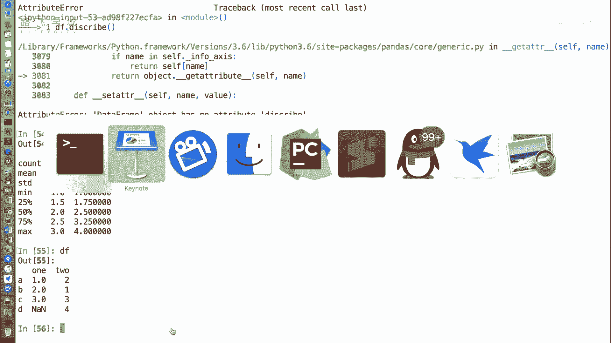
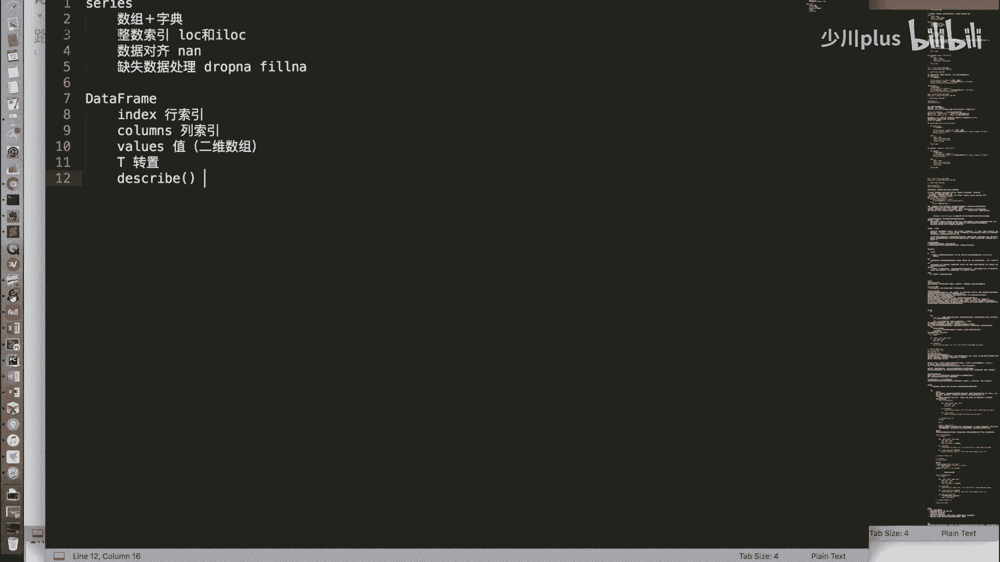
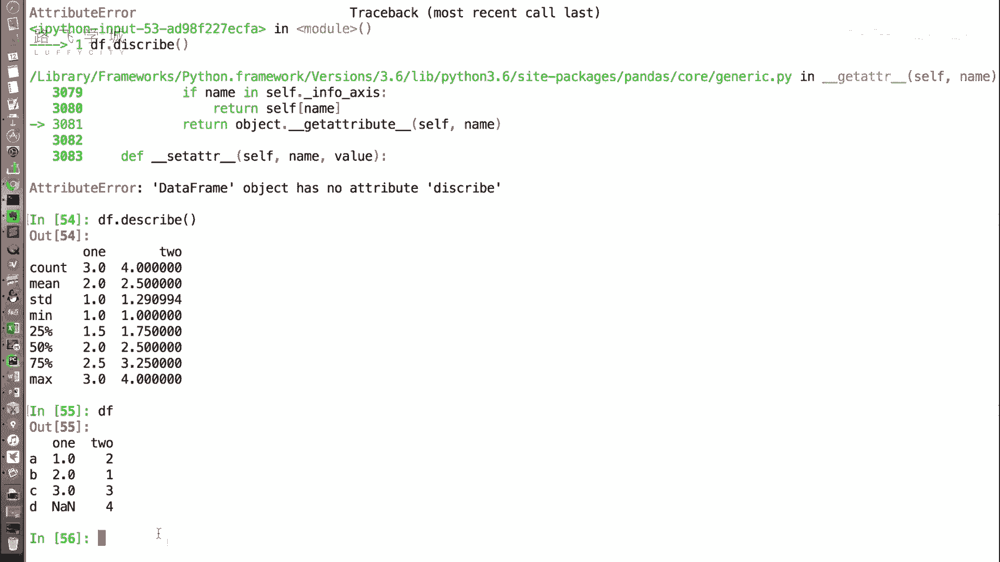

# Python金融量化分析：P23：DataFrame常用属性 📊

在本节课中，我们将学习Pandas中`DataFrame`对象的一些常用属性。这些属性可以帮助我们快速查看和了解数据的基本结构，例如行索引、列索引、数据值以及一些统计摘要。

上一节我们介绍了`DataFrame`对象的几种创建方式，本节中我们来看看它有哪些关键的属性。

## 行索引与值

和`Series`对象类似，`DataFrame`也有`index`和`values`属性。

*   `index`属性用于获取`DataFrame`的行索引，即数据最左侧的索引标签。
*   `values`属性用于获取`DataFrame`中的数据值。但与`Series`返回一维数组不同，`DataFrame`的`values`返回的是一个二维数组，其中每一行是一个一维数组。

以下是相关代码示例：
```python
# 假设 df 是一个已创建的 DataFrame
print(df.index)   # 输出行索引，例如 Index(['A', 'B', 'C', 'D'], dtype='object')
print(df.values)  # 输出一个二维数组，包含所有数据值
```

## 转置与列索引

由于`DataFrame`是二维结构，它比`Series`多了一个列索引，并提供了转置功能。

*   `T`属性用于获取`DataFrame`的转置，即交换数据的行和列。
*   `columns`属性用于获取`DataFrame`的列索引，即数据顶部的列名标签。

以下是相关代码示例：
```python
print(df.T)        # 输出转置后的 DataFrame，行变列，列变行
print(df.columns)  # 输出列索引，例如 Index(['one', 'two'], dtype='object')
```
**注意**：在转置或数据操作过程中，如果一列中同时存在整数和浮点数（包括NaN），Pandas可能会将整列统一为浮点数类型，因为浮点数可以表示整数，反之则不行。如需转换数据类型，可以使用`astype`方法。

## 数据描述统计

`describe()`方法虽然不是属性，但非常实用。它可以快速生成`DataFrame`中数值列的描述性统计摘要。



以下是`describe()`方法返回的主要统计信息：
*   **count**：非空值的数量。
*   **mean**：平均值。
*   **std**：标准差。
*   **min**：最小值。
*   **25%**：第一四分位数。
*   **50%**：中位数。
*   **75%**：第三四分位数。
*   **max**：最大值。



以下是相关代码示例：
```python
print(df.describe())  # 输出各数值列的统计摘要
```



本节课中我们一起学习了`DataFrame`的几个核心属性与方法。我们了解了如何通过`index`和`columns`查看数据的结构，通过`values`获取原始数据数组，通过`T`属性进行转置操作，以及如何使用`describe()`方法快速获取数据的统计摘要。掌握这些基础属性是进行后续数据操作和分析的重要前提。