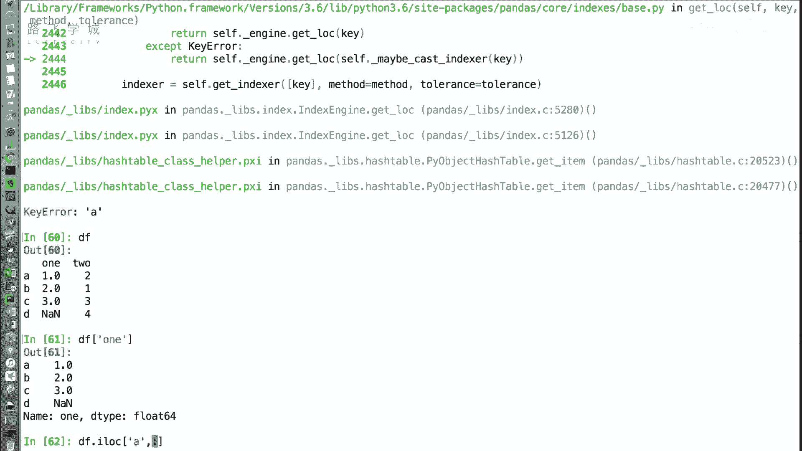
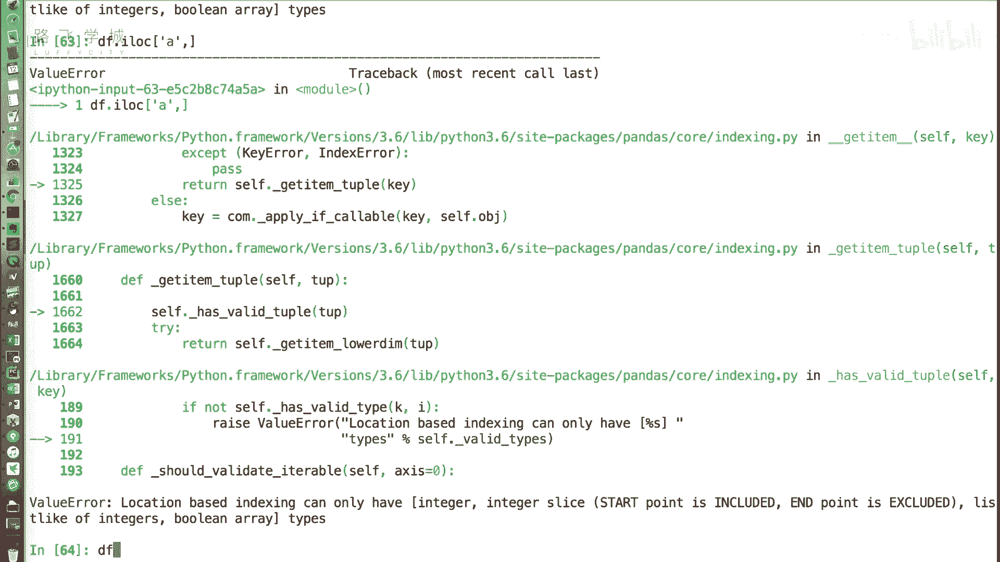
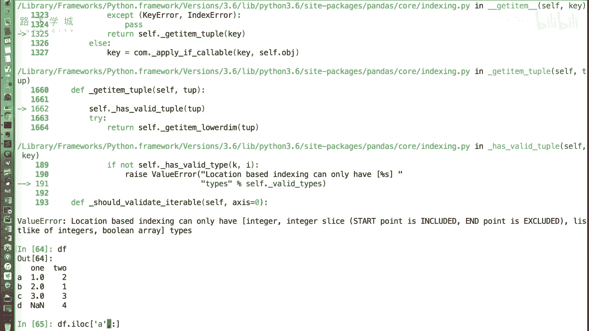
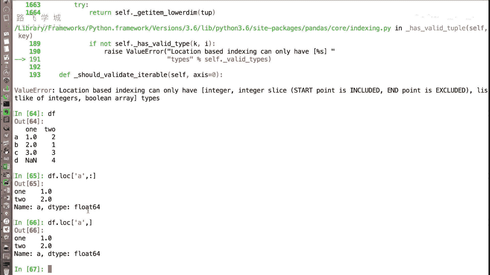
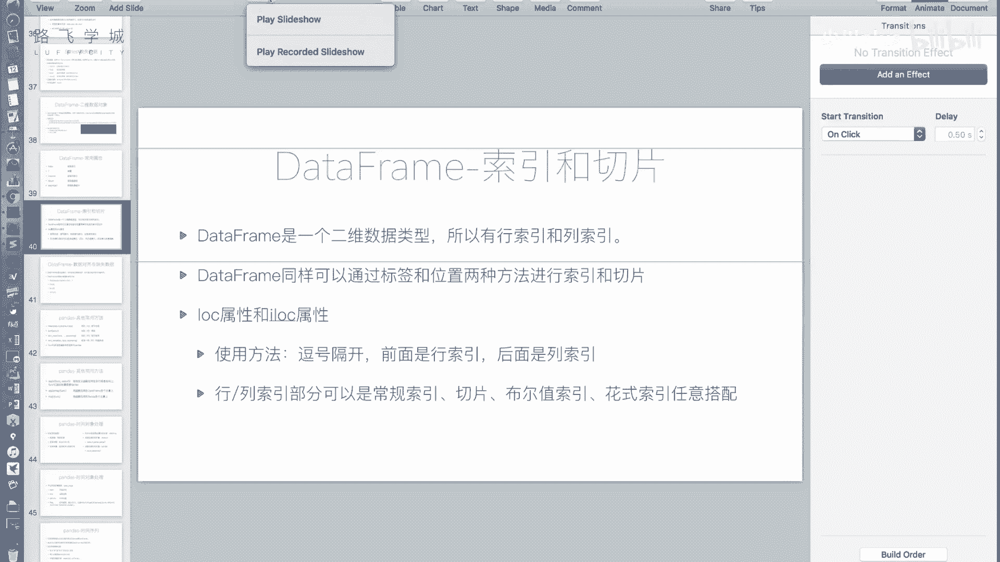
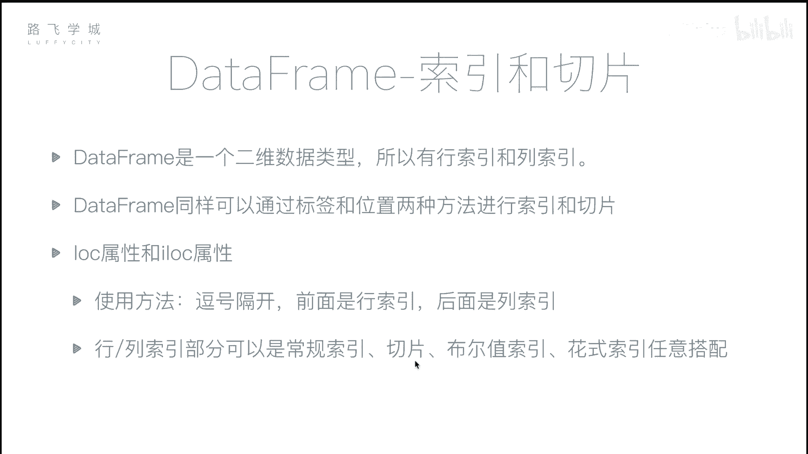
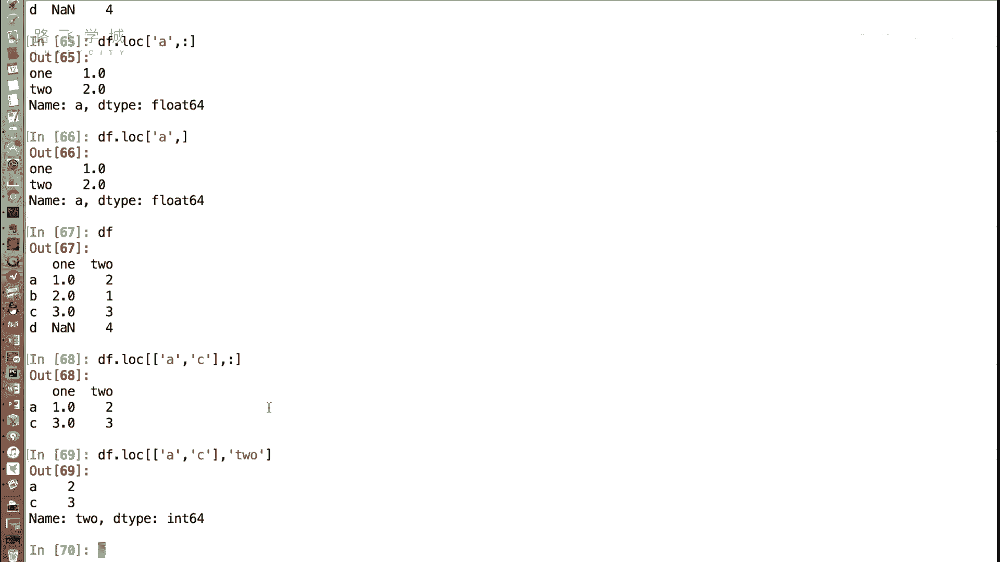
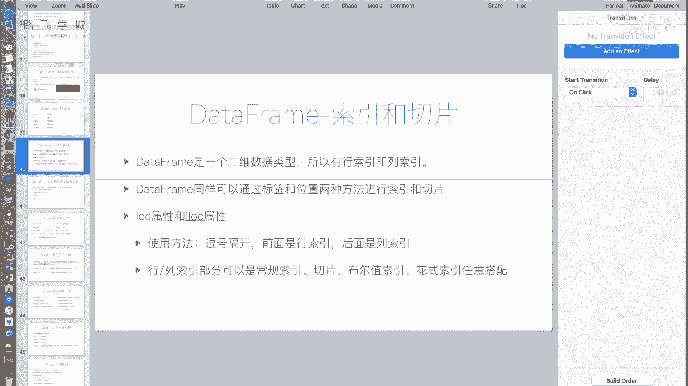

# Python金融量化分析：P24：DataFrame索引与切片 📊

在本节课中，我们将学习如何从Pandas的DataFrame对象中获取数据。DataFrame是一个二维表格型数据结构，拥有行索引和列索引。我们将重点介绍如何使用`.loc`和`.iloc`属性进行安全、灵活的索引和切片操作。

## 索引基础

上一节我们介绍了DataFrame的一些常用属性。本节中我们来看看如何获取DataFrame中的具体数值。

与Series类似，我们可以使用中括号`[]`来获取DataFrame的值。但需要注意的是，通过中括号直接索引时，通常是**先指定列，再指定行**，这与二维数组先指定行、再指定列的习惯不同。

**示例：**
```python
# 假设有一个DataFrame名为df
# 直接通过中括号获取‘one’列下‘A’行的值
value = df['one']['A']
```

然而，当行索引为整数时，这种直接索引的方式容易产生混淆和错误。因此，我们**不建议**使用连续两个中括号的写法。

## 推荐方法：使用 .loc 与 .iloc

为了避免混淆，我们推荐使用`.loc`和`.iloc`属性进行索引。这两个属性明确区分了按标签索引和按位置索引。

*   **`.loc`**：基于**标签**进行索引。
*   **`.iloc`**：基于**整数位置**进行索引。

它们的通用语法是：`df.loc[行选择器, 列选择器]` 或 `df.iloc[行选择器, 列选择器]`，用逗号分隔行和列。



**示例：**
```python
# 使用.loc获取‘A’行，‘one’列的值（推荐）
value = df.loc['A', 'one']



# 使用.iloc获取第0行，第0列的值（按位置）
value = df.iloc[0, 0]
```



如果想获取一整行或一整列的数据，可以使用切片。例如，获取‘A’行的所有数据：

**示例：**
```python
# 获取‘A’行的所有数据
row_a = df.loc['A', :]  # 冒号‘:’表示选择所有列
# 或者简写为
row_a = df.loc['A']
```



## 灵活的索引组合



`.loc`和`.iloc`的强大之处在于，行和列选择器可以非常灵活地组合使用，包括切片、布尔索引和花式索引。

以下是几种常见的组合方式：



*   **切片索引**：选择连续的行或列。
    ```python
    # 选择‘A’到‘C’行，‘one’到‘three’列
    df.loc['A':'C', 'one':'three']
    ```


*   **花式索引**：通过传递一个列表，选择指定的不连续行或列。
    ```python
    # 选择‘A’和‘C’行，‘two’列
    df.loc[['A', 'C'], 'two']
    ```

*   **布尔索引**：通过条件表达式选择数据。
    ```python
    # 选择‘one’列大于0的所有行
    df.loc[df['one'] > 0]
    ```

这些方法可以任意搭配，使得数据选取变得极其方便和灵活。



## 总结



本节课中我们一起学习了DataFrame的核心数据获取方法。我们了解到，直接使用中括号索引可能存在问题，因此更推荐使用`.loc`（基于标签）和`.iloc`（基于位置）这两个属性。通过行、列选择器的灵活组合（包括切片、列表和布尔条件），我们可以精准、高效地从DataFrame中提取出所需的任何数据子集，这是进行后续数据分析与处理的基础。