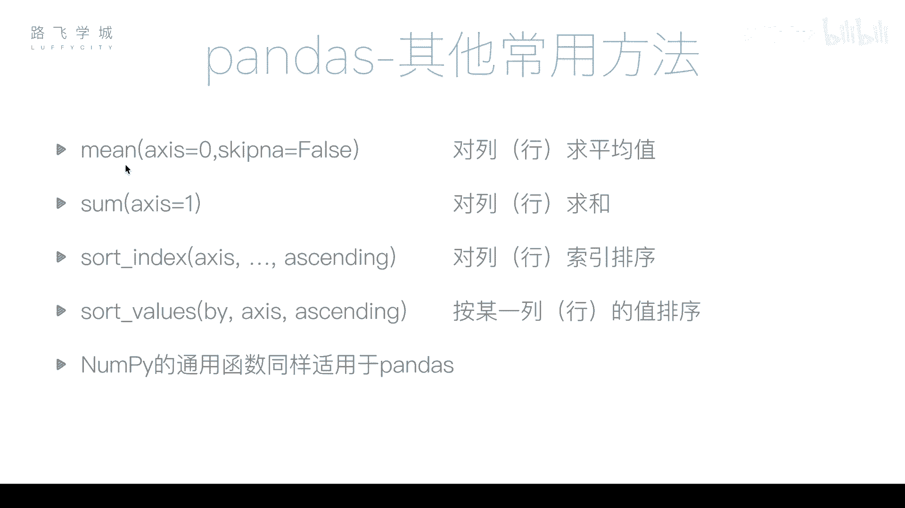
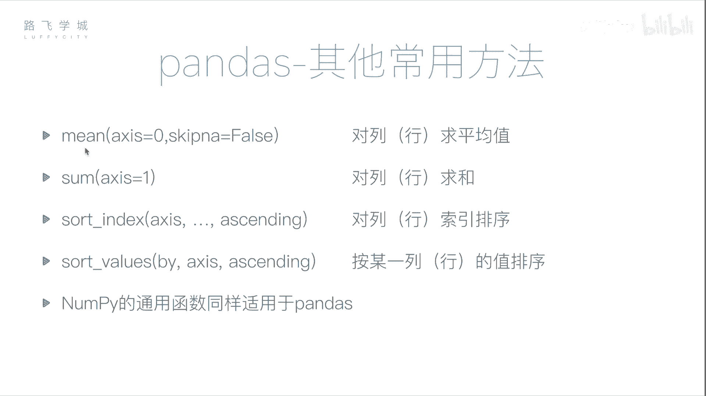

# Python金融量化分析：P26：pandas常用函数 📊

在本节课中，我们将学习pandas库中一些常用的数据处理函数，包括求平均值、求和以及排序等操作。这些功能是数据分析的基础，掌握它们能帮助我们更高效地处理和分析金融数据。

## 求平均值函数



上一节我们介绍了缺失值的处理，本节中我们来看看如何计算数据的平均值。pandas中的`mean()`方法用于计算平均值。

对于DataFrame对象，`mean()`方法默认按列计算平均值，返回一个Series对象，其中包含每一列的平均值。


**公式**：
`df.mean()`

例如，对于一个包含两列的DataFrame，`mean()`方法会分别计算每一列的平均值，忽略缺失值。

```python
import pandas as pd
import numpy as np

# 创建一个示例DataFrame
data = {'one': [5, 6, 7, np.nan],
        'two': [1, 2, 3, 4]}
df = pd.DataFrame(data, index=['a', 'b', 'c', 'd'])
print(df.mean())
```

执行上述代码，会返回一个长度为2的Series。对于第一列`one`，忽略缺失值后计算5、6、7的平均值为6。对于第二列`two`，计算1、2、3、4的平均值为2.5。

如果想按行计算平均值，可以通过设置参数`axis=1`来实现。

**公式**：
`df.mean(axis=1)`

```python
print(df.mean(axis=1))
```

## 求和函数

接下来，我们介绍求和函数`sum()`。与`mean()`方法类似，`sum()`方法默认也是按列求和。

**公式**：
`df.sum()`

如果想按行求和，同样需要设置参数`axis=1`。

**公式**：
`df.sum(axis=1)`

```python
# 按列求和
print(df.sum())
# 按行求和
print(df.sum(axis=1))
```

## 排序函数

排序是数据分析中常见的操作。pandas提供了两种主要的排序方式：按值排序和按索引排序。

### 按值排序

按值排序使用`sort_values()`方法。你需要通过`by`参数指定按照哪一列的值进行排序。

**公式**：
`df.sort_values(by=‘column_name‘)`

例如，按照`two`列进行升序排序：

```python
print(df.sort_values(by=‘two‘))
```

默认是升序排列。如果需要降序排列，可以设置参数`ascending=False`。

**公式**：
`df.sort_values(by=‘column_name‘, ascending=False)`

```python
print(df.sort_values(by=‘two‘, ascending=False))
```

当排序的列中存在缺失值`NaN`时，所有包含`NaN`的行不会参与排序，无论升序还是降序，它们都会被统一放在结果的最后。

也可以按行进行排序，但这并不常用。此时，`by`参数需要指定行索引，`axis`参数需设置为1。

```python
# 按‘a‘这一行的值对列进行排序（降序）
print(df.sort_values(by=‘a‘, axis=1, ascending=False))
```

### 按索引排序

按索引排序使用`sort_index()`方法。默认按行索引（如a, b, c, d）进行排序。

**公式**：
`df.sort_index()`

```python
# 按行索引升序排序
print(df.sort_index())
# 按行索引降序排序
print(df.sort_index(ascending=False))
```

如果想按列索引（即列名）进行排序，需要设置参数`axis=1`。

**公式**：
`df.sort_index(axis=1)`

```python
# 按列索引升序排序
print(df.sort_index(axis=1))
# 按列索引降序排序
print(df.sort_index(axis=1, ascending=False))
```

## 其他通用函数

除了上述函数，之前在NumPy中学过的许多通用函数同样适用于pandas，例如计算标准差的`std()`、计算方差的`var()`、求最大值的`max()`和求最小值的`min()`等。它们的调用方式与`mean()`、`sum()`类似。

以下是这些函数的使用示例：



```python
# 计算标准差
print(df.std())
# 计算方差
print(df.var())
# 查找最大值
print(df.max())
# 查找最小值
print(df.min())
```

本节课中我们一起学习了pandas库中几个核心的常用函数。我们掌握了如何使用`mean()`和`sum()`进行平均值与求和计算，并了解了如何通过`axis`参数控制计算方向。接着，我们深入探讨了`sort_values()`和`sort_index()`两种排序方法，明确了按值排序与按索引排序的区别及应用场景。最后，我们了解到NumPy中的通用统计函数在pandas中同样适用。这些基础而强大的函数是构建复杂金融数据分析模型的基石。