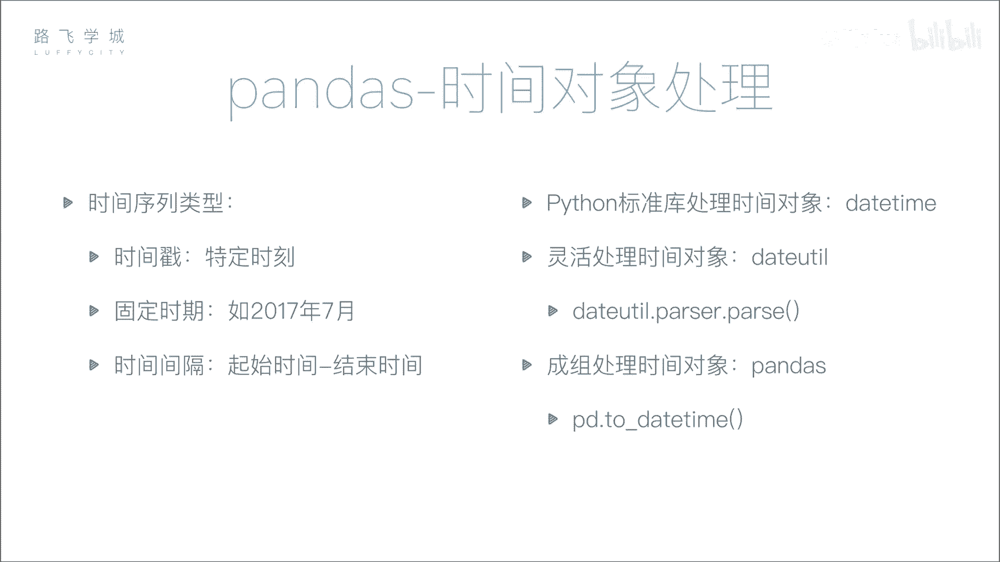
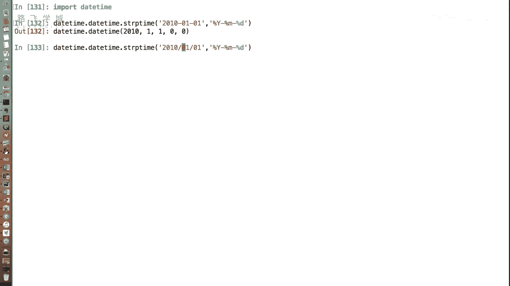
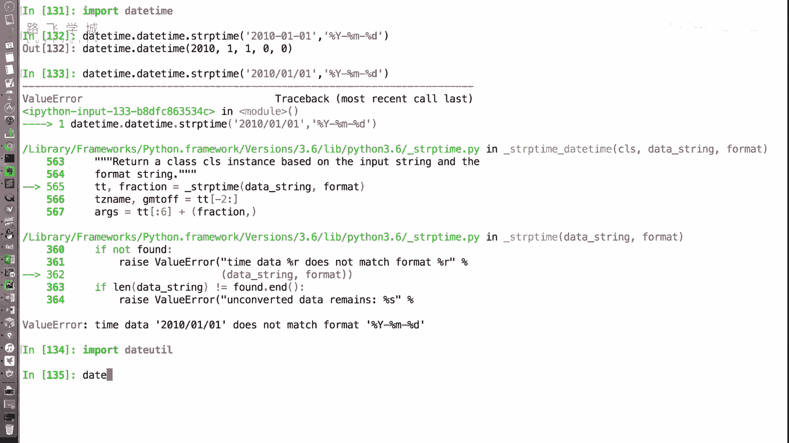
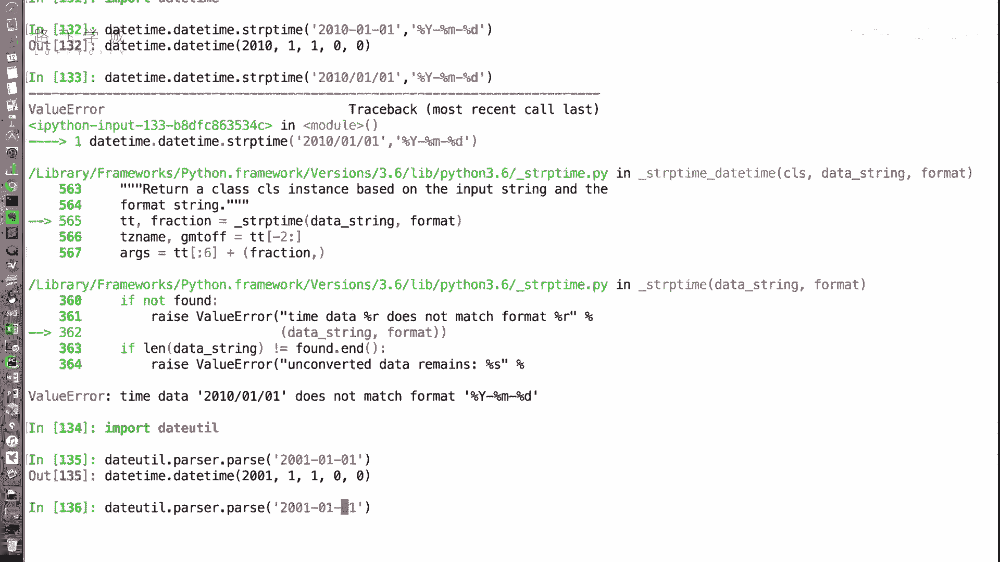
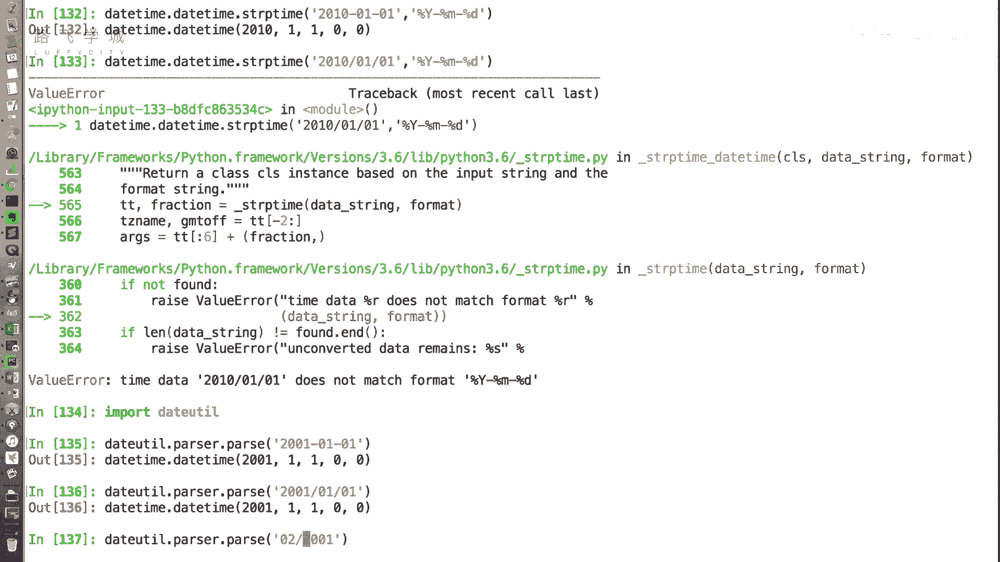
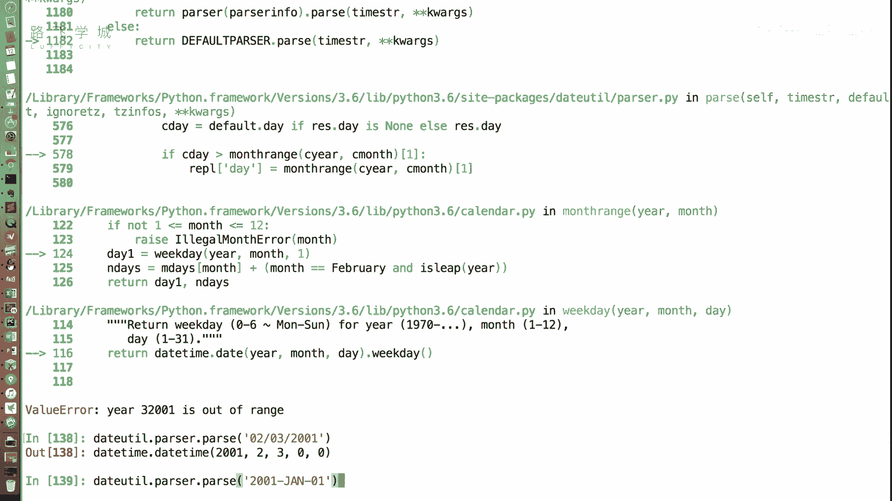
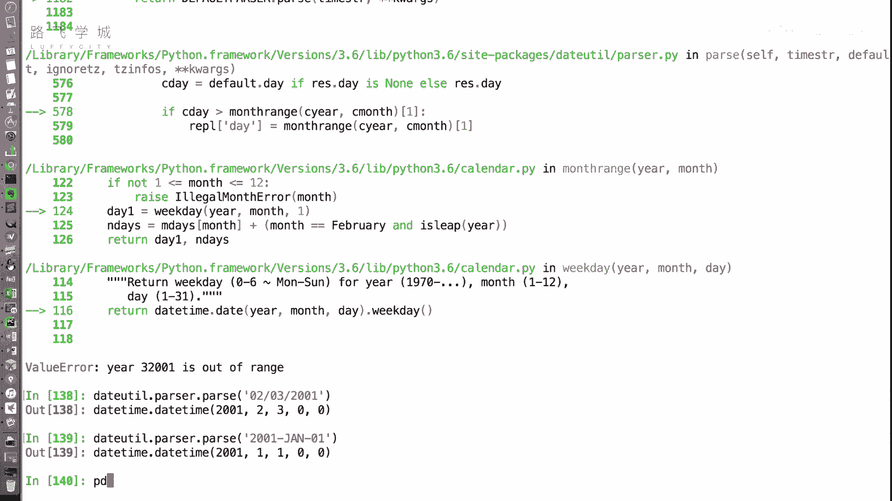
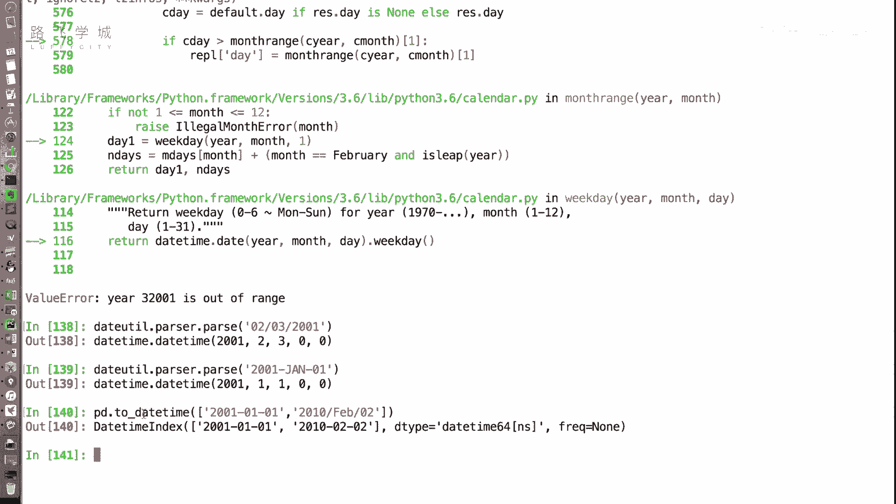

# Python金融量化分析：P27：时间处理对象 📅

在本节课中，我们将学习如何使用Python处理时间数据，这是金融量化分析中至关重要的一步。我们将重点介绍`pandas`库中处理时间序列的强大功能，并学习如何将各种格式的日期字符串高效地转换为统一的时间对象。



## 标准库的时间处理

上一节我们介绍了时间处理的重要性，本节中我们来看看Python标准库如何处理时间对象。

在Python基础课程中，你可能已经了解过，Python标准库中处理时间对象的类是`datetime`。`datetime`模块中有一个方法，可以将字符串转换成时间对象，即`strptime`。

**代码示例：**
```python
from datetime import datetime
datetime.strptime('2024-01-01', '%Y-%m-%d')
```

`strptime`函数的第一个参数是字符串，第二个参数是格式化字符串。例如，`%Y`代表四位数的年份，`%m`代表月份，`%d`代表日期。这种转换方式比较麻烦，因为每次都需要输入正确的格式化字符串。

## 自动解析日期字符串



当数据来源不同时，日期格式可能五花八门，例如有人用`-`分隔，有人用`/`分隔。手动为每种格式编写解析规则非常繁琐。

幸运的是，有一个名为`dateutil`的库可以自动检测并解析多种日期格式。如果你安装了`pandas`，`dateutil`库通常已经自动安装好了。



**代码示例：**
```python
from dateutil import parser
parser.parse('2001-01-01')
parser.parse('2001/01/01')
parser.parse('Jan 1, 2001')
```



`dateutil.parser.parse`函数非常强大，可以自动识别并解析多种常见的日期字符串格式，包括带月份缩写的英文格式。不过，它可能无法解析纯中文格式（如“2001年1月1日”）。



## Pandas的批量时间转换



如果我们需要将大量数据批量转换为时间对象，使用`dateutil`逐个处理效率不高。将字符串转换为时间对象后，我们才能进行更高级的时间序列分析。

`pandas`库提供了一个非常便捷的函数`to_datetime`，可以批量地将字符串数组转换为时间对象。



**代码示例：**
```python
import pandas as pd
date_strings = ['2001-01-01', '2001/01/02']
pd.to_datetime(date_strings)
```

`pd.to_datetime`函数接收一个列表或数组，并返回一个`DatetimeIndex`对象。这个对象是`pandas`中专门用于时间序列索引的数据结构，在后续的金融数据分析（如按时间切片、重采样等）中将发挥巨大作用。

---



本节课中我们一起学习了Python中处理时间对象的三种方法：使用标准库`datetime.strptime`进行精确但繁琐的转换；使用`dateutil.parser.parse`进行灵活的自动解析；以及使用`pandas.to_datetime`进行高效的批量转换，并生成适用于数据分析的`DatetimeIndex`对象。掌握这些方法是进行金融时间序列分析的基础。