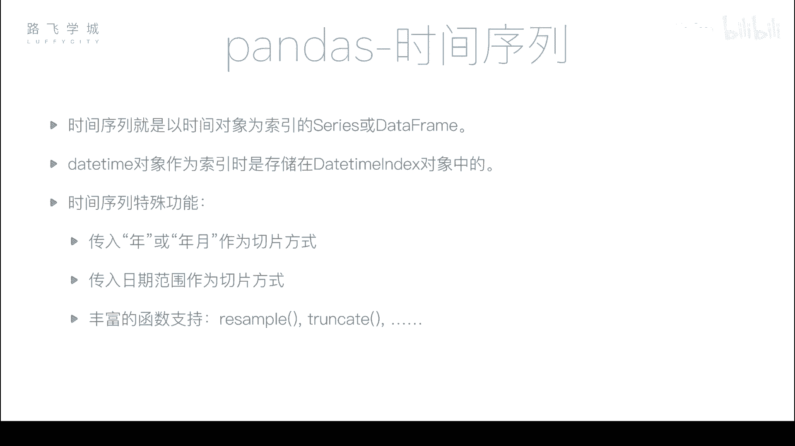
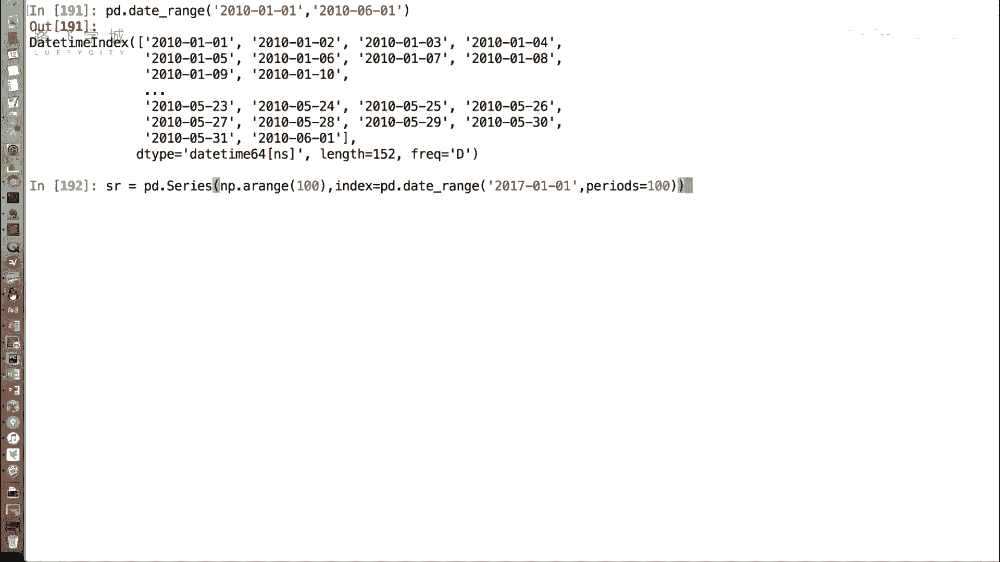
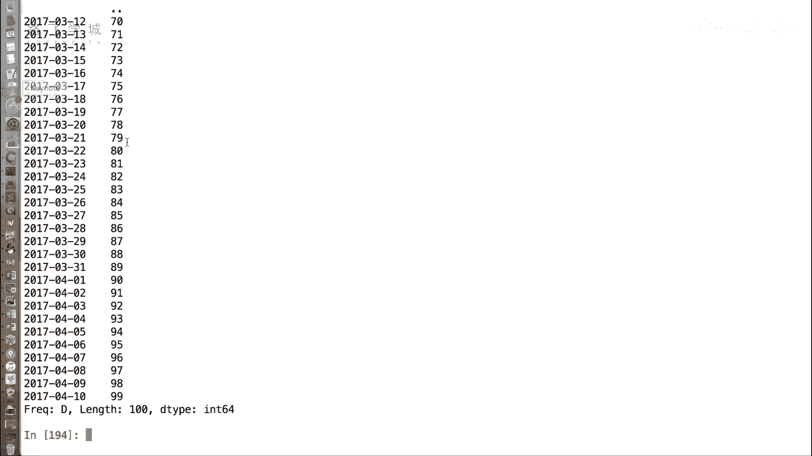
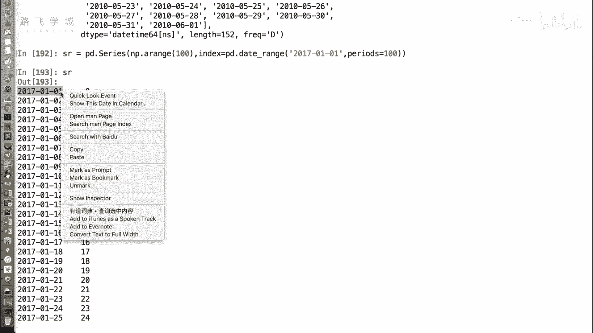
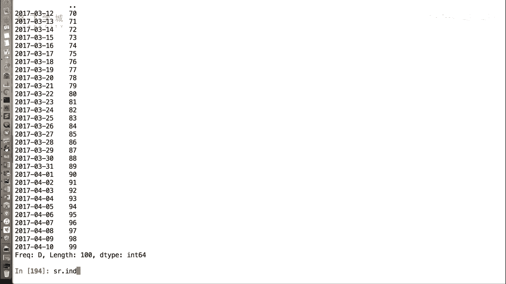
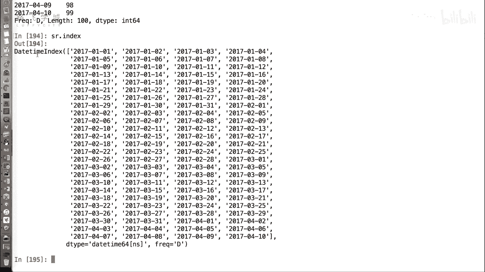
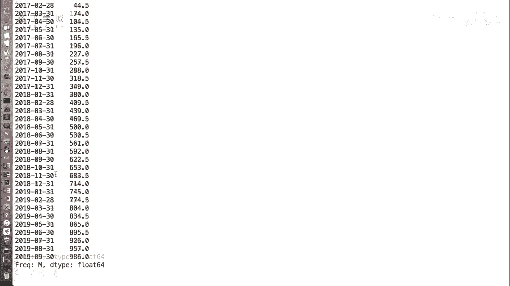
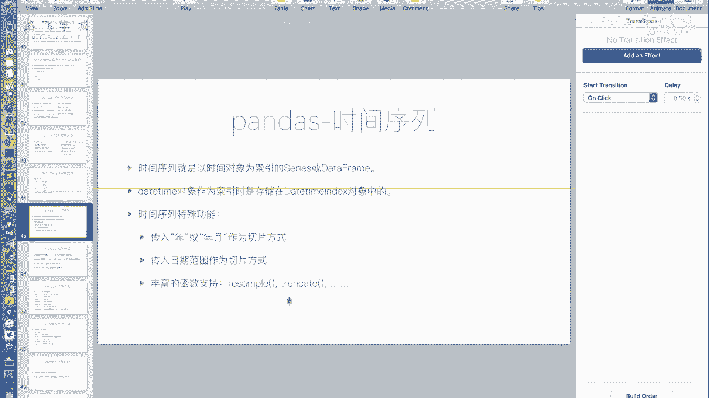
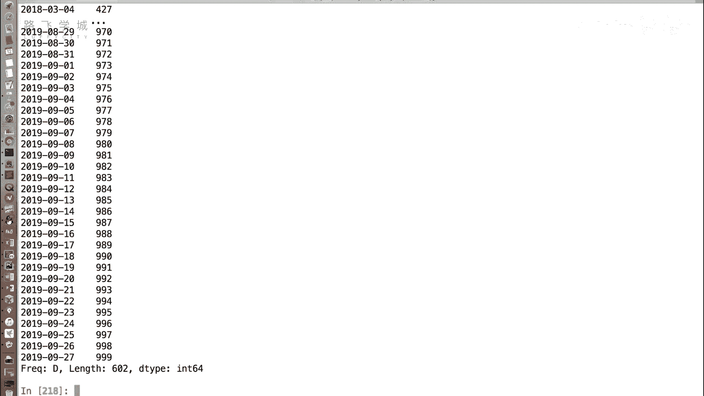
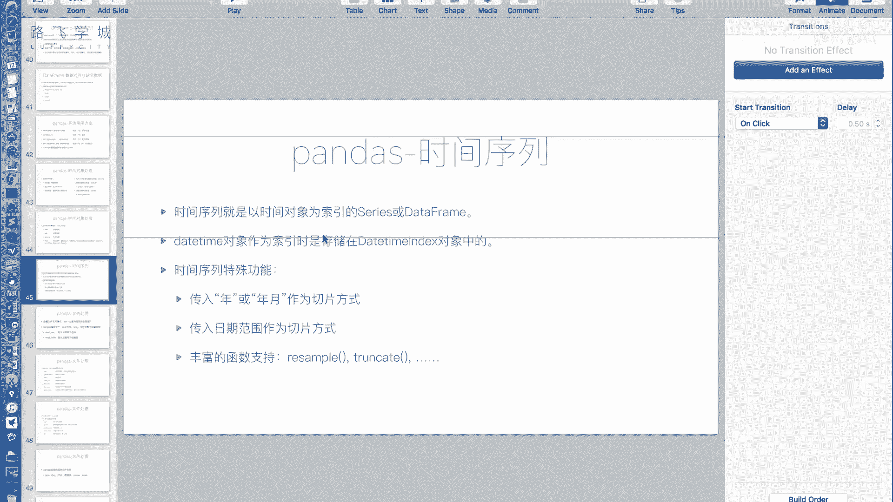

# Python金融量化与股票分析：P29：时间序列 📅

在本节课中，我们将学习如何利用Pandas的时间对象来构建时间序列。时间序列是以时间对象作为索引的Series或DataFrame，它在金融数据分析中至关重要。我们将探讨如何创建时间序列，以及利用其索引特性进行高效的数据切片和重采样。



---

上一节我们介绍了Pandas中各种处理时间对象的函数。本节中，我们来看看如何将这些时间对象作为索引，构成一个时间序列。

**时间序列**是指以时间对象（如`DatetimeIndex`）作为索引的`Series`或`DataFrame`。例如，使用`pd.date_range`函数可以生成一个`DatetimeIndex`，我们可以用它来作为数据结构的索引。

以下是创建一个时间序列`Series`的示例代码：





```python
import pandas as pd
import numpy as np



# 创建一个DatetimeIndex作为索引
date_index = pd.date_range(start='2017-01-01', periods=100)



# 创建一个以该时间索引的Series
sr = pd.Series(np.arange(100), index=date_index)
print(sr.index)  # 输出：DatetimeIndex
```



运行上述代码，可以看到`sr`的索引类型是`DatetimeIndex`，而不仅仅是字符串。这标志着它已经成为一个时间序列。

---

成为时间序列后，数据可以进行直观且高效的切片操作。以下是几种常见的切片方式：

*   **按年月切片**：你可以使用不完整的日期字符串（如“年-月”）来选取整个月份的数据。
    *   示例：`sr[‘2017-03’]` 会选取2017年3月的所有数据。
*   **按年切片**：仅使用年份可以选取整年的数据。
    *   示例：`sr[‘2017’]` 会选取2017年的所有数据。
*   **按日期范围切片**：你可以指定一个明确的起止日期范围。
    *   示例：`sr[‘2017-12-25’:‘2018-02-01’]` 会选取从2017年12月25日到2018年2月1日（包含）的数据。

这些操作使得按时间维度筛选数据变得异常简单。

---

除了切片，时间序列还支持强大的重采样功能。`resample`函数用于将数据按照新的时间频率（如天、周、月）进行聚合。

以下是`resample`函数的使用示例：

*   **按周求和**：将每日数据聚合为每周总和。
    ```python
    sr.resample(‘W’).sum()
    ```
*   **按月求平均值**：将每日数据聚合为每月平均值。
    ```python
    sr.resample(‘M’).mean()
    ```

`resample`的参数与`date_range`的频率参数一致（如`‘W’`代表周，`‘M’`代表月），其后可接`.sum()`、`.mean()`、`.max()`等聚合方法。这为分析不同时间周期的数据特征提供了极大便利。

---



Pandas还提供了`truncate`函数，用于截取指定日期之前或之后的数据。虽然其功能大多可由切片实现，但了解它仍有必要。

以下是`truncate`函数的示例：



```python
# 截取2018-02-03之后的数据（保留之后的部分）
sr.truncate(before=‘2018-02-03’)

# 截取2018-02-03之前的数据（保留之前的部分）
sr.truncate(after=‘2018-02-03’)
```

你可以同时使用`before`和`after`参数来截取一个中间时间段。不过，直接使用切片操作 `sr[‘start_date’:‘end_date’]` 通常更为直观和常用。



---



本节课中，我们一起学习了Pandas时间序列的核心概念与应用。我们掌握了如何创建以`DatetimeIndex`为索引的时间序列，并利用其特性进行灵活的数据切片（按年、月、日期范围）和重采样聚合分析。这些功能是金融时间序列数据分析的基础，能极大地提升数据处理的效率和深度。