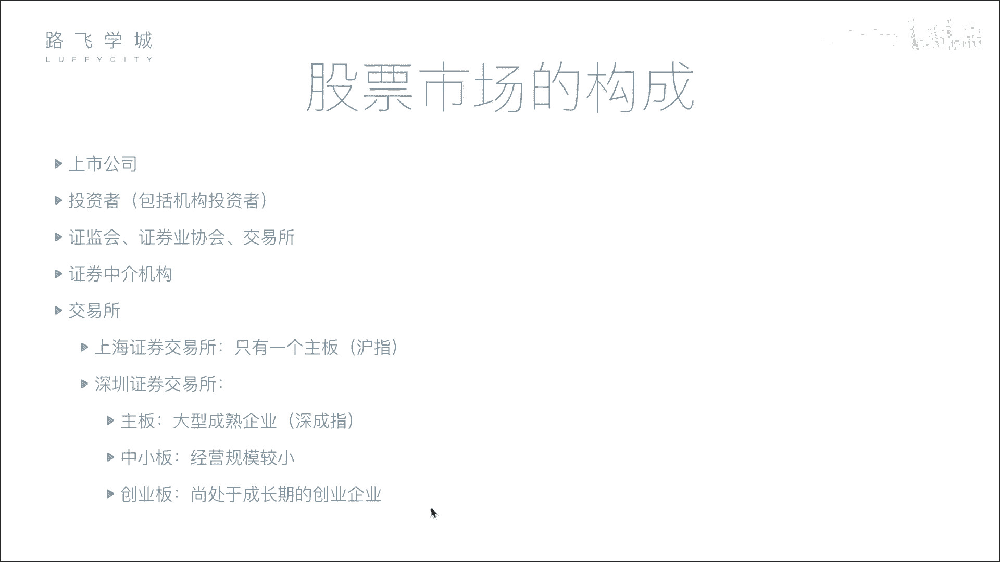
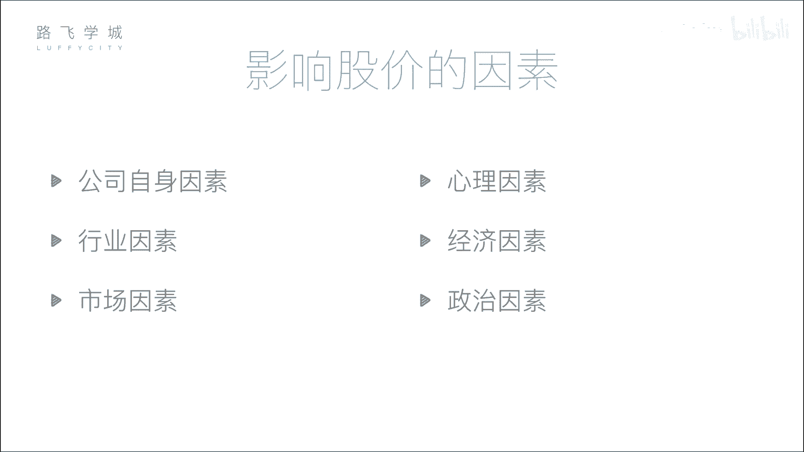

# 金融量化分析：03：股票市场构成 🏛️

在本节课中，我们将要学习股票市场的基本构成。了解市场中有哪些参与者以及他们各自扮演的角色，是进行金融量化分析的重要基础。

## 公司和投资者

上一节我们介绍了股票的分类，本节中我们来看看股票市场的构成。首先，市场中最核心的参与者是公司和投资者。公司是需要融资的一方，投资者是提供资金的一方。公司通过发行股票向投资者融资。

## 监管机构

公司和投资者不能直接进行交易，这是为了防止暗箱操作。因此，市场需要监管机构。以下是主要的监管机构：

*   **证监会**：这是证券行业的监管机构。公司想要上市，必须将各种材料提交给证监会审核。证监会负责判断公司是否存在欺诈、洗钱等违法行为，并有权决定公司能否上市或将其退市。
*   **证券业协会**：这是一个行业自律组织，作用相对较弱。例如，证券从业资格考试通常由其主办。

## 交易所

交易所为股票交易提供了一个集中的场所。在中国，主要有上海和深圳两家交易所。在电子化交易普及之前，投资者需要亲自到交易所的交易大厅进行买卖。现在，所有交易都通过网络连接到交易所的系统进行。交易所的核心功能是处理来自各方的买卖请求。

## 证券中介机构

个人投资者通常不能直接向交易所买卖股票，这主要是因为成本问题。在历史上，交易所通过出售价格高昂的“交易席位”来限制直接参与者。拥有席位的机构（如大型券商）为了赚回席位费，便代理众多小投资者进行交易，从而衍生出证券中介机构，也就是我们常说的券商。

以下是关于券商的关键点：

*   券商（如中信证券、中金公司等）在证券交易所拥有交易席位。
*   投资者需要通过券商开户，并使用其提供的软件（如同花顺）下达交易指令。
*   券商接收投资者的指令后，通过其在交易所的席位，将指令传达给交易所执行。

## 交易所板块与大盘指数

中国的两个交易所下设不同的板块，以满足不同类型公司的上市需求。

*   **上海证券交易所**：主要设有**主板**。
*   **深圳证券交易所**：设有**主板**、**中小板**和**创业板**。中小板和创业板是为规模较小或处于创业阶段的公司提供的融资平台，上市门槛相对主板较低。

每个板块都有一个综合性的**大盘指数**，用以反映该板块内所有股票的整体表现。

**指数**的计算公式可以简化为对板块内众多股票价格进行加权平均或综合计算，从而形成一条趋势曲线。例如：
`指数值 = f(股票1价格, 股票2价格, ..., 股票N价格)`
这条曲线代表了整个市场的总体走势是向好还是向坏。

以下是各主要板块对应的指数名称：

*   上海主板大盘指数：**沪指**（上证指数）
*   深圳主板大盘指数：**深成指**
*   深圳中小板大盘指数：**中小板指**
*   深圳创业板大盘指数：**创业板指**

---

本节课中我们一起学习了股票市场的核心构成。我们了解了资金的需求方（公司）与供给方（投资者），认识了维护市场秩序的监管机构（证监会、证券业协会），知道了股票交易的物理与逻辑场所（交易所及其板块），也明白了连接我们与交易所的关键桥梁（证券中介机构/券商）。最后，我们学习了用以衡量市场整体状况的工具——大盘指数。理解这些基本要素，是后续进行深入量化分析的第一步。