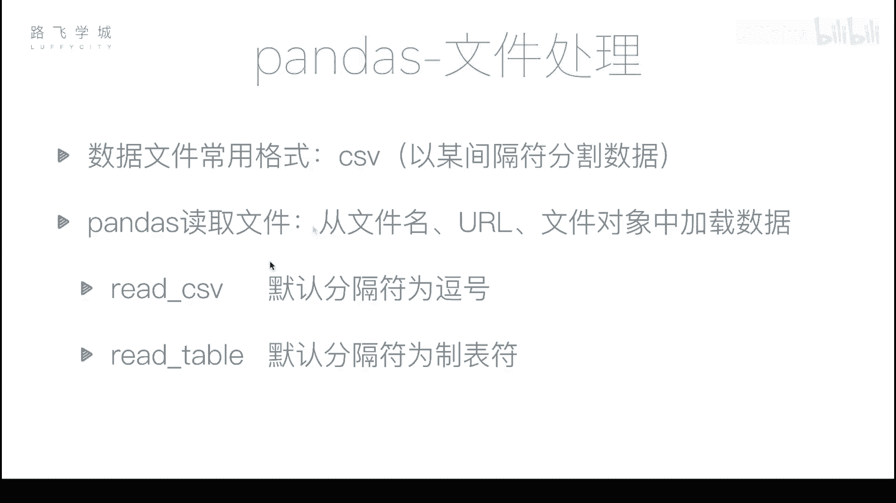
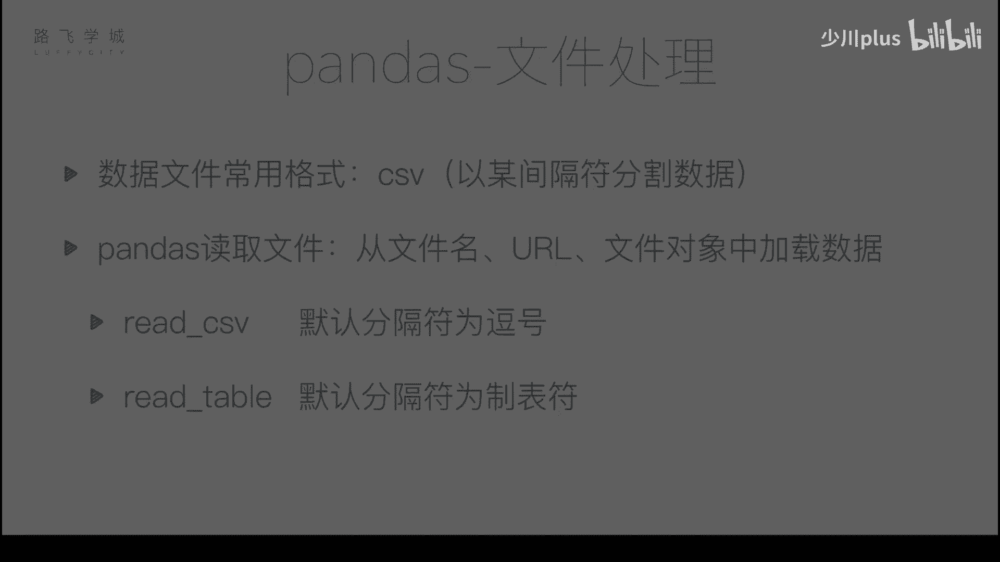
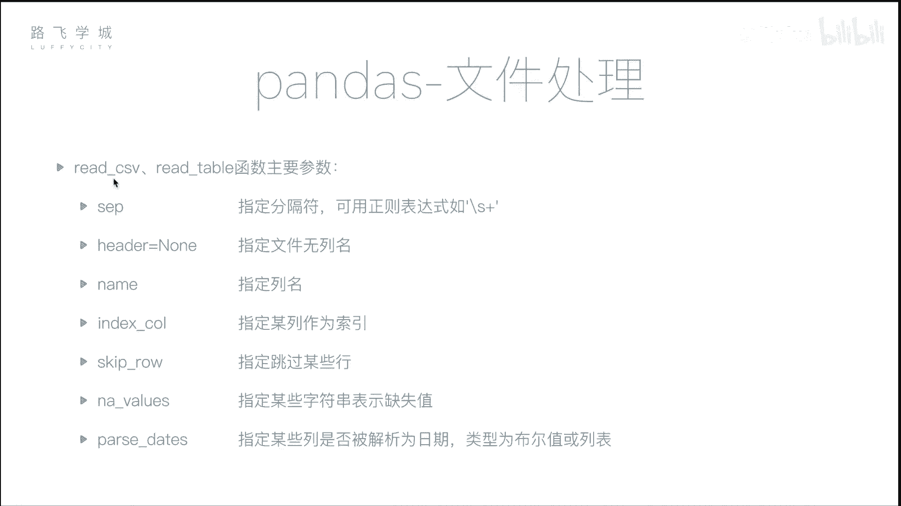

# Python金融量化分析：P30：文件读取 📂

在本节课中，我们将学习如何使用Pandas库读取外部文件数据。这是数据分析中至关重要的一步，因为真实世界的数据通常存储在文件中，而非手动输入。

## 概述

到目前为止，我们已经学习了Pandas的多种功能，包括灵活的数据操作、数据对齐、缺失值处理和时间序列等。最后一部分内容是文件处理。在日常编程中，我们通常不会手动创建DataFrame对象，而是从文件中读取真实数据。最常用的数据文件格式是CSV。



CSV文件本质上是文本文件，其内容由逗号分隔。每一行代表一条记录，两个逗号之间的部分代表一个单元格的数据，类似于Excel表格中的一个格子。



## 读取CSV文件

`read_csv`函数可以将CSV文件的内容读取到Pandas的DataFrame中。

```python
import pandas as pd
df = pd.read_csv(‘filename.csv’)
```

假设我们有一个名为`stock_data.csv`的文件，它包含了某支股票从2007年3月1日到2017年11月10日的行情数据。文件包含以下列：序号、时间、开盘价、收盘价、最高价、最低价、成交量和股票代码。

### 基本读取与问题

直接使用`read_csv`函数读取文件：

```python
df = pd.read_csv(‘stock_data.csv’)
```

数据虽然被成功读取，但存在几个问题：
1.  文件原有的序号列（0,1,2...）被当作普通数据读取，同时Pandas又自动生成了一列新的数字索引。
2.  第一行（列名行）如果为空，Pandas会为其分配一个默认名称（如`Unnamed: 0`）。

### 指定行索引

为了解决第一个问题，我们可以使用`index_col`参数来指定将哪一列作为DataFrame的行索引。

*   **传入列编号**：`index_col=0` 表示将第0列作为索引。
*   **传入列名**：`index_col=‘date’` 表示将名为‘date’的列作为索引。将时间列作为索引通常更符合分析需求。

```python
df = pd.read_csv(‘stock_data.csv’, index_col=‘date’)
```

### 解析时间序列

指定日期列为索引后，其数据类型可能仍是字符串。为了进行时间序列分析，需要将其转换为`datetime`对象。这可以通过`parse_dates`参数实现。

*   **传入布尔值**：`parse_dates=True` 会尝试解析文件中所有可以解释为日期的列。
*   **传入列表**：`parse_dates=[‘date’]` 会仅解析列表中指定的列。

```python
df = pd.read_csv(‘stock_data.csv’, index_col=‘date’, parse_dates=True)
# 或
df = pd.read_csv(‘stock_data.csv’, index_col=‘date’, parse_dates=[‘date’])
```

执行后，`df.index`的类型将变为`DatetimeIndex`。

### 处理无列名的文件

如果CSV文件没有表头（即第一行就是数据），直接读取会导致第一行数据被误认为是列名。这时需要使用`header`和`names`参数。

*   `header=None`：告知Pandas文件没有列名，Pandas会自动生成数字列名（0,1,2...）。
*   `names=[...]`：可以传入一个列表，手动指定各列的名称。

```python
# 自动生成列名
df = pd.read_csv(‘data_without_header.csv’, header=None)

# 手动指定列名
column_names = [‘A‘, ‘B‘, ‘C‘, ‘D‘, ‘E‘, ‘F‘, ‘G‘, ‘H‘]
df = pd.read_csv(‘data_without_header.csv’, header=None, names=column_names)
```

## `read_table`函数

除了`read_csv`，Pandas还提供了`read_table`函数。两者的主要区别在于默认分隔符：
*   `read_csv` 默认分隔符是逗号（`,`）。
*   `read_table` 默认分隔符是制表符（`\t`）。

在`read_csv`中，可以通过`sep`参数指定任意分隔符。

```python
# 使用read_csv读取以制表符分隔的文件
df = pd.read_csv(‘file.tsv’, sep=‘\t’)
# 使用read_table读取以逗号分隔的文件
df = pd.read_table(‘file.csv’, sep=‘,’)
```

`sep`参数甚至可以接受正则表达式。例如，`sep=‘\s+’`可以匹配任意长度的空白字符（包括空格和制表符），适用于列之间空格数量不固定的文件。

## 其他常用参数

以下是`read_csv`和`read_table`函数中其他一些有用的参数：

*   `skiprows`：跳过文件开头的指定行数。例如，`skiprows=[1,2,3]`会跳过第1、2、3行（0-based索引，通常跳过标题行之后的不需要的数据）。
*   `na_values`：指定哪些字符串应被解释为缺失值（NaN）。这对于处理来源多样、缺失值标记不统一的数据非常有用。例如，如果数据中用“N/A”或“-”表示缺失，可以设置`na_values=[‘N/A‘, ‘-’]`。

```python
# 示例：跳过前3行，并将“N/A“和“--“识别为缺失值
df = pd.read_csv(‘data.csv’, skiprows=3, na_values=[‘N/A‘, ‘--’])
```

## 总结

本节课我们一起学习了Pandas中读取文件的核心方法。我们重点掌握了：
1.  使用`read_csv`和`read_table`函数读取文本数据。
2.  通过`index_col`参数设置行索引。
3.  利用`parse_dates`参数将字符串列解析为时间序列。
4.  使用`header`和`names`参数处理没有列名的文件。
5.  了解`sep`参数用于指定分隔符。
6.  使用`skiprows`跳过不需要的行，以及用`na_values`统一缺失值标识。



熟练掌握这些参数，能够帮助你高效、准确地将各种格式的原始数据加载到Pandas中，为后续的数据清洗和分析工作奠定坚实的基础。