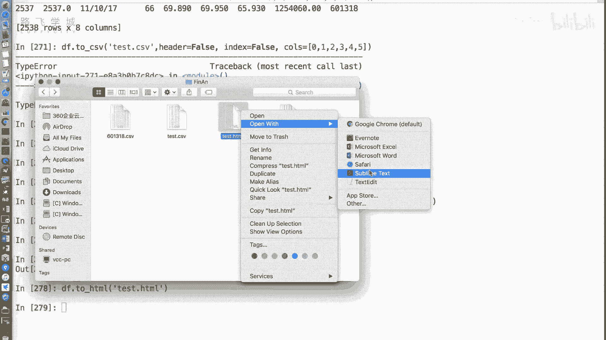
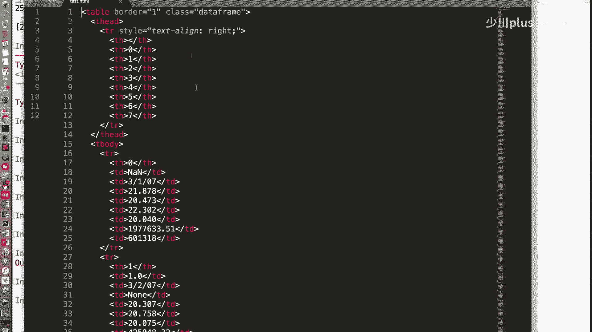
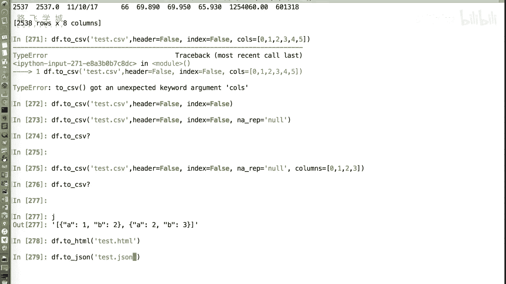
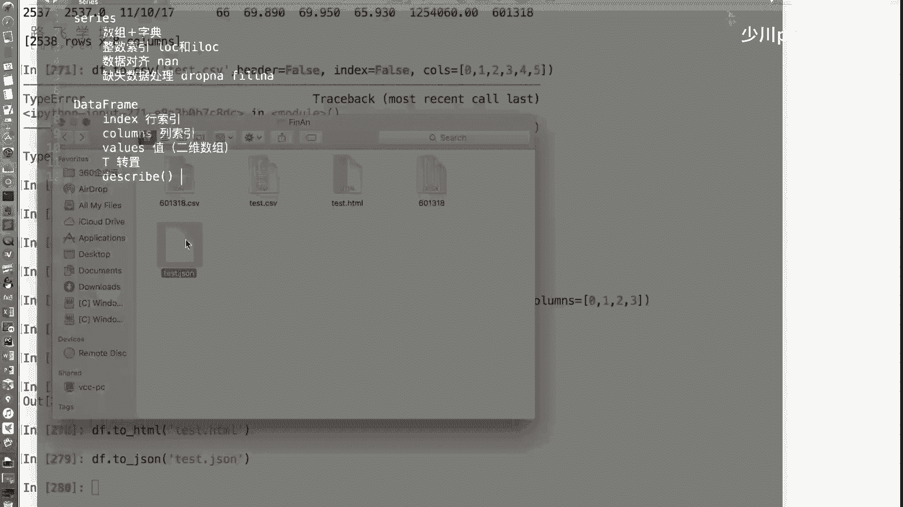
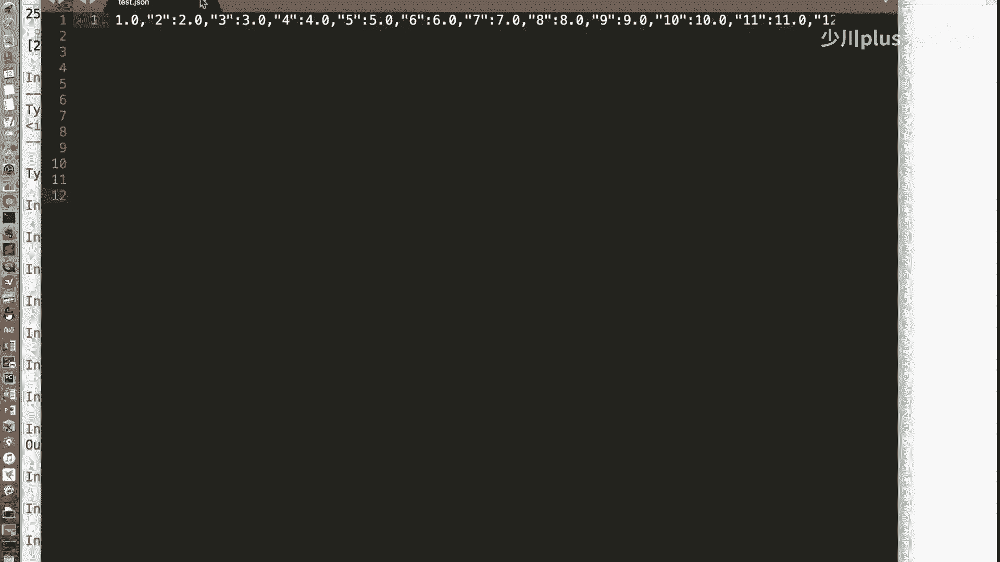
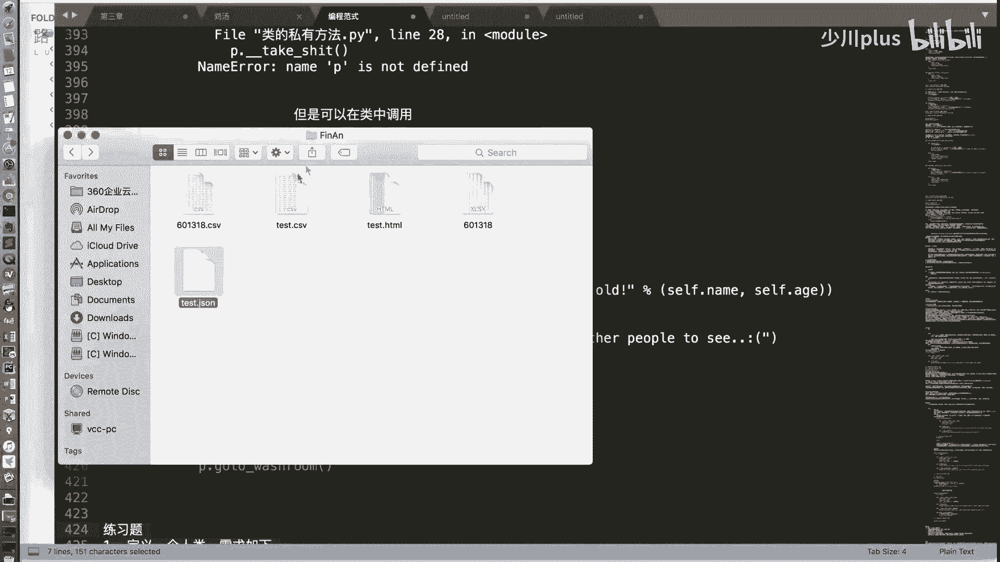
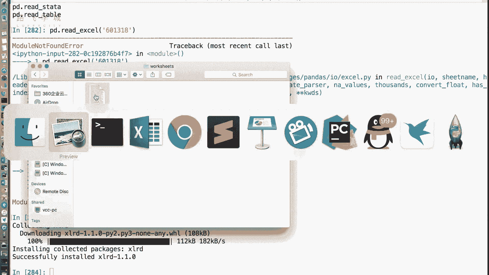
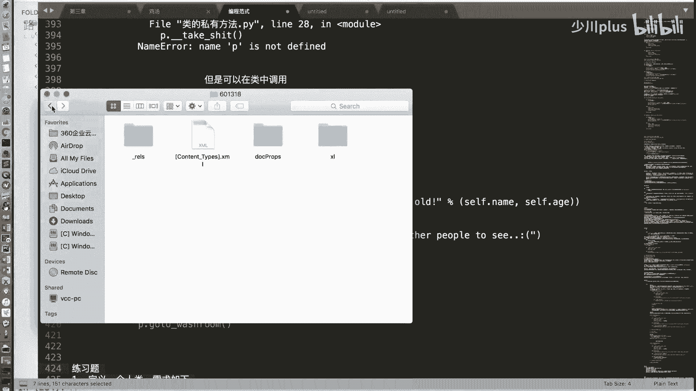
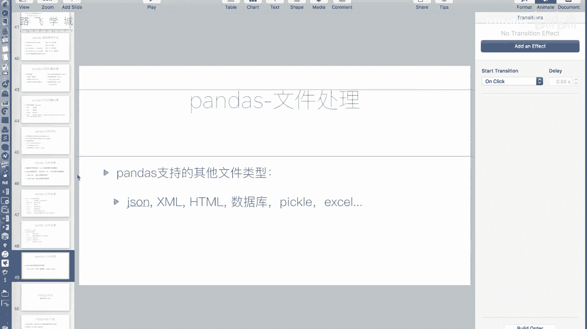

# Python金融量化分析：P31：文件操作3与pandas收尾 📊

## 概述
在本节课中，我们将深入学习pandas库中`DataFrame`对象的`to_csv`方法，了解其关键参数，并简要介绍pandas支持的其他文件格式读写操作。最后，我们将对pandas的核心内容进行总结。

---

## `to_csv`方法详解

上一节我们介绍了`read_csv`函数用于读取文件，本节中我们来看看如何将`DataFrame`写入文件，即`to_csv`方法。虽然之前提到过此方法，但未详细说明其参数。

以下是`to_csv`方法的一些常用参数：

*   **`sep`参数**：与`read_csv`的`sep`参数功能相同，用于指定写入文件时使用的分隔符。默认值为逗号（`,`）。
    ```python
    df.to_csv('file.csv', sep=',')
    ```

*   **`na_rep`参数**：此参数与`read_csv`中的`na_values`参数作用相反。`na_values`用于指定将哪些字符串解释为缺失值（NaN），而`na_rep`则用于指定将`DataFrame`中的缺失值（NaN）写入文件时替换成什么字符串。默认值为空字符串。
    ```python
    df.to_csv('file.csv', na_rep='NULL')
    ```

*   **`header`参数**：当设置为`False`时，不将列名（表头）写入文件的第一行。
    ```python
    df.to_csv('file.csv', header=False)
    ```

*   **`index`参数**：当设置为`False`时，不将行索引写入文件的一列。
    ```python
    df.to_csv('file.csv', index=False)
    ```

*   **`columns`参数**：可以传入一个列表，用于指定需要写入文件的列。列表中可以包含列的编号或列名。
    ```python
    df.to_csv('file.csv', columns=[0, 1, 2]) # 写入前3列
    df.to_csv('file.csv', columns=['col1', 'col3']) # 写入指定列名的列
    ```

**参数使用示例**：
```python
import pandas as pd
import numpy as np

# 假设df是一个DataFrame
df = pd.DataFrame(np.random.randn(5, 6))
# 将第0行第0列的值改为NaN
df.iloc[0, 0] = np.nan

# 写入文件，不包含表头和行索引，并将NaN替换为‘NULL’，只写入前4列
df.to_csv('test.csv', header=False, index=False, na_rep='NULL', columns=[0, 1, 2, 3])
```

**注意**：`to_csv`方法没有直接参数用于限制写入的行数。如果需要只写入前N行，可以先对`DataFrame`进行切片操作，再调用`to_csv`。
```python
df_head = df.head(4) # 获取前4行
df_head.to_csv('test_head.csv')
```

---

## pandas支持的其他文件格式



除了CSV文件，pandas库还支持读写多种其他格式的数据文件。





以下是pandas支持的部分文件格式：





*   **JSON**
*   **Excel** (`.xlsx`, `.xls`)
*   **HTML** 表格
*   **SQL** 数据库
*   **Pickle** (Python对象序列化格式)
*   **Parquet**
*   **Feather**



**示例：写入HTML和JSON文件**

```python
# 将DataFrame写入HTML文件，在浏览器中打开会显示为表格
df.to_html('data.html')

# 将DataFrame写入JSON文件
df.to_json('data.json')
```

**示例：读取Excel文件**
读取Excel文件需要额外的依赖库（如`openpyxl` 用于 `.xlsx` 或 `xlrd` 用于旧版 `.xls`）。安装后即可使用`pd.read_excel`。
```python
# 需要先安装：pip install openpyxl
df_excel = pd.read_excel('data.xlsx')
```

对于其他格式（如`read_json`, `read_html`, `read_sql`），使用方法类似。在Jupyter Notebook或IPython中，你可以使用`pd.read_?`或`df.to_?`并加上问号来查看具体方法的文档和参数说明。

---



## pandas核心内容总结 🎯



本节课中我们一起学习了pandas文件操作的收尾部分，现在对整个pandas章节的核心内容进行总结。

我们主要学习了两个核心数据结构：

1.  **`Series`对象**：用于处理一维带标签数据。
2.  **`DataFrame`对象**：用于处理二维表格型数据，是数据分析中最常用的结构。



**关键知识点回顾**：

*   **索引与切片**：我们详细讲解了如何使用`.loc`（基于标签）和`.iloc`（基于整数位置）进行数据选取。对于`DataFrame`，建议使用`df.loc[行选择, 列选择]`的语法，而非连续使用两个中括号`df[][]]`。
*   **数据对齐**：`Series`或`DataFrame`进行运算时，会按照行和列的标签自动对齐。未对齐的位置会产生缺失值（NaN）。
*   **缺失值处理**：缺失值在pandas中表示为`NaN`。我们可以使用`dropna()`方法删除包含缺失值的行或列，或者使用`fillna()`方法用特定值填充缺失值。
*   **时间序列**：pandas提供了强大的时间序列处理功能。
*   **文件读写**：pandas支持包括CSV、Excel、JSON、HTML在内的多种文件格式的读写。

关于pandas核心库的介绍到此结束。后续请务必通过练习题巩固所学知识，以加深理解。

---