# 金融量化分析：P32：Matplotlib介绍 📊

## 概述
在本节课中，我们将要学习Python三大数据分析工具包中的最后一个——Matplotlib。这是一个用于数据可视化的强大工具包，能够帮助我们绘制各种图表，例如在金融量化分析中直观展示股票价格走势图。

---

## Matplotlib是什么？
Matplotlib是一个Python的数据可视化工具包。简而言之，它是用来画图的。在金融分析或数据分析中，图表（如股票价格走势图）比单纯的数据表格更直观。

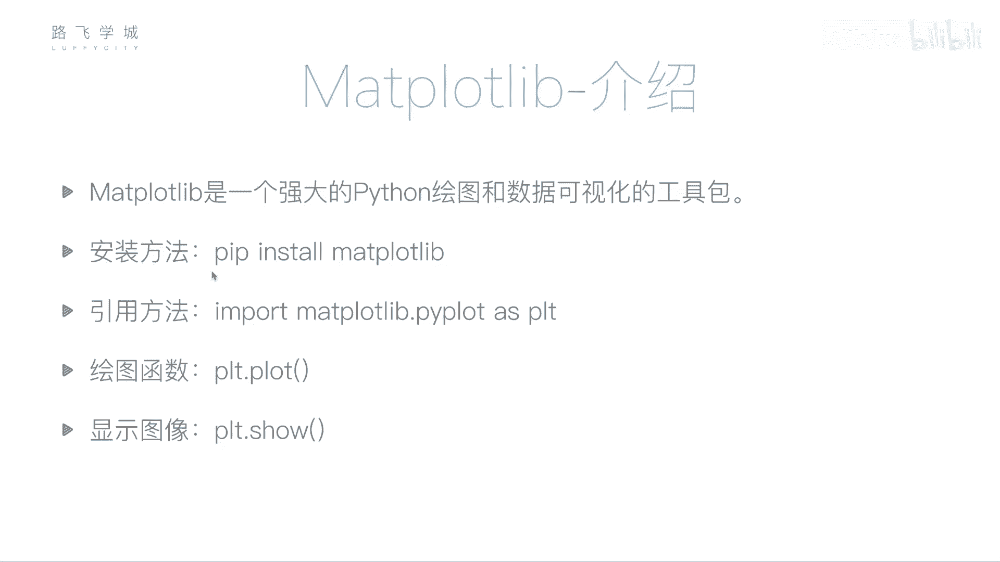

Matplotlib是一个强大的Python绘图和数据可视化工具包。

## 安装与引入
安装方法依然是使用`pip`进行安装。

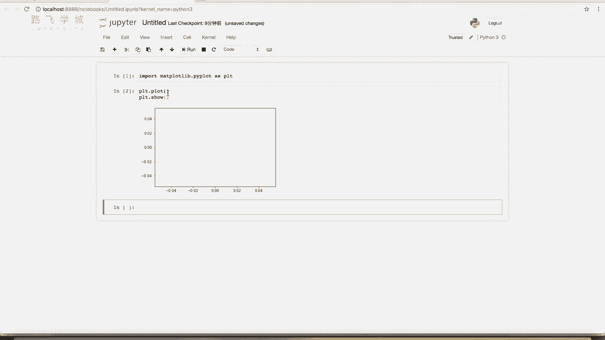

```bash
pip install matplotlib
```

在代码中，我们通常这样引入Matplotlib的绘图模块：

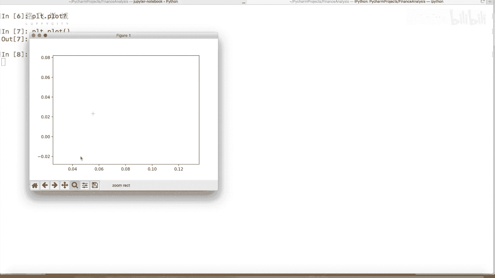


```python
import matplotlib.pyplot as plt
```
其中，`pyplot`是其主要用于绘图的子模块，`plt`是约定俗成的别名。

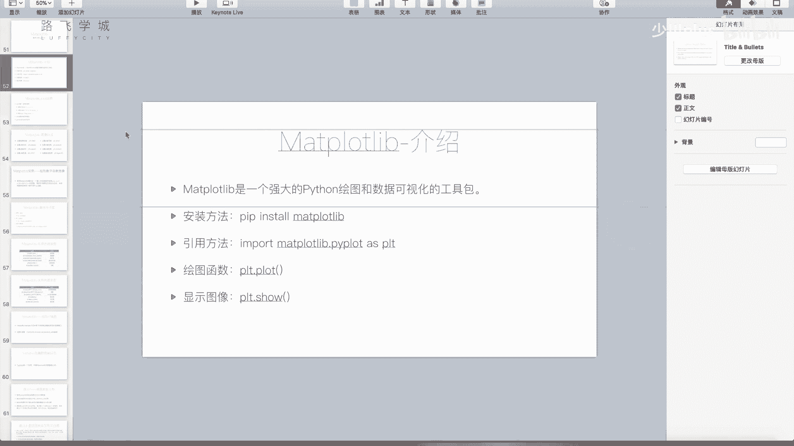

---

## 基础绘图：折线图
上一节我们介绍了如何引入Matplotlib，本节中我们来看看如何使用它绘制最简单的图表。

`plt.plot()`函数用于画图，`plt.show()`函数用于展示图形。

```python
import matplotlib.pyplot as plt
plt.plot()
plt.show()
```
运行以上代码会显示一个空的坐标轴图像，因为`plot()`函数没有传入任何数据。

### 绘制折线图
`plot()`函数的核心功能是绘制**折线图**。它主要接受两个参数：X轴坐标列表和Y轴坐标列表。

```python
plt.plot([1, 2, 3, 4], [2, 4, 6, 8])
plt.show()
```
这段代码会将点(1,2)、(2,4)、(3,6)、(4,8)连接起来，形成一条直线。如果Y值不规则，则会形成折线。

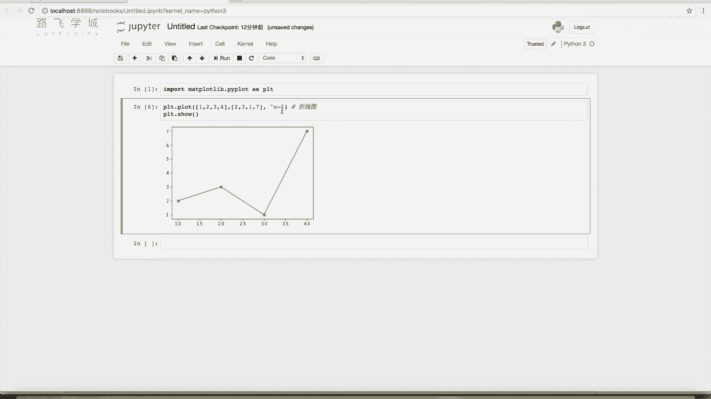

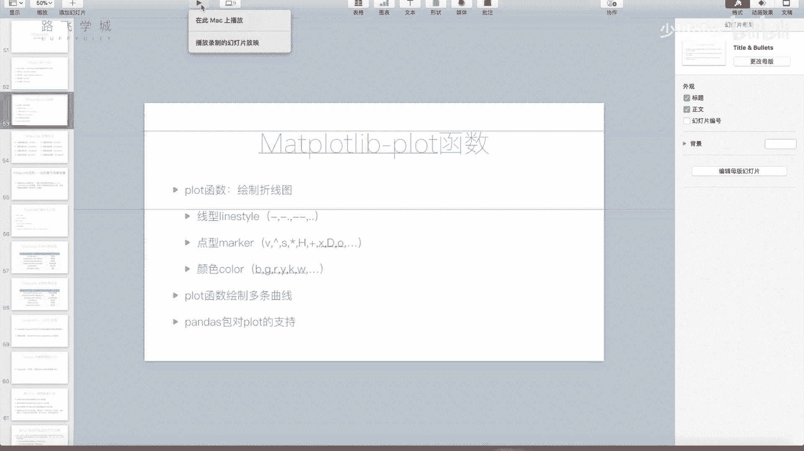

```python
plt.plot([1, 2, 3, 4], [2, 3, 5, 7])
plt.show()
```

参数不仅可以传递列表，也可以传递之前学过的NumPy数组。

---


## 自定义图表样式
除了数据点，我们还可以自定义线条的样式、数据点的标记和颜色。这通过向`plot()`函数传入第三个参数（一个格式字符串）来实现。

格式字符串的语法通常为：`[颜色][标记][线型]`。

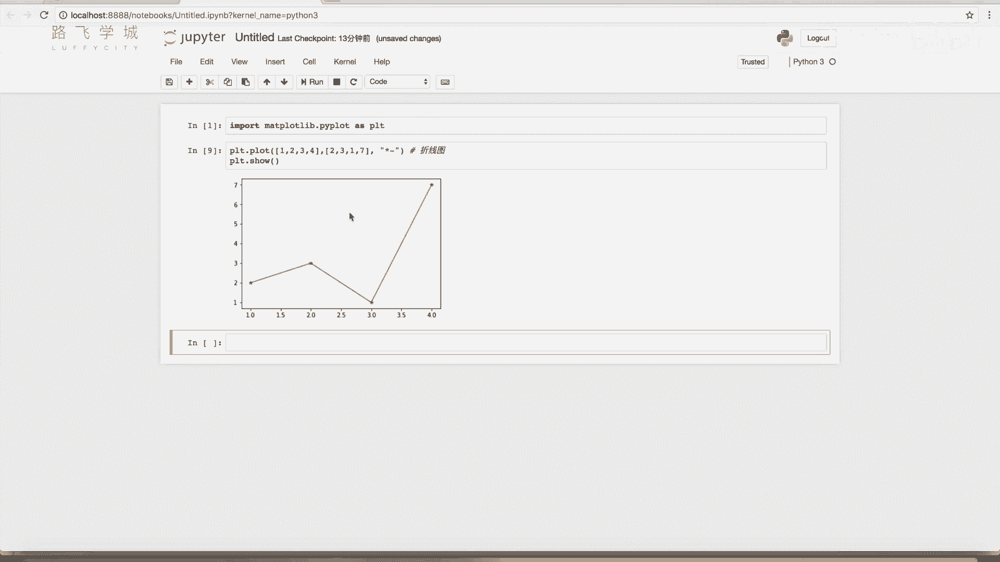

以下是几个关键组成部分的示例：

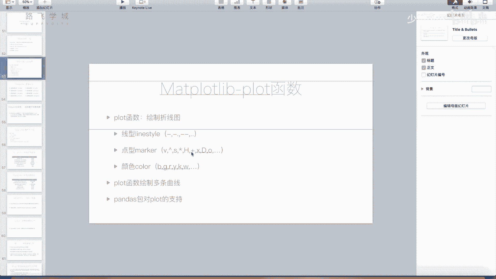

### 1. 标记 (Marker)
标记用于突出显示数据点。
*   `‘o’`：小圆点
*   `‘v’`：倒三角形
*   `‘^’`：正三角形
*   `‘*’`：五角星
*   `‘+’`：加号
*   `‘x’`：叉号
*   `‘d’`：菱形 (Diamond)
*   `‘h’`：六边形 (Hexagon)

示例：只显示数据点（不连线）
```python
plt.plot([1,2,3,4], [1,4,9,16], ‘o’)
plt.show()
```

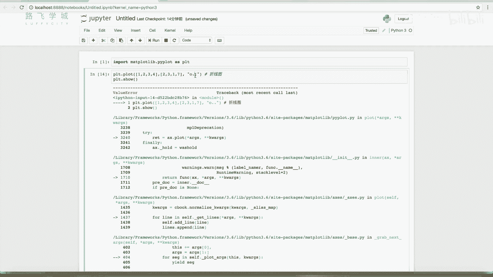

### 2. 线型 (Linestyle)
线型决定连接数据点的线条样式。
*   `‘-’`：实线 (solid line)
*   `‘--’`：虚线 (dashed line)
*   `‘-.’`：点划线 (dash-dot line)
*   `‘:’`：点线 (dotted line)

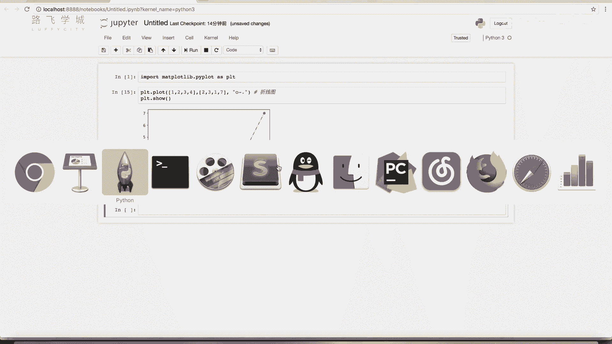

### 3. 颜色 (Color)
颜色用于指定线条或标记的颜色。
*   `‘b’`：蓝色 (Blue)
*   `‘g’`：绿色 (Green)
*   `‘r’`：红色 (Red)
*   `‘y’`：黄色 (Yellow)
*   `‘k’`：黑色 (Black)
*   `‘w’`：白色 (White)

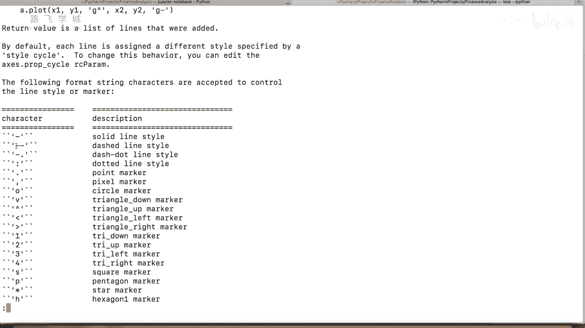

### 组合示例
以下代码绘制一条红色的虚线，并用圆圈标出数据点：
```python
plt.plot([1,2,3,4], [1,4,9,16], ‘r--o’)
plt.show()
```
也可以使用关键字参数分别指定，这样更清晰：
```python
plt.plot([1,2,3,4], [1,4,9,16], color=‘red’, linestyle=‘--’, marker=‘o’)
plt.show()
```

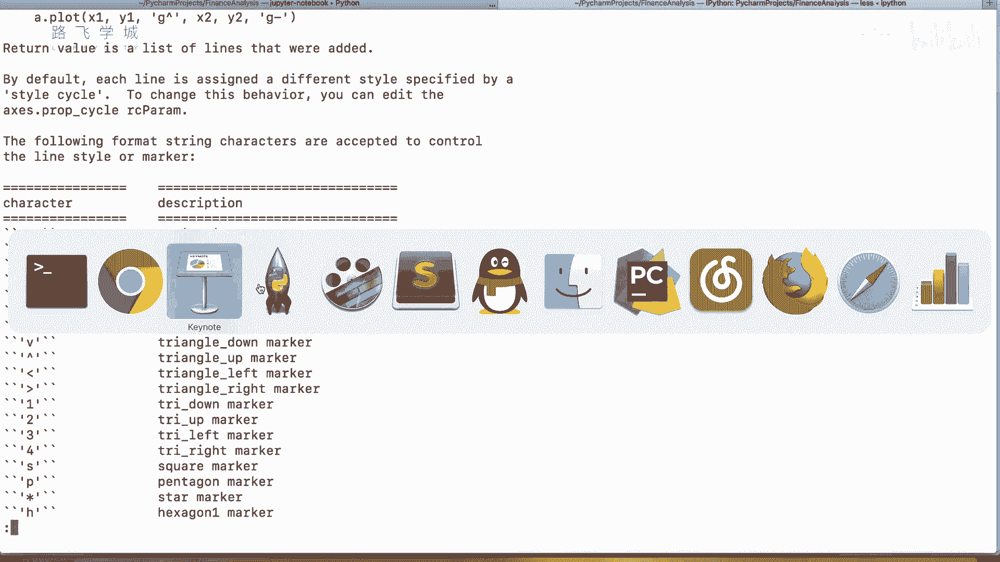

---

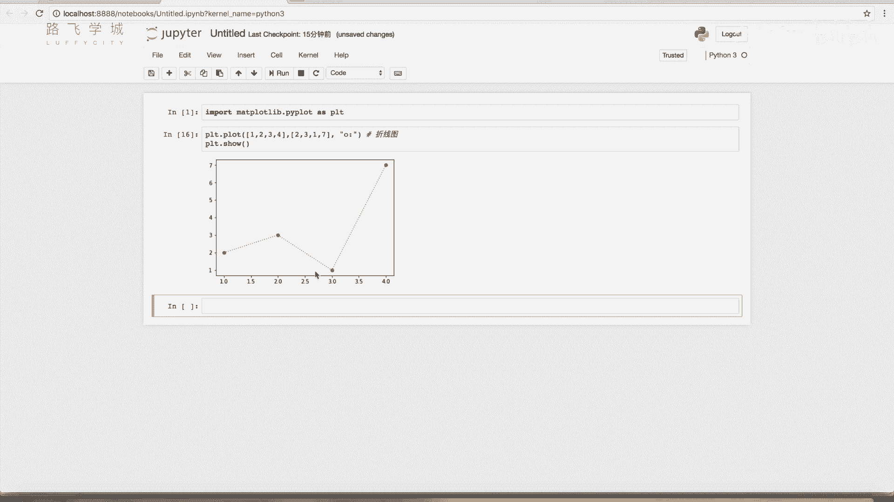

## 高级功能
掌握了单条折线图的绘制后，我们来看看一些更复杂的用法。

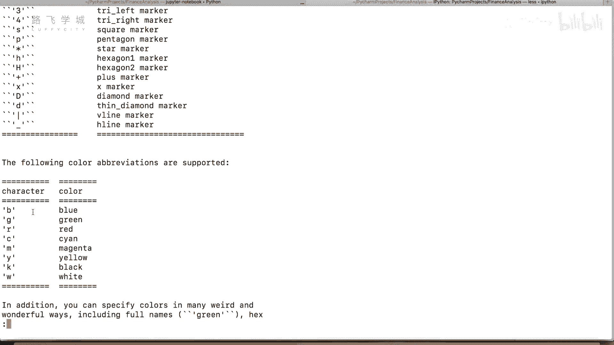

### 在同一坐标系中绘制多条线
只需多次调用`plt.plot()`函数，然后再调用`plt.show()`即可。

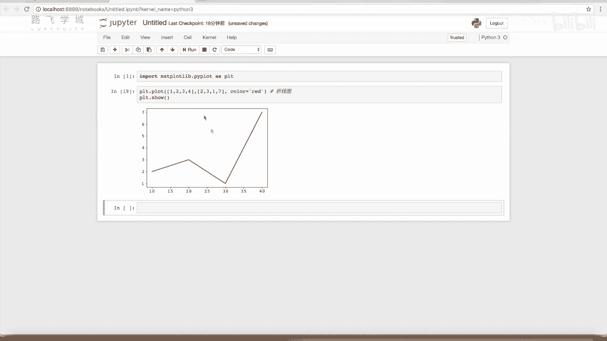

```python
import matplotlib.pyplot as plt
# 第一条线
plt.plot([1, 2, 3, 4], [1, 4, 9, 16], ‘r-’)
# 第二条线
plt.plot([1, 2, 3, 4], [2, 5, 10, 17], ‘b--o’)
plt.show()
```
这样，两个数据集就会显示在同一张图中。


---

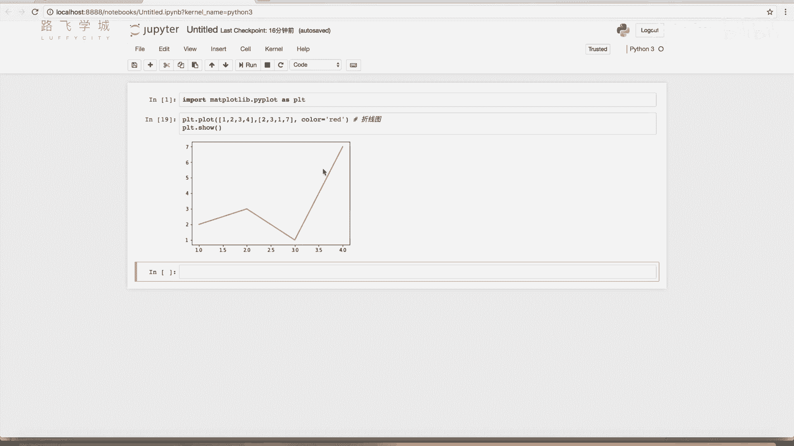

## 总结
本节课中我们一起学习了Matplotlib的基础知识。我们了解了Matplotlib是一个用于数据可视化的Python工具包，掌握了如何使用`plt.plot()`和`plt.show()`绘制基础的折线图，并学会了通过格式字符串或关键字参数自定义线条的颜色、标记和线型。最后，我们还了解了如何在同一张图中绘制多条折线。这些是进行金融数据图表化展示的基础技能。