# Python金融量化与股票分析：P33：plot函数周边详解 📊

在本节课中，我们将深入学习Matplotlib库中`plot`函数的相关周边功能。上一节我们介绍了`plot`函数的基本用法，本节中我们来看看如何绘制多条曲线，并为图表添加标题、坐标轴标签、刻度以及图例等元素，使图表更加完整和专业。

## 绘制多条曲线

在单个图表中绘制多条曲线非常简单。你只需要多次调用`plot`函数即可。Matplotlib库会累积所有调用过的`plot`命令，直到你调用`show()`函数，然后将所有曲线绘制在同一张图中。

以下是绘制多条曲线的示例代码：

```python
import matplotlib.pyplot as plt

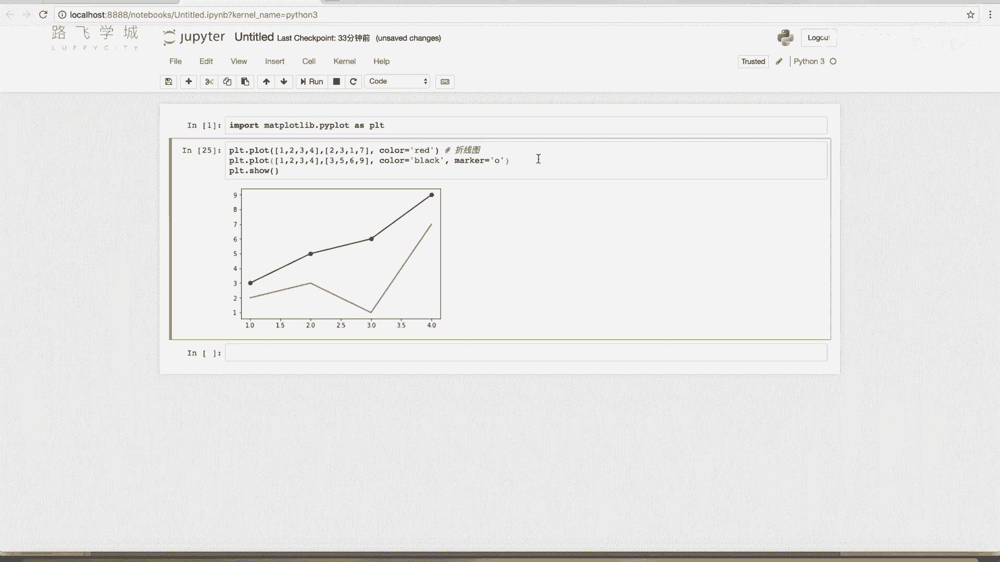

# 绘制第一条曲线
plt.plot([1, 2, 3, 4], [1, 4, 9, 16], 'ro-', label='Line A')
# 绘制第二条曲线
plt.plot([1, 2, 3, 4], [2, 5, 10, 17], 'bo--', label='Line B')

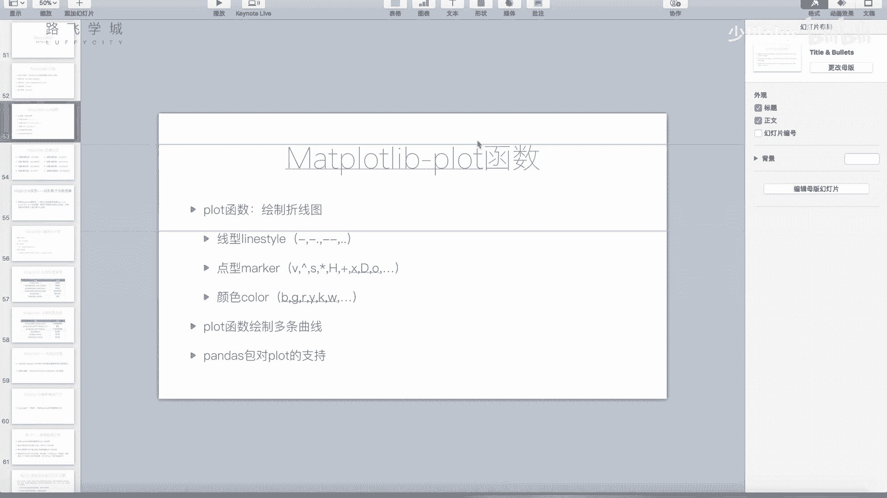

plt.show()
```

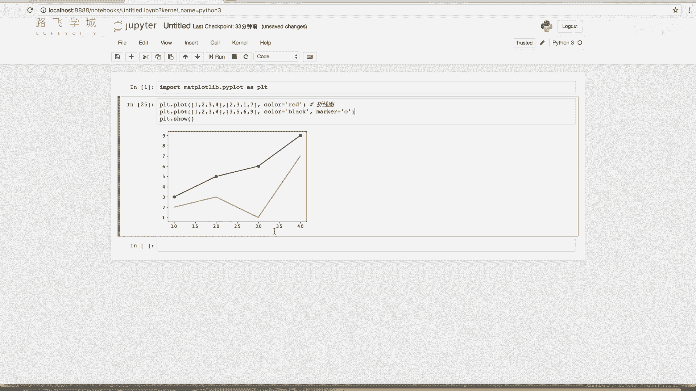

## 设置图表标题与坐标轴标签

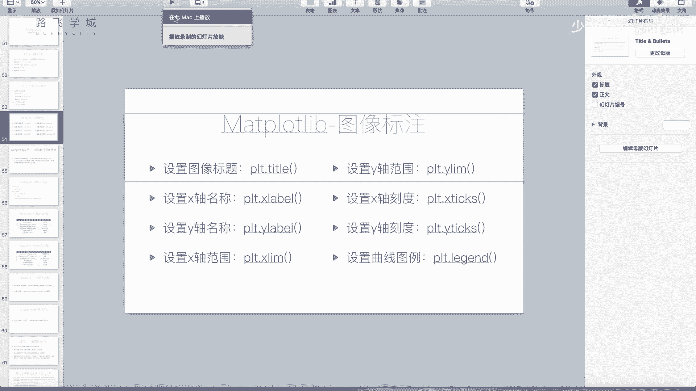

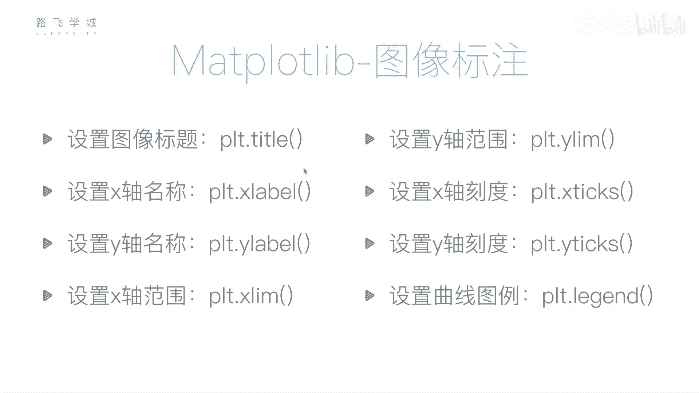

一个完整的图表通常包含标题以及X轴和Y轴的标签，用于说明图表内容和坐标轴的含义。

以下是设置这些元素的函数：

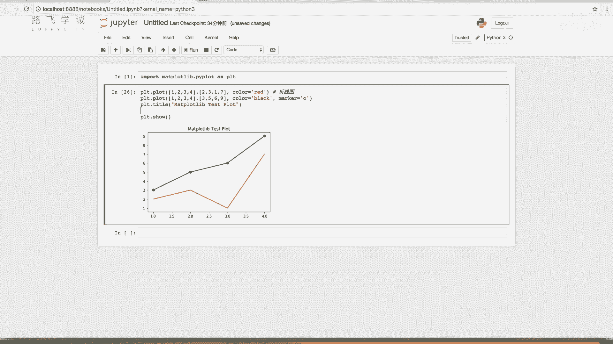

*   **`plt.title()`**: 用于设置图表的标题。
*   **`plt.xlabel()`**: 用于设置X轴的标签。
*   **`plt.ylabel()`**: 用于设置Y轴的标签。

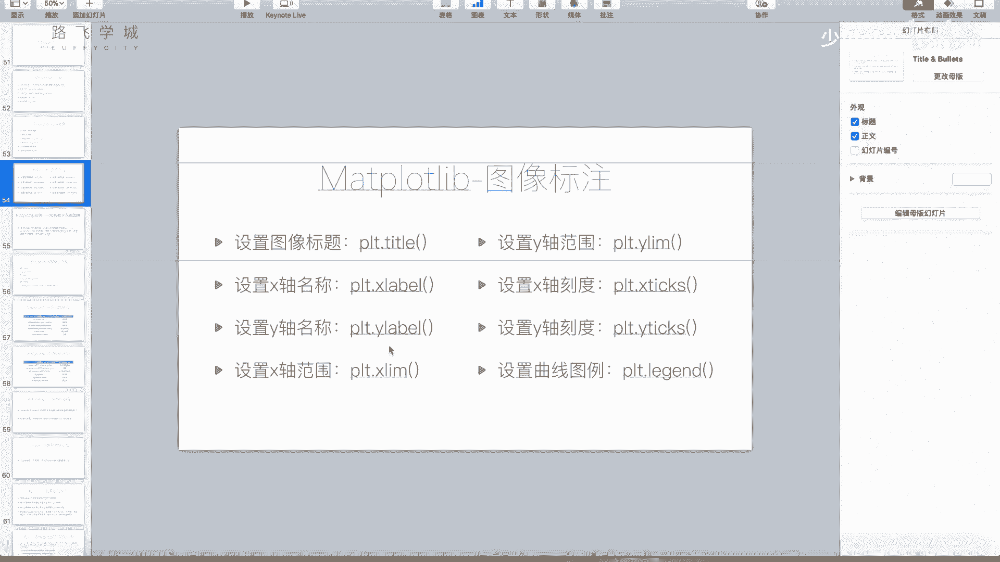

这些函数需要在调用`plt.show()`之前执行。示例代码如下：

```python
plt.title('Matplotlib Plot Test')
plt.xlabel('X Label')
plt.ylabel('Y Label')
plt.show()
```

## 设置坐标轴范围

默认情况下，Matplotlib会自动调整坐标轴范围以适应数据。但有时你可能需要手动设置。

以下是设置坐标轴范围的函数：

*   **`plt.xlim(min, max)`**: 设置X轴显示的最小值和最大值。
*   **`plt.ylim(min, max)`**: 设置Y轴显示的最小值和最大值。

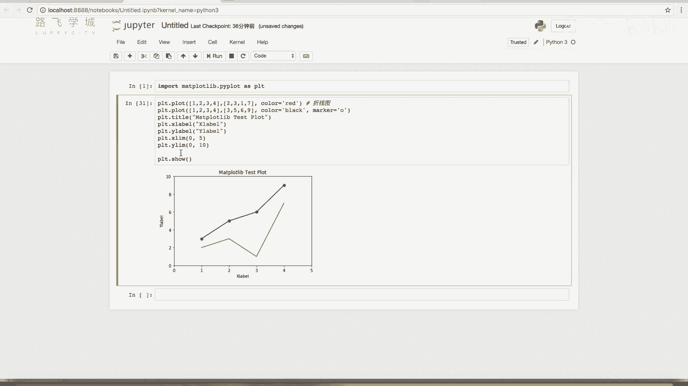

示例代码如下：


```python
plt.xlim(0, 5)  # 设置X轴范围为0到5
plt.ylim(0, 20) # 设置Y轴范围为0到20
plt.show()
```

## 设置坐标轴刻度

你可以自定义坐标轴上的刻度位置和标签，这在处理分类数据或特定间隔时非常有用。

以下是设置刻度的函数：

*   **`plt.xticks(ticks, labels)`**: 设置X轴的刻度位置和可选的标签。
*   **`plt.yticks(ticks, labels)`**: 设置Y轴的刻度位置和可选的标签。

`ticks`参数是一个列表或数组，指定刻度出现的位置。`labels`参数是一个可选的列表，用于替换对应位置的数字标签。

以下是设置刻度的示例：

```python
import numpy as np

# 设置X轴刻度为0, 2, 4, 6, 8, 10
plt.xticks(np.arange(0, 11, 2))
# 设置X轴刻度并用字母标签替换
plt.xticks([0, 1, 2, 3, 4], ['A', 'B', 'C', 'D', 'E'])
plt.show()
```

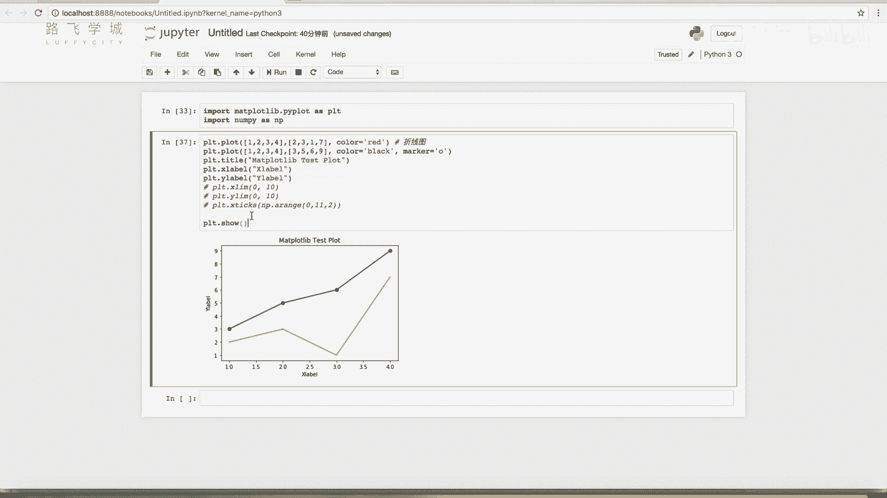

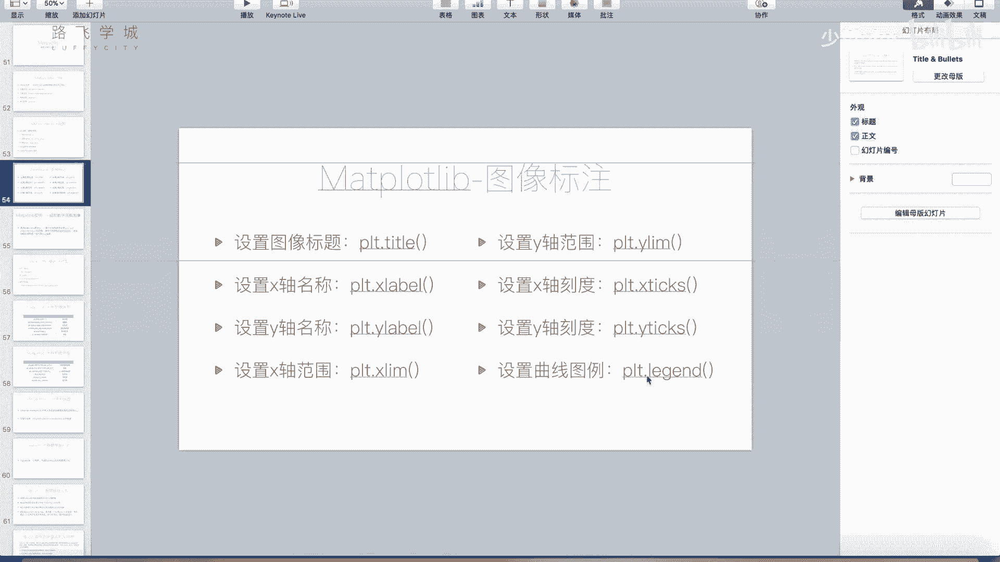

## 添加图例

当图表中有多条曲线时，添加图例（Legend）至关重要，它用于说明每条曲线代表的数据系列。

添加图例最推荐的方法是在调用`plot`函数时，通过`label`参数为每条曲线指定一个标签名称，然后调用`plt.legend()`函数。

示例代码如下：

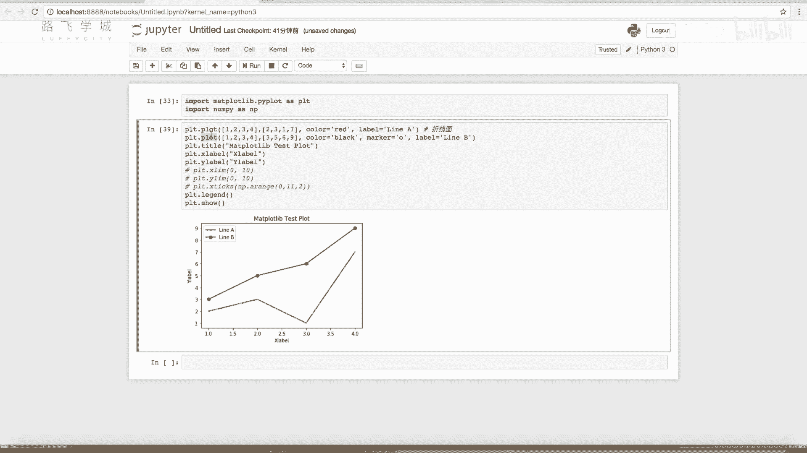

```python
# 绘制曲线并指定标签
plt.plot([1, 2, 3, 4], [1, 4, 9, 16], label='Price Trend')
plt.plot([1, 2, 3, 4], [2, 5, 10, 17], label='Moving Average')

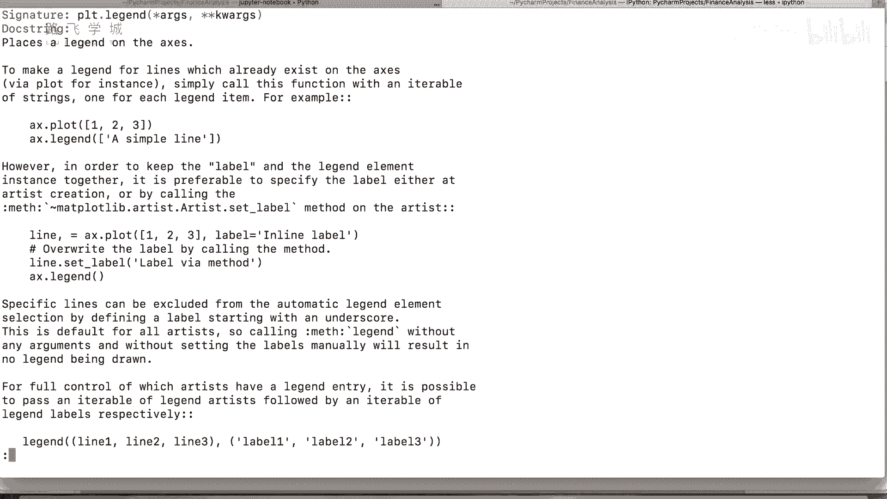

# 显示图例
plt.legend()
plt.show()
```

`plt.legend()`函数还有其他用法，例如手动传入标签列表，但上述方法最为直观和常用。

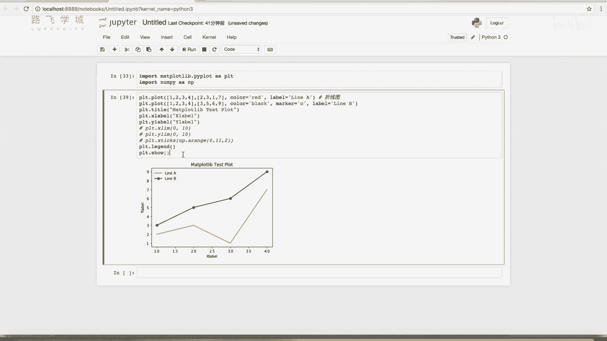

---

本节课中我们一起学习了`plot`函数的周边功能。我们掌握了如何在同一图表中绘制多条曲线，以及如何通过设置标题、坐标轴标签、范围、刻度和图例来完善和美化图表，这些是制作专业数据可视化图表的基础技能。