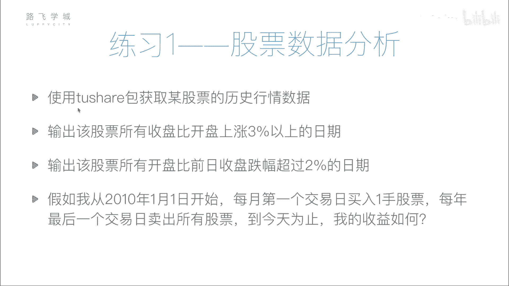
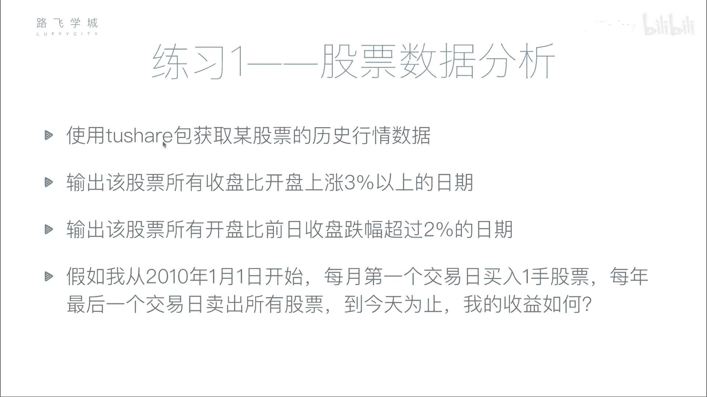
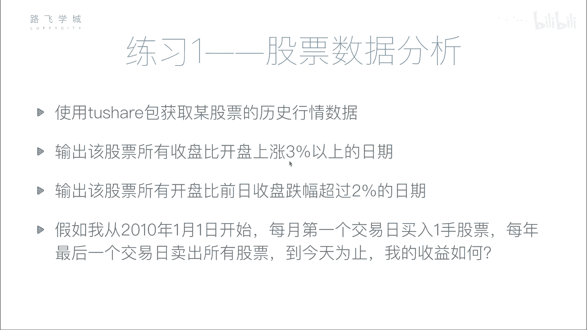
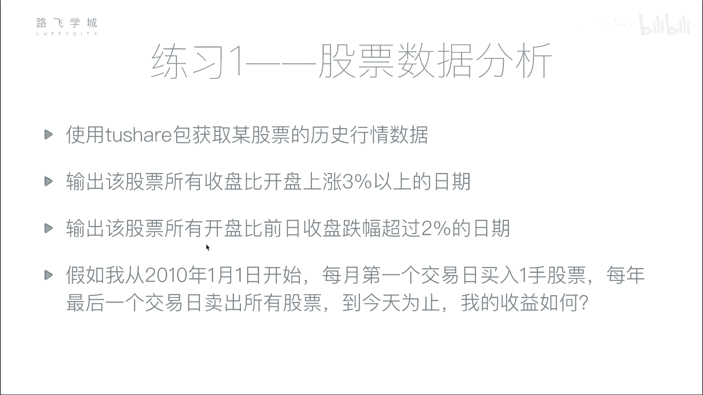
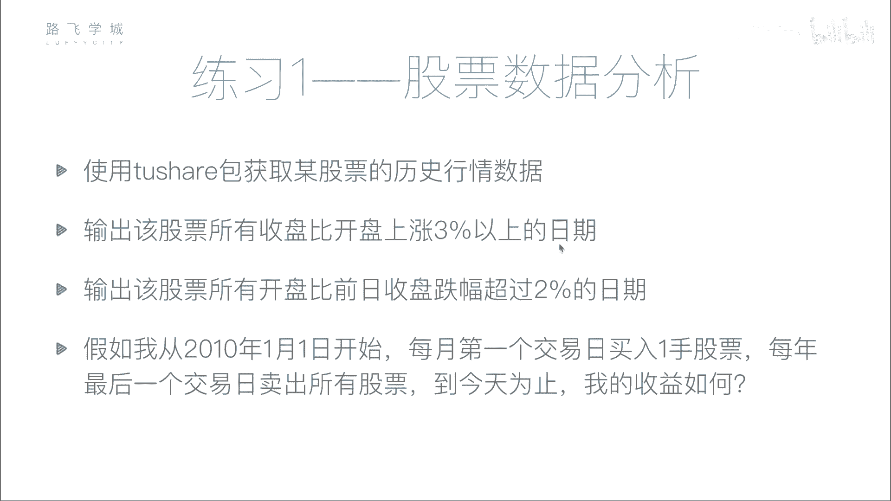
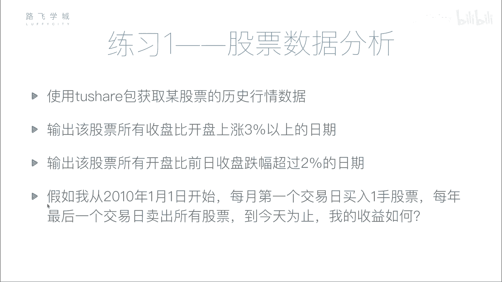
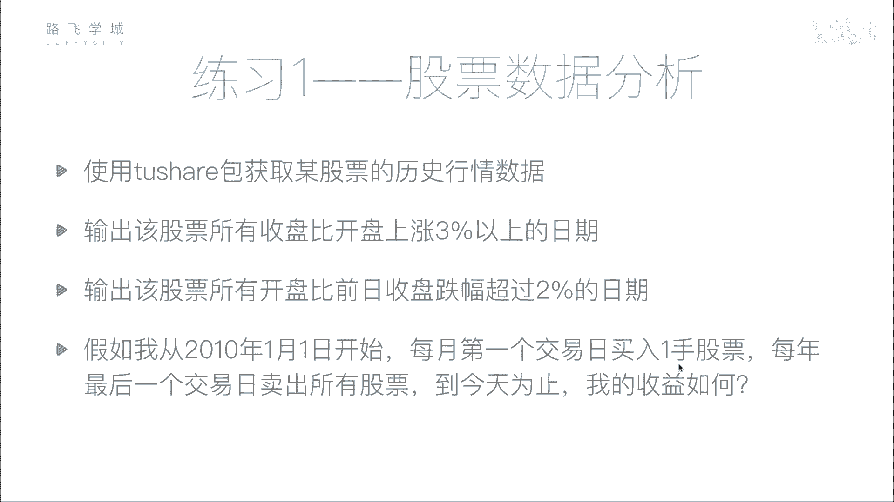

# Python金融量化分析实战：P40：股票分析作业说明 📊



## 概述
在本节课中，我们将通过一个综合性的练习，学习如何使用Python进行基础的股票数据分析。我们将从获取数据开始，逐步完成数据筛选、条件分析，并最终模拟一个简单的投资策略来计算收益。这个练习将帮助我们巩固数据处理技能，并为后续更复杂的量化分析打下基础。

## 作业内容详解

### 第一步：获取并保存股票数据
首先，我们需要使用 `tushare` 包获取某只股票的历史行情数据。为了避免每次分析都重复调用接口，我们将数据保存到本地的CSV文件中。



以下是具体步骤：
1.  选择一只股票（例如，股票代码为 `000001.SZ`）。
2.  获取其从指定起始日期（如2010-01-01）至今的历史行情数据。
3.  将获取到的 `DataFrame` 数据保存为CSV文件。

**核心代码示例：**
```python
import tushare as ts
import pandas as pd


# 获取股票数据
df = ts.get_k_data('000001', start='2010-01-01')
# 保存到CSV文件
df.to_csv('stock_data.csv', index=False)
```



### 第二步：筛选单日涨幅数据
上一节我们介绍了如何获取和保存数据，本节中我们来看看如何对数据进行筛选分析。第一个任务是：找出所有收盘价比开盘价上涨超过3%的交易日。



这属于同一天内的数据比较。我们可以通过计算涨跌幅，并使用布尔索引进行筛选。

**核心公式与代码：**
涨幅计算公式为：`(收盘价 - 开盘价) / 开盘价 * 100%`
```python
# 读取数据
df = pd.read_csv('stock_data.csv')
# 计算单日涨幅
df['daily_pct_change'] = (df['close'] - df['open']) / df['open'] * 100
# 使用布尔索引筛选涨幅>3%的日期
up_dates = df[df['daily_pct_change'] > 3]['date'].tolist()
print("涨幅超过3%的日期：", up_dates)
```



### 第三步：筛选跳空低开数据
接下来，我们进行跨日的数据比较。第三个任务是：找出所有开盘价较前一日收盘价跌幅超过2%的日期。



这需要比较当前交易日的开盘价和前一个交易日的收盘价。Pandas的 `shift()` 函数可以帮助我们方便地获取前一行的数据。



**核心代码示例：**
```python
# 计算开盘价相对于前日收盘价的涨跌幅
df['gap_change'] = (df['open'] - df['close'].shift(1)) / df['close'].shift(1) * 100
# 筛选跌幅超过2%的日期
gap_down_dates = df[df['gap_change'] < -2]['date'].tolist()
print("跳空低开超过2%的日期：", gap_down_dates)
```

### 第四步：模拟定期投资策略
前面三问都是基础的数据分析，最后一问我们将模拟一个简单的投资策略，并计算其收益。

**策略规则如下：**
*   **买入**：从2010年1月1日开始，每月第一个交易日买入100股。
*   **卖出**：每年最后一个交易日，卖出全部持仓。
*   **计算终点**：计算截至2017年12月（或你进行分析的日期）的收益。

**收益计算逻辑：**
1.  初始现金（例如：100,000元）。
2.  每次买入时，现金减少 `买入价格 * 100`。
3.  每年年底卖出时，现金增加 `卖出价格 * 持有股数`。
4.  最终收益 = （最终现金 + 股票当前市值） - 初始现金。
    *   股票当前市值 = 当前日期开盘价 * 当前持有股数。

以下是实现该策略的关键步骤列表：
*   **步骤一**：确保数据已按日期排序。
*   **步骤二**：识别出每月第一个交易日和每年最后一个交易日。
*   **步骤三**：循环遍历每个交易日，在买入日执行买入操作，在卖出日执行卖出操作，并更新现金和持股数量。
*   **步骤四**：在最终日期，计算股票市值并与现金相加，减去初始资金得到总收益。

**核心代码结构示意：**
```python
# 初始化变量
initial_cash = 100000
cash = initial_cash
shares_held = 0

# 策略执行循环 (伪代码逻辑)
for date, row in df.iterrows():
    if is_first_trading_day_of_month(date):
        # 执行买入
        cost = row['open'] * 100
        cash -= cost
        shares_held += 100
    if is_last_trading_day_of_year(date):
        # 执行卖出
        revenue = row['open'] * shares_held
        cash += revenue
        shares_held = 0

# 计算最终收益
final_stock_value = df.iloc[-1]['open'] * shares_held
total_asset = cash + final_stock_value
profit = total_asset - initial_cash
print(f"策略总收益为：{profit:.2f} 元")
```

## 总结
本节课我们一起学习了股票数据分析的完整流程。我们从使用 `tushare` 获取数据开始，接着练习了使用布尔索引进行单条件数据筛选，以及利用 `shift()` 函数进行跨行数据比较。最后，我们模拟了一个简单的定期定额投资策略，并通过跟踪现金和持股状态计算了策略收益。这个练习涵盖了量化分析中数据获取、处理、分析和回测的基本环节，是后续学习更复杂模型的重要基础。请大家尝试独立完成，并在下一个视频中查看参考答案和详细讲解。