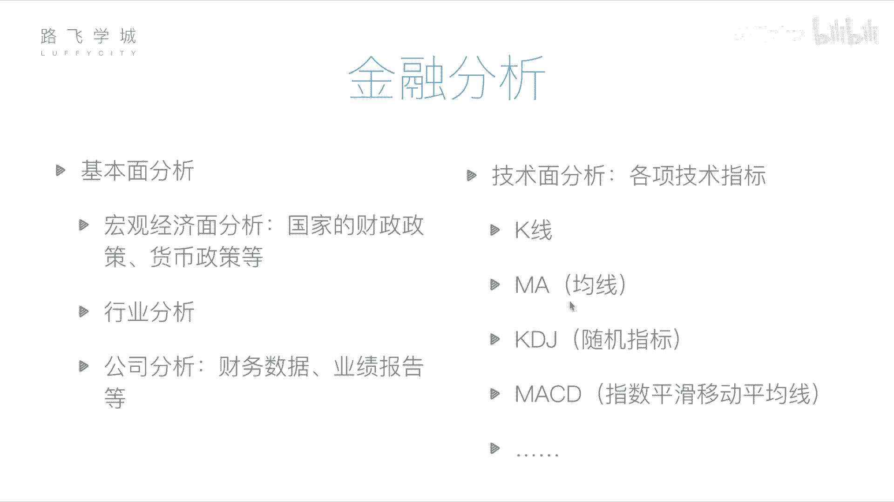
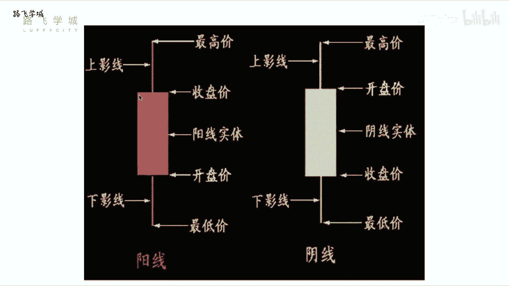
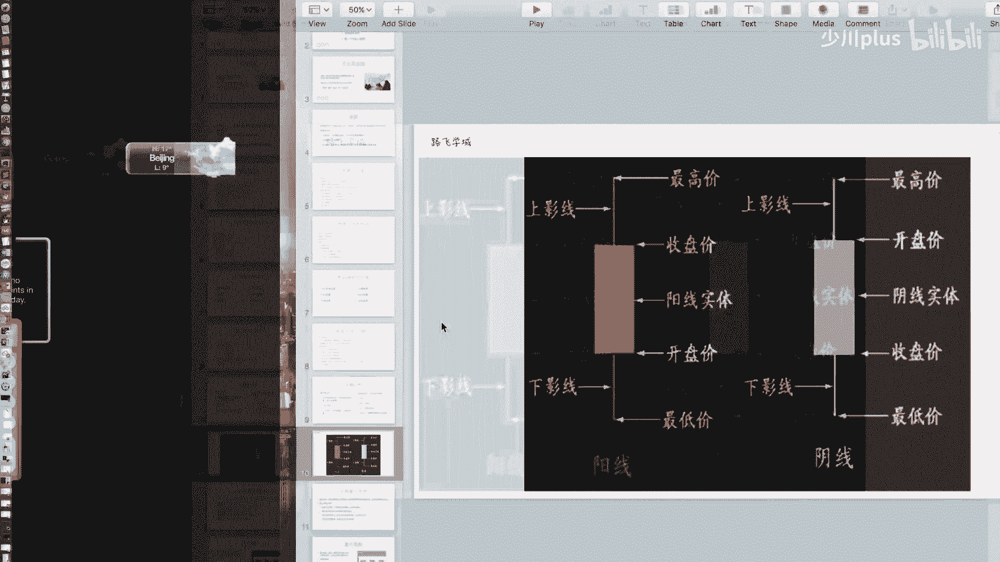
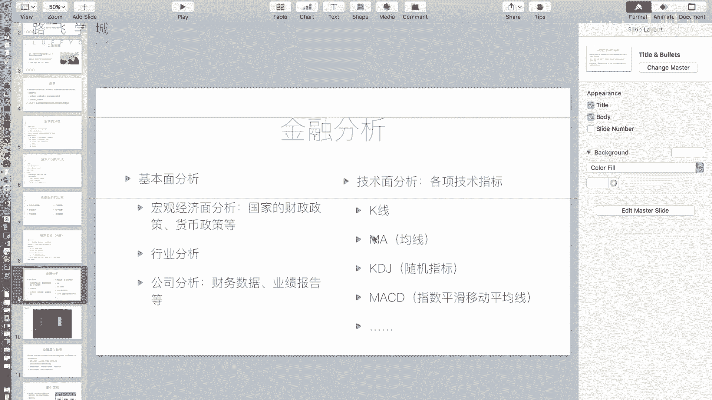
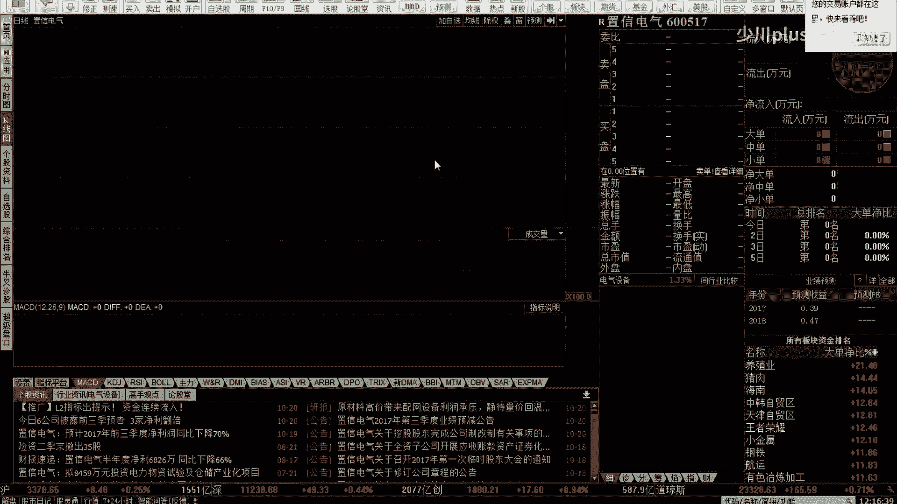
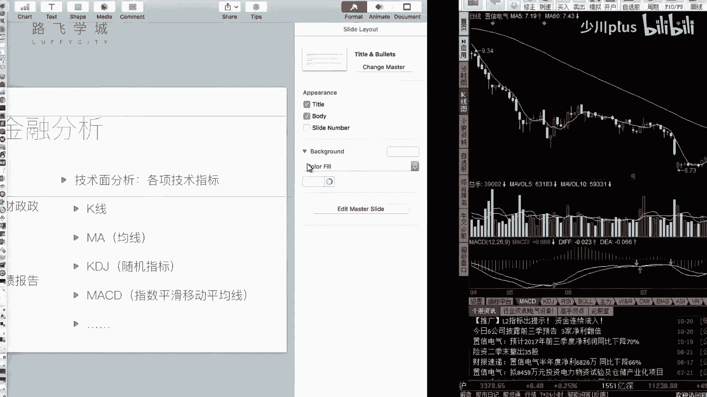

# Python金融量化分析：P5：05 金融分析 📈

在本节课中，我们将要学习金融分析的核心方法。上一节我们介绍了金融和股票的基础知识，本节中我们来看看如何通过分析手段来判断股票的买卖时机，而不是盲目投资。

金融分析主要分为两种方法：基本面分析和技术面分析。

## 基本面分析

基本面分析的核心是评估公司的运营状况，即我们之前提到的“公司自身因素”。通过分析当前经济状况、行业发展以及公司具体经营情况，来决定是否购买其股票。

以下是基本面分析的三个层面：

1.  **宏观经济面分析**：分析国家的财政政策、货币政策等宏观因素，判断资金流向。但需注意，宏观经济规律并非总是与股市表现一致。
2.  **行业分析**：判断整个行业的发展前景。可以通过观察该行业内几只代表性股票的走势来辅助判断。
3.  **公司分析**：具体分析目标公司的财务状况。上市公司需定期公开经审计的财务报表，这些数据相对客观可靠。通过分析财报（如利润、每股收益等）及公司新闻、实地考察等信息，判断公司运营是否良好。如果公司运营非常好且盈利能力强，则可以考虑购买其股票。

## 技术面分析

上一节我们介绍了基本面分析，本节中我们来看看技术面分析。技术面分析的核心观点是：所有信息都已蕴含在市场交易数据中。它通过分析历史市场走势和一系列技术指标来预测未来价格动向。

以下是两个基础且重要的技术指标：

1.  **K线**：K线是反映单个交易日价格变动的图表。一根标准的K线包含四个价格：开盘价、收盘价、最高价和最低价。
    *   **阳线**（通常为红色或空心）：表示当日收盘价高于开盘价，股价上涨。
    *   **阴线**（通常为绿色或实心）：表示当日收盘价低于开盘价，股价下跌。
    *   **实体部分**：表示开盘价与收盘价之间的价格区间。
    *   **影线部分**：上影线顶端表示最高价，下影线底端表示最低价。

    K线的计算公式可以理解为对四个关键价格点的图形化封装。特殊形态如“十字星”（开盘价等于收盘价）也具有分析意义。

2.  **移动平均线（MA）**：均线是通过计算过去一段时间内收盘价的平均值，并将每日的点连接起来形成的曲线。它用于平滑价格波动，反映趋势。
    *   **MA5**：5日均线，计算过去5个交易日收盘价的平均值。
    *   **MA60**：60日均线，计算过去60个交易日收盘价的平均值。

    均线的计算公式为：
    **MA(N) = (P1 + P2 + ... + PN) / N**
    其中，`P1` 到 `PN` 代表过去N个交易日的收盘价。

    在量化策略中，常使用“双均线策略”，例如观察短期均线（如MA5）与长期均线（如MA60）的交叉情况来产生交易信号。

---

本节课中我们一起学习了金融分析的两大支柱：基本面分析和技术面分析。基本面分析侧重于公司的内在价值，而技术面分析则专注于市场价格行为本身。理解K线和移动平均线（MA）是进入技术分析领域的第一步，后续我们将基于这些概念构建具体的量化交易策略。