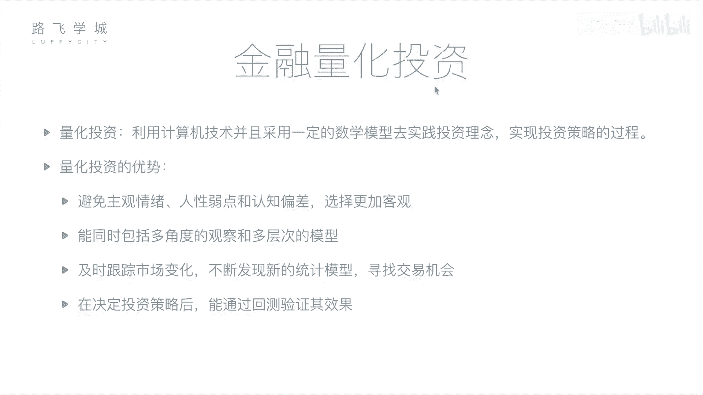
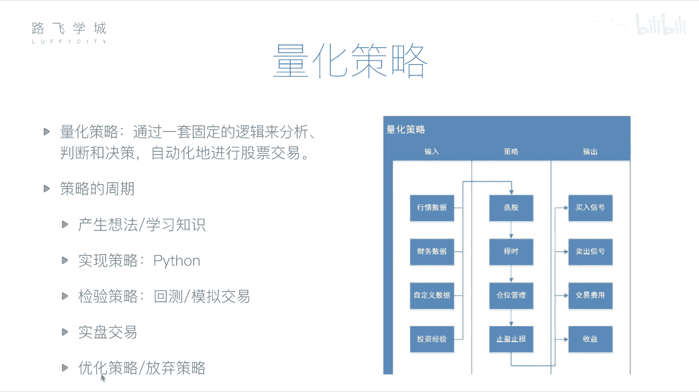

# Python金融量化分析：P6：06：金融量化投资介绍 📈

## 概述
在本节课中，我们将学习金融量化投资的核心概念。我们将了解什么是量化投资，它与传统人工投资的区别，以及一个量化策略是如何构建和运行的。通过本课，你将掌握量化分析的基本框架。

---

## 量化投资的概念
上一节我们介绍了金融分析的基本面与技术面。本节中我们来看看如何将这种分析过程自动化。

金融分析涉及对公司和股票的判断。这个判断过程可以交给计算机来完成。无论是基本面分析所需的财务报表，还是技术面分析所需的历史价格与交易记录，计算机都能获取并处理。这种利用计算机进行分析和决策的过程，就称为**量化投资**或**量化分析**。

所谓量化投资，是指**利用计算机技术，并采用一定的数学模型，去实践投资理念，实现投资策略的过程**。它包含三个重要部分：
1.  **计算机技术**：即使用编程的方式实现。
2.  **数学模型**：即具体的投资策略和套路，例如均线就是一个数学模型。
3.  **实践**：用编写好的程序去执行投资，或预先进行测试验证。

---

## 量化投资的优势
相较于人工投资，量化投资具有以下优势：

以下是量化投资的四个主要优点：

1.  **避免主观情绪干扰**：人类投资者容易受到情感、人性弱点和认知偏差的影响。例如，可能因为持有某支股票时间过长而产生感情，即使各种迹象表明应该卖出也舍不得；或者因为股票连续几天下跌而产生恐慌，在低点错误卖出。量化投资基于预设的规则和数据进行决策，更加客观。
2.  **处理海量信息与多维度分析**：计算机可以同时、快速地处理大量信息，从多个角度（如技术指标、财务报表、行业新闻等）分析成千上万只股票。而人类投资者在有限时间内只能深入分析少数几只。
3.  **及时跟踪与发现机会**：市场每时每刻都在变化。计算机程序可以7x24小时不间断地监控市场，一旦出现符合策略的买卖机会，能够立即反应，速度远超人工盯盘。同时，程序也更容易尝试和集成新的分析方法或策略。
4.  **通过回测验证策略**：在将策略投入真实交易前，可以使用历史数据进行**回测**。回测是指用过去的数据模拟策略在过去的表现，从而评估其有效性和风险。这相当于在“实战”前进行了多次“演习”，有助于优化策略并增强信心。

---

## 量化策略的核心构成
量化交易的核心是**量化策略**，即具体的投资“套路”。一个完整的策略主要包括输入、处理逻辑和输出三部分。

### 策略输入：数据源
策略需要数据来进行分析和判断。主要的数据输入包括：

*   **行情数据**：股票的历史交易数据，如每日的开盘价、收盘价、最高价、最低价、成交量等。
*   **财务数据**：上市公司的财务报表数据，如利润表、资产负债表等。
*   **自定义数据**：任何你认为有价值的其他数据，例如通过自然语言处理分析的新闻舆情数据，甚至是某些个性化的投资经验指标。

### 策略处理：决策内容
策略程序基于输入的数据，主要完成以下四类决策：

*   **选股**：从众多股票中筛选出符合特定条件的股票。例如，筛选出市盈率低于20且近期成交量放大的所有股票。
*   **择时**：决定买卖的具体时机。目标是实现“低买高卖”，例如当股价突破30日均线时买入，跌破时卖出。
*   **仓位管理**：决定资金在不同股票之间的分配比例。例如，对上涨概率更高的股票分配更多资金。
*   **止盈止损**：设置必要的风险控制规则。
    *   **止损**：当亏损达到一定比例（如-10%）时自动卖出，防止损失扩大。
    *   **止盈**：当盈利达到一定比例（如+30%）时自动卖出，锁定利润，避免回落。

### 策略输出：执行指令
策略分析完成后，会产生具体的输出指令：

*   **买卖信号**：直接给出“买入”或“卖出”的建议。这可以是一个发送给投资者的提醒，也可以是自动发送给券商交易系统的指令。
*   **交易费用与收益报告**：计算本次交易产生的佣金、手续费等成本，并核算最终的收益或亏损，以及各项绩效指标。

---

## 量化策略的开发周期
一个量化策略从构思到应用，通常会经历一个完整的生命周期。

以下是策略开发的标准流程：

1.  **产生想法**：基于投资经验、学习的新指标或灵感，形成一个初步的策略思路。
2.  **程序实现**：使用编程语言（如Python）将想法转化为可执行的计算机程序。
3.  **回测检验**：使用历史数据运行策略程序，检验其在过去一段时间内的表现，评估盈亏和风险。
4.  **模拟交易**：在当下市场环境中，用实时数据但虚拟资金进行交易模拟，进一步验证策略在当前市场的适应性。
5.  **实盘交易/策略迭代**：如果回测和模拟交易结果令人满意，则可将策略投入实盘资金进行真实交易。在此过程中，仍需持续监控，并根据表现对策略进行优化调整或决定是否放弃。

---

## 总结
本节课中，我们一起学习了金融量化投资的基础知识。我们明确了量化投资是利用计算机和数学模型进行自动化决策的过程，并了解了其客观、高效、可回测的优势。我们深入剖析了一个量化策略的三大组成部分：**数据输入**、包含**选股、择时、仓位管理、止盈止损**的**处理逻辑**，以及**买卖信号和收益报告**的**输出**。最后，我们梳理了策略从想法产生到实盘交易的完整开发周期。接下来，我们将开始学习如何使用Python及其相关工具库来具体实现这些量化分析策略。