# 数据分析实战：P11：股票数据预处理 📊

在本节课中，我们将学习如何使用Python的Pandas库和财经数据接口包Tushare，对一个真实的股票历史行情数据集进行预处理。我们将从获取数据开始，逐步完成数据清洗、类型转换和索引设置，为后续的金融量化分析打下基础。

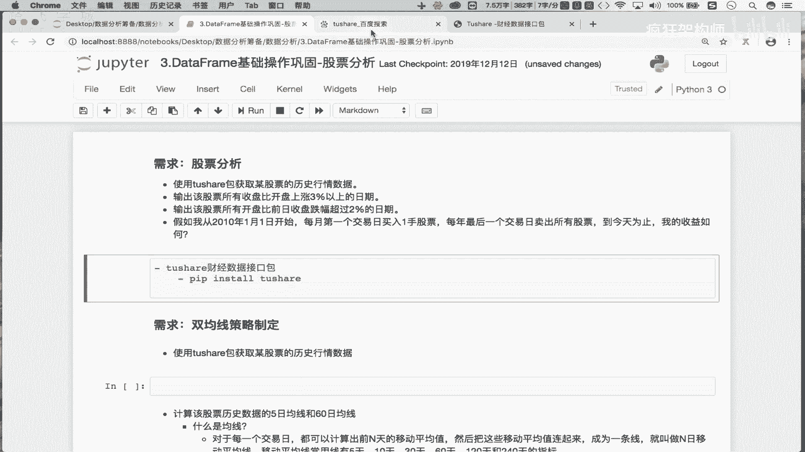

上一节我们介绍了DataFrame的基础操作，本节中我们来看看如何将这些操作应用到一个实际的股票数据分析项目中。

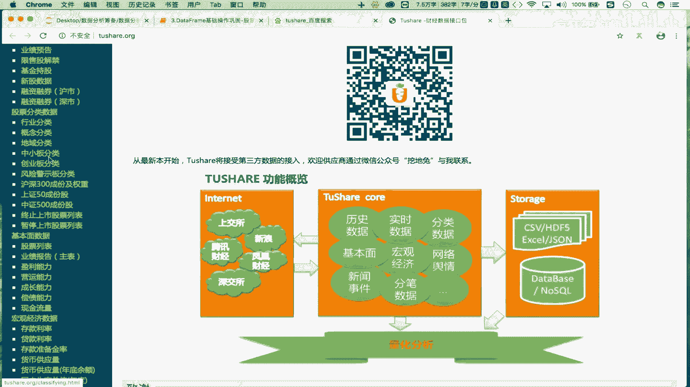

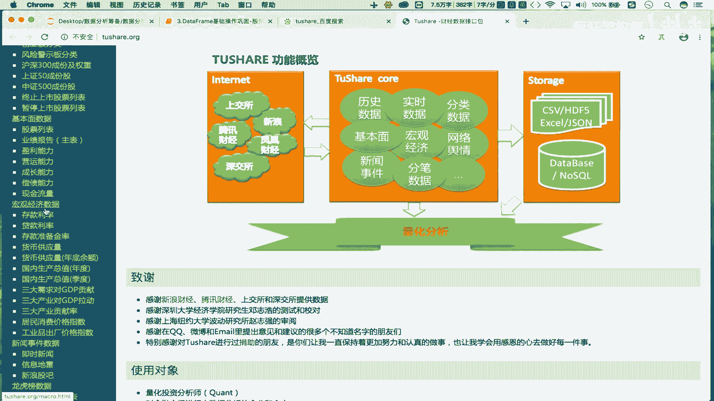

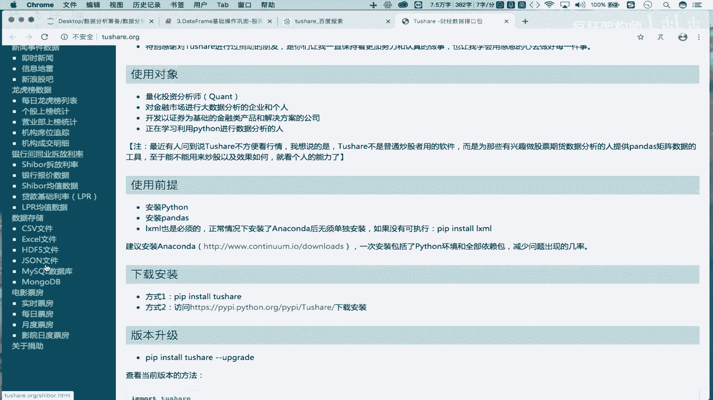

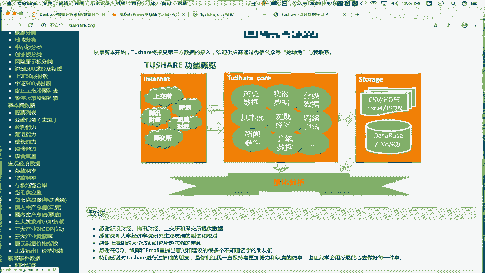

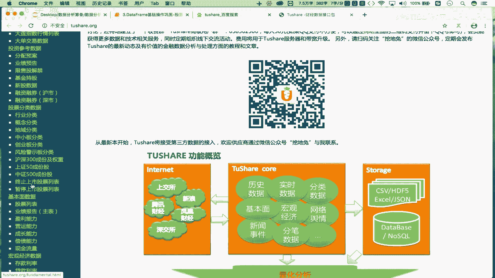

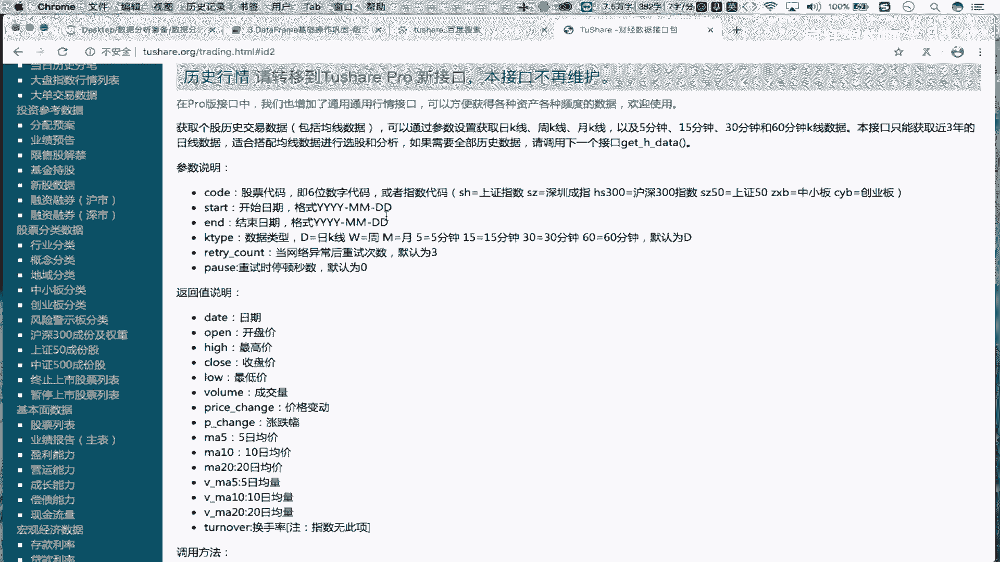

## 获取股票历史数据 📈

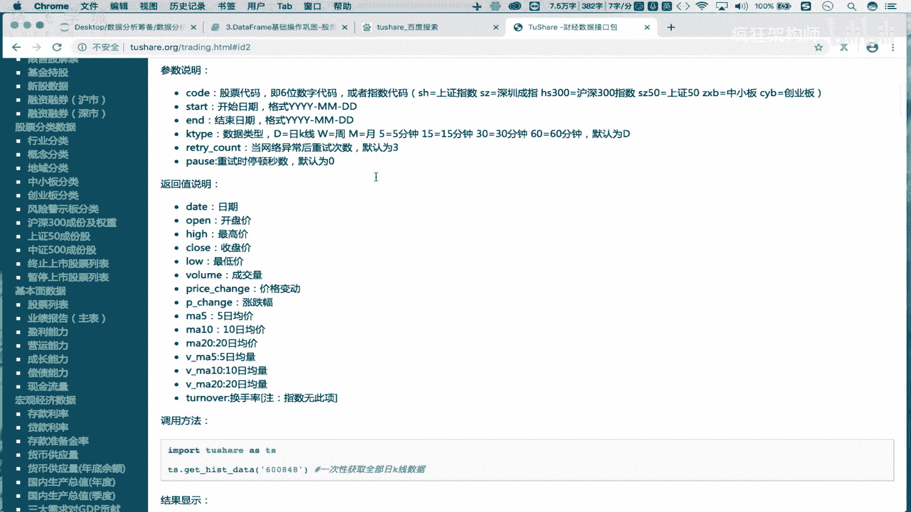

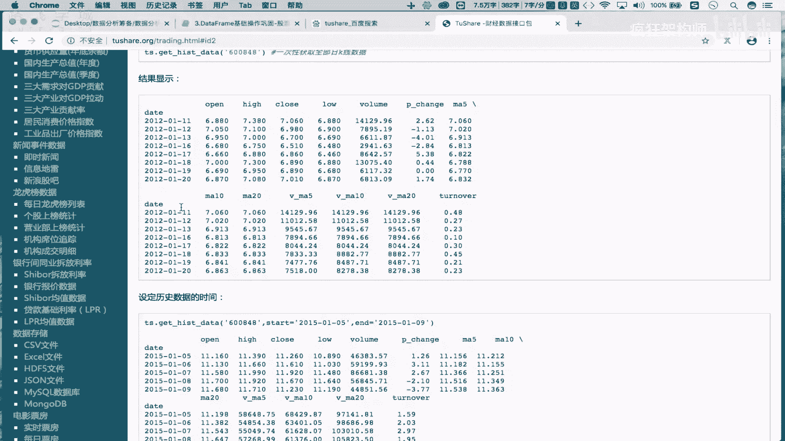

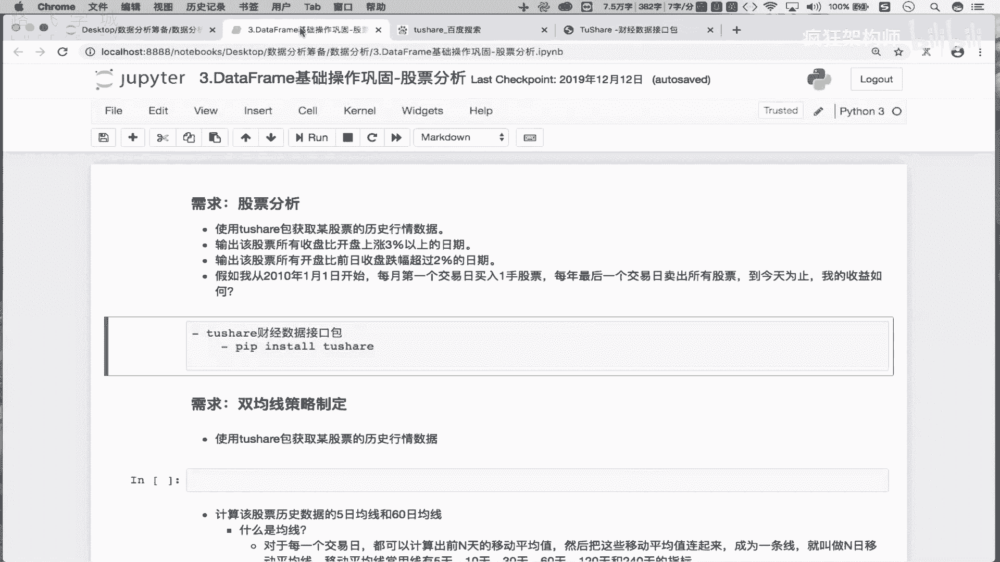

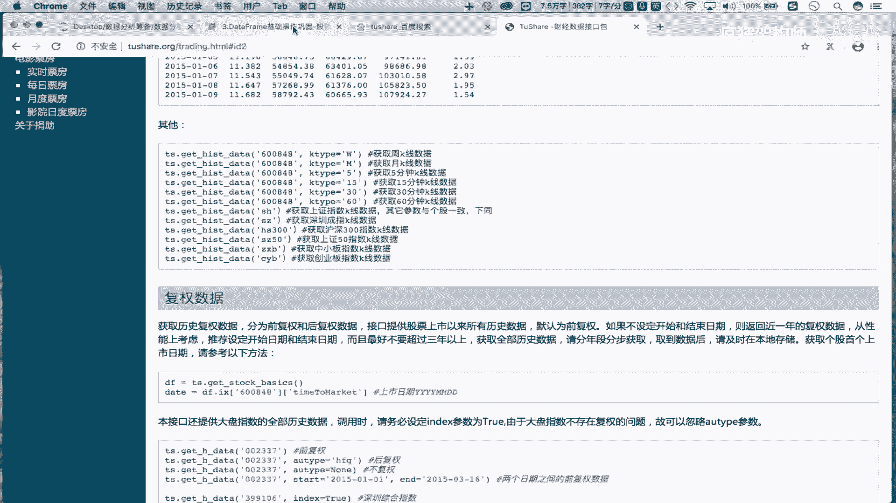

要进行股票分析，首先需要获取历史交易数据。我们使用`Tushare`这个免费的Python财经数据接口包来获取数据。

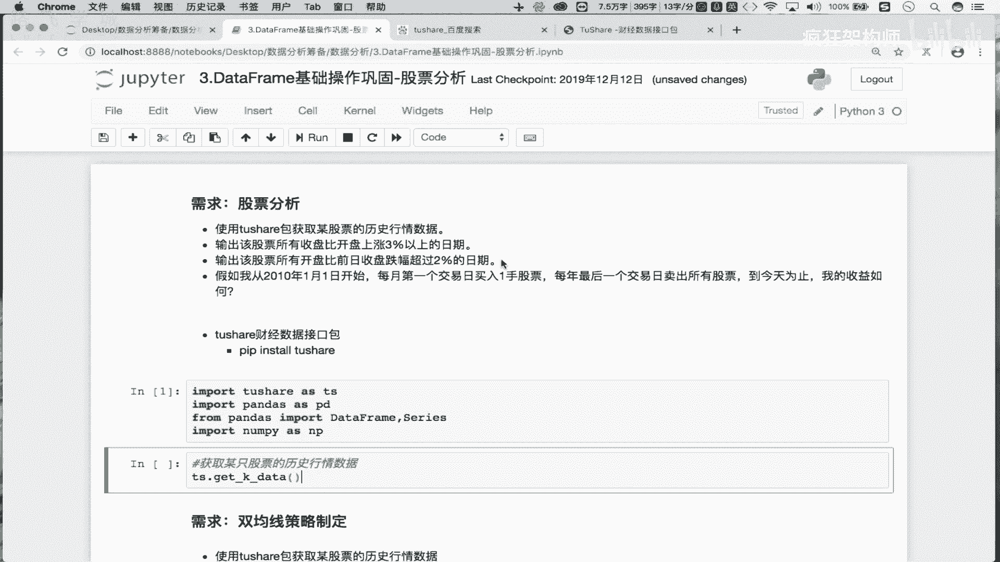

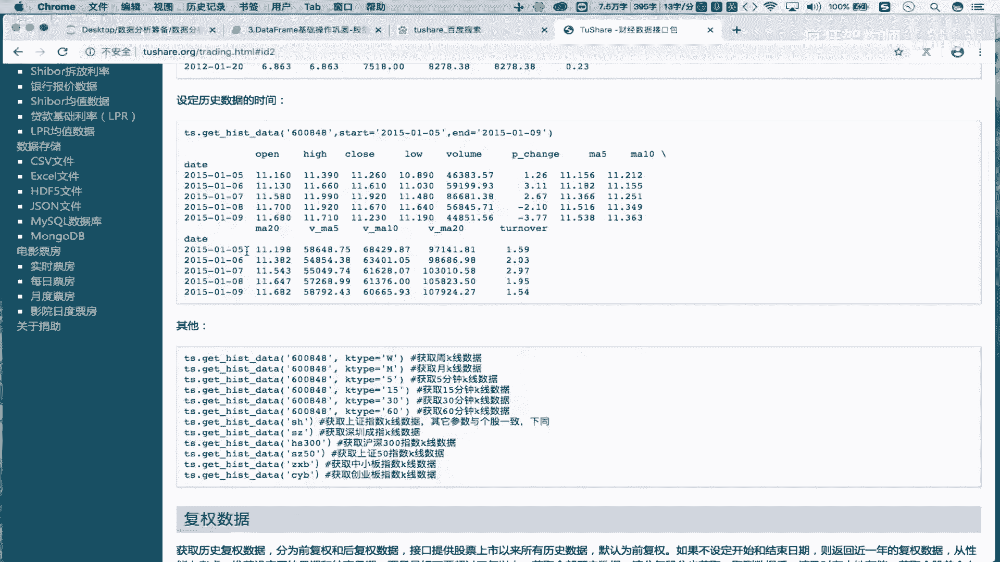

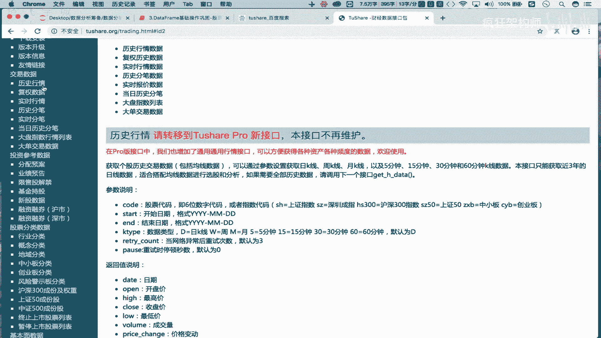

以下是获取数据的关键步骤：
1.  **安装Tushare包**：在命令行中执行 `pip install tushare`。
2.  **导入必要模块**：在Python脚本中导入`tushare`和`pandas`。
3.  **调用数据接口**：使用`tushare`的`get_k_data`函数，传入股票代码和起止日期来获取数据。

```python
import tushare as ts
import pandas as pd

# 获取股票‘600519’（贵州茅台）从较早日期到最近的历史数据
df = ts.get_k_data(code=‘600519‘, start=‘2000-01-01‘)
print(df.head())
```
执行上述代码后，`df`这个DataFrame将包含指定股票的历史行情，包括日期（`date`）、开盘价（`open`）、收盘价（`close`）、最高价（`high`）、最低价（`low`）、成交量（`volume`）和股票代码（`code`）等列。

## 数据存储与读取 💾

从网络获取数据存在不稳定性，因此将数据保存到本地是一个好习惯。处理完成后，我们也可以从本地文件重新读取数据。

以下是相关的操作：
*   **保存数据到本地**：使用DataFrame的`to_csv`方法将数据保存为CSV文件。
    ```python
    df.to_csv(‘maotai.csv‘)
    ```
*   **从本地读取数据**：使用Pandas的`read_csv`函数将CSV文件读入DataFrame。
    ```python
    df = pd.read_csv(‘maotai.csv‘)
    print(df.head())
    ```

## 数据清洗与预处理 🧹

从文件读取数据后，我们通常需要进行一些清洗和预处理，使其更易于分析。

以下是需要完成的预处理步骤：
1.  **删除无用列**：读取的CSV文件可能包含一个默认的索引列（`Unnamed: 0`），这列数据没有分析价值，需要删除。
    ```python
    # 删除名为‘Unnamed: 0‘的列，axis=1表示操作列，inplace=True表示直接修改原DataFrame
    df.drop(labels=‘Unnamed: 0‘, axis=1, inplace=True)
    ```
2.  **查看数据信息**：使用`info()`方法可以快速查看各列的数据类型和非空值数量，帮助我们了解数据概况。
    ```python
    print(df.info())
    ```
    通过`info()`的输出，我们发现`date`列的数据类型是`object`（字符串），而不是时间类型。
3.  **转换日期格式**：为了便于进行时间序列分析，需要将`date`列从字符串转换为Pandas的`datetime`类型。
    ```python
    df[‘date‘] = pd.to_datetime(df[‘date‘])
    print(df.info()) # 再次查看，确认date列类型已变为datetime64
    ```
4.  **设置日期为索引**：在时间序列分析中，将日期列设置为行索引非常方便。我们使用`set_index`方法来完成这个操作。
    ```python
    df.set_index(keys=‘date‘, inplace=True)
    print(df.head())
    ```
    现在，`date`列成为了DataFrame的行索引，其他列（开盘价、收盘价等）则作为数据列保留。

## 总结 📝

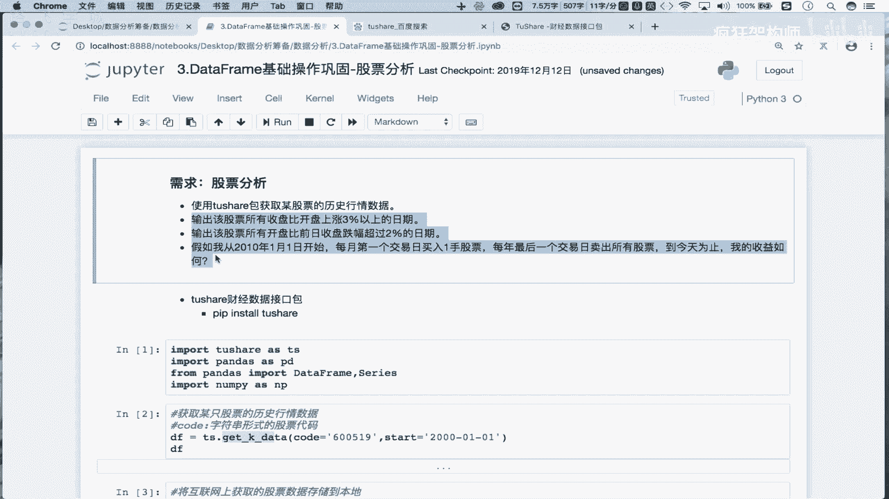

本节课中我们一起学习了股票数据预处理的全流程。我们首先使用Tushare包从网络获取了股票历史行情数据，接着将数据保存到本地CSV文件以备后用。然后，我们从文件读取数据，并进行了关键的数据清洗与预处理操作：删除无用列、检查数据信息、将日期字符串转换为时间类型，最后将日期列设置为DataFrame的行索引。经过这些步骤，我们得到了一个干净、结构清晰且易于进行时间序列分析的数据集，为后续制定股票分析策略做好了准备。