# 数据分析实战：P13：12 捕获股票跌幅的日期 📉📅

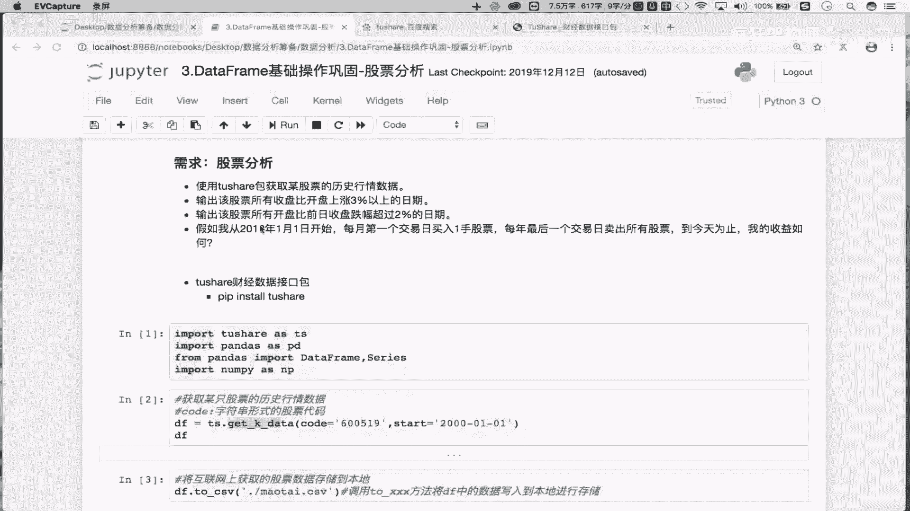

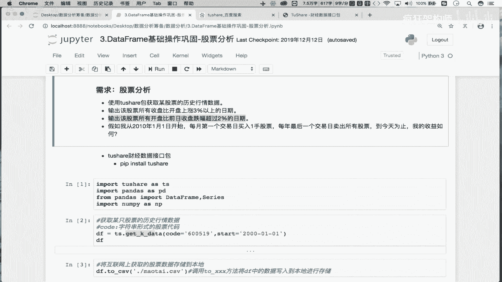

在本节课中，我们将学习如何使用Pandas库，通过数据计算和布尔索引，来筛选出股票开盘价较前一日收盘价跌幅超过2%的日期。这个技巧是量化分析中识别异常交易日的基础。

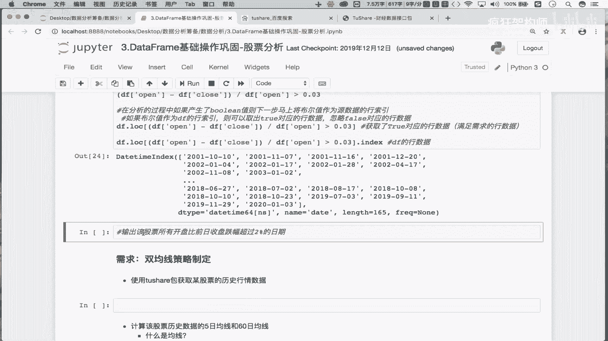

上一节我们介绍了如何计算股票的涨跌幅，本节中我们来看看如何应用类似逻辑，但结合时间序列的“前一日”概念，来捕获特定的价格波动事件。

## 核心概念与伪代码

我们的目标是：找到所有满足 `(当日开盘价 - 前一日收盘价) / 前一日收盘价 < -0.02` 条件的日期。

这个公式可以分解为几个步骤：
1.  计算前一日收盘价序列。
2.  计算开盘价相对于前一日收盘价的涨跌幅。
3.  判断该涨跌幅是否小于-2%（即跌幅超过2%）。
4.  利用布尔索引筛选出符合条件的日期。

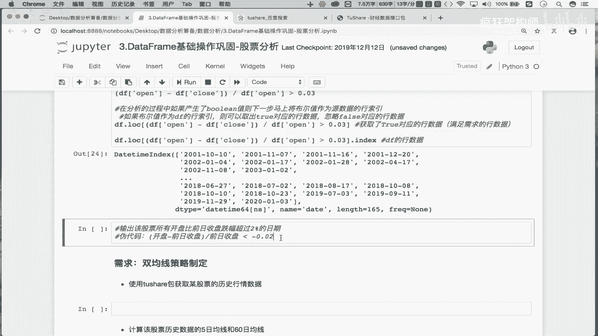

## 分步实现教程

以下是实现该需求的具体步骤。

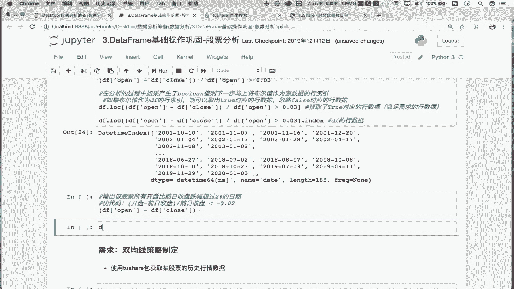

### 步骤一：理解“前日收盘价”的计算

在时间序列数据中，“前一日”的数据可以通过`shift()`函数方便地获取。`shift(1)`表示将整列数据**向下**移动一行，这样每一行的数据就变成了它前一行的值。

```python
# 假设 df 是一个包含 ‘close’ 列的DataFrame
previous_close = df[‘close’].shift(1)
```
执行后，`previous_close`序列中，8月29日对应的值就是8月28日的收盘价，依此类推。第一行（最早日期）由于没有“前一日”，其值会变为`NaN`。

### 步骤二：计算涨跌幅并判断

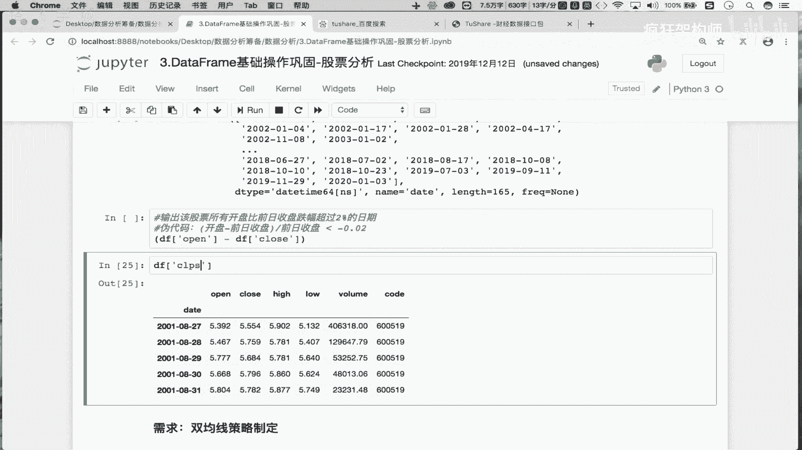

有了前一日收盘价序列，我们就可以计算每日开盘价相对于它的涨跌幅。

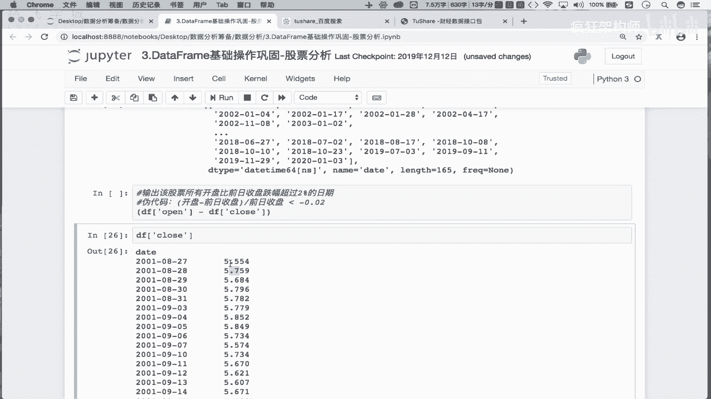

```python
# 计算涨跌幅：(当日开盘 - 前日收盘) / 前日收盘
price_change_pct = (df[‘open’] - previous_close) / previous_close
```
接下来，我们判断这个涨跌幅是否小于-0.02（即跌幅超过2%）。这会得到一个布尔序列（`Series`），其中`True`表示该日期满足条件。

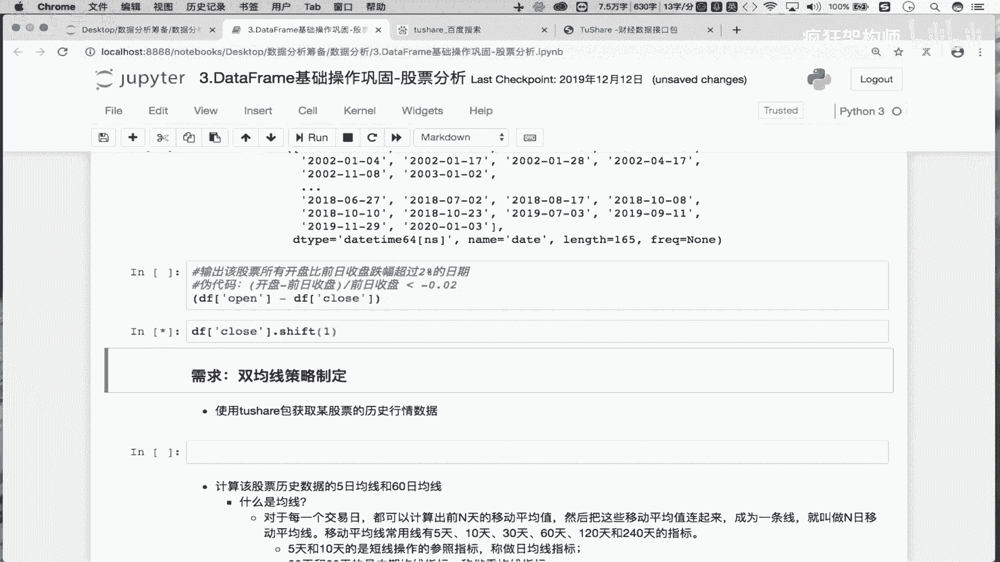

```python
# 判断跌幅是否超过2%
condition = price_change_pct < -0.02
```

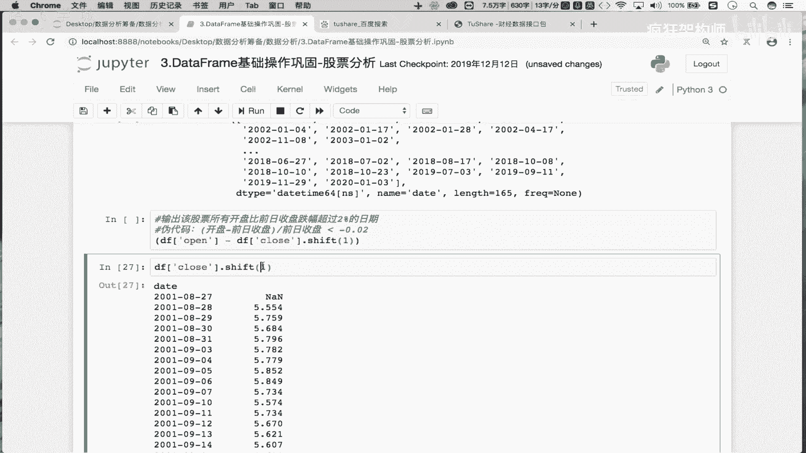

### 步骤三：使用布尔索引筛选日期

得到布尔序列后，我们可以将其作为原始DataFrame的行索引，直接筛选出所有`True`对应的行数据。

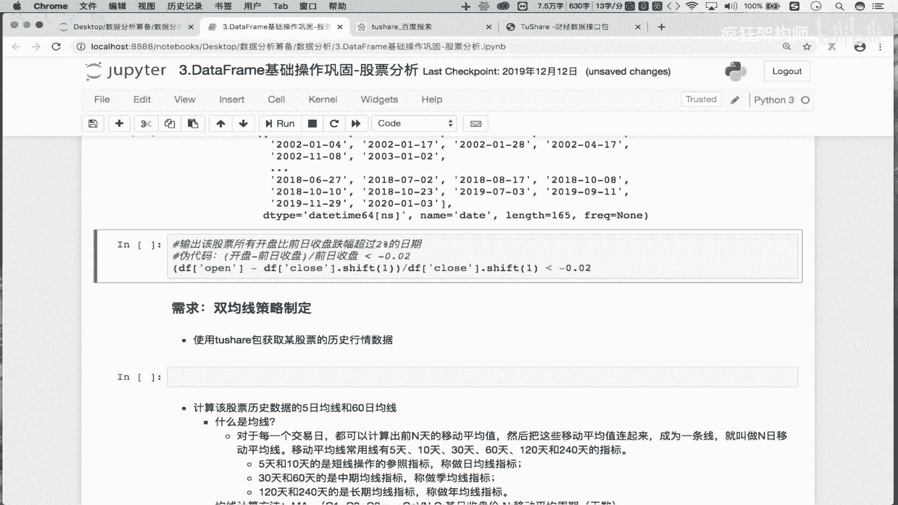

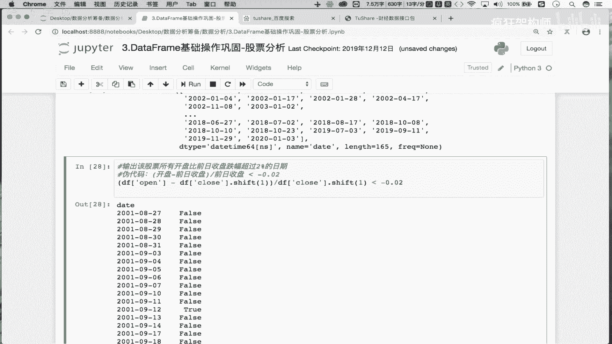

```python
# 筛选出满足条件的行
result_df = df.loc[condition]
```
此时，`result_df`包含了所有开盘跌幅超过2%的日子的完整数据（开盘、收盘、最高、最低等）。如果我们只关心日期本身，只需提取其索引。

```python
# 提取满足条件的日期
target_dates = result_df.index
```

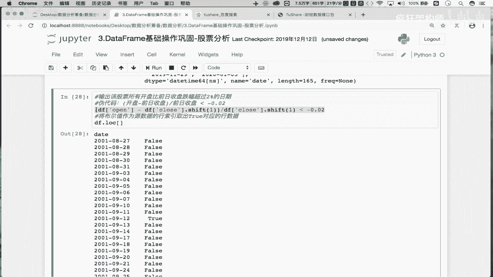

### 步骤四：代码整合

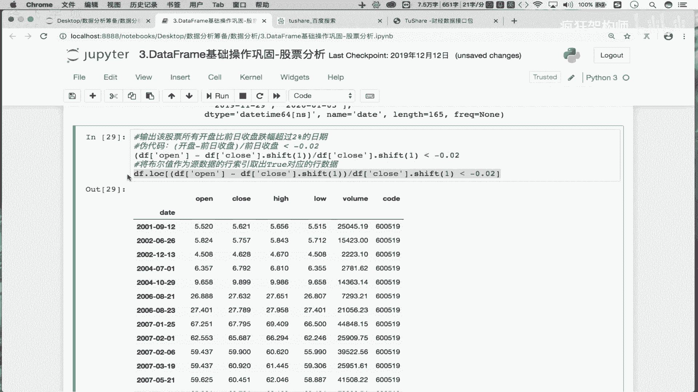

将以上步骤整合，可以得到一行简洁的代码实现整个需求：

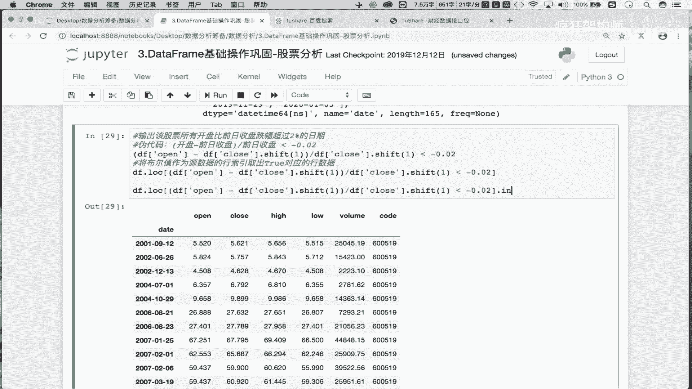

```python
target_dates = df.loc[(df[‘open’] - df[‘close’].shift(1)) / df[‘close’].shift(1) < -0.02].index
```
虽然这行代码紧凑，但建议初学者先进行分步编写和验证，确保每一步的结果都符合预期，然后再进行整合。

## 总结

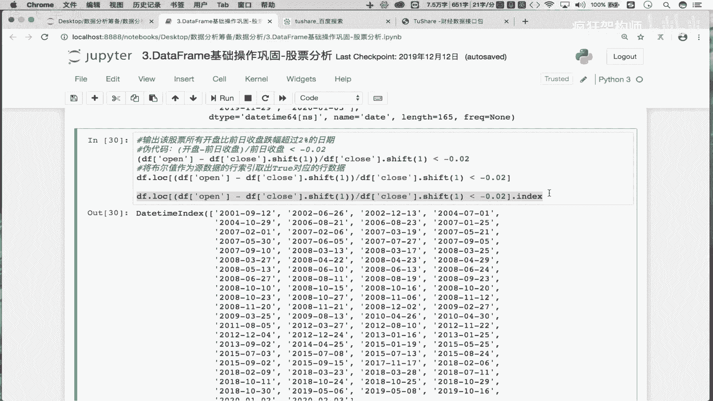

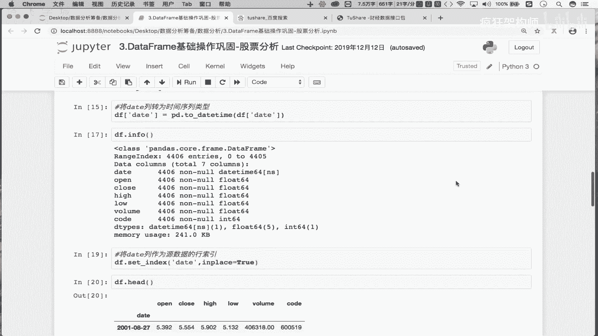

本节课中我们一起学习了如何利用Pandas处理时间序列数据的一个典型场景。我们掌握了两个关键点：
1.  使用`shift()`函数获取时间序列的滞后值（如前一日值）。
2.  通过构造逻辑条件（公式计算 + 比较运算）生成布尔序列，并最终利用布尔索引精准筛选出目标数据行或日期。

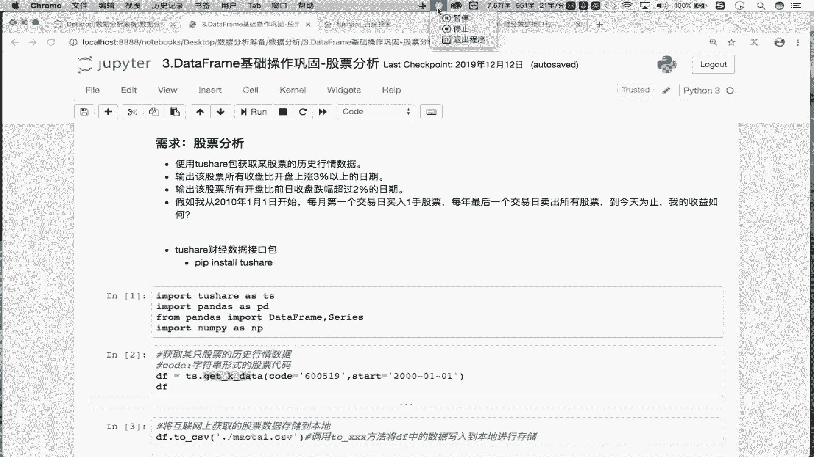

这个方法非常强大，可以灵活变通用于寻找涨幅过大、价格突破均线等各种量化分析条件。