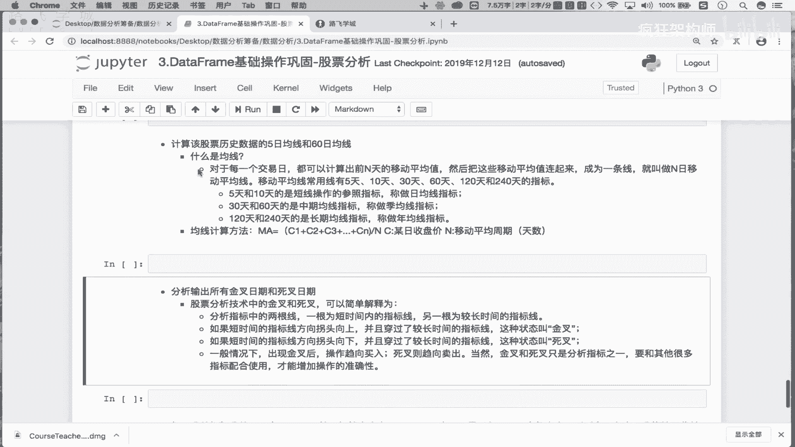
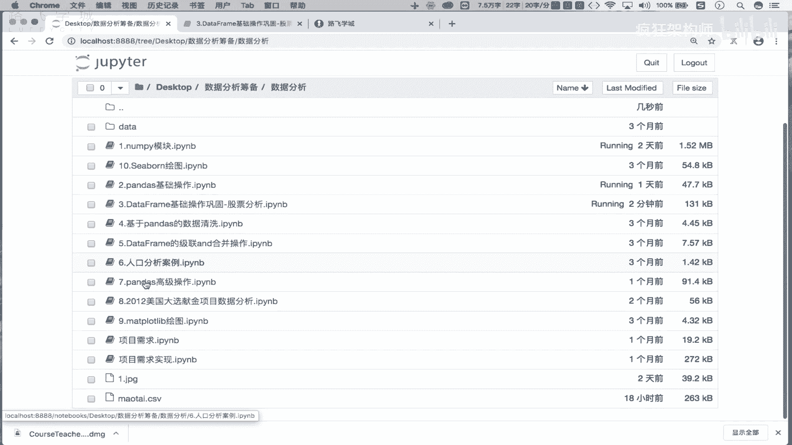
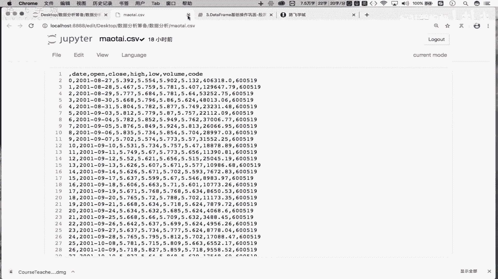
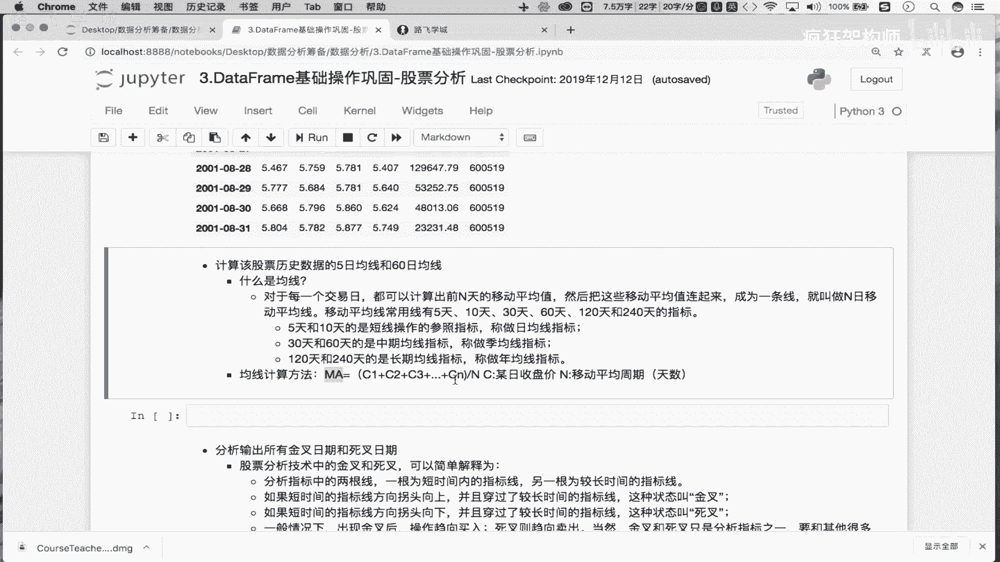
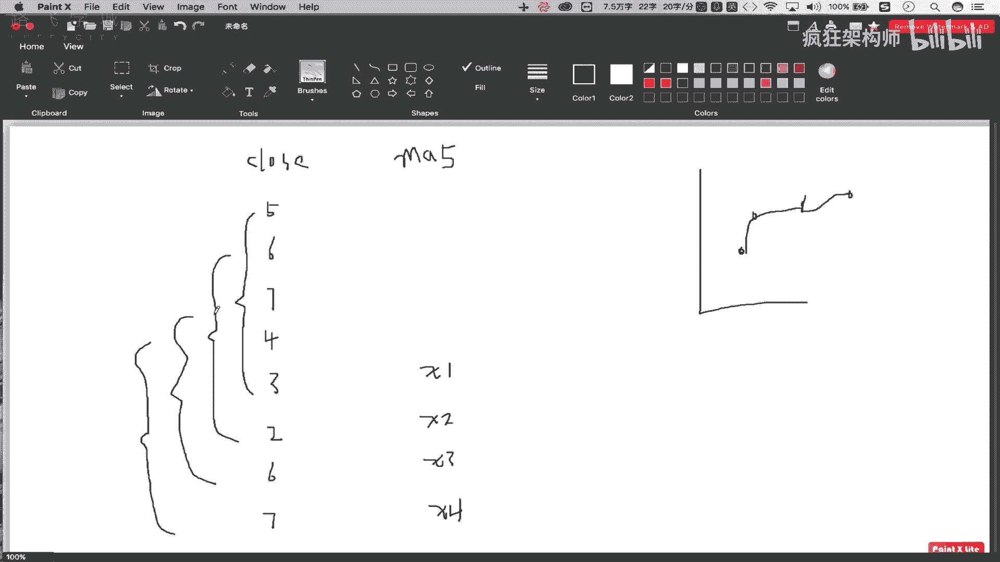
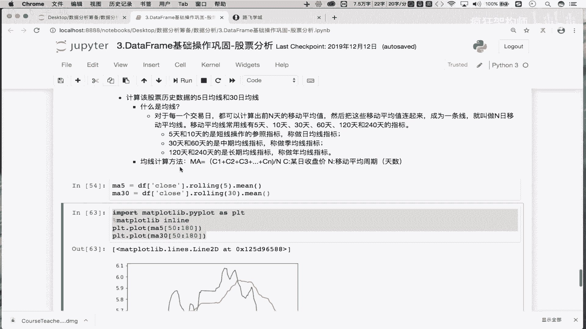

# 金融量化分析：P15：双均线策略-均线的计算分析 📈



在本节课中，我们将学习金融量化分析中一个经典策略——双均线策略的基础部分。我们将从获取股票数据开始，逐步计算并理解什么是均线，最终计算出关键的5日和30日移动平均线。

## 数据准备 📊

上一节我们介绍了双均线策略的基本概念。本节中，我们来看看如何准备所需的数据。

首先，我们需要获取并处理股票的历史行情数据。我们已经将贵州茅台股票的历史数据保存到了本地文件“茅台.csv”中。

以下是数据读取与处理的步骤：





1.  **读取数据**：使用Pandas的`read_csv`函数从本地CSV文件中读取数据。
    ```python
    df = pd.read_csv(‘茅台.csv’)
    ```
2.  **清理数据**：删除数据中无用的列（例如默认的索引列）。
    ```python
    df = df.drop(labels=‘Unnamed: 0’, axis=1)
    ```
3.  **转换时间索引**：将“date”列转换为时间序列格式，并设置为数据框的行索引，便于后续基于时间的分析。
    ```python
    df[‘date’] = pd.to_datetime(df[‘date’])
    df.set_index(‘date’, inplace=True)
    ```

完成以上步骤后，我们就得到了一个以日期为索引、包含股票开盘价、收盘价等信息的整洁数据框。

## 理解与计算均线 📉

数据准备就绪后，接下来我们深入理解核心概念——移动平均线（均线），并学习如何计算它。



在股票分析中，均线是一个非常重要的技术指标。所谓均线，是指对于每一个交易日，计算出前N天收盘价的移动平均值，将这些平均值连接起来形成的曲线，就称为N日移动平均线。

常用的均线有5日、10日（短期均线）、30日、60日（中期均线）等。其计算公式为：
**MA = (C1 + C2 + C3 + … + CN) / N**
其中，`MA`代表移动平均值，`C1`到`CN`代表连续N个交易日的收盘价。

为了更直观地理解，我们可以想象有连续8天的收盘价。计算5日均线时：
*   首先计算第1到第5天收盘价的平均值，得到第一个点（X1）。
*   然后计算第2到第6天收盘价的平均值，得到第二个点（X2）。
*   接着计算第3到第7天、第4到第8天的平均值，得到X3和X4。
*   最后，将X1, X2, X3, X4这四个点连接起来，就构成了5日均线。



理解了原理后，计算就变得简单。Pandas提供了便捷的`rolling`函数来实现滑动窗口计算。

以下是计算5日和30日移动平均线的具体方法：

1.  **计算5日均线（MA5）**：对收盘价序列取5天的滑动窗口，并计算每个窗口的平均值。
    ```python
    ma5 = df[‘close’].rolling(5).mean()
    ```
    注意：前4天的值为`NaN`，因为不足5天无法计算均值。
2.  **计算30日均线（MA30）**：同理，对收盘价序列取30天的滑动窗口计算平均值。
    ```python
    ma30 = df[‘close’].rolling(30).mean()
    ```
    前29天的值为`NaN`。

## 可视化均线 🖼️

计算出均线数据后，我们可以将其可视化，以便更清晰地观察走势。这里我们使用Matplotlib库进行简单的绘图。

以下是绘制两条均线的代码示例：
```python
import matplotlib.pyplot as plt
%matplotlib inline # 在Jupyter Notebook中显示图表

plt.plot(ma5[50:80], label=‘MA5’) # 绘制部分区间的5日均线
plt.plot(ma30[50:80], label=‘MA30’) # 绘制部分区间的30日均线
plt.legend() # 显示图例
plt.show()
```
通过图表，我们可以观察到短期均线（MA5）波动更为频繁，而长期均线（MA30）则相对平滑。两条线的交叉点（金叉或死叉）在双均线策略中具有重要的交易信号意义。

---



本节课中我们一起学习了双均线策略的数据准备与均线计算核心步骤。我们首先获取并处理了股票历史数据，然后详细解释了移动平均线的概念与计算公式，最后使用Pandas的`rolling`方法计算出了5日和30日移动平均线，并进行了初步的可视化。在接下来的课程中，我们将基于这些均线来制定具体的交易策略信号。