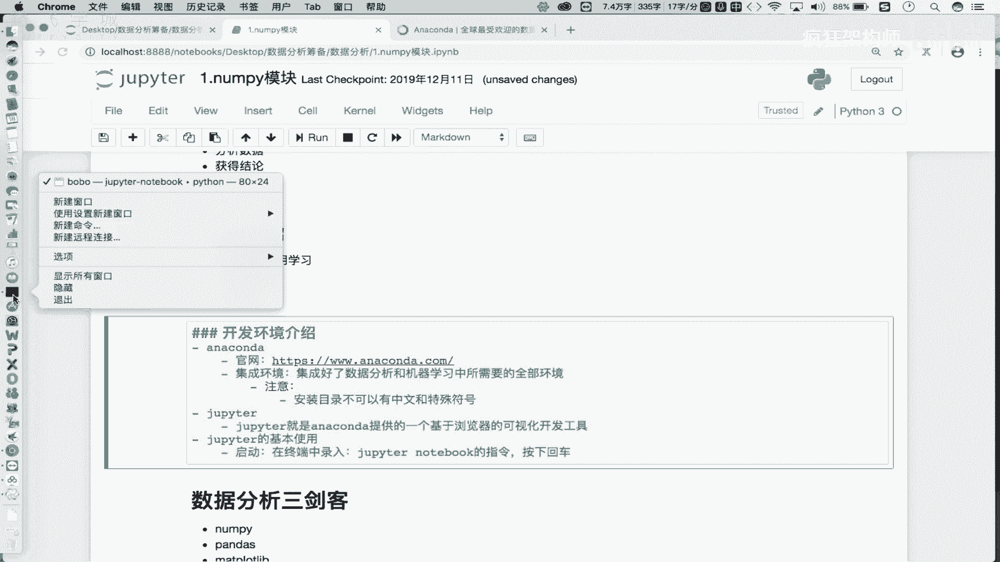
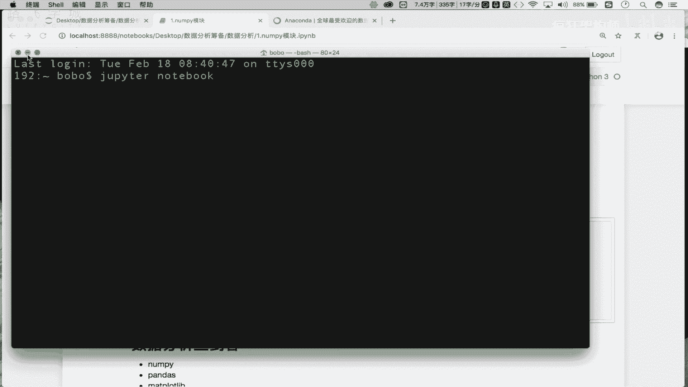
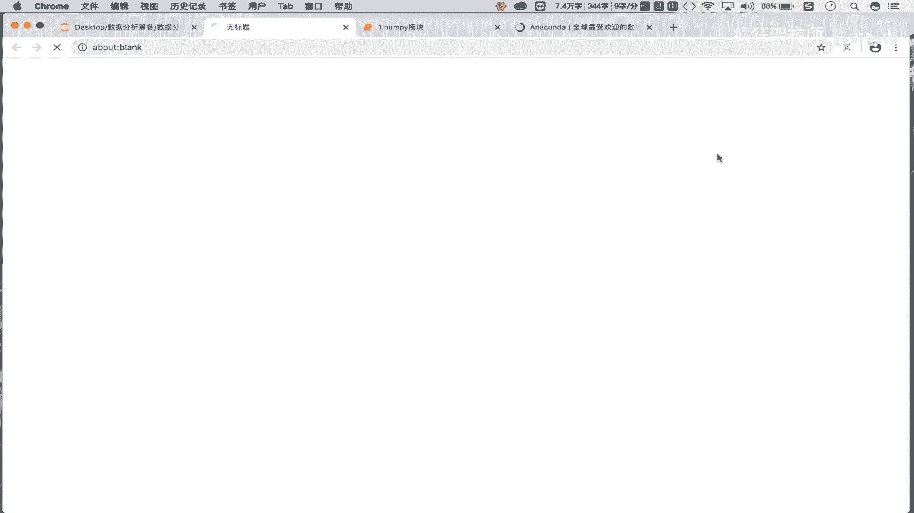
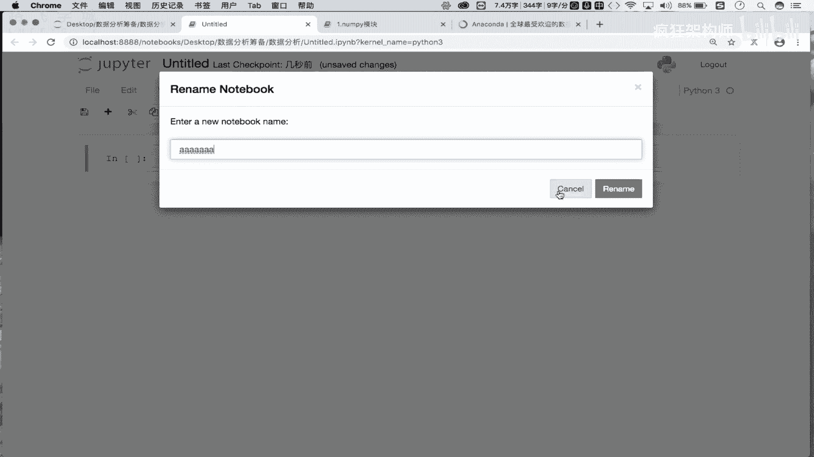
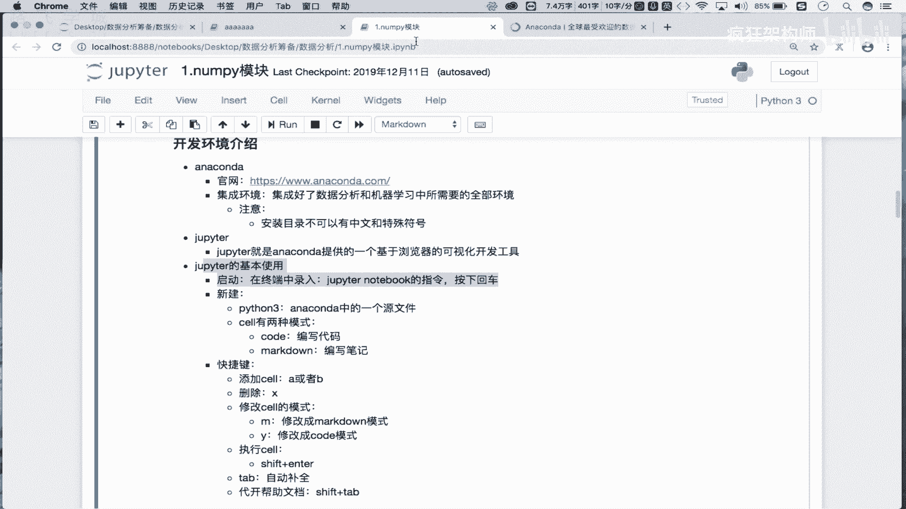

# 数据分析实战：P3：02：环境搭建指南 🛠️

在本节课中，我们将学习如何搭建数据分析的开发环境。我们将介绍两个核心工具：Anaconda和Jupyter Notebook，并详细讲解它们的安装与基本使用方法。

上一节我们对数据分析课程进行了初步介绍，本节中我们来看看如何准备开发环境。

## Anaconda：集成环境

首先，我们需要安装一个名为 **Anaconda** 的集成环境。Anaconda 集成了进行数据分析和机器学习开发所需的全部环境。

*   **定义**：Anaconda 是一个集成了数据分析和机器学习所需全部环境的软件包。
*   **作用**：安装 Anaconda 后，我们便拥有了进行相关开发工作的基础环境。
*   **安装步骤**：
    1.  访问 Anaconda 官网，根据你的操作系统（Windows、macOS 或 Linux）下载对应的安装包。
    2.  运行安装程序，按照提示进行“下一步”安装。
*   **注意事项**：安装路径**不能包含中文或特殊符号**，建议安装在某个磁盘的根目录下。

安装完成后，Anaconda 会自带一个名为 Jupyter Notebook 的可视化开发工具。



## Jupyter Notebook：开发工具



Jupyter Notebook 是 Anaconda 提供的一个基于浏览器的可视化开发工具。我们将在其中编写和执行数据分析代码。

*   **定义**：Jupyter Notebook 是一个基于浏览器的交互式开发环境。
*   **启动方法**：在系统终端（命令行）中输入指令 `jupyter notebook` 并按下回车。
    ```bash
    jupyter notebook
    ```
*   **界面说明**：指令执行后，会自动打开浏览器并显示一个文件目录界面，这就是 Jupyter Notebook 的工作区。



### 创建与使用 Notebook 文件



在 Jupyter 界面中，我们可以创建新的 Notebook 文件来编写代码。

以下是创建和使用 Notebook 的基本步骤：
1.  点击右上角的 **New** 按钮。
2.  选择 **Python 3**，这将创建一个新的 Notebook 源文件（后缀为 `.ipynb`）。
3.  在打开的新文件中，你会看到一个个称为 **Cell（单元格）** 的编辑框。

### Cell 的两种模式

每个 Cell 有两种工作模式，用于不同的目的。

以下是两种模式的介绍：
*   **Code 模式**：用于编写和运行 Python 代码。
*   **Markdown 模式**：用于编写格式化的文本笔记和说明。

你可以通过 Cell 上方的下拉菜单或快捷键来切换模式。

### 常用快捷键

熟练使用快捷键可以极大提升在 Jupyter Notebook 中的工作效率。

以下是几个核心快捷键：
*   **添加 Cell**：
    *   `A`：在当前选中的 Cell **上方**插入一个新 Cell。
    *   `B`：在当前选中的 Cell **下方**插入一个新 Cell。
*   **删除 Cell**：`X` 删除当前选中的 Cell。
*   **切换 Cell 模式**：
    *   `M`：将当前 Cell 切换到 **Markdown 模式**。
    *   `Y`：将当前 Cell 切换到 **Code 模式**。
*   **运行 Cell**：`Shift + Enter` 运行当前 Cell 中的代码或渲染 Markdown 文本。
*   **代码补全**：`Tab` 键可以触发代码自动补全功能。
*   **查看帮助**：在函数名上按 `Shift + Tab` 可以查看该函数的帮助文档。

---



本节课中我们一起学习了数据分析环境的搭建。核心步骤是：首先安装 **Anaconda** 集成环境，然后使用其自带的 **Jupyter Notebook** 工具进行开发。我们熟悉了 Jupyter 的基本操作，包括创建文件、使用两种模式的 Cell 以及一系列高效的快捷键。环境准备就绪后，我们就可以正式开始数据分析的代码实战了。