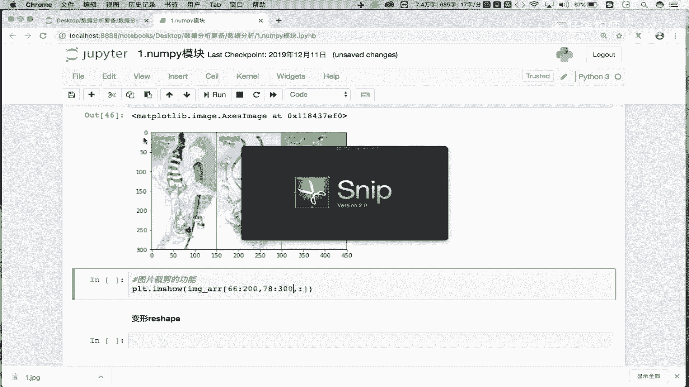
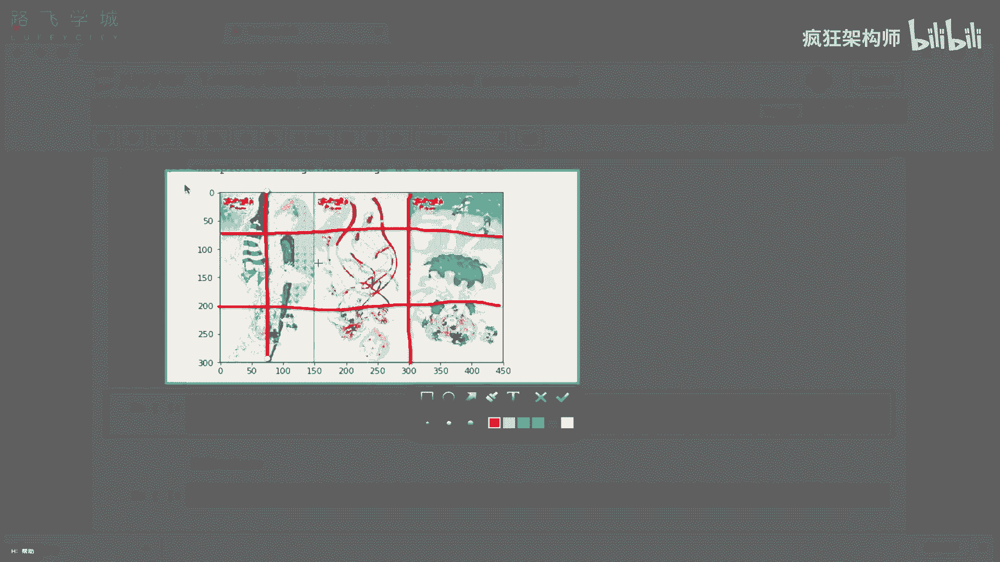
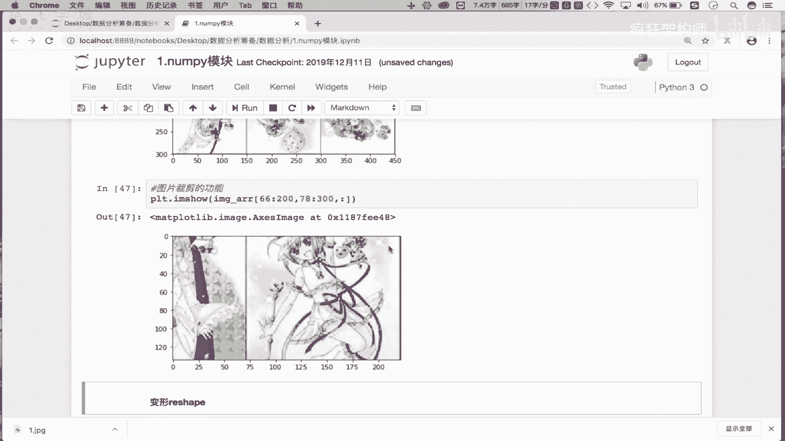

# NumPy实战：05：NumPy索引与切片操作 🚀

在本节课中，我们将学习NumPy中索引与切片的核心操作。这些操作是高效处理数组数据的基础，能帮助我们灵活地获取和操作数组中的任意数据。

## 索引操作

上一节我们介绍了NumPy数组的创建。本节中，我们来看看如何通过索引获取数组中的特定数据。

NumPy数组的索引操作与Python列表的索引操作原理相同。我们首先创建一个示例数组。

```python
import numpy as np
arr = np.random.randint(1, 100, size=(5, 6))
print(arr)
```

以下是索引操作的具体用法：
*   **获取单行数据**：`arr[1]` 取出下标为1的行数据。
*   **获取多行数据**：`arr[[1, 3, 4]]` 取出下标为1、3、4的行数据。

## 切片操作

理解了基础的索引后，本节我们来看看更灵活的切片操作。切片允许我们获取数组的连续子集。

切片的基本语法是在方括号内使用冒号`:`。逗号`,`用于分隔不同维度的切片。

以下是切片操作的具体用法：
*   **切出前两行**：`arr[0:2]` 对行进行切片，获取第0行和第1行。
*   **切出前两列**：`arr[:, 0:2]` 逗号左侧为空表示所有行，右侧`0:2`表示对列进行切片，获取前两列。
*   **切出前两行的前两列**：`arr[0:2, 0:2]` 同时指定行和列的切片范围。

## 数组反转

切片操作不仅能获取子集，还能实现数组的反转。反转是指将数组元素的顺序进行倒置。

反转操作通过切片语法`[::-1]`实现，其中`-1`表示步长为负，即反向遍历。

以下是反转操作的具体用法：
*   **将数组的行倒置**：`arr[::-1]` 行顺序反转，列顺序不变。
*   **将数组的列倒置**：`arr[:, ::-1]` 列顺序反转，行顺序不变。
*   **将所有元素倒置**：`arr[::-1, ::-1]` 行和列的顺序同时反转，相当于将整个数组元素顺序完全翻转。

## 实战应用：图片处理

掌握了索引和切片的核心概念后，我们来看一个实战应用：处理图片数据。图片在NumPy中可以被表示为一个三维数组（高度、宽度、颜色通道）。



首先，我们读取并显示一张原始图片。
```python
import matplotlib.pyplot as plt
image_arr = plt.imread(‘1.jpg’)
plt.imshow(image_arr)
plt.show()
```



以下是图片处理的具体操作：
*   **图片左右翻转**：`plt.imshow(image_arr[:, ::-1, :])` 对代表宽度的列维度进行反转。
*   **图片上下翻转**：`plt.imshow(image_arr[::-1, :, :])` 对代表高度的行维度进行反转。
*   **图片局部裁剪**：`plt.imshow(image_arr[66:200, 78:300, :])` 通过指定行和列的切片范围，截取图片的局部区域。



本节课中我们一起学习了NumPy强大的索引与切片操作。我们从基础的索引和切片语法开始，逐步深入到数组反转，并最终将这些知识应用于实际的图片翻转与裁剪场景。熟练掌握这些操作是进行高效数组数据处理的关键。