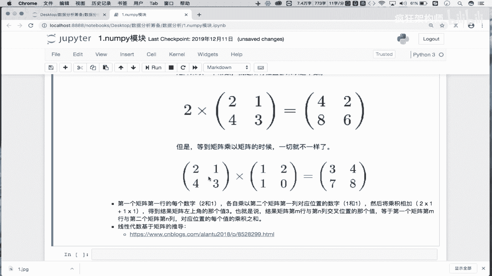
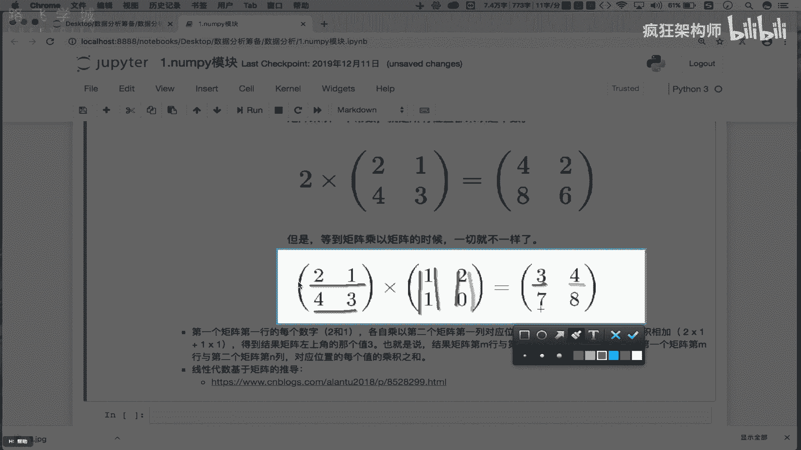
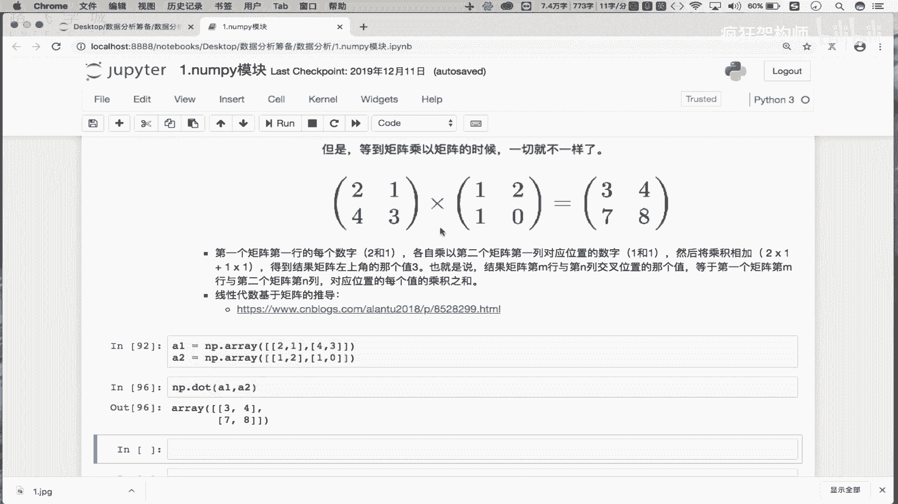
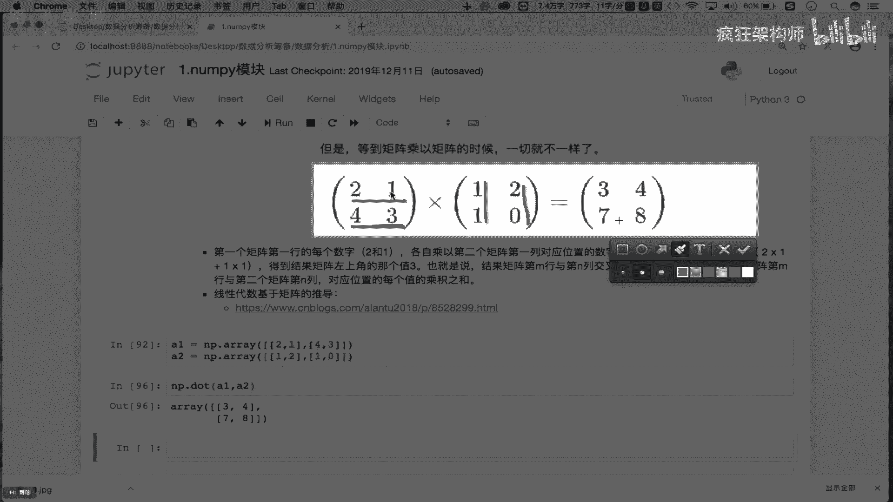
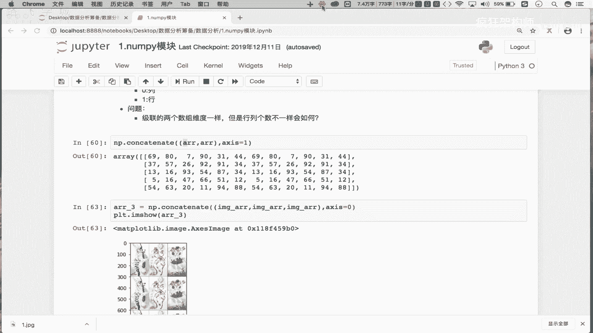

# Numpy+Pandas实战金融量化分析：P7：06 统计&聚合&矩阵操作 🧮➡️🧩

在本节课中，我们将学习NumPy模块中关于数组形状变换、拼接、聚合统计以及矩阵运算的核心操作。这些是数据处理和科学计算的基础，对于后续的量化分析至关重要。

## 数组形状变换（Reshape）

上一节我们介绍了数组的索引与切片，本节中我们来看看如何改变数组的形状。数组的`shape`属性描述了其维度结构，例如一个五行六列的二维数组。`reshape`操作可以改变数组的维度，而不改变其数据。

**核心概念**：使用`reshape`方法并指定新的形状参数`shape`。

```python
import numpy as np
# 原始二维数组
arr = np.arange(30).reshape(5, 6)
print("原始形状:", arr.shape)  # 输出: (5, 6)

# 将二维数组变形为一维数组
arr_1d = arr.reshape(30)
print("变形后形状:", arr_1d.shape)  # 输出: (30,)

# 将一维数组变形为多维数组
arr_new = arr_1d.reshape(2, 15)  # 变形为2行15列
print("新形状:", arr_new.shape)  # 输出: (2, 15)
```

**注意**：变形后的新数组必须能容纳原数组的所有元素，即总元素数量必须相等。

## 数组拼接（Concatenate）

接下来，我们学习如何将多个数组组合在一起。拼接操作可以将数组沿指定轴（横向或纵向）连接起来。

**核心概念**：使用`np.concatenate()`函数，并通过`axis`参数指定拼接方向（0为纵向，1为横向）。

```python
# 创建两个相同的二维数组
arr1 = np.arange(30).reshape(5, 6)
arr2 = np.arange(30, 60).reshape(5, 6)

# 纵向拼接（沿行方向，即axis=0）
v_stack = np.concatenate((arr1, arr2), axis=0)
print("纵向拼接后形状:", v_stack.shape)  # 输出: (10, 6)

# 横向拼接（沿列方向，即axis=1）
h_stack = np.concatenate((arr1, arr2), axis=1)
print("横向拼接后形状:", h_stack.shape)  # 输出: (5, 12)
```

**注意**：进行拼接的数组必须在拼接轴之外的维度上形状一致。

以下是拼接操作的应用场景示例：
*   **图像处理**：将多张图片拼接成宫格图。
*   **数据合并**：将来自不同来源但结构相同的数据表合并。

## 聚合操作（Aggregation）

聚合操作是指对数组中的一组值执行计算，返回一个单一的值。这是数据分析中最常用的操作之一。

**核心概念**：使用数组的`.sum()`, `.min()`, `.max()`, `.mean()`等方法，并可指定`axis`参数按行或列计算。

```python
arr = np.arange(30).reshape(5, 6)

# 计算所有元素的总和、最小值、最大值、平均值
total_sum = arr.sum()
min_val = arr.min()
max_val = arr.max()
avg_val = arr.mean()
print(f"总和: {total_sum}, 最小值: {min_val}, 最大值: {max_val}, 平均值: {avg_val}")

# 计算每一列的和（axis=0）
col_sum = arr.sum(axis=0)
print("每列的和:", col_sum)

# 计算每一行的最大值（axis=1）
row_max = arr.max(axis=1)
print("每行的最大值:", row_max)
```

## 常用数学与统计函数

NumPy提供了丰富的数学函数，可以对数组进行逐元素计算。此外，统计函数能帮助我们理解数据的分布。

**核心概念**：
*   **数学函数**：如`np.sin()`, `np.cos()`, `np.round()`，对数组每个元素进行计算。
*   **统计函数**：如`np.std()`（标准差）, `np.var()`（方差），用于衡量数据的离散程度。

```python
arr = np.array([22.5, 45, 67.5, 90])

# 数学函数：计算正弦值
sin_values = np.sin(arr)
print("正弦值:", sin_values)

# 四舍五入
rounded = np.round(3.84)
print("四舍五入:", rounded)  # 输出: 4.0



# 统计函数：计算标准差和方差
data = np.array([85, 90, 78, 92, 88])
std_dev = np.std(data)  # 标准差
variance = np.var(data)  # 方差
print(f"标准差: {std_dev:.2f}, 方差: {variance:.2f}")
```

**方差与标准差公式**：
*   方差公式：**σ² = Σ(xi - μ)² / N**
*   标准差公式：**σ = √σ²**
其中，`xi`是每个数据点，`μ`是数据的均值，`N`是数据点总数。标准差是方差的平方根，两者都表示数据相对于平均值的分散程度。

## 矩阵运算



最后，我们探讨NumPy中的矩阵运算。矩阵是二维数组的一种特殊形式，在线性代数和机器学习中应用广泛。

**核心概念**：
*   **矩阵创建**：可以使用`np.eye(n)`创建n维单位矩阵。
*   **矩阵转置**：使用`.T`属性或`np.transpose()`函数。
*   **矩阵乘法**：使用`np.dot(A, B)`或`A @ B`运算符，遵循“行乘列”规则。

```python
# 创建矩阵
A = np.array([[2, 1], [4, 3]])
B = np.array([[1, 2], [1, 0]])
print("矩阵 A:\n", A)
print("矩阵 B:\n", B)



# 矩阵转置
A_T = A.T
print("A的转置:\n", A_T)

# 矩阵乘法
# 结果C[i][j] = A的第i行 点乘 B的第j列
C = np.dot(A, B)
# 等价于 C = A @ B
print("矩阵乘法结果 A·B:\n", C)
```
**矩阵乘法计算过程**：
结果矩阵C的第一个元素`C[0][0]` = (2 * 1) + (1 * 1) = 3
结果矩阵C的第二个元素`C[0][1]` = (2 * 2) + (1 * 0) = 4
以此类推。



---



本节课中我们一起学习了NumPy的核心操作：通过`reshape`改变数组形状；使用`concatenate`进行数组拼接；利用`.sum()`, `.mean()`等方法进行数据聚合；应用`np.sin()`, `np.std()`等函数进行数学与统计计算；最后掌握了矩阵的创建、转置和乘法运算。这些技能是构建复杂数据分析和量化模型的重要基石。