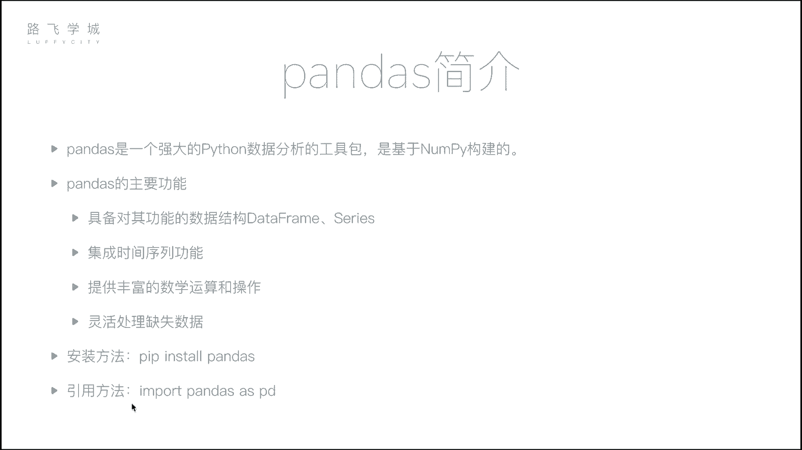
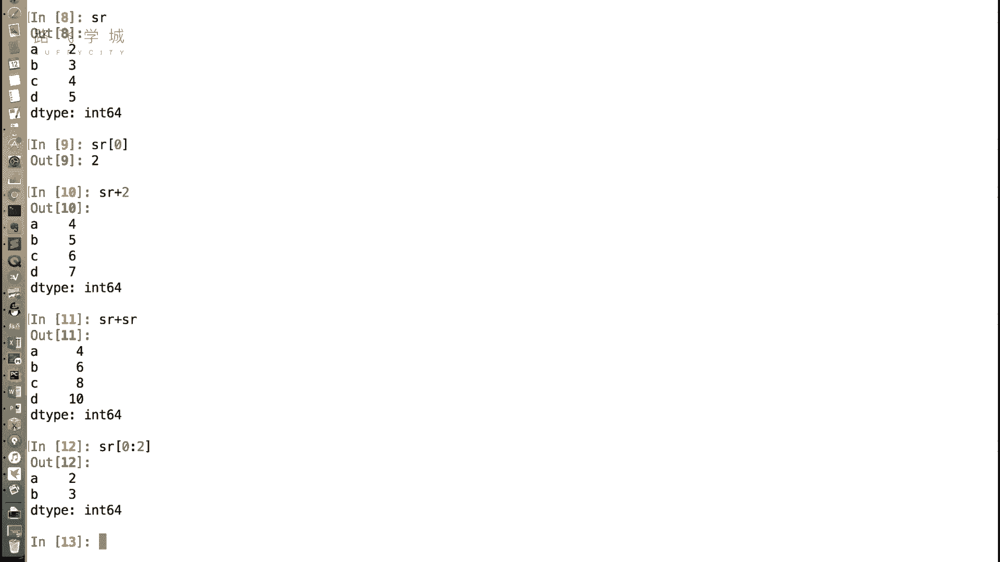
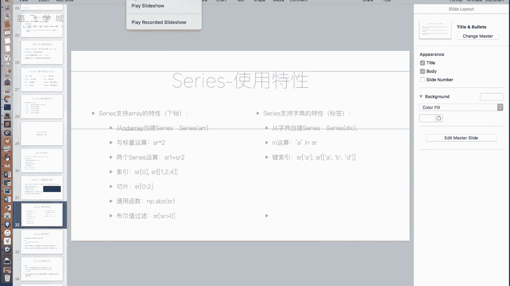
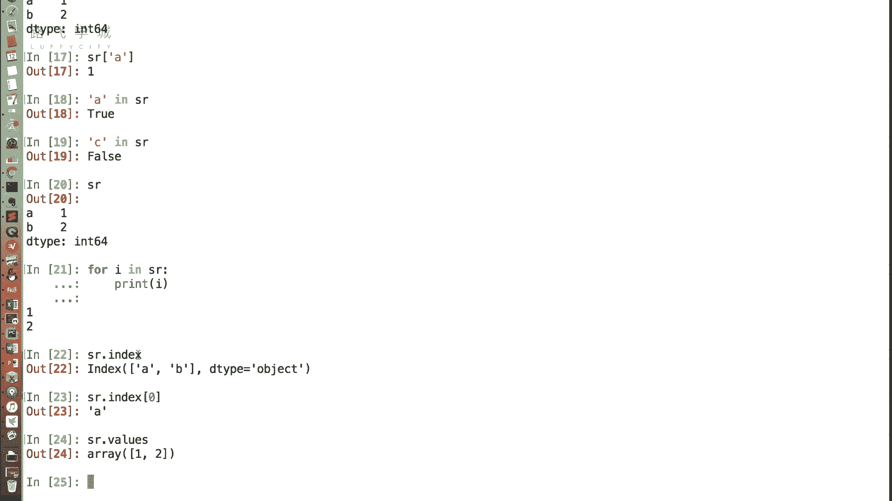
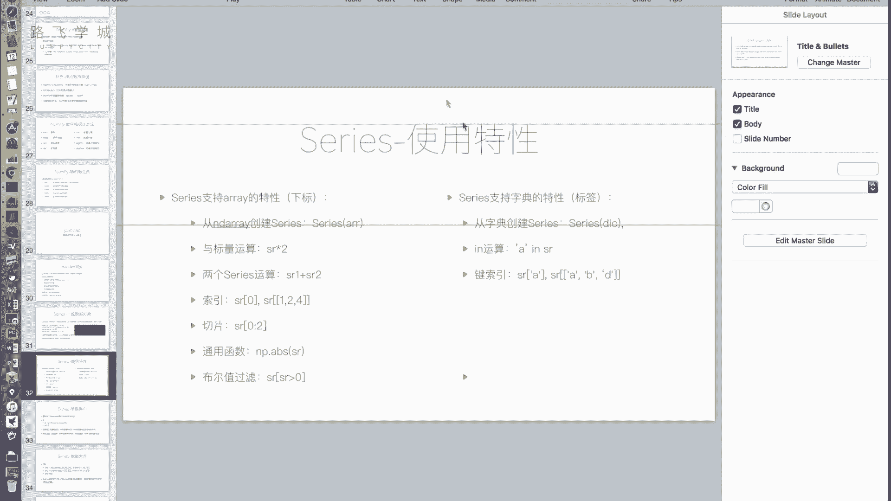
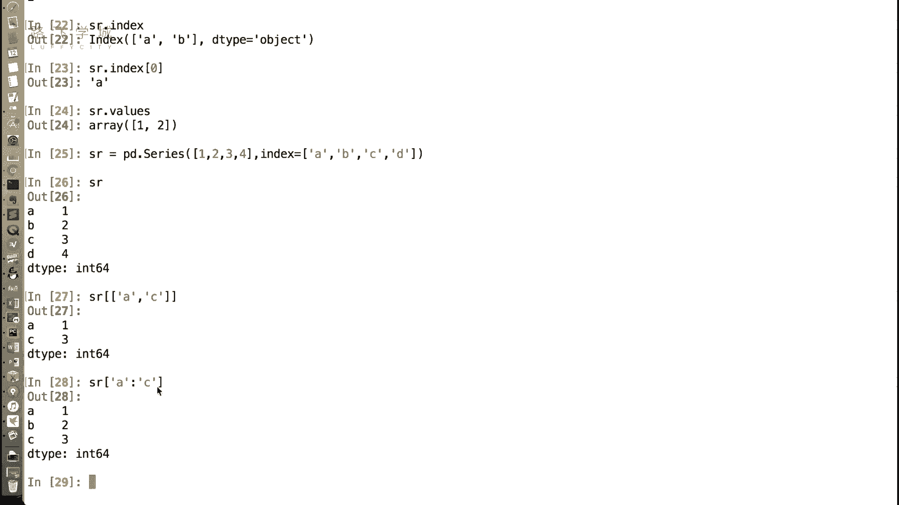

# 金融量化分析：P18：Series介绍 📊

在本节课中，我们将学习Pandas库中的第一个核心数据结构——Series。我们将了解它是什么，如何创建它，以及它如何结合了列表（数组）和字典的特性，从而成为数据分析中一个强大且灵活的工具。

## 概述

上一节我们介绍了NumPy，它是数据分析的基础包。本节中，我们来看看Pandas。Pandas是基于NumPy构建的，在数据分析领域应用极为广泛。无论进行何种数据分析，Pandas都是不可或缺的工具。它的主要功能包括提供`DataFrame`和`Series`两种核心数据结构、集成时间序列功能、提供丰富的数学运算以及灵活处理缺失数据等。



安装Pandas非常简单，使用`pip install pandas`即可。官方建议的导入方式是`import pandas as pd`，我们也将遵循此惯例。

## 什么是Series？🤔


Series是Pandas中的第一种核心数据对象。它是一种类似于一维数组的对象，可以看作是数组和字典的结合体。

### 创建Series


创建Series的基本方法是使用`pd.Series()`函数。


**1. 从列表或数组创建**
这种方式创建的Series，其默认索引是整数（0, 1, 2...），类似于列表。

```python
import pandas as pd
import numpy as np

# 从列表创建
s1 = pd.Series([2, 3, 4, 5])
print(s1)
# 输出：
# 0    2
# 1    3
# 2    4
# 3    5
# dtype: int64

# 从NumPy数组创建
arr = np.array([10, 20, 30])
s2 = pd.Series(arr)
print(s2)
```


**2. 指定自定义索引（标签）**
创建时可以通过`index`参数指定索引标签，这使得Series看起来像一个有序的字典。

```python
s3 = pd.Series([2, 3, 4, 5], index=['A', 'B', 'C', 'D'])
print(s3)
# 输出：
# A    2
# B    3
# C    4
# D    5
# dtype: int64
```

**3. 从字典创建**
直接传入一个字典，字典的键（key）会自动成为Series的索引标签。



```python
data_dict = {'A': 100, 'B': 200, 'C': 300}
s4 = pd.Series(data_dict)
print(s4)
# 输出：
# A    100
# B    200
# C    300
# dtype: int64
```



## Series的特性：继承自数组/列表 🧮

Series继承了NumPy数组和Python列表的许多特性，使其能进行高效的数值计算。

以下是Series支持的数组类操作：

*   **通过位置（下标）访问**：即使指定了自定义标签，依然可以通过整数位置访问数据。
    ```python
    s = pd.Series([10, 20, 30, 40], index=['a', 'b', 'c', 'd'])
    print(s[0])  # 输出：10
    print(s[2])  # 输出：30
    ```
*   **向量化运算**：Series支持与标量或相同大小的另一个Series进行逐元素运算。
    ```python
    s = pd.Series([1, 2, 3, 4])
    print(s + 10)      # 每个元素加10
    print(s * 2)       # 每个元素乘以2
    print(s + s)       # 两个相同Series相加
    ```
*   **切片**：可以使用整数位置进行切片，遵循“前闭后开”原则。
    ```python
    s = pd.Series([10, 20, 30, 40, 50])
    print(s[1:4])  # 输出索引1到3的元素
    ```
*   **通用函数**：支持NumPy的通用函数（ufunc），如`np.abs`, `np.log`等。
    ```python
    import numpy as np
    s = pd.Series([-1, 2, -3])
    print(np.abs(s))  # 取绝对值
    ```
*   **布尔索引**：通过条件表达式可以筛选数据。
    ```python
    s = pd.Series([5, 12, 3, 8])
    print(s[s > 4])  # 输出大于4的元素
    ```

## Series的特性：继承自字典 🔑

Series也具备类似字典的特性，允许通过键（即索引标签）来访问和操作数据。

以下是Series支持的字典类操作：



*   **通过标签访问**：使用自定义的索引标签来获取值。
    ```python
    s = pd.Series([100, 200, 300], index=['X', 'Y', 'Z'])
    print(s['Y'])  # 输出：200
    ```
*   **`in`操作**：检查某个标签是否存在于Series的索引中。
    ```python
    s = pd.Series([100, 200], index=['A', 'B'])
    print('A' in s)   # 输出：True
    print('C' in s)   # 输出：False
    ```
*   **花式索引**：通过传入一个标签列表，可以一次性获取多个值。
    ```python
    s = pd.Series([10, 20, 30, 40], index=['a', 'b', 'c', 'd'])
    print(s[['a', 'c']])  # 输出标签'a'和'c'对应的值
    ```
*   **标签切片**：使用标签进行切片。**注意**：与位置切片不同，标签切片是“前闭后闭”的。
    ```python
    s = pd.Series([10, 20, 30, 40], index=['a', 'b', 'c', 'd'])
    print(s['a':'c'])  # 输出标签从'a'到'c'（包含'c'）的所有值
    ```



**与字典的重要区别**：
对Series进行`for`循环迭代时，迭代的是**值**，而不是键（索引标签）。这与字典的行为不同。

```python
s = pd.Series([100, 200], index=['A', 'B'])
for value in s:
    print(value)  # 输出：100, 200
```

## 获取索引和值

我们可以分别获取Series的索引部分和值部分，这对于数据处理非常有用。

*   **`.index`属性**：获取索引对象。
*   **`.values`属性**：获取值数组（通常是一个NumPy数组）。

```python
s = pd.Series([5, 6, 7], index=['row1', 'row2', 'row3'])
print(s.index)   # 输出：Index(['row1', 'row2', 'row3'], dtype='object')
print(s.values)  # 输出：[5 6 7]
```

## Series的应用场景 💡

Series结合了有序数组和键值对查询的优点，使其在多种场景下非常实用：
*   **时间序列数据**：例如存储一支股票每日的收盘价。索引可以是日期（标签），方便按日期查询；同时它又是有序的，方便进行时间窗口计算（如前5天的平均价）。
*   **带标签的一维数据**：任何需要为每个数据点赋予一个名称（如产品名称、城市名、用户ID）并可能进行顺序处理或批量计算的情况。
*   **替代复杂结构**：可以替代需要同时维护顺序和快速查找的“列表内嵌元组”等复杂数据结构。



## 总结

本节课我们一起学习了Pandas的核心数据结构之一——Series。
*   我们了解了Series是**一维的、带标签的数组**，融合了数组和字典的特性。
*   我们掌握了三种创建Series的方法：**从列表/数组**、**指定`index`参数**以及**从字典直接创建**。
*   我们详细探讨了Series继承自数组的特性，如**向量化运算、切片、布尔索引**。
*   我们也学习了Series继承自字典的特性，如**通过标签访问、`in`操作、标签切片**，并注意了其与字典在迭代上的区别。
*   最后，我们通过`.index`和`.values`属性来分别获取索引和值，并探讨了Series在金融等领域的实际应用价值。

理解Series是掌握Pandas的基石。在下一节中，我们将介绍更强大的二维数据结构——DataFrame，它由多个Series组成，是进行表格型数据分析的主要工具。