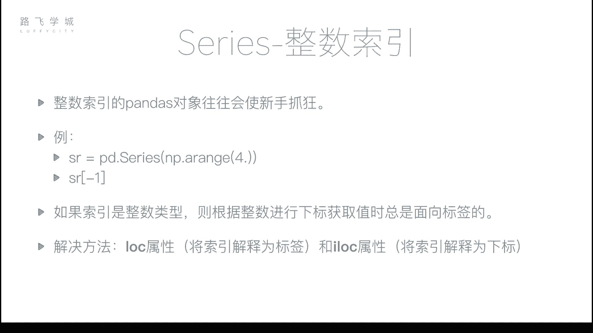
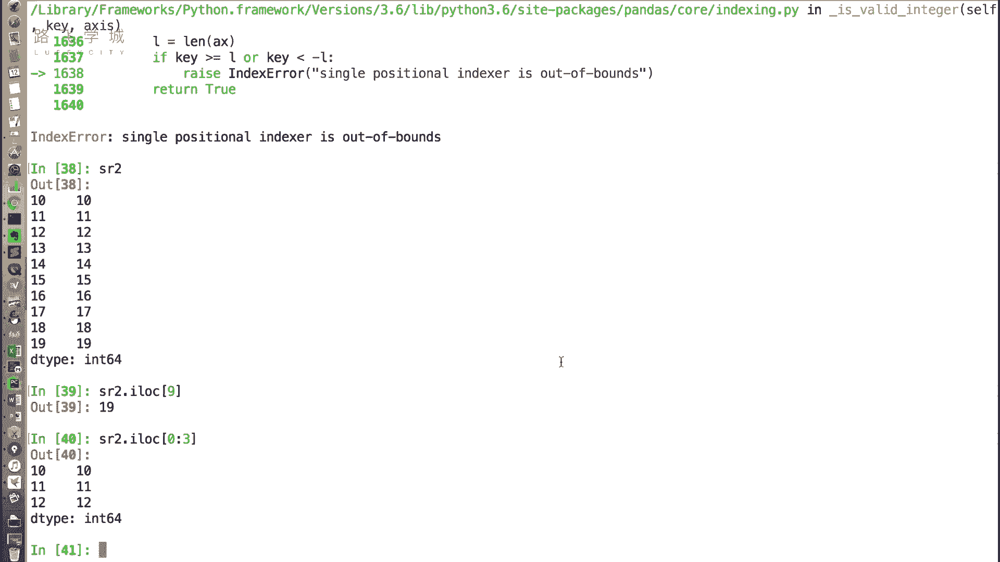
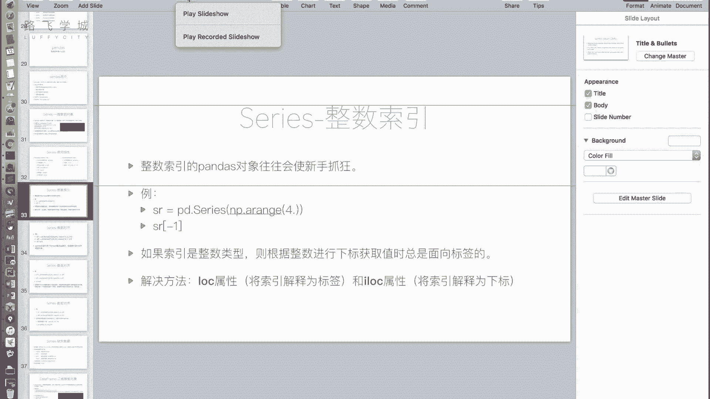

# 金融量化分析实战：P19：Series整数索引问题 📊🔢

在本节课中，我们将要学习Pandas Series对象在使用整数索引时可能遇到的歧义问题，并掌握解决这一问题的两个关键属性：`.loc`和`.iloc`。



上一节我们介绍了Series的一些基本特性，本节中我们来看看使用整数索引时一个非常重要的注意事项。这个特性常常让初学者感到困惑。


## 整数索引的歧义问题

当你的Series对象使用整数作为索引时，通过中括号`[]`进行数据选取可能会产生歧义。解释器无法确定你传入的整数是代表“标签”还是代表“位置下标”。

例如，我们创建一个自动生成整数索引的Series：

```python
import pandas as pd
import numpy as np

# 创建一个从0到19的Series，索引为0,1,2,...,19
sr = pd.Series(np.arange(20))
print(sr)
```

如果我们通过切片创建一个新的Series对象：

```python
# 切片创建新Series，索引变为10,11,12,...,19
sr2 = sr[10:].copy()
print(sr2)
```

此时，`sr2`的索引是从10开始的整数。如果我们尝试获取`sr2[10]`，问题就出现了：这个`10`应该被解释为“标签为10的那一行”，还是“下标位置为10（即第11个）的元素”？由于存在歧义，Pandas的默认规则是：**当中括号内的值是整数时，一律解释为标签**。因此，`sr2[10]`会返回标签为10的那一行数据。如果你想获取最后一个元素（位置下标为9），使用`sr2[9]`是无效的，因为它会被解释为“标签为9”，而`sr2`中并不存在这个标签，从而导致错误或无法获取数据。

## 解决方案：使用.loc和.iloc属性

为了解决整数索引的歧义问题，Pandas提供了两个明确的属性来区分操作意图。

以下是这两个属性的核心区别：
*   **`.loc[]`**： **基于标签的索引**。中括号内的值始终被解释为索引标签。
*   **`.iloc[]`**： **基于整数位置的索引**。中括号内的值始终被解释为从0开始的位置下标。

让我们通过代码示例来理解它们的用法：

```python
# 使用 .loc，明确按标签获取数据
value_by_label = sr2.loc[10]  # 获取索引标签为10的数据
print(f"使用.loc[10]获取的值: {value_by_label}")

# 使用 .iloc，明确按位置下标获取数据
value_by_index = sr2.iloc[9]  # 获取位置下标为9（即第10个）的数据
print(f"使用.iloc[9]获取的值: {value_by_index}")
```

这两个属性不仅支持单个值选取，也完全支持切片、布尔索引等高级索引方式，只是明确了索引的基准。例如：

```python
# 使用.iloc进行位置切片
slice_by_position = sr2.iloc[0:3] # 获取前3个元素（位置0,1,2）
print("使用.iloc[0:3]切片:")
print(slice_by_position)

# 使用.loc进行标签切片 (如果索引是连续的)
slice_by_label = sr2.loc[10:12] # 获取标签为10,11,12的元素
print("\n使用.loc[10:12]切片:")
print(slice_by_label)
```



## 核心建议

为了避免混淆和错误，我们强烈建议：**只要涉及到整数索引的数据选取，就习惯性地使用`.loc`或`.iloc`来明确你的意图**。这可以让代码意图更清晰，避免潜在的bug。



本节课中我们一起学习了Pandas Series整数索引的歧义性及其解决方案。关键点在于理解`.loc`（标签索引）和`.iloc`（位置索引）的区别，并在实践中始终使用它们来精准地操作数据，这是进行稳健的数据分析的重要一步。