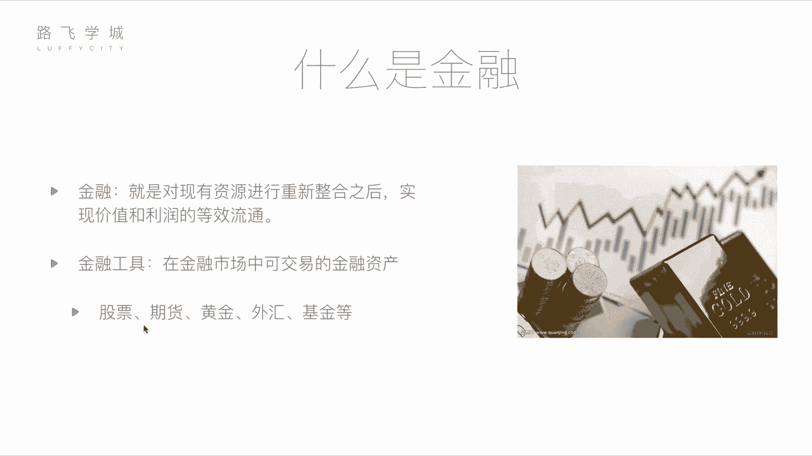

# 金融量化分析：P2-01：基本金融知识介绍 🧠📈

在本节课中，我们将学习金融与量化分析的基础知识。我们将首先了解金融的基本概念，然后介绍几种常见的金融工具，最后重点讲解股票这一核心概念。通过本节内容，你将建立起对金融市场的初步认识，为后续学习量化分析打下基础。

## 什么是金融？

金融的定义是对现有资源进行重新整合之后，实现价值和利润的等效流通。这个概念可能听起来有些抽象，但通俗地理解，金融就是关于资金流动和管理的行业。它并非完全是不劳而获的投机行为，而是能够促进经济发展的活动。

例如，一位拥有闲置资金的投资者，可以将资金投入一个有潜力的创业公司。创业者获得了发展所需的资金，而投资者则有望在未来获得回报。这个过程通过金融工具（如股票）实现，是一种双赢，它让资金流向需要的地方，刺激了经济增长。

## 常见的金融工具

在金融市场中，可交易的金融资产被称为金融工具。以下是几种常见的金融工具：

*   **股票**：代表对一家公司的所有权份额。购买股票即成为该公司的股东。
*   **期货**：一种标准化合约，约定在未来某个时间以特定价格买卖某种资产（如大宗商品）。
*   **黄金**：一种传统的贵金属，常被视为保值和对冲通胀的工具。
*   **外汇**：指不同国家货币之间的兑换交易，其价格表现为汇率。
*   **基金**：由专业基金经理管理的一篮子资产（如股票、债券等），投资者购买基金份额即间接持有了这些资产。

上一节我们介绍了金融的宏观概念，本节中我们来看看这些具体的金融工具各自有何特点。

### 期货详解

期货是一种高风险、高收益的金融衍生品。它的核心是基于买卖双方对未来资产价格走势的不同判断。

**核心机制**：买卖双方签订一份标准化合约，约定在未来某一时间，以今天约定的价格（期货价格）交易一定数量的标的资产（如煤炭、石油）。

**举例说明**：
假设发电厂A预计半年后煤炭价格会从现在的10元/吨上涨，而煤矿主B预计价格会下跌。他们可以签订一份期货合约：约定半年后A以10元/吨的价格向B购买5000吨煤。
*   如果半年后市价涨到15元，A仍然可以按10元买入，相当于节省了成本（每吨赚5元），而B则少赚了5元。
*   如果半年后市价跌到5元，A仍需按10元买入，相当于产生了亏损（每吨多付5元），而B则锁定了10元的售价，避免了价格下跌的损失。

期货交易通常涉及**保证金**制度，即只需支付合约价值的一部分资金即可进行交易，这放大了潜在的收益和风险。

### 黄金与外汇

**黄金**的价值相对稳定，是一种“硬通货”。其价格主要受全球供应量（如新矿发掘）、宏观经济形势、通货膨胀和避险情绪等因素影响。简单来说，黄金总量相对固定，当市场上流通的货币增多时，黄金价格往往上涨。

**外汇**交易涉及不同国家货币的兑换，其价格即汇率。汇率波动受两国经济状况、利率政策、国际贸易等因素影响。

**举例说明**：
如果中国经济持续高速增长，而美国经济相对平稳，人民币相对于美元可能会升值（例如，从1美元兑6.5人民币变为兑6.3人民币）。大型投资机构会基于对这类宏观经济趋势的判断进行外汇交易。对于个人投资者而言，外汇日常波动较小，需要极大资金量才能产生显著收益，因此并非主流投资工具。

### 基金运作原理

基金是为个人投资者设计的一种集合投资工具。其运作模式如下：

1.  **资金汇集**：基金公司向公众募集资金，每个投资者购买一定的基金份额。
2.  **专业管理**：募集的资金由专业的基金经理负责管理。基金经理会运用其知识和策略，将资金投资于股票、债券、货币市场工具等多种资产。
3.  **收益与费用**：投资产生的收益或亏损由所有基金份额持有人按比例承担。基金公司会收取管理费，基金经理的业绩报酬也可能从收益中提取。

**特点**：基金通过专业管理和分散投资（不把所有鸡蛋放在一个篮子里），旨在为投资者提供比直接投资单一股票更低的风险，但相应的，其潜在收益通常也低于表现最佳的单一股票。

## 核心工具：股票

在众多金融工具中，**股票**是我们本课程后续内容的核心。它代表持有者（股东）对一家上市公司的部分所有权。股东有权分享公司的利润（通过分红），并参与公司重大决策（通过股东大会投票）。

股票价格在证券交易所实时波动，受公司业绩、行业前景、宏观经济、市场情绪等多种因素驱动。量化分析的目标之一，就是尝试通过数学模型和计算机程序，从海量数据中寻找价格波动的规律，从而辅助投资决策。

本节课中我们一起学习了金融的基本概念以及股票、期货、黄金、外汇和基金这五大常见金融工具的特点与运作原理。理解这些基础知识是进入金融量化世界的第一步。在接下来的课程中，我们将聚焦于**股票市场**，学习如何运用Python和数据分析技术对其进行深入研究。