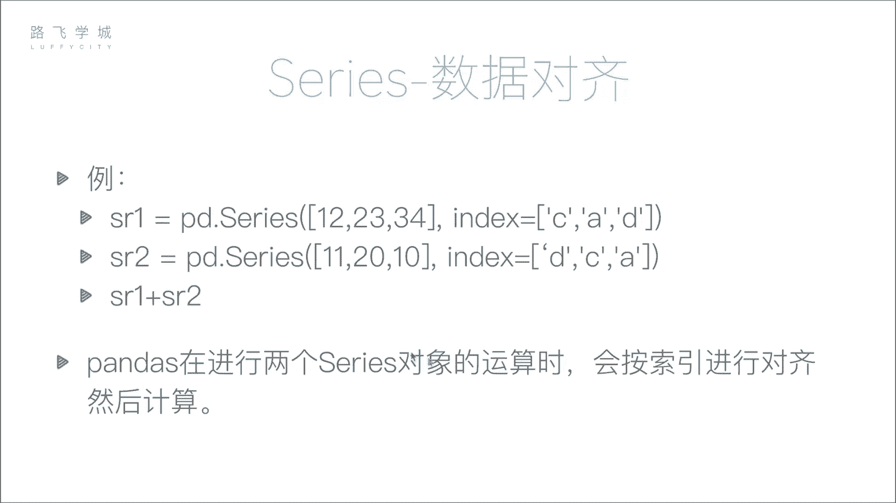
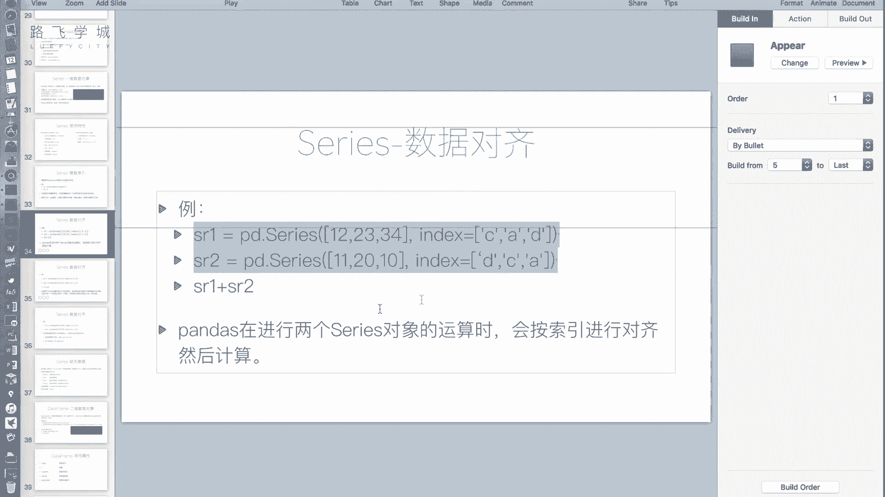
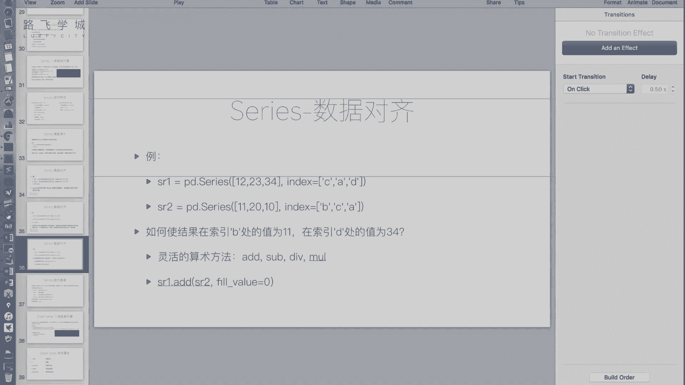

# 金融量化分析：P20：Series数据对齐 🧮


在本节课中，我们将要学习 Pandas Series 的一个核心特性：**数据对齐**。我们将了解当两个 Series 对象进行运算时，Pandas 如何根据索引标签自动对齐数据，以及如何处理由此可能产生的缺失值。

---

## 数据对齐的概念

上一节我们介绍了 Series 的基本操作，本节中我们来看看 Series 在进行算术运算时的独特行为。

在 NumPy 数组中，运算通常是按位置（下标）进行的。然而，Pandas Series 的设计更贴近现实数据表格，其运算遵循 **按索引标签对齐** 的原则。这意味着，两个 Series 对象进行运算时，Pandas 会寻找它们**索引标签相同**的元素进行配对计算，而**不关心**它们在各自 Series 中的顺序。

## 数据对齐示例

让我们通过一个例子来理解这个概念。假设我们有两个 Series 对象：



```python
import pandas as pd


sr1 = pd.Series([12, 23, 34], index=['C', 'A', 'D'])
sr2 = pd.Series([11, 20, 10], index=['D', 'C', 'A'])
```

以下是这两个 Series 的直观表示：
*   `sr1`: 索引 `['C', 'A', 'D']`，对应值 `[12, 23, 34]`
*   `sr2`: 索引 `['D', 'C', 'A']`，对应值 `[11, 20, 10]`

如果执行 `sr1 + sr2`，结果会如何？

*   **按位置（下标）对齐（NumPy方式）**：`12+11`, `23+20`, `34+10`。
*   **按标签对齐（Pandas方式）**：Pandas 会寻找相同标签进行配对：
    *   标签 `A`: `sr1` 的值 `23` + `sr2` 的值 `10` = `33`
    *   标签 `C`: `sr1` 的值 `12` + `sr2` 的值 `20` = `32`
    *   标签 `D`: `sr1` 的值 `34` + `sr2` 的值 `11` = `45`

执行代码 `sr1 + sr2`，我们得到的结果是：
```
A    33
C    32
D    45
dtype: int64
```

这个功能非常强大。例如，在对比两个不同年份的日度销售数据时，即使两个数据表的日期顺序被打乱，只要日期（索引）标签一致，Pandas 就能自动将它们正确对齐并计算，无需手动排序。

## 索引长度不一致与缺失值

在实际数据分析中，我们经常遇到两个数据集长度或内容不完全一致的情况。Pandas 如何处理这种场景呢？

假设我们有两个新的 Series：

```python
sr1 = pd.Series([12, 23, 34], index=['A', 'C', 'D'])
sr2 = pd.Series([11, 20, 10, 5], index=['A', 'B', 'C', 'D'])
```

此时，`sr1` 的索引是 `['A', 'C', 'D']`，而 `sr2` 的索引是 `['A', 'B', 'C', 'D']`。它们拥有不同的标签集合。

当我们执行 `sr1 + sr2` 时，Pandas 依然会尝试按标签对齐：
*   标签 `A`, `C`, `D` 在两个 Series 中都存在，可以进行加法。
*   标签 `B` 只存在于 `sr2` 中，在 `sr1` 中找不到对应的标签。对于这个位置，Pandas 无法进行计算。

Pandas 使用一个特殊值 `NaN`（Not a Number）来标记这种因数据缺失而无法计算的结果。因此，`sr1 + sr2` 的结果是：
```
A    23.0
B     NaN
C    33.0
D    39.0
dtype: float64
```
`NaN` 在 Pandas 中被广泛用作**缺失值**的标识。

## 灵活运算：填充缺失值

有时，我们并不希望缺失值直接显示为 `NaN`。例如，在计算员工两个月的出勤总天数时，如果某员工第二个月才入职（第一个月数据缺失），我们希望将他第一个月的出勤天数视为 `0`，而不是 `NaN`。

Pandas 提供了一组灵活的算术方法，允许我们指定缺失值的填充方式。


以下是四个核心的算术方法，对应基本的四则运算：
*   `.add()`: 加法
*   `.sub()`: 减法
*   `.mul()`: 乘法
*   `.div()`: 除法



这些方法都接受一个 `fill_value` 参数。当某个索引标签只存在于一个 Series 中时，会用 `fill_value` 指定的值来填充缺失的部分，然后再进行计算。


使用示例：
```python
# 使用 add 方法，并设置缺失值填充为 0
result = sr1.add(sr2, fill_value=0)
print(result)
```
输出：
```
A    23.0
B    20.0  # sr1中B缺失，用0填充，即 0 + 20 = 20
C    33.0
D    39.0
dtype: float64
```
可以看到，标签 `B` 的结果不再是 `NaN`，而是被填充为 `0` 后与 `sr2` 的值 `20` 相加，得到了 `20`。



---

## 总结

本节课中我们一起学习了 Pandas Series 的**数据对齐**特性。我们了解到：
1.  Series 的运算是基于**索引标签**对齐的，而非元素位置，这大大简化了无序数据的处理。
2.  当两个 Series 的索引标签不完全一致时，运算会产生缺失值，并以 `NaN` 表示。
3.  通过 `.add()`, `.sub()` 等方法的 `fill_value` 参数，我们可以灵活控制缺失值的填充逻辑，以适应不同的业务场景。


数据对齐是 Pandas 强大功能的基础，而由此产生的缺失值则是数据分析中必须处理的问题。在接下来的课程中，我们将专门讲解如何处理这些缺失值。