# 金融量化分析实战：P21：Series缺失值处理 🧩

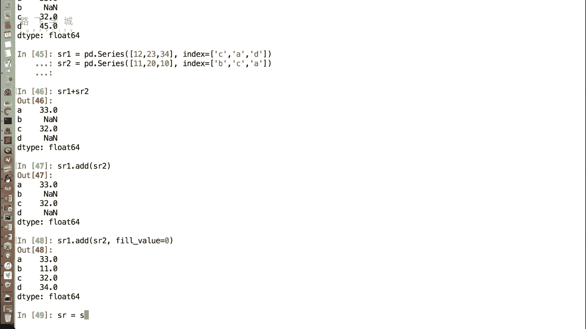

在本节课中，我们将学习如何处理Pandas Series中的缺失数据。缺失值是数据分析中常见的问题，学会处理它们对于保证分析的准确性和完整性至关重要。

上一节我们介绍了Series的基本操作，本节中我们来看看如何处理其中的缺失值。

## 什么是缺失值

在Series中，可能会出现缺失数据，通常用`NaN`（Not a Number）表示。出现缺失数据时，有时可以放任不管，但在进行进一步运算或生成图表时，这些缺失值可能会带来问题，因此需要处理。

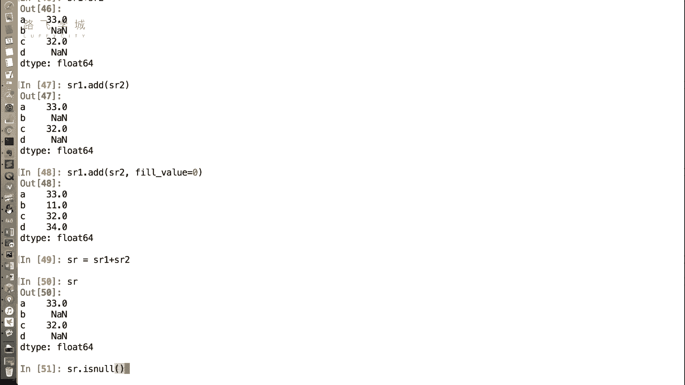

## 处理缺失值的两种主要方法

处理缺失值主要有两种思路：一是直接删除含有缺失值的行；二是用某个值填充缺失的部分。

### 方法一：删除缺失值

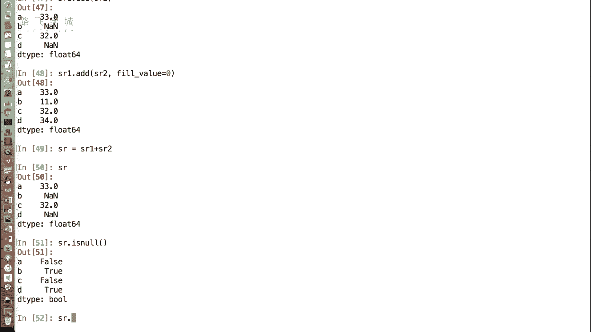

首先，我们需要判断哪些数据是缺失的。Pandas提供了相关的函数。

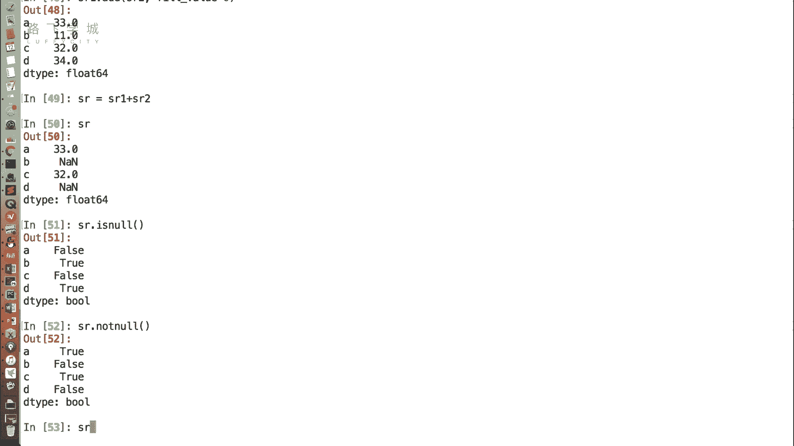

以下是判断缺失值的函数：

*   **`SR.isnull()`**：此函数返回一个布尔型Series。如果原位置是`NaN`，则返回`True`；否则返回`False`。
*   **`SR.notnull()`**：此函数是`isnull()`的反向操作。如果原位置不是`NaN`，则返回`True`；否则返回`False`。

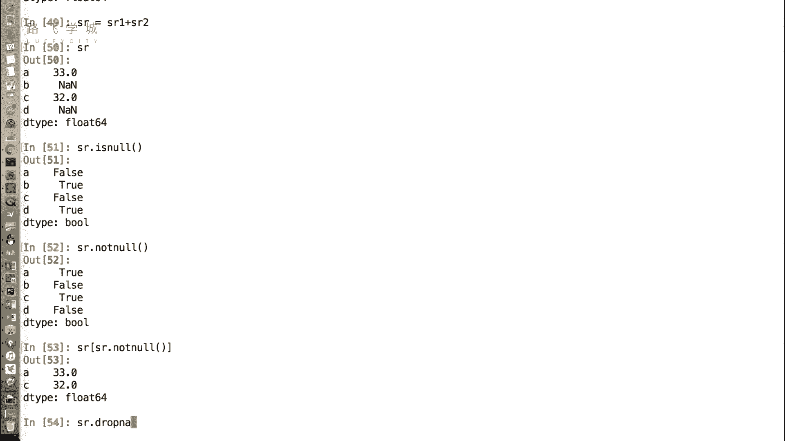

利用布尔索引，我们可以过滤掉缺失值：

```python
SR_filtered = SR[SR.notnull()]
```

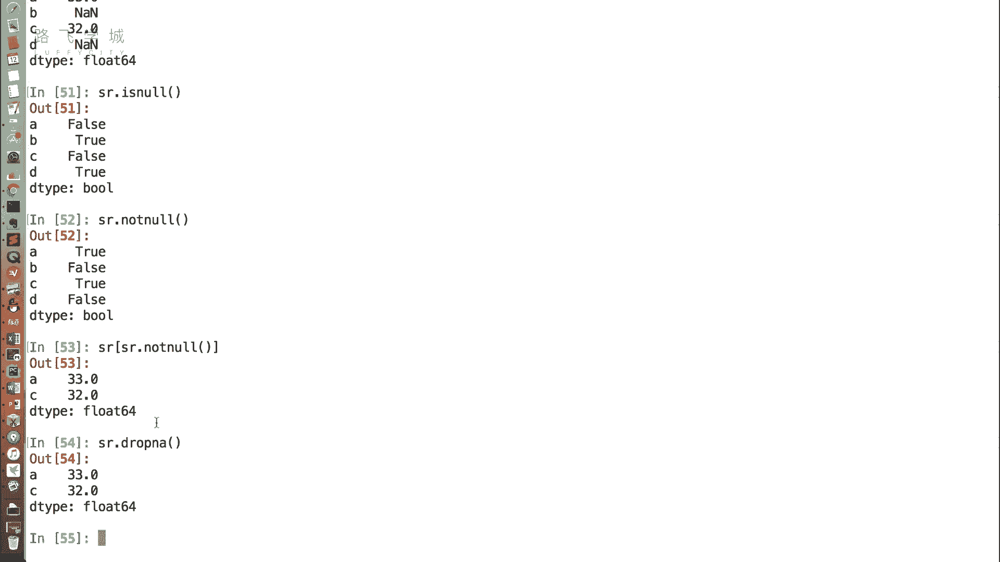

此外，Pandas还提供了一个直接删除缺失值的便捷函数：

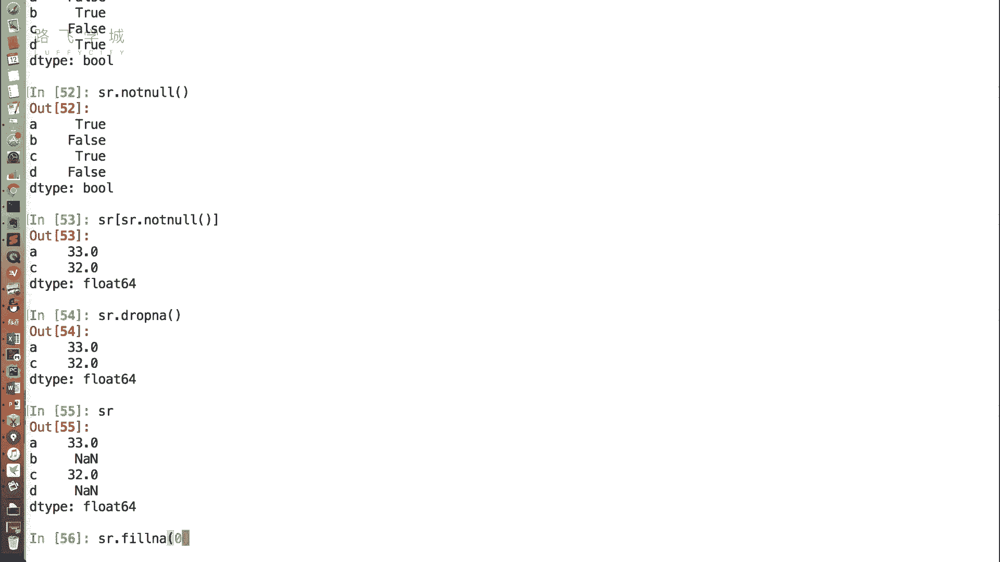

*   **`SR.dropna()`**：此函数会直接删除所有包含`NaN`值的行。

### 方法二：填充缺失值

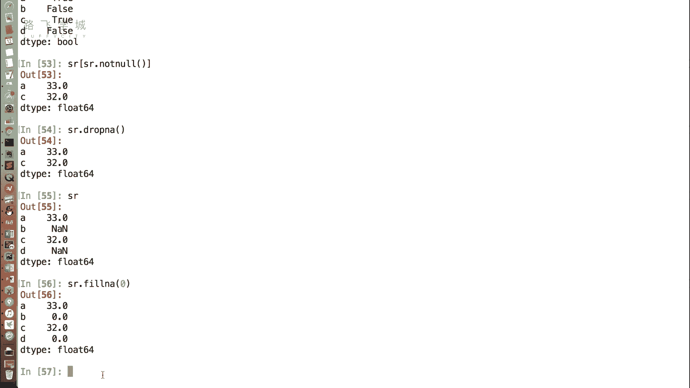

另一种方法不是删除，而是为缺失值赋予一个具体的值。

填充缺失值的函数是：

*   **`SR.fillna(value)`**：此函数将所有的`NaN`值替换为指定的`value`。

例如，将所有缺失值填充为0：

```python
SR_filled = SR.fillna(0)
```

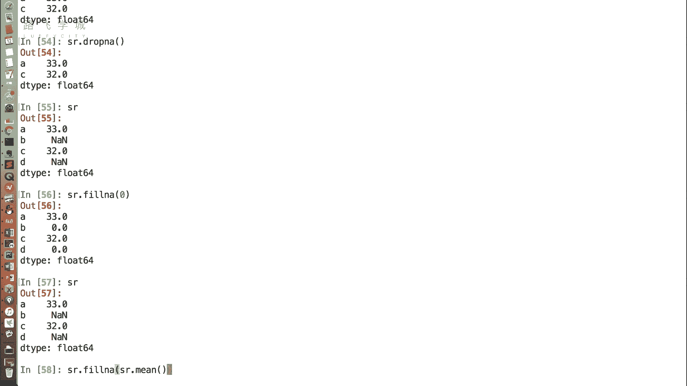

**重要提示**：Pandas的Series操作（如`dropna`和`fillna`）默认返回一个新的Series对象，而**不会**修改原始数据。如果你想保存处理后的结果，必须将其赋值给一个新变量。

在实际分析中，填充值的选择取决于业务场景。除了填充固定值（如0），还有一些更常用的填充策略：

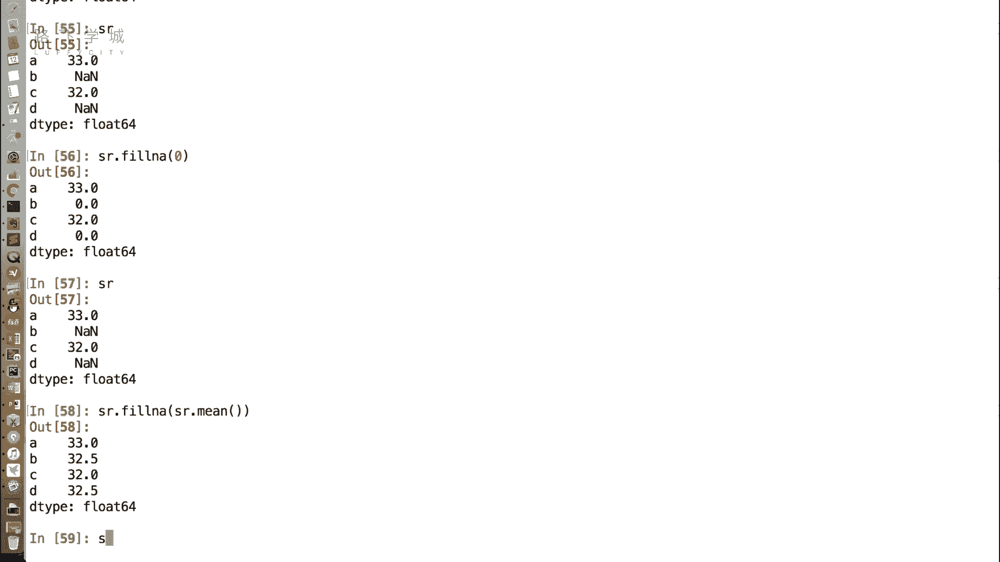

*   **填充为平均值**：当缺失值只是个别记录缺失，且我们希望数据保持连续趋势时，常用该列的均值进行填充。

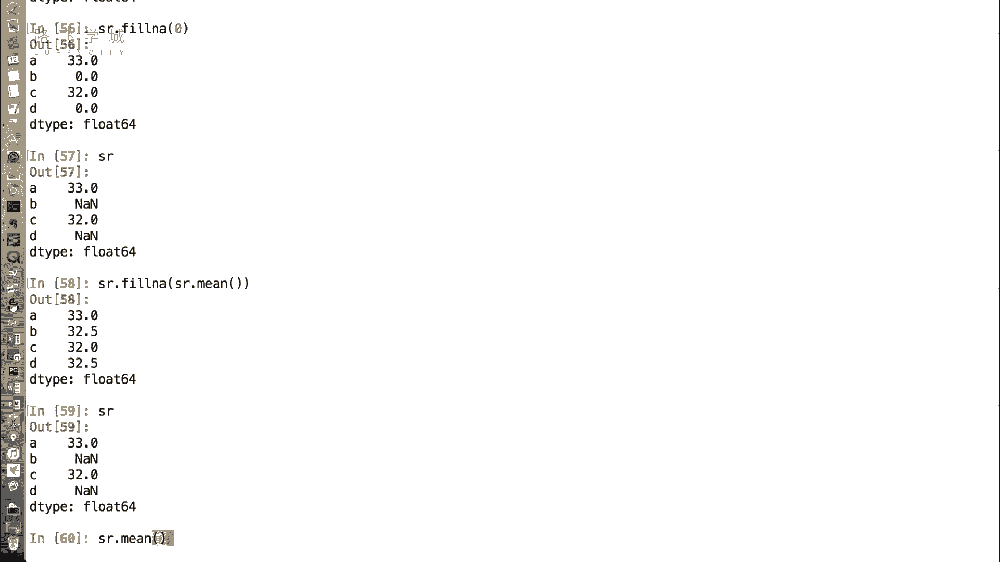

```python
mean_value = SR.mean()  # 计算非NaN值的平均值
SR_filled_with_mean = SR.fillna(mean_value)
```

Pandas的`.mean()`方法在计算时会自动忽略`NaN`值，这为数据处理带来了极大的便利。

## 总结

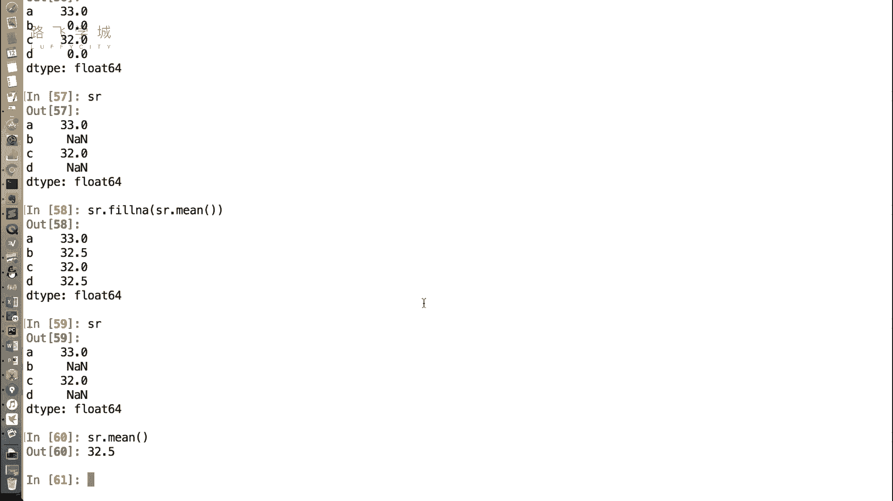

本节课中我们一起学习了处理Series缺失值的核心方法。我们介绍了两种主要策略：使用`dropna()`**删除**缺失值，以及使用`fillna()`**填充**缺失值。填充时可以根据需求选择固定值或统计值（如平均值）。掌握这些方法，能有效清理数据，为后续的量化分析和投资决策打下坚实的基础。